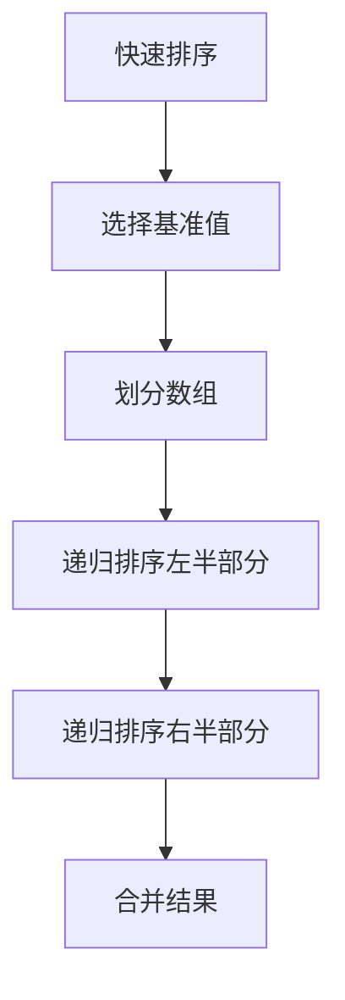

                 

# 领导力训练营：98天从菜鸟到大神

> 关键词：领导力、技术成长、职业发展、团队管理、项目管理、技术架构、代码质量、持续学习

> 摘要：本文旨在通过98天的系统训练，帮助技术菜鸟快速成长为技术大神。我们将从领导力培养、技术成长路径、项目管理、团队管理、技术架构设计等多个维度进行深入探讨，通过理论与实践相结合的方式，帮助读者全面提升技术能力与领导力，实现职业生涯的飞跃。

## 1. 背景介绍
### 1.1 目的和范围
本文旨在为技术菜鸟提供一个系统化的成长路径，帮助他们在98天内从技术菜鸟成长为技术大神。我们将从领导力培养、技术成长路径、项目管理、团队管理、技术架构设计等多个维度进行深入探讨，通过理论与实践相结合的方式，帮助读者全面提升技术能力与领导力，实现职业生涯的飞跃。

### 1.2 预期读者
本文的预期读者包括但不限于：
- 初入职场的技术新人
- 技术团队中的初级成员
- 想要提升技术能力与领导力的技术爱好者
- 对技术管理有兴趣的项目经理
- 想要转型为技术领导者的非技术人员

### 1.3 文档结构概述
本文将分为以下几个部分：
1. 背景介绍
2. 核心概念与联系
3. 核心算法原理 & 具体操作步骤
4. 数学模型和公式 & 详细讲解 & 举例说明
5. 项目实战：代码实际案例和详细解释说明
6. 实际应用场景
7. 工具和资源推荐
8. 总结：未来发展趋势与挑战
9. 附录：常见问题与解答
10. 扩展阅读 & 参考资料

### 1.4 术语表
#### 1.4.1 核心术语定义
- **技术菜鸟**：指刚刚进入技术领域，缺乏经验的初学者。
- **技术大神**：指在技术领域有深厚积累，能够独立完成复杂项目的技术专家。
- **领导力**：指在团队中引导、激励和管理他人的能力。
- **项目管理**：指对项目从开始到结束的全过程进行计划、组织、指挥、协调和控制。
- **团队管理**：指对团队成员进行有效管理，提升团队整体效能。
- **技术架构**：指系统的设计和结构，包括硬件、软件、网络等组成部分及其相互关系。
- **代码质量**：指代码的可读性、可维护性、可扩展性等特性。

#### 1.4.2 相关概念解释
- **敏捷开发**：一种迭代、增量的软件开发方法，强调快速响应变化。
- **DevOps**：指开发（Development）和运维（Operations）的结合，强调自动化和协作。
- **持续集成/持续部署（CI/CD）**：一种软件开发实践，通过自动化构建、测试和部署流程，提高软件交付速度和质量。

#### 1.4.3 缩略词列表
- **API**：Application Programming Interface（应用程序编程接口）
- **CI/CD**：Continuous Integration/Continuous Deployment（持续集成/持续部署）
- **DevOps**：Development and Operations（开发和运维）
- **KPI**：Key Performance Indicator（关键绩效指标）
- **SOP**：Standard Operating Procedure（标准操作程序）

## 2. 核心概念与联系
### 2.1 领导力与技术成长
领导力是技术成长的重要驱动力。一个优秀的领导者能够激发团队成员的潜力，推动团队共同进步。领导力的核心在于沟通、激励和决策能力。

### 2.2 项目管理与团队管理
项目管理与团队管理是技术成长的重要环节。项目管理确保项目按时、按质完成，而团队管理则确保团队成员高效协作，共同达成目标。

### 2.3 技术架构设计
技术架构设计是技术成长的关键。一个良好的技术架构能够提高系统的可扩展性、可维护性和安全性，为后续的技术发展奠定坚实基础。

### 2.4 代码质量与持续学习
代码质量是技术成长的重要指标。良好的代码质量不仅能够提高系统的可读性和可维护性，还能够降低开发成本。持续学习则是技术成长的不竭动力，通过不断学习新技术、新方法，不断提升自己的技术水平。

## 3. 核心算法原理 & 具体操作步骤
### 3.1 核心算法原理
我们将以一个简单的算法为例，详细阐述其原理和操作步骤。以快速排序算法为例，其原理是通过递归的方式将数组分成两部分，一部分小于基准值，另一部分大于基准值，然后对这两部分分别进行排序。



### 3.2 具体操作步骤
```python
def quick_sort(arr):
    if len(arr) <= 1:
        return arr
    else:
        pivot = arr[0]
        left = [x for x in arr[1:] if x < pivot]
        right = [x for x in arr[1:] if x >= pivot]
        return quick_sort(left) + [pivot] + quick_sort(right)
```

## 4. 数学模型和公式 & 详细讲解 & 举例说明
### 4.1 数学模型
我们将使用一个简单的数学模型来说明其原理。以线性回归模型为例，其数学模型为：

$$
y = \beta_0 + \beta_1 x + \epsilon
$$

其中，$y$ 是因变量，$x$ 是自变量，$\beta_0$ 和 $\beta_1$ 是模型参数，$\epsilon$ 是误差项。

### 4.2 详细讲解
线性回归模型是一种常用的统计模型，用于预测因变量与自变量之间的线性关系。通过最小化误差平方和，可以求解出模型参数。

### 4.3 举例说明
假设我们有一组数据，自变量 $x$ 为年龄，因变量 $y$ 为收入。我们可以使用线性回归模型来预测收入与年龄之间的关系。

$$
y = 1000 + 50x + \epsilon
$$

## 5. 项目实战：代码实际案例和详细解释说明
### 5.1 开发环境搭建
我们将使用Python和Jupyter Notebook进行项目实战。首先需要安装Python和Jupyter Notebook，可以通过以下命令进行安装：

```bash
pip install python
pip install jupyter
```

### 5.2 源代码详细实现和代码解读
我们将实现一个简单的线性回归模型，并使用Jupyter Notebook进行代码解读。

```python
import numpy as np
import matplotlib.pyplot as plt
from sklearn.linear_model import LinearRegression

# 生成数据
np.random.seed(0)
x = np.random.rand(100, 1)
y = 1000 + 50 * x + np.random.randn(100, 1)

# 创建线性回归模型
model = LinearRegression()
model.fit(x, y)

# 预测
y_pred = model.predict(x)

# 绘制结果
plt.scatter(x, y, color='blue')
plt.plot(x, y_pred, color='red')
plt.xlabel('年龄')
plt.ylabel('收入')
plt.title('线性回归模型')
plt.show()
```

### 5.3 代码解读与分析
- `import numpy as np`：导入NumPy库，用于数值计算。
- `import matplotlib.pyplot as plt`：导入Matplotlib库，用于绘制图表。
- `from sklearn.linear_model import LinearRegression`：导入线性回归模型。
- `np.random.rand(100, 1)`：生成100个随机数，作为自变量。
- `y = 1000 + 50 * x + np.random.randn(100, 1)`：生成因变量，包含线性关系和随机误差。
- `model = LinearRegression()`：创建线性回归模型。
- `model.fit(x, y)`：训练模型。
- `y_pred = model.predict(x)`：预测结果。
- `plt.scatter(x, y, color='blue')`：绘制散点图。
- `plt.plot(x, y_pred, color='red')`：绘制预测结果。
- `plt.xlabel('年龄')`：设置x轴标签。
- `plt.ylabel('收入')`：设置y轴标签。
- `plt.title('线性回归模型')`：设置图表标题。

## 6. 实际应用场景
线性回归模型在实际中有广泛的应用，例如：
- **金融领域**：预测股票价格、评估贷款风险等。
- **医疗领域**：预测疾病风险、评估治疗效果等。
- **市场营销**：预测销售额、评估广告效果等。

## 7. 工具和资源推荐
### 7.1 学习资源推荐
#### 7.1.1 书籍推荐
- 《深入浅出统计学》
- 《机器学习实战》
- 《Python数据科学手册》

#### 7.1.2 在线课程
- Coursera：《机器学习》
- edX：《数据科学基础》
- Udacity：《机器学习工程师纳米学位》

#### 7.1.3 技术博客和网站
- Medium：《机器学习》
- HackerRank：《编程挑战》
- GitHub：《开源项目》

### 7.2 开发工具框架推荐
#### 7.2.1 IDE和编辑器
- PyCharm：Python开发环境
- VSCode：跨平台代码编辑器
- Jupyter Notebook：交互式编程环境

#### 7.2.2 调试和性能分析工具
- PyCharm Debugger：Python调试工具
- VisualVM：Java性能分析工具
- Chrome DevTools：Web开发调试工具

#### 7.2.3 相关框架和库
- NumPy：数值计算库
- Pandas：数据处理库
- Matplotlib：数据可视化库
- Scikit-learn：机器学习库

### 7.3 相关论文著作推荐
#### 7.3.1 经典论文
- **《统计学习方法》**：李航
- **《机器学习》**：周志华

#### 7.3.2 最新研究成果
- **《深度学习》**：Ian Goodfellow, Yoshua Bengio, Aaron Courville

#### 7.3.3 应用案例分析
- **《大数据技术与应用》**：张志华

## 8. 总结：未来发展趋势与挑战
未来，技术领域将面临更多的挑战和机遇。随着人工智能、大数据、云计算等技术的不断发展，技术领域将更加注重技术创新和应用落地。同时，技术人才的需求也将不断增加，对技术人才的综合素质要求也将不断提高。

## 9. 附录：常见问题与解答
### 9.1 问题：如何提高代码质量？
- **答案**：可以通过代码审查、单元测试、代码重构等方式提高代码质量。

### 9.2 问题：如何提升领导力？
- **答案**：可以通过学习领导力理论、实践领导力技能、寻求反馈和改进等方式提升领导力。

## 10. 扩展阅读 & 参考资料
- **书籍**：《深入浅出统计学》、《机器学习实战》、《Python数据科学手册》
- **在线课程**：Coursera《机器学习》、edX《数据科学基础》、Udacity《机器学习工程师纳米学位》
- **技术博客和网站**：Medium《机器学习》、HackerRank《编程挑战》、GitHub《开源项目》
- **论文著作**：《统计学习方法》、《机器学习》、《深度学习》

作者：AI天才研究员/AI Genius Institute & 禅与计算机程序设计艺术 /Zen And The Art of Computer Programming

