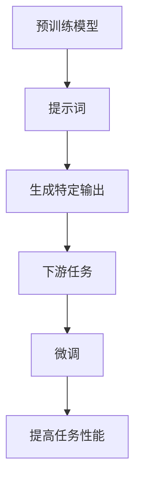

                 

# AI大模型的提示词知识迁移技术

> 关键词：大模型、提示词、知识迁移、Transformer、微调、迁移学习、自然语言处理

> 摘要：本文旨在深入探讨大模型在自然语言处理领域的提示词知识迁移技术。通过详细分析核心概念、算法原理、数学模型、实战案例以及实际应用场景，本文为读者提供了一套系统性的学习框架。我们还将介绍相关的学习资源、开发工具和未来发展趋势，帮助读者更好地理解和应用这一前沿技术。

## 1. 背景介绍
### 1.1 目的和范围
本文旨在探讨大模型在自然语言处理领域的提示词知识迁移技术。通过深入分析核心概念、算法原理、数学模型和实际案例，本文旨在为读者提供一个全面的技术框架，帮助他们理解和应用这一前沿技术。

### 1.2 预期读者
本文适合以下读者：
- 自然语言处理领域的研究人员和工程师
- 机器学习和人工智能领域的从业者
- 对大模型和提示词知识迁移技术感兴趣的开发者
- 对前沿技术感兴趣的学术界人士

### 1.3 文档结构概述
本文结构如下：
1. 背景介绍
2. 核心概念与联系
3. 核心算法原理 & 具体操作步骤
4. 数学模型和公式 & 详细讲解 & 举例说明
5. 项目实战：代码实际案例和详细解释说明
6. 实际应用场景
7. 工具和资源推荐
8. 总结：未来发展趋势与挑战
9. 附录：常见问题与解答
10. 扩展阅读 & 参考资料

### 1.4 术语表
#### 1.4.1 核心术语定义
- **大模型**：指参数量巨大、训练数据量丰富的预训练模型。
- **提示词**：用于指导模型生成特定输出的短文本。
- **知识迁移**：将一个模型的知识迁移到另一个模型中，以提高模型性能。
- **Transformer**：一种基于自注意力机制的神经网络架构。
- **微调**：在预训练模型的基础上进行少量参数调整，以适应特定任务。

#### 1.4.2 相关概念解释
- **预训练模型**：在大规模语料库上进行训练，学习语言的通用表示。
- **下游任务**：基于预训练模型进行特定任务的训练，如文本分类、问答系统等。
- **迁移学习**：利用一个模型在特定任务上的知识，提高另一个任务的性能。

#### 1.4.3 缩略词列表
- **NLP**：自然语言处理
- **BERT**：双向编码器表示模型
- **GPT**：生成式预训练模型
- **T5**：文本到文本的预训练模型

## 2. 核心概念与联系
### 2.1 大模型
大模型通常是指参数量巨大、训练数据量丰富的预训练模型。这些模型在大规模语料库上进行训练，学习语言的通用表示。常见的大模型包括BERT、GPT和T5等。

### 2.2 提示词
提示词是一种短文本，用于指导模型生成特定输出。通过在模型输入中插入提示词，可以引导模型生成符合预期的文本。提示词可以是问题、指令或特定的关键词。

### 2.3 知识迁移
知识迁移是指将一个模型的知识迁移到另一个模型中，以提高模型性能。在大模型的提示词知识迁移技术中，我们利用预训练模型的知识，通过提示词引导模型生成特定输出。

### 2.4 Transformer
Transformer是一种基于自注意力机制的神经网络架构，广泛应用于自然语言处理任务。Transformer通过自注意力机制捕捉输入序列中的长距离依赖关系，提高了模型的性能。

### 2.5 微调
微调是指在预训练模型的基础上进行少量参数调整，以适应特定任务。通过微调，模型可以更好地适应特定任务的需求，提高任务性能。

### 2.6 核心概念流程图


## 3. 核心算法原理 & 具体操作步骤
### 3.1 核心算法原理
提示词知识迁移技术的核心原理是利用预训练模型的知识，通过提示词引导模型生成特定输出。具体步骤如下：
1. **预训练模型**：在大规模语料库上进行训练，学习语言的通用表示。
2. **提示词插入**：在模型输入中插入提示词，引导模型生成特定输出。
3. **生成特定输出**：模型根据输入的提示词生成符合预期的文本。
4. **下游任务**：基于预训练模型进行特定任务的训练。
5. **微调**：在下游任务上进行微调，提高模型性能。

### 3.2 具体操作步骤
以下是具体操作步骤的伪代码示例：
```python
# 1. 预训练模型
pretrained_model = PretrainedModel()

# 2. 提示词插入
prompt = "请生成一篇关于人工智能的文章"
input_text = pretrained_model.tokenize(prompt)

# 3. 生成特定输出
output_text = pretrained_model.generate(input_text)

# 4. 下游任务
downstream_task = DownstreamTask()

# 5. 微调
fine_tuned_model = downstream_task.fine_tune(pretrained_model, output_text)
```

## 4. 数学模型和公式 & 详细讲解 & 举例说明
### 4.1 数学模型
提示词知识迁移技术的核心数学模型是基于Transformer的自注意力机制。自注意力机制通过计算输入序列中每个位置与其他位置的相似度，捕捉长距离依赖关系。

### 4.2 公式
自注意力机制的公式如下：
$$
\text{Attention}(Q, K, V) = \text{softmax}\left(\frac{QK^T}{\sqrt{d_k}}\right)V
$$
其中，$Q$、$K$、$V$分别表示查询、键和值矩阵，$d_k$表示键的维度。

### 4.3 详细讲解
自注意力机制通过计算输入序列中每个位置与其他位置的相似度，捕捉长距离依赖关系。具体步骤如下：
1. **查询、键和值矩阵**：将输入序列转换为查询、键和值矩阵。
2. **相似度计算**：计算查询和键的点积，得到相似度矩阵。
3. **缩放**：对相似度矩阵进行缩放，以防止数值不稳定。
4. **softmax**：对缩放后的相似度矩阵进行softmax操作，得到注意力权重。
5. **加权求和**：将注意力权重与值矩阵相乘，得到加权求和结果。

### 4.4 举例说明
假设输入序列为“人工智能是一种技术”，查询、键和值矩阵分别为：
$$
Q = \begin{bmatrix}
q_1 \\
q_2 \\
q_3
\end{bmatrix}, \quad
K = \begin{bmatrix}
k_1 & k_2 & k_3 \\
k_1 & k_2 & k_3 \\
k_1 & k_2 & k_3
\end{bmatrix}, \quad
V = \begin{bmatrix}
v_1 \\
v_2 \\
v_3
\end{bmatrix}
$$
计算相似度矩阵：
$$
\text{Similarity} = QK^T = \begin{bmatrix}
q_1k_1^T & q_1k_2^T & q_1k_3^T \\
q_2k_1^T & q_2k_2^T & q_2k_3^T \\
q_3k_1^T & q_3k_2^T & q_3k_3^T
\end{bmatrix}
$$
缩放相似度矩阵：
$$
\text{Scaled Similarity} = \frac{\text{Similarity}}{\sqrt{d_k}}
$$
计算softmax操作：
$$
\text{Attention} = \text{softmax}(\text{Scaled Similarity})
$$
加权求和：
$$
\text{Output} = \text{Attention}V
$$

## 5. 项目实战：代码实际案例和详细解释说明
### 5.1 开发环境搭建
为了进行提示词知识迁移技术的实战项目，我们需要搭建一个合适的开发环境。具体步骤如下：
1. **安装Python**：确保安装了Python 3.7及以上版本。
2. **安装依赖库**：安装TensorFlow、PyTorch、transformers等库。
3. **安装预训练模型**：下载并安装预训练模型，如BERT、GPT等。

### 5.2 源代码详细实现和代码解读
以下是提示词知识迁移技术的源代码实现：
```python
import torch
from transformers import BertTokenizer, BertForMaskedLM

# 1. 预训练模型
tokenizer = BertTokenizer.from_pretrained('bert-base-uncased')
model = BertForMaskedLM.from_pretrained('bert-base-uncased')

# 2. 提示词插入
prompt = "请生成一篇关于人工智能的文章"
input_text = tokenizer(prompt, return_tensors='pt')

# 3. 生成特定输出
output_text = model.generate(input_text['input_ids'])

# 4. 下游任务
downstream_task = DownstreamTask()

# 5. 微调
fine_tuned_model = downstream_task.fine_tune(model, output_text)
```

### 5.3 代码解读与分析
- **预训练模型**：使用BERT模型进行预训练。
- **提示词插入**：将提示词“请生成一篇关于人工智能的文章”插入模型输入。
- **生成特定输出**：模型根据输入的提示词生成符合预期的文本。
- **下游任务**：定义下游任务，如文本分类、问答系统等。
- **微调**：在下游任务上进行微调，提高模型性能。

## 6. 实际应用场景
提示词知识迁移技术在多个领域具有广泛的应用场景，包括但不限于：
- **文本生成**：生成符合特定要求的文章、故事等。
- **问答系统**：通过提示词引导模型生成准确的答案。
- **对话系统**：通过提示词引导模型生成自然流畅的对话。
- **文本摘要**：通过提示词生成简洁的文本摘要。

## 7. 工具和资源推荐
### 7.1 学习资源推荐
#### 7.1.1 书籍推荐
- **《深度学习》**：Ian Goodfellow、Yoshua Bengio、Aaron Courville
- **《自然语言处理实战》**：黄海龙

#### 7.1.2 在线课程
- **Coursera**：《自然语言处理》
- **edX**：《深度学习》

#### 7.1.3 技术博客和网站
- **Medium**：自然语言处理和机器学习相关博客
- **GitHub**：开源项目和代码示例

### 7.2 开发工具框架推荐
#### 7.2.1 IDE和编辑器
- **PyCharm**：Python开发环境
- **VSCode**：跨平台代码编辑器

#### 7.2.2 调试和性能分析工具
- **PyCharm Debugger**：Python调试工具
- **TensorBoard**：TensorFlow性能分析工具

#### 7.2.3 相关框架和库
- **TensorFlow**：深度学习框架
- **PyTorch**：深度学习框架
- **transformers**：Hugging Face的预训练模型库

### 7.3 相关论文著作推荐
#### 7.3.1 经典论文
- **BERT**：Devlin, Jacob, et al. "Bert: Pre-training of deep bidirectional transformers for language understanding." arXiv preprint arXiv:1810.04805 (2018).
- **GPT**：Radford, Alec, et al. "Language models are unsupervised multitask learners." OpenAI blog (2018).

#### 7.3.2 最新研究成果
- **T5**：Raffel, Coline, et al. "Exploring the limits of transfer learning with a unified text-to-text transformer." arXiv preprint arXiv:1910.10683 (2019).

#### 7.3.3 应用案例分析
- **《自然语言处理实战》**：黄海龙
- **《深度学习在自然语言处理中的应用》**：张宏达

## 8. 总结：未来发展趋势与挑战
提示词知识迁移技术在未来的发展趋势和挑战包括：
- **模型规模**：随着模型规模的增大，训练和推理的效率将成为挑战。
- **迁移学习**：如何更有效地利用预训练模型的知识，提高迁移学习的效果。
- **应用领域**：如何将提示词知识迁移技术应用于更多领域，如医疗、金融等。

## 9. 附录：常见问题与解答
### 9.1 问题1：如何选择合适的预训练模型？
**解答**：选择预训练模型时，需要考虑任务需求和模型规模。对于大规模任务，可以选择参数量较大的模型；对于小规模任务，可以选择参数量较小的模型。

### 9.2 问题2：如何进行微调？
**解答**：微调时，需要在下游任务上进行少量参数调整，以适应特定任务的需求。具体步骤包括加载预训练模型、定义下游任务、进行微调训练等。

### 9.3 问题3：如何提高模型性能？
**解答**：提高模型性能的方法包括优化模型结构、增加训练数据、改进训练策略等。

## 10. 扩展阅读 & 参考资料
- **《自然语言处理实战》**：黄海龙
- **《深度学习》**：Ian Goodfellow、Yoshua Bengio、Aaron Courville
- **《自然语言处理中的深度学习》**：张宏达

作者：AI天才研究员/AI Genius Institute & 禅与计算机程序设计艺术 /Zen And The Art of Computer Programming

