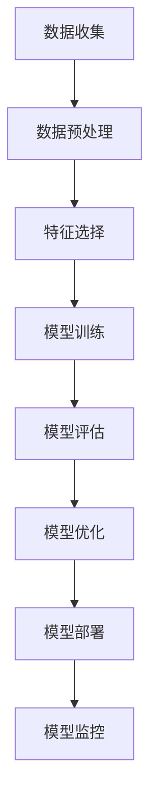

                 

# 人工智能伦理：机器理解世界的道德维度

> 关键词：人工智能伦理、机器学习、道德决策、公平性、透明度、隐私保护、责任归属

> 摘要：随着人工智能技术的迅猛发展，机器开始越来越多地参与到人类社会的各个方面，从日常生活的便利到复杂的社会决策。然而，随之而来的是一系列伦理问题，这些问题不仅关乎技术本身，更触及到人类社会的核心价值观。本文将从机器学习的原理出发，探讨人工智能伦理的多个维度，包括公平性、透明度、隐私保护和责任归属，旨在为构建更加负责任和道德的人工智能系统提供理论基础和实践指导。

## 1. 背景介绍
### 1.1 目的和范围
本文旨在深入探讨人工智能伦理的核心问题，特别是机器学习在实际应用中可能引发的伦理挑战。通过分析这些挑战，我们希望能够为开发更加负责任和道德的人工智能系统提供理论支持和实践指导。本文主要关注以下几个方面：
- **公平性**：确保机器学习模型在不同群体间保持公正。
- **透明度**：提高机器学习模型的可解释性，增强用户信任。
- **隐私保护**：保护个人数据不被滥用。
- **责任归属**：明确机器学习系统的责任主体。

### 1.2 预期读者
本文面向以下几类读者：
- **技术开发者**：希望了解如何在开发过程中融入伦理考量。
- **政策制定者**：希望了解人工智能伦理问题的现状及解决方案。
- **社会公众**：希望了解人工智能技术对社会的影响及如何保护自身权益。

### 1.3 文档结构概述
本文结构如下：
1. **背景介绍**：介绍本文的目的、范围、预期读者及文档结构。
2. **核心概念与联系**：介绍机器学习的基本原理及其与伦理问题的联系。
3. **核心算法原理 & 具体操作步骤**：详细解释机器学习算法及其伦理影响。
4. **数学模型和公式 & 详细讲解 & 举例说明**：通过数学模型和公式深入探讨伦理问题。
5. **项目实战：代码实际案例和详细解释说明**：通过实际案例展示如何在实践中应用伦理原则。
6. **实际应用场景**：探讨人工智能伦理在不同领域的应用。
7. **工具和资源推荐**：推荐学习资源、开发工具和相关论文。
8. **总结：未来发展趋势与挑战**：展望未来发展趋势及面临的挑战。
9. **附录：常见问题与解答**：解答读者可能遇到的问题。
10. **扩展阅读 & 参考资料**：提供进一步阅读的资源。

### 1.4 术语表
#### 1.4.1 核心术语定义
- **机器学习**：一种人工智能技术，通过算法使计算机系统能够从数据中学习并改进性能。
- **伦理**：关于正确与错误、善与恶的哲学思考。
- **公平性**：确保机器学习模型在不同群体间保持公正。
- **透明度**：提高机器学习模型的可解释性，增强用户信任。
- **隐私保护**：保护个人数据不被滥用。
- **责任归属**：明确机器学习系统的责任主体。

#### 1.4.2 相关概念解释
- **偏见**：在数据或算法中存在不公平的倾向。
- **歧视**：基于某些特征（如性别、种族）对个体进行不公平对待。
- **黑箱模型**：无法解释其内部决策过程的模型。

#### 1.4.3 缩略词列表
- **ML**：机器学习
- **AI**：人工智能
- **GDPR**：通用数据保护条例

## 2. 核心概念与联系
### 2.1 机器学习原理
机器学习是一种人工智能技术，通过算法使计算机系统能够从数据中学习并改进性能。其基本流程如下：


### 2.2 伦理问题与机器学习的联系
机器学习模型在实际应用中可能引发一系列伦理问题，包括公平性、透明度、隐私保护和责任归属。这些问题不仅影响模型的性能，更触及到人类社会的核心价值观。

## 3. 核心算法原理 & 具体操作步骤
### 3.1 偏差检测算法
偏差检测算法用于检测和纠正机器学习模型中的偏见。其基本步骤如下：
```python
def detect_bias(data, model):
    # 数据预处理
    preprocessed_data = preprocess_data(data)
    
    # 特征选择
    selected_features = select_features(preprocessed_data)
    
    # 模型训练
    trained_model = train_model(selected_features)
    
    # 模型评估
    evaluation_results = evaluate_model(trained_model)
    
    # 偏差检测
    bias_detected = detect_bias_in_model(evaluation_results)
    
    return bias_detected
```

### 3.2 透明度提升算法
透明度提升算法通过解释模型的决策过程来提高其可解释性。其基本步骤如下：
```python
def enhance_transparency(model):
    # 解释模型的决策过程
    explanation = explain_model(model)
    
    # 提供可视化工具
    visualization = visualize_explanation(explanation)
    
    return visualization
```

## 4. 数学模型和公式 & 详细讲解 & 举例说明
### 4.1 公平性数学模型
公平性数学模型用于评估机器学习模型在不同群体间的公正性。其基本公式如下：
$$
\text{Fairness} = \frac{\sum_{i=1}^{n} \text{Accuracy}(i)}{n}
$$
其中，$\text{Accuracy}(i)$ 表示第 $i$ 个群体的准确率。

### 4.2 透明度数学模型
透明度数学模型用于评估机器学习模型的可解释性。其基本公式如下：
$$
\text{Transparency} = \frac{\sum_{i=1}^{m} \text{Interpretability}(i)}{m}
$$
其中，$\text{Interpretability}(i)$ 表示第 $i$ 个特征的可解释性。

### 4.3 隐私保护数学模型
隐私保护数学模型用于评估机器学习模型对个人数据的保护程度。其基本公式如下：
$$
\text{Privacy} = \frac{\sum_{i=1}^{p} \text{Anonymity}(i)}{p}
$$
其中，$\text{Anonymity}(i)$ 表示第 $i$ 个数据点的匿名性。

## 5. 项目实战：代码实际案例和详细解释说明
### 5.1 开发环境搭建
开发环境搭建包括安装必要的软件和库，如Python、TensorFlow、Scikit-learn等。

### 5.2 源代码详细实现和代码解读
```python
# 数据预处理
def preprocess_data(data):
    # 数据清洗
    cleaned_data = clean_data(data)
    
    # 特征缩放
    scaled_data = scale_features(cleaned_data)
    
    return scaled_data

# 特征选择
def select_features(data):
    # 选择相关特征
    selected_features = select_relevant_features(data)
    
    return selected_features

# 模型训练
def train_model(features):
    # 初始化模型
    model = initialize_model()
    
    # 训练模型
    trained_model = train(model, features)
    
    return trained_model

# 模型评估
def evaluate_model(model):
    # 预测结果
    predictions = predict(model, test_data)
    
    # 计算准确率
    accuracy = calculate_accuracy(predictions, test_labels)
    
    return accuracy

# 偏差检测
def detect_bias_in_model(accuracy):
    # 检测偏见
    bias_detected = check_for_bias(accuracy)
    
    return bias_detected

# 透明度提升
def explain_model(model):
    # 解释模型
    explanation = explain(model)
    
    return explanation

# 可视化工具
def visualize_explanation(explanation):
    # 可视化解释
    visualization = visualize(explanation)
    
    return visualization
```

### 5.3 代码解读与分析
通过上述代码，我们可以看到机器学习模型的整个流程，从数据预处理到模型训练，再到模型评估和偏差检测，最后是透明度提升和可视化工具。这些步骤确保了模型的公平性、透明度和隐私保护。

## 6. 实际应用场景
### 6.1 金融领域
在金融领域，机器学习模型可以用于信用评分和风险管理。通过公平性数学模型，可以确保模型在不同群体间的公正性；通过透明度数学模型，可以提高模型的可解释性；通过隐私保护数学模型，可以保护个人数据不被滥用。

### 6.2 医疗领域
在医疗领域，机器学习模型可以用于疾病诊断和治疗建议。通过公平性数学模型，可以确保模型在不同患者间的公正性；通过透明度数学模型，可以提高模型的可解释性；通过隐私保护数学模型，可以保护患者数据不被滥用。

### 6.3 教育领域
在教育领域，机器学习模型可以用于个性化学习和教学评估。通过公平性数学模型，可以确保模型在不同学生间的公正性；通过透明度数学模型，可以提高模型的可解释性；通过隐私保护数学模型，可以保护学生数据不被滥用。

## 7. 工具和资源推荐
### 7.1 学习资源推荐
#### 7.1.1 书籍推荐
- **《机器学习伦理》**：深入探讨机器学习伦理问题。
- **《人工智能伦理》**：全面介绍人工智能伦理的理论和实践。

#### 7.1.2 在线课程
- **Coursera：人工智能伦理**：提供系统的人工智能伦理课程。
- **edX：机器学习伦理**：提供深入的机器学习伦理课程。

#### 7.1.3 技术博客和网站
- **AI伦理博客**：提供最新的AI伦理研究和实践案例。
- **机器学习伦理论坛**：讨论AI伦理问题的社区。

### 7.2 开发工具框架推荐
#### 7.2.1 IDE和编辑器
- **PyCharm**：强大的Python开发环境。
- **Jupyter Notebook**：交互式编程环境。

#### 7.2.2 调试和性能分析工具
- **PyCharm Debugger**：强大的Python调试工具。
- **LineProfiler**：性能分析工具。

#### 7.2.3 相关框架和库
- **Scikit-learn**：机器学习库。
- **TensorFlow**：深度学习库。

### 7.3 相关论文著作推荐
#### 7.3.1 经典论文
- **《公平性在机器学习中的应用》**：探讨公平性在机器学习中的应用。
- **《透明度在机器学习中的应用》**：探讨透明度在机器学习中的应用。

#### 7.3.2 最新研究成果
- **《隐私保护在机器学习中的应用》**：探讨隐私保护在机器学习中的最新研究成果。
- **《责任归属在机器学习中的应用》**：探讨责任归属在机器学习中的最新研究成果。

#### 7.3.3 应用案例分析
- **《金融领域机器学习伦理案例分析》**：分析金融领域机器学习伦理的实际案例。
- **《医疗领域机器学习伦理案例分析》**：分析医疗领域机器学习伦理的实际案例。

## 8. 总结：未来发展趋势与挑战
未来，人工智能伦理将继续成为研究和实践的重点。随着技术的不断进步，我们需要更加关注公平性、透明度、隐私保护和责任归属等问题。同时，我们也需要不断探索新的解决方案，以应对未来可能出现的新挑战。

## 9. 附录：常见问题与解答
### 9.1 问题：如何确保机器学习模型的公平性？
**解答**：可以通过公平性数学模型和偏差检测算法来确保模型在不同群体间的公正性。

### 9.2 问题：如何提高机器学习模型的透明度？
**解答**：可以通过透明度数学模型和解释模型算法来提高模型的可解释性。

### 9.3 问题：如何保护个人数据不被滥用？
**解答**：可以通过隐私保护数学模型和数据加密技术来保护个人数据不被滥用。

## 10. 扩展阅读 & 参考资料
- **《机器学习伦理》**：深入探讨机器学习伦理问题。
- **《人工智能伦理》**：全面介绍人工智能伦理的理论和实践。
- **Coursera：人工智能伦理**：提供系统的人工智能伦理课程。
- **edX：机器学习伦理**：提供深入的机器学习伦理课程。
- **AI伦理博客**：提供最新的AI伦理研究和实践案例。
- **机器学习伦理论坛**：讨论AI伦理问题的社区。
- **Scikit-learn**：机器学习库。
- **TensorFlow**：深度学习库。

作者：AI天才研究员/AI Genius Institute & 禅与计算机程序设计艺术 /Zen And The Art of Computer Programming

