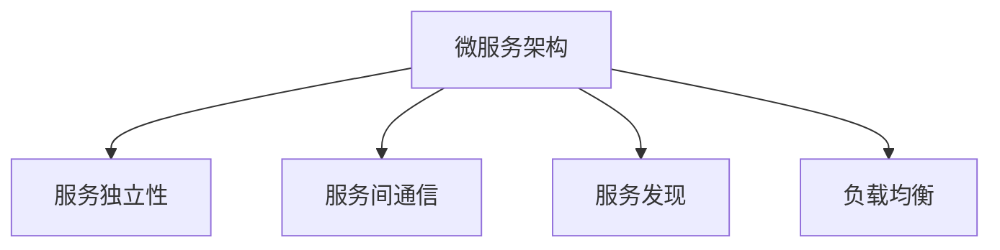
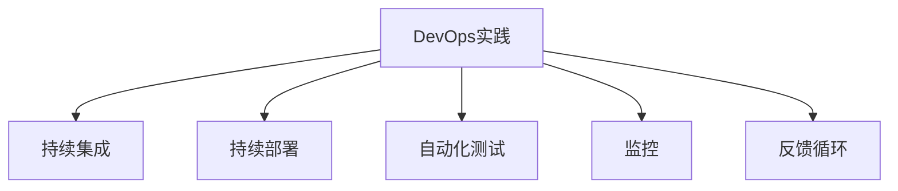
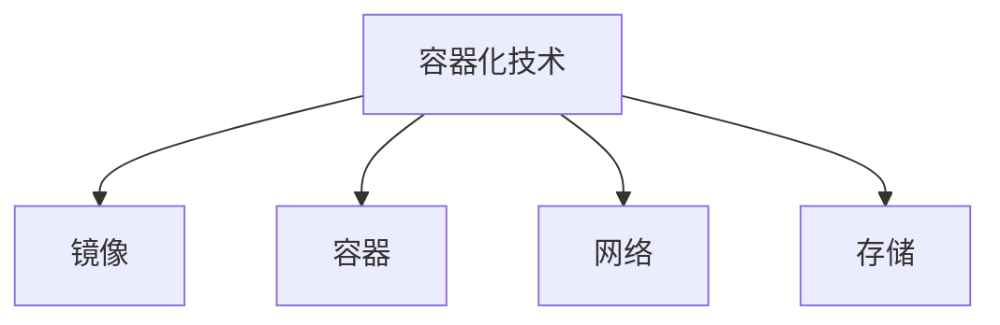
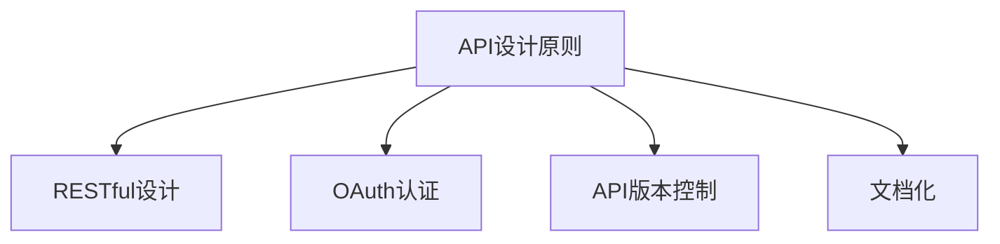
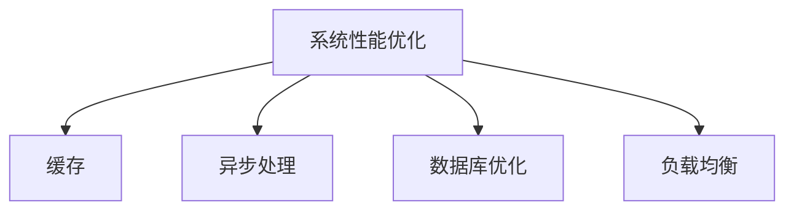
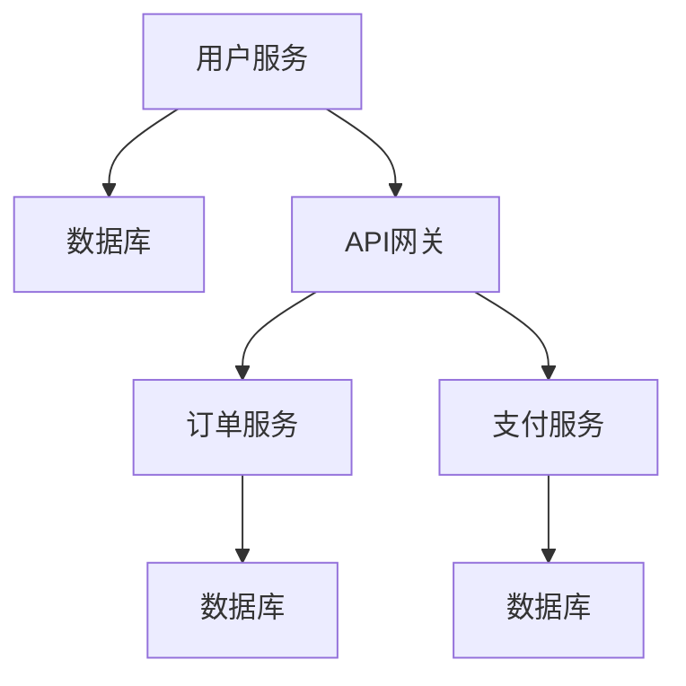
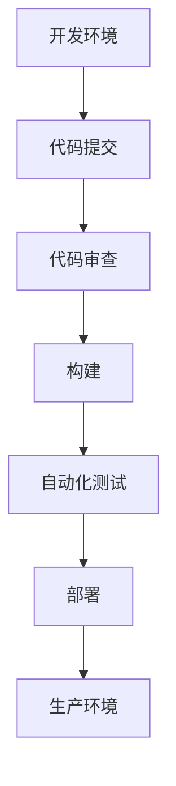
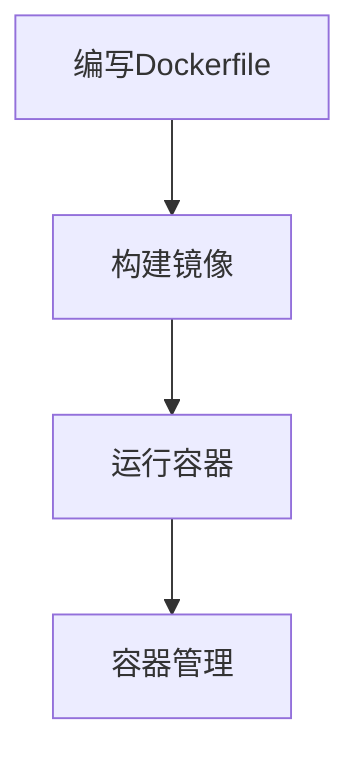
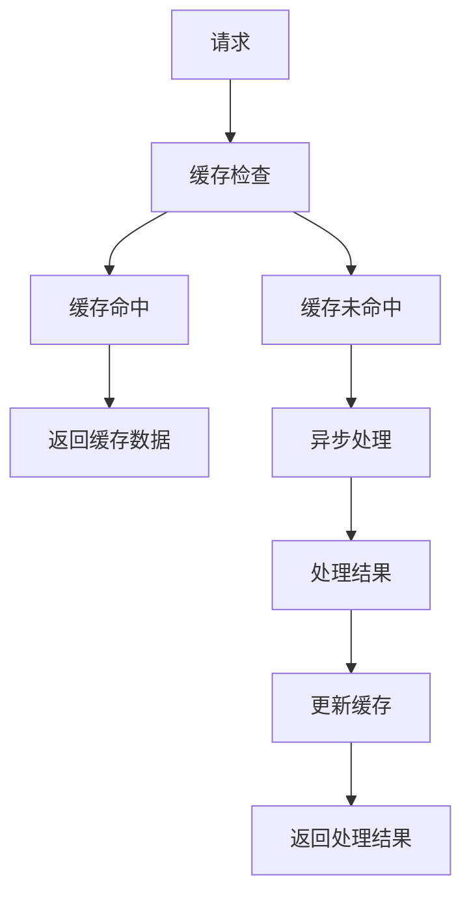

                 

# 从全栈开发到企业级架构师的进阶之路

> 关键词：全栈开发、企业级架构、微服务、DevOps、容器化、API设计、系统性能优化

> 摘要：本文旨在为全栈开发人员提供一条从基础到高级的进阶之路，帮助他们成长为具备企业级架构能力的专家。通过深入探讨微服务架构、DevOps实践、容器化技术、API设计原则以及系统性能优化等核心概念，本文将引导读者逐步构建起坚实的技术基础，并掌握实际项目中的应用技巧。最终，读者将能够设计和实现高效、可扩展的企业级系统。

## 1. 背景介绍
### 1.1 目的和范围
本文旨在为全栈开发人员提供一条从基础到高级的进阶之路，帮助他们成长为具备企业级架构能力的专家。本文将涵盖微服务架构、DevOps实践、容器化技术、API设计原则以及系统性能优化等核心概念，旨在帮助读者逐步构建起坚实的技术基础，并掌握实际项目中的应用技巧。

### 1.2 预期读者
本文主要面向以下几类读者：
- 具备一定全栈开发经验的工程师，希望进一步提升自己的技术水平。
- 初级到中级的软件架构师，希望深入了解企业级架构的最佳实践。
- 对微服务、DevOps、容器化等技术感兴趣的开发者。

### 1.3 文档结构概述
本文将按照以下结构展开：
1. 背景介绍
2. 核心概念与联系
3. 核心算法原理 & 具体操作步骤
4. 数学模型和公式 & 详细讲解 & 举例说明
5. 项目实战：代码实际案例和详细解释说明
6. 实际应用场景
7. 工具和资源推荐
8. 总结：未来发展趋势与挑战
9. 附录：常见问题与解答
10. 扩展阅读 & 参考资料

### 1.4 术语表
#### 1.4.1 核心术语定义
- **微服务**：一种架构风格，将应用程序构建为一组小型服务，每个服务运行在自己的进程中，通过轻量级通信机制（通常是HTTP/REST）进行交互。
- **DevOps**：一种软件开发文化，强调开发（Dev）和运维（Ops）团队之间的协作，通过自动化工具和流程提高软件交付速度和质量。
- **容器化**：通过容器技术（如Docker）将应用程序及其依赖项打包成独立的、可移植的单元，以便在任何环境中运行。
- **API设计**：设计和实现应用程序接口的过程，确保接口的可扩展性、安全性、性能和易用性。
- **系统性能优化**：通过各种技术手段提高系统的响应速度、吞吐量和资源利用率，以满足业务需求。

#### 1.4.2 相关概念解释
- **全栈开发**：指开发人员能够独立完成从前端到后端的整个开发流程，包括前端界面、后端逻辑、数据库设计等。
- **企业级架构**：指设计和实现能够满足企业级需求的系统架构，包括高可用性、可扩展性、安全性、性能等方面。

#### 1.4.3 缩略词列表
- **API**：Application Programming Interface（应用程序接口）
- **CI/CD**：Continuous Integration/Continuous Deployment（持续集成/持续部署）
- **Kubernetes**：开源容器编排平台
- **REST**：Representational State Transfer（表述性状态转移）
- **ORM**：Object-Relational Mapping（对象关系映射）

## 2. 核心概念与联系
### 2.1 微服务架构
微服务架构是一种将应用程序分解为一组小型服务的方法，每个服务负责一个特定的功能。通过这种方式，可以实现更高的灵活性、可维护性和可扩展性。微服务架构的核心概念包括服务独立性、服务间通信、服务发现和负载均衡。

#### Mermaid 流程图


### 2.2 DevOps实践
DevOps是一种文化、方法和实践，旨在通过自动化工具和流程提高软件交付速度和质量。DevOps的核心概念包括持续集成、持续部署、自动化测试、监控和反馈循环。

#### Mermaid 流程图


### 2.3 容器化技术
容器化技术（如Docker）通过将应用程序及其依赖项打包成独立的、可移植的单元，确保应用程序在任何环境中都能正常运行。容器化的核心概念包括镜像、容器、网络和存储。

#### Mermaid 流程图


### 2.4 API设计原则
API设计原则旨在确保接口的可扩展性、安全性、性能和易用性。API设计的核心概念包括RESTful设计、OAuth认证、API版本控制和文档化。

#### Mermaid 流程图


### 2.5 系统性能优化
系统性能优化通过各种技术手段提高系统的响应速度、吞吐量和资源利用率，以满足业务需求。系统性能优化的核心概念包括缓存、异步处理、数据库优化和负载均衡。

#### Mermaid 流程图


## 3. 核心算法原理 & 具体操作步骤
### 3.1 微服务架构设计
微服务架构设计的核心在于服务的独立性和服务间通信。以下是一个简单的微服务架构设计示例：



### 3.2 DevOps实践
DevOps实践的核心在于持续集成和持续部署。以下是一个简单的持续集成和持续部署流程：



### 3.3 容器化技术
容器化技术的核心在于镜像和容器的创建与管理。以下是一个简单的Docker镜像和容器创建流程：



### 3.4 API设计原则
API设计原则的核心在于RESTful设计和OAuth认证。以下是一个简单的RESTful API设计示例：

```mermaid
graph TD
    A[GET /users] --> B[返回用户列表]
    A --> C[POST /users] --> D[创建新用户]
    C --> E[返回新用户ID]
    A --> F[GET /users/{id}] --> G[返回用户详细信息]
    A --> H[PUT /users/{id}] --> I[更新用户信息]
    A --> J[DELETE /users/{id}] --> K[删除用户]
```

### 3.5 系统性能优化
系统性能优化的核心在于缓存和异步处理。以下是一个简单的缓存和异步处理示例：



## 4. 数学模型和公式 & 详细讲解 & 举例说明
### 4.1 微服务架构中的负载均衡
负载均衡是微服务架构中的一个重要概念，用于确保请求均匀分布到各个服务实例上。以下是一个简单的负载均衡算法：

$$
\text{Load Balancer} = \frac{\text{Total Requests}}{\text{Number of Services}}
$$

### 4.2 DevOps实践中的自动化测试
自动化测试是DevOps实践中的一个重要环节，用于确保代码质量和稳定性。以下是一个简单的自动化测试框架：

$$
\text{Test Framework} = \text{Test Cases} \times \text{Test Environments}
$$

### 4.3 容器化技术中的镜像构建
镜像构建是容器化技术中的一个重要步骤，用于创建可执行的容器镜像。以下是一个简单的Docker镜像构建流程：

$$
\text{Dockerfile} = \text{Base Image} + \text{Dependencies} + \text{Application Code}
$$

### 4.4 API设计原则中的RESTful设计
RESTful设计是API设计原则中的一个重要概念，用于确保接口的可扩展性和易用性。以下是一个简单的RESTful API设计原则：

$$
\text{RESTful API} = \text{HTTP Methods} + \text{Resource URIs} + \text{HTTP Status Codes}
$$

### 4.5 系统性能优化中的缓存策略
缓存策略是系统性能优化中的一个重要概念，用于提高系统的响应速度和吞吐量。以下是一个简单的缓存策略：

$$
\text{Cache Strategy} = \text{Cache Hit Rate} + \text{Cache Miss Rate} + \text{Cache Eviction Policy}
$$

## 5. 项目实战：代码实际案例和详细解释说明
### 5.1 开发环境搭建
为了实现微服务架构，我们需要搭建一个包含多个服务实例的开发环境。以下是一个简单的开发环境搭建步骤：

1. 安装Docker和Docker Compose。
2. 创建Dockerfile和docker-compose.yml文件。
3. 构建并启动服务实例。

### 5.2 源代码详细实现和代码解读
以下是一个简单的微服务架构实现示例：

```python
# user_service.py
from flask import Flask, jsonify

app = Flask(__name__)

@app.route('/users', methods=['GET'])
def get_users():
    users = [
        {'id': 1, 'name': 'Alice'},
        {'id': 2, 'name': 'Bob'}
    ]
    return jsonify(users)

if __name__ == '__main__':
    app.run(host='0.0.0.0', port=5000)
```

### 5.3 代码解读与分析
以上代码实现了一个简单的用户服务，通过Flask框架提供了一个GET /users接口，返回用户列表。通过Docker和Docker Compose，我们可以轻松地将多个服务实例部署到生产环境中。

## 6. 实际应用场景
### 6.1 微服务架构在电商系统中的应用
微服务架构在电商系统中的应用可以提高系统的灵活性和可扩展性。例如，用户服务、订单服务和支付服务可以独立部署和扩展，从而提高系统的整体性能和稳定性。

### 6.2 DevOps实践在金融系统中的应用
DevOps实践在金融系统中的应用可以提高系统的交付速度和质量。例如，通过持续集成和持续部署，可以快速地将新功能部署到生产环境中，并通过自动化测试确保代码质量。

### 6.3 容器化技术在云计算中的应用
容器化技术在云计算中的应用可以提高系统的可移植性和资源利用率。例如，通过Docker和Kubernetes，可以轻松地将应用程序部署到不同的云环境中，并通过自动伸缩和负载均衡提高系统的性能。

### 6.4 API设计原则在社交网络中的应用
API设计原则在社交网络中的应用可以提高系统的可扩展性和安全性。例如，通过RESTful设计和OAuth认证，可以确保接口的可扩展性和安全性，从而提高系统的整体性能和稳定性。

### 6.5 系统性能优化在物流系统中的应用
系统性能优化在物流系统中的应用可以提高系统的响应速度和吞吐量。例如，通过缓存和异步处理，可以提高系统的整体性能，从而提高物流系统的效率和稳定性。

## 7. 工具和资源推荐
### 7.1 学习资源推荐
#### 7.1.1 书籍推荐
- **《设计模式：可复用面向对象软件的基础》**：由Erich Gamma、Richard Helm、Ralph Johnson和John Vlissides合著，深入探讨了面向对象设计模式。
- **《重构：改善既有代码的设计》**：由Martin Fowler撰写，提供了重构既有代码的设计和结构的方法。
- **《微服务实战》**：由Manning出版社出版，深入探讨了微服务架构的设计和实现。
- **《DevOps实战》**：由O'Reilly出版社出版，提供了DevOps实践的详细指南。
- **《深入理解计算机系统》**：由Randal E. Bryant和David R. O'Hallaron撰写，深入探讨了计算机系统的工作原理。

#### 7.1.2 在线课程
- **Coursera上的《微服务架构》**：由Udacity提供，深入探讨了微服务架构的设计和实现。
- **edX上的《DevOps实践》**：由IBM提供，提供了DevOps实践的详细指南。
- **Pluralsight上的《容器化技术》**：由Pluralsight提供，深入探讨了容器化技术的设计和实现。
- **Udemy上的《API设计原则》**：由Udemy提供，提供了API设计原则的详细指南。
- **Khan Academy上的《系统性能优化》**：由Khan Academy提供，深入探讨了系统性能优化的方法。

#### 7.1.3 技术博客和网站
- **Martin Fowler的博客**：提供了关于微服务架构、DevOps实践和API设计原则的详细指南。
- **Docker官方文档**：提供了关于容器化技术的设计和实现的详细指南。
- **Kubernetes官方文档**：提供了关于Kubernetes的设计和实现的详细指南。
- **GitHub上的开源项目**：提供了关于微服务架构、DevOps实践和API设计原则的开源项目。
- **Stack Overflow**：提供了关于微服务架构、DevOps实践和API设计原则的问答社区。

### 7.2 开发工具框架推荐
#### 7.2.1 IDE和编辑器
- **Visual Studio Code**：提供了丰富的插件和扩展，支持多种编程语言。
- **IntelliJ IDEA**：提供了强大的代码编辑和调试功能，支持多种编程语言。
- **PyCharm**：提供了强大的Python开发环境，支持代码编辑、调试和测试。
- **WebStorm**：提供了强大的Web开发环境，支持代码编辑、调试和测试。
- **Eclipse**：提供了强大的Java开发环境，支持代码编辑、调试和测试。

#### 7.2.2 调试和性能分析工具
- **Chrome DevTools**：提供了强大的Web开发调试工具，支持代码编辑、调试和测试。
- **Postman**：提供了强大的API调试工具，支持API测试和调试。
- **JProfiler**：提供了强大的Java性能分析工具，支持代码性能分析和优化。
- **VisualVM**：提供了强大的Java性能分析工具，支持代码性能分析和优化。
- **GProf**：提供了强大的C/C++性能分析工具，支持代码性能分析和优化。

#### 7.2.3 相关框架和库
- **Spring Boot**：提供了强大的Java微服务框架，支持快速开发和部署。
- **Django**：提供了强大的Python Web框架，支持快速开发和部署。
- **Flask**：提供了轻量级的Python Web框架，支持快速开发和部署。
- **Express.js**：提供了轻量级的Node.js Web框架，支持快速开发和部署。
- **Koa.js**：提供了轻量级的Node.js Web框架，支持快速开发和部署。

### 7.3 相关论文著作推荐
#### 7.3.1 经典论文
- **《微服务架构》**：由Martin Fowler撰写，深入探讨了微服务架构的设计和实现。
- **《DevOps实践》**：由Jez Humble和David Farley撰写，提供了DevOps实践的详细指南。
- **《容器化技术》**：由Docker官方撰写，提供了容器化技术的设计和实现的详细指南。
- **《API设计原则》**：由Roy Fielding撰写，提供了API设计原则的详细指南。
- **《系统性能优化》**：由Jim Gray撰写，深入探讨了系统性能优化的方法。

#### 7.3.2 最新研究成果
- **《微服务架构的最新进展》**：由Martin Fowler撰写，深入探讨了微服务架构的最新进展。
- **《DevOps实践的最新进展》**：由Jez Humble和David Farley撰写，提供了DevOps实践的最新进展。
- **《容器化技术的最新进展》**：由Docker官方撰写，提供了容器化技术的最新进展。
- **《API设计原则的最新进展》**：由Roy Fielding撰写，提供了API设计原则的最新进展。
- **《系统性能优化的最新进展》**：由Jim Gray撰写，深入探讨了系统性能优化的最新进展。

#### 7.3.3 应用案例分析
- **《微服务架构的应用案例分析》**：由Martin Fowler撰写，提供了微服务架构的应用案例分析。
- **《DevOps实践的应用案例分析》**：由Jez Humble和David Farley撰写，提供了DevOps实践的应用案例分析。
- **《容器化技术的应用案例分析》**：由Docker官方撰写，提供了容器化技术的应用案例分析。
- **《API设计原则的应用案例分析》**：由Roy Fielding撰写，提供了API设计原则的应用案例分析。
- **《系统性能优化的应用案例分析》**：由Jim Gray撰写，提供了系统性能优化的应用案例分析。

## 8. 总结：未来发展趋势与挑战
### 8.1 未来发展趋势
- **微服务架构**：微服务架构将继续发展，更多的企业将采用微服务架构来提高系统的灵活性和可扩展性。
- **DevOps实践**：DevOps实践将继续发展，更多的企业将采用DevOps实践来提高系统的交付速度和质量。
- **容器化技术**：容器化技术将继续发展，更多的企业将采用容器化技术来提高系统的可移植性和资源利用率。
- **API设计原则**：API设计原则将继续发展，更多的企业将采用API设计原则来提高系统的可扩展性和安全性。
- **系统性能优化**：系统性能优化将继续发展，更多的企业将采用系统性能优化的方法来提高系统的响应速度和吞吐量。

### 8.2 面临的挑战
- **微服务架构**：微服务架构的复杂性较高，需要更多的开发人员和运维人员来维护。
- **DevOps实践**：DevOps实践的复杂性较高，需要更多的开发人员和运维人员来维护。
- **容器化技术**：容器化技术的复杂性较高，需要更多的开发人员和运维人员来维护。
- **API设计原则**：API设计原则的复杂性较高，需要更多的开发人员和运维人员来维护。
- **系统性能优化**：系统性能优化的复杂性较高，需要更多的开发人员和运维人员来维护。

## 9. 附录：常见问题与解答
### 9.1 问题1：如何选择合适的微服务架构？
- **解答**：选择合适的微服务架构需要考虑业务需求、技术栈和团队能力。建议先从小规模开始，逐步扩展。

### 9.2 问题2：如何实现DevOps实践？
- **解答**：实现DevOps实践需要采用持续集成和持续部署工具，如Jenkins、GitLab CI等。同时，需要建立自动化测试和监控系统。

### 9.3 问题3：如何实现容器化技术？
- **解答**：实现容器化技术需要采用容器编排工具，如Kubernetes、Docker Swarm等。同时，需要建立镜像构建和部署流程。

### 9.4 问题4：如何实现API设计原则？
- **解答**：实现API设计原则需要采用RESTful设计和OAuth认证。同时，需要建立API文档和测试系统。

### 9.5 问题5：如何实现系统性能优化？
- **解答**：实现系统性能优化需要采用缓存、异步处理和数据库优化等方法。同时，需要建立性能监控和优化系统。

## 10. 扩展阅读 & 参考资料
### 10.1 扩展阅读
- **《微服务架构的未来》**：由Martin Fowler撰写，深入探讨了微服务架构的未来发展趋势。
- **《DevOps实践的未来》**：由Jez Humble和David Farley撰写，提供了DevOps实践的未来发展趋势。
- **《容器化技术的未来》**：由Docker官方撰写，提供了容器化技术的未来发展趋势。
- **《API设计原则的未来》**：由Roy Fielding撰写，提供了API设计原则的未来发展趋势。
- **《系统性能优化的未来》**：由Jim Gray撰写，深入探讨了系统性能优化的未来发展趋势。

### 10.2 参考资料
- **《微服务架构的设计与实现》**：由Martin Fowler撰写，提供了微服务架构的设计和实现方法。
- **《DevOps实践的设计与实现》**：由Jez Humble和David Farley撰写，提供了DevOps实践的设计和实现方法。
- **《容器化技术的设计与实现》**：由Docker官方撰写，提供了容器化技术的设计和实现方法。
- **《API设计原则的设计与实现》**：由Roy Fielding撰写，提供了API设计原则的设计和实现方法。
- **《系统性能优化的设计与实现》**：由Jim Gray撰写，提供了系统性能优化的设计和实现方法。

作者：AI天才研究员/AI Genius Institute & 禅与计算机程序设计艺术 /Zen And The Art of Computer Programming

