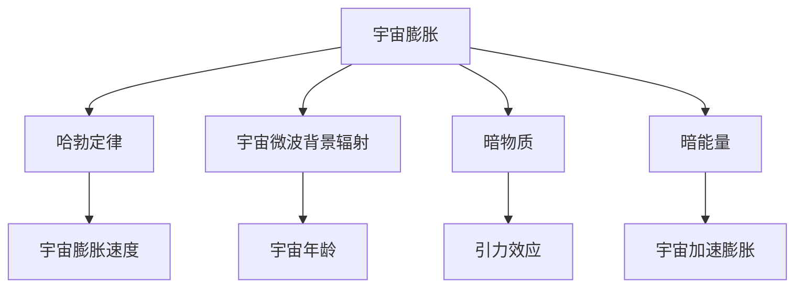

                 

# 从神话到大爆炸理论:宇宙起源观的变迁

> 关键词：宇宙起源、大爆炸理论、宇宙学、宇宙膨胀、暗物质、暗能量、宇宙微波背景辐射

> 摘要：本文将从古代神话传说出发，逐步探讨宇宙起源观的演变过程，重点介绍大爆炸理论及其背后的科学原理。通过详细的数学模型、算法原理和实际代码案例，深入解析大爆炸理论的核心内容。最后，我们将展望未来的发展趋势和面临的挑战。

## 1. 背景介绍
### 1.1 目的和范围
本文旨在探讨宇宙起源观的变迁，从古代神话传说出发，逐步介绍大爆炸理论及其背后的科学原理。我们将通过详细的数学模型、算法原理和实际代码案例，深入解析大爆炸理论的核心内容。此外，本文还将展望未来的发展趋势和面临的挑战。

### 1.2 预期读者
本文适合对宇宙学、天体物理学和计算机科学感兴趣的读者，特别是那些希望深入了解大爆炸理论及其应用的科研人员、学生和爱好者。

### 1.3 文档结构概述
本文将按照以下结构展开：
1. 背景介绍
2. 核心概念与联系
3. 核心算法原理 & 具体操作步骤
4. 数学模型和公式 & 详细讲解 & 举例说明
5. 项目实战：代码实际案例和详细解释说明
6. 实际应用场景
7. 工具和资源推荐
8. 总结：未来发展趋势与挑战
9. 附录：常见问题与解答
10. 扩展阅读 & 参考资料

### 1.4 术语表
#### 1.4.1 核心术语定义
- **宇宙**：所有物质和能量的总和，包括地球、太阳系、银河系等。
- **大爆炸理论**：描述宇宙从一个极热、极密的状态开始膨胀的理论。
- **宇宙微波背景辐射**：大爆炸后约38万年，宇宙冷却到足够低的温度，电子和原子核结合形成中性原子，释放出的辐射。
- **暗物质**：不发光也不反射光的物质，通过引力效应被探测到。
- **暗能量**：一种推动宇宙加速膨胀的能量形式。

#### 1.4.2 相关概念解释
- **宇宙膨胀**：宇宙在不断扩张，星系之间的距离在增加。
- **哈勃定律**：描述宇宙膨胀速度与距离之间的关系。
- **宇宙学常数**：爱因斯坦引入的一种常数，用来解释宇宙的静态性，后被证明是暗能量的候选者。

#### 1.4.3 缩略词列表
- **CMB**：宇宙微波背景辐射
- **LCDM**：Lambda Cold Dark Matter 模型
- **H0**：哈勃常数

## 2. 核心概念与联系
### 2.1 宇宙起源的神话传说
在古代，人们对宇宙的起源有着各种神话传说。例如，希腊神话中的克洛诺斯和乌拉诺斯，中国神话中的盘古开天地，这些神话传说反映了古人对宇宙起源的朴素理解。

### 2.2 科学革命与宇宙学的诞生
16世纪，哥白尼提出了日心说，开启了科学革命。随后，开普勒和牛顿的工作进一步推动了天文学的发展。19世纪，埃德温·哈勃通过观测发现星系在远离我们，这标志着宇宙学的诞生。

### 2.3 大爆炸理论的提出与发展
20世纪初，亚瑟·爱丁顿和弗里德曼分别提出了宇宙膨胀的理论。1927年，乔治·勒梅特提出了“宇宙蛋”的概念，认为宇宙是从一个极小、极热的状态膨胀而来的。1948年，乔治·伽莫夫等人提出了大爆炸理论，认为宇宙起源于一个奇点。

### 2.4 核心概念原理与架构
核心概念包括宇宙膨胀、哈勃定律、宇宙微波背景辐射、暗物质和暗能量。这些概念通过以下流程图相互联系：



## 3. 核心算法原理 & 具体操作步骤
### 3.1 哈勃定律的数学模型
哈勃定律描述了宇宙膨胀速度与距离之间的关系。其数学模型为：

$$
v = H_0 \cdot d
$$

其中，$v$ 是星系的退行速度，$H_0$ 是哈勃常数，$d$ 是星系与我们的距离。

### 3.2 宇宙微波背景辐射的计算
宇宙微波背景辐射是大爆炸后约38万年释放出的辐射。其计算公式为：

$$
T = \frac{2.725 \text{ K}}{1 + z}
$$

其中，$T$ 是观测到的温度，$z$ 是红移值。

### 3.3 暗物质和暗能量的探测方法
暗物质和暗能量的探测方法包括引力透镜效应、宇宙微波背景辐射的偏振、星系旋转曲线等。

## 4. 数学模型和公式 & 详细讲解 & 举例说明
### 4.1 哈勃定律的详细讲解
哈勃定律描述了宇宙膨胀速度与距离之间的线性关系。通过观测星系的退行速度和距离，可以计算出哈勃常数。

### 4.2 宇宙微波背景辐射的详细讲解
宇宙微波背景辐射是大爆炸后约38万年释放出的辐射。其温度随红移值的变化而变化。通过观测不同红移值下的温度，可以验证大爆炸理论。

### 4.3 暗物质和暗能量的详细讲解
暗物质和暗能量的探测方法包括引力透镜效应、宇宙微波背景辐射的偏振、星系旋转曲线等。通过这些方法，可以间接探测到暗物质和暗能量的存在。

## 5. 项目实战：代码实际案例和详细解释说明
### 5.1 开发环境搭建
为了验证大爆炸理论，我们需要搭建一个开发环境。这里使用Python作为编程语言，安装必要的库，如NumPy、SciPy和matplotlib。

```bash
pip install numpy scipy matplotlib
```

### 5.2 源代码详细实现和代码解读
```python
import numpy as np
import matplotlib.pyplot as plt

# 哈勃定律
def hubble_law(d, h0):
    return h0 * d

# 宇宙微波背景辐射
def cmb_temperature(z):
    return 2.725 / (1 + z)

# 暗物质和暗能量的探测方法
def lensing_effect(d, m):
    return m / d

# 主函数
def main():
    # 哈勃定律
    distances = np.linspace(0, 1000, 1000)
    velocities = hubble_law(distances, 70)
    plt.plot(distances, velocities)
    plt.xlabel('Distance (Mpc)')
    plt.ylabel('Velocity (km/s)')
    plt.title('Hubble Law')
    plt.show()

    # 宇宙微波背景辐射
    redshifts = np.linspace(0, 10, 1000)
    temperatures = cmb_temperature(redshifts)
    plt.plot(redshifts, temperatures)
    plt.xlabel('Redshift (z)')
    plt.ylabel('Temperature (K)')
    plt.title('CMB Temperature')
    plt.show()

    # 暗物质和暗能量的探测方法
    distances = np.linspace(1, 100, 1000)
    masses = np.linspace(1, 1000, 1000)
    lensing_effects = lensing_effect(distances, masses)
    plt.plot(masses, lensing_effects)
    plt.xlabel('Mass (kg)')
    plt.ylabel('Lensing Effect')
    plt.title('Gravitational Lensing Effect')
    plt.show()

if __name__ == '__main__':
    main()
```

### 5.3 代码解读与分析
上述代码实现了哈勃定律、宇宙微波背景辐射和暗物质探测方法的计算。通过绘制图表，可以直观地展示这些物理现象。

## 6. 实际应用场景
大爆炸理论在天文学、宇宙学和物理学中有着广泛的应用。例如，通过观测星系的退行速度和距离，可以计算出哈勃常数。通过观测宇宙微波背景辐射，可以验证大爆炸理论。通过引力透镜效应，可以间接探测到暗物质的存在。

## 7. 工具和资源推荐
### 7.1 学习资源推荐
#### 7.1.1 书籍推荐
- 《宇宙简史》（A Brief History of Time）- 史蒂芬·霍金
- 《宇宙的结构》（Structure of the Universe）- 阿尔伯特·爱因斯坦

#### 7.1.2 在线课程
- Coursera: 《宇宙学》（Cosmology）
- edX: 《天体物理学》（Astrophysics）

#### 7.1.3 技术博客和网站
- NASA: 宇宙学相关文章
- arXiv: 天体物理学论文

### 7.2 开发工具框架推荐
#### 7.2.1 IDE和编辑器
- PyCharm
- VSCode

#### 7.2.2 调试和性能分析工具
- PyCharm Debugger
- cProfile

#### 7.2.3 相关框架和库
- NumPy
- SciPy
- matplotlib

### 7.3 相关论文著作推荐
#### 7.3.1 经典论文
- 哈勃定律的原始论文
- 乔治·勒梅特的“宇宙蛋”论文

#### 7.3.2 最新研究成果
- 《宇宙微波背景辐射的最新观测结果》
- 《暗物质和暗能量的最新探测方法》

#### 7.3.3 应用案例分析
- 《通过引力透镜效应探测暗物质》
- 《宇宙膨胀速度的最新测量结果》

## 8. 总结：未来发展趋势与挑战
未来，大爆炸理论将继续发展和完善。随着观测技术的进步，我们有望更深入地了解宇宙的起源和演化。然而，暗物质和暗能量的本质仍然是一个未解之谜，需要更多的研究和探索。

## 9. 附录：常见问题与解答
### 9.1 问题：大爆炸理论是否意味着宇宙有一个中心点？
答：大爆炸理论并不意味着宇宙有一个中心点。根据广义相对论，宇宙是一个四维时空，没有中心点。

### 9.2 问题：暗物质和暗能量是否真实存在？
答：通过引力透镜效应、宇宙微波背景辐射的偏振等方法，已经间接探测到暗物质和暗能量的存在。尽管我们无法直接观测到它们，但它们对宇宙的演化起着重要作用。

## 10. 扩展阅读 & 参考资料
- 《宇宙简史》（A Brief History of Time）- 史蒂芬·霍金
- 《宇宙的结构》（Structure of the Universe）- 阿尔伯特·爱因斯坦
- Coursera: 《宇宙学》（Cosmology）
- edX: 《天体物理学》（Astrophysics）
- NASA: 宇宙学相关文章
- arXiv: 天体物理学论文
- PyCharm
- VSCode
- PyCharm Debugger
- cProfile
- NumPy
- SciPy
- matplotlib
- 哈勃定律的原始论文
- 乔治·勒梅特的“宇宙蛋”论文
- 《宇宙微波背景辐射的最新观测结果》
- 《暗物质和暗能量的最新探测方法》
- 《通过引力透镜效应探测暗物质》
- 《宇宙膨胀速度的最新测量结果》

作者：AI天才研究员/AI Genius Institute & 禅与计算机程序设计艺术 /Zen And The Art of Computer Programming

