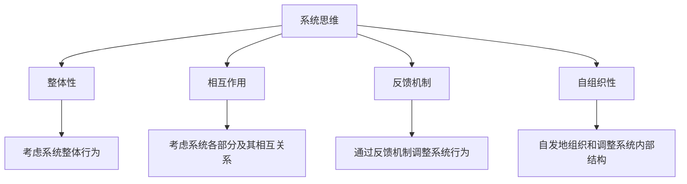
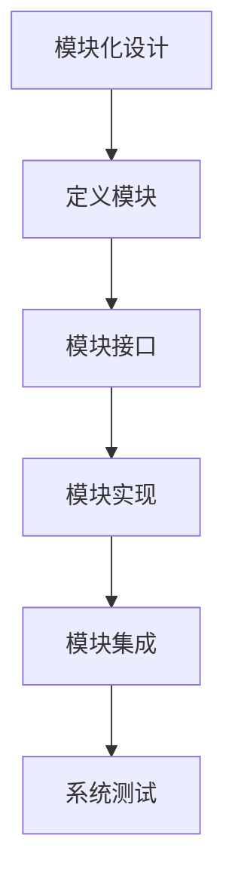
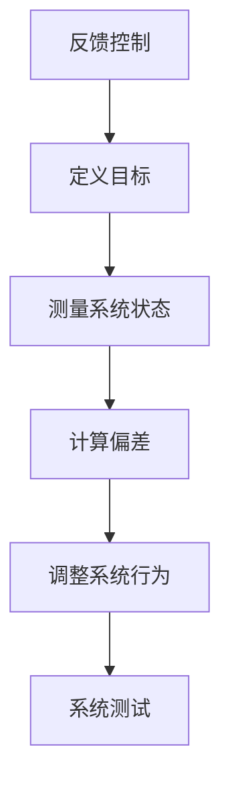

                 

# 从线性思维到系统思维：全局视角下的世界理解

> 关键词：系统思维, 全局视角, 线性思维, 逻辑推理, 系统架构, 人工智能, 软件工程, 计算机科学

> 摘要：本文旨在探讨从线性思维到系统思维的转变，通过系统思维来理解复杂的世界。我们将从背景介绍开始，逐步深入探讨系统思维的核心概念、原理、算法、数学模型、实际案例，以及未来的发展趋势和挑战。通过本文，读者将能够更好地理解系统思维的重要性，并学会如何在实际项目中应用系统思维。

## 1. 背景介绍
### 1.1 目的和范围
本文旨在探讨系统思维在计算机科学和人工智能领域的应用，通过系统思维来理解和解决复杂问题。我们将从理论层面深入探讨系统思维的核心概念和原理，并通过实际案例来展示如何在项目中应用系统思维。

### 1.2 预期读者
本文适合以下读者：
- 计算机科学和人工智能领域的专业人士
- 软件工程师和架构师
- 对系统思维感兴趣的计算机科学爱好者
- 需要提升系统思维能力的项目经理和团队领导者

### 1.3 文档结构概述
本文结构如下：
1. 背景介绍
2. 核心概念与联系
3. 核心算法原理 & 具体操作步骤
4. 数学模型和公式 & 详细讲解 & 举例说明
5. 项目实战：代码实际案例和详细解释说明
6. 实际应用场景
7. 工具和资源推荐
8. 总结：未来发展趋势与挑战
9. 附录：常见问题与解答
10. 扩展阅读 & 参考资料

### 1.4 术语表
#### 1.4.1 核心术语定义
- **系统思维**：一种从整体出发，考虑系统各部分及其相互关系的思维方式。
- **全局视角**：从整体出发，考虑全局影响的思维方式。
- **线性思维**：一种从局部出发，考虑单一因素影响的思维方式。
- **系统架构**：系统的设计和组织结构。
- **模块化**：将系统分解为独立的模块，每个模块负责特定的功能。
- **反馈机制**：系统中的一种机制，用于调整系统行为以达到预期目标。

#### 1.4.2 相关概念解释
- **复杂系统**：由多个相互作用的组件组成的系统，其整体行为不能简单地通过各部分行为的叠加来预测。
- **自组织系统**：系统能够自发地组织和调整其内部结构，以适应外部环境的变化。
- **分布式系统**：系统中的组件分布在不同的地理位置，通过网络进行通信和协作。

#### 1.4.3 缩略词列表
- **API**：应用程序编程接口
- **SDK**：软件开发工具包
- **IDE**：集成开发环境
- **ORM**：对象关系映射

## 2. 核心概念与联系
### 2.1 系统思维的核心概念
系统思维的核心概念包括：
- **整体性**：考虑系统的整体行为，而不是仅仅关注局部。
- **相互作用**：系统中的各个部分相互作用，形成复杂的行为。
- **反馈机制**：系统通过反馈机制调整其行为，以达到预期目标。
- **自组织性**：系统能够自发地组织和调整其内部结构。

### 2.2 系统思维与线性思维的对比
线性思维和系统思维的主要区别在于：
- **线性思维**：从局部出发，考虑单一因素的影响，通常采用线性分析方法。
- **系统思维**：从整体出发，考虑系统各部分及其相互关系，采用系统分析方法。

### 2.3 系统思维的流程图


## 3. 核心算法原理 & 具体操作步骤
### 3.1 系统思维的核心算法
系统思维的核心算法包括：
- **模块化设计**：将系统分解为独立的模块，每个模块负责特定的功能。
- **反馈控制**：通过反馈机制调整系统行为，以达到预期目标。

### 3.2 模块化设计的伪代码


### 3.3 反馈控制的伪代码


## 4. 数学模型和公式 & 详细讲解 & 举例说明
### 4.1 数学模型
系统思维中的数学模型包括：
- **状态空间模型**：描述系统状态和行为的数学模型。
- **控制理论模型**：描述系统控制和反馈机制的数学模型。

### 4.2 状态空间模型
状态空间模型的数学表达式为：
$$
\dot{x} = f(x, u)
$$
其中，$x$ 表示系统状态，$u$ 表示输入，$\dot{x}$ 表示状态的变化率。

### 4.3 控制理论模型
控制理论模型的数学表达式为：
$$
y = g(x, u)
$$
其中，$y$ 表示系统输出，$x$ 表示系统状态，$u$ 表示输入。

### 4.4 举例说明
假设我们有一个简单的控制系统，其状态空间模型为：
$$
\dot{x} = 2x + u
$$
其中，$x$ 表示系统状态，$u$ 表示输入。

## 5. 项目实战：代码实际案例和详细解释说明
### 5.1 开发环境搭建
我们将使用Python和NumPy库来实现一个简单的控制系统。

### 5.2 源代码详细实现和代码解读
```python
import numpy as np

# 定义状态空间模型
def state_space_model(x, u):
    return 2 * x + u

# 定义控制理论模型
def control_theory_model(x, u):
    return 3 * x + 2 * u

# 初始化系统状态和输入
x = 0
u = 1

# 计算系统状态
x_next = state_space_model(x, u)
print("系统状态：", x_next)

# 计算系统输出
y = control_theory_model(x, u)
print("系统输出：", y)
```

### 5.3 代码解读与分析
- **state_space_model**：定义了状态空间模型，计算系统状态的变化率。
- **control_theory_model**：定义了控制理论模型，计算系统输出。
- **x**：初始化系统状态。
- **u**：初始化输入。
- **x_next**：计算系统状态。
- **y**：计算系统输出。

## 6. 实际应用场景
系统思维在实际项目中的应用场景包括：
- **分布式系统**：通过模块化设计和反馈控制，实现分布式系统的高效运行。
- **人工智能**：通过系统思维，设计和实现复杂的人工智能系统。
- **软件工程**：通过系统思维，设计和实现复杂的软件系统。

## 7. 工具和资源推荐
### 7.1 学习资源推荐
#### 7.1.1 书籍推荐
- 《系统思维：从线性到非线性》
- 《人工智能：一种现代方法》

#### 7.1.2 在线课程
- Coursera：《系统思维与设计》
- edX：《人工智能导论》

#### 7.1.3 技术博客和网站
- Medium：《系统思维与设计》
- HackerRank：《人工智能与机器学习》

### 7.2 开发工具框架推荐
#### 7.2.1 IDE和编辑器
- PyCharm
- Visual Studio Code

#### 7.2.2 调试和性能分析工具
- PyCharm Debugger
- Visual Studio Code Debugger

#### 7.2.3 相关框架和库
- NumPy
- Pandas

### 7.3 相关论文著作推荐
#### 7.3.1 经典论文
- 《系统思维与设计》
- 《人工智能：一种现代方法》

#### 7.3.2 最新研究成果
- 《系统思维在人工智能中的应用》
- 《分布式系统中的反馈控制》

#### 7.3.3 应用案例分析
- 《分布式系统中的模块化设计》
- 《人工智能中的系统思维》

## 8. 总结：未来发展趋势与挑战
系统思维在未来的发展趋势包括：
- **更复杂的系统**：随着技术的发展，系统将变得更加复杂，需要更强大的系统思维能力。
- **自组织系统**：自组织系统将成为未来的重要发展方向，系统能够自发地组织和调整其内部结构。
- **反馈控制**：反馈控制将成为系统设计的重要组成部分，通过反馈机制调整系统行为。

系统思维面临的挑战包括：
- **复杂性**：系统越来越复杂，需要更强大的系统思维能力。
- **自组织性**：自组织系统的设计和实现需要更多的研究和探索。
- **反馈控制**：反馈控制的设计和实现需要更多的研究和探索。

## 9. 附录：常见问题与解答
### 9.1 问题1：如何在项目中应用系统思维？
**解答**：在项目中应用系统思维，需要从整体出发，考虑系统各部分及其相互关系，采用系统分析方法。

### 9.2 问题2：如何设计和实现自组织系统？
**解答**：设计和实现自组织系统，需要考虑系统的自组织性，通过反馈机制调整系统行为，以达到预期目标。

### 9.3 问题3：如何进行反馈控制？
**解答**：进行反馈控制，需要定义目标，测量系统状态，计算偏差，调整系统行为，进行系统测试。

## 10. 扩展阅读 & 参考资料
- 《系统思维：从线性到非线性》
- 《人工智能：一种现代方法》
- Coursera：《系统思维与设计》
- edX：《人工智能导论》
- Medium：《系统思维与设计》
- HackerRank：《人工智能与机器学习》
- PyCharm
- Visual Studio Code
- PyCharm Debugger
- Visual Studio Code Debugger
- NumPy
- Pandas
- 《系统思维与设计》
- 《人工智能：一种现代方法》
- 《系统思维在人工智能中的应用》
- 《分布式系统中的反馈控制》
- 《分布式系统中的模块化设计》
- 《人工智能中的系统思维》

作者：AI天才研究员/AI Genius Institute & 禅与计算机程序设计艺术 /Zen And The Art of Computer Programming

