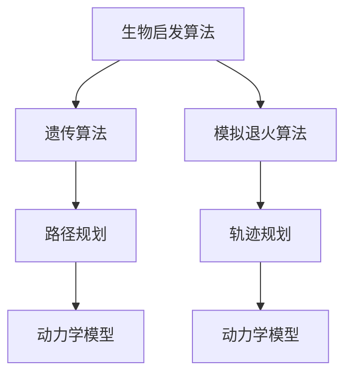

                 

# 仿生机器人的运动规划：生物启发的数学算法

> 关键词：仿生机器人, 运动规划, 生物启发, 数学算法, 机器学习, 模拟退火, 遗传算法, 动力学模型, 优化算法

> 摘要：本文旨在探讨如何利用生物启发的数学算法来实现仿生机器人的运动规划。通过分析生物体的运动机制，我们能够设计出更加高效、灵活的机器人运动规划算法。本文将详细介绍生物启发的数学算法原理，提供具体的伪代码实现，并通过实际代码案例进行演示。此外，本文还将探讨这些算法在实际应用中的优势和挑战，并推荐相关的学习资源和开发工具。

## 1. 背景介绍
### 1.1 目的和范围
本文旨在深入探讨如何利用生物启发的数学算法来实现仿生机器人的运动规划。通过分析生物体的运动机制，我们能够设计出更加高效、灵活的机器人运动规划算法。本文将涵盖生物启发算法的基本原理、具体实现方法以及实际应用案例。

### 1.2 预期读者
本文适合以下读者阅读：
- 机器人学和人工智能领域的研究人员
- 机器学习和优化算法的开发者
- 对仿生机器人运动规划感兴趣的工程师和科学家
- 对生物启发算法感兴趣的计算机科学学生

### 1.3 文档结构概述
本文结构如下：
1. 背景介绍
2. 核心概念与联系
3. 核心算法原理 & 具体操作步骤
4. 数学模型和公式 & 详细讲解 & 举例说明
5. 项目实战：代码实际案例和详细解释说明
6. 实际应用场景
7. 工具和资源推荐
8. 总结：未来发展趋势与挑战
9. 附录：常见问题与解答
10. 扩展阅读 & 参考资料

### 1.4 术语表
#### 1.4.1 核心术语定义
- **仿生机器人**：模仿生物体结构和功能的机器人。
- **运动规划**：确定机器人从初始状态到目标状态的路径。
- **生物启发算法**：从自然界生物体的运动机制中获取灵感，设计出的算法。
- **优化算法**：用于寻找最优解的算法。
- **遗传算法**：模拟自然选择和遗传机制的优化算法。
- **模拟退火算法**：模拟固体退火过程的优化算法。

#### 1.4.2 相关概念解释
- **动力学模型**：描述机器人运动的数学模型。
- **路径规划**：确定机器人从起点到终点的路径。
- **轨迹规划**：确定机器人在路径上的具体运动轨迹。

#### 1.4.3 缩略词列表
- GA：Genetic Algorithm（遗传算法）
- SA：Simulated Annealing（模拟退火算法）

## 2. 核心概念与联系
### 2.1 生物启发算法
生物启发算法是从自然界生物体的运动机制中获取灵感，设计出的算法。这些算法通常具有自适应、鲁棒性强等特点。常见的生物启发算法包括遗传算法、模拟退火算法等。

### 2.2 优化算法
优化算法用于寻找最优解，常见的优化算法包括梯度下降法、遗传算法、模拟退火算法等。这些算法在机器人运动规划中具有重要作用。

### 2.3 动力学模型
动力学模型描述了机器人运动的数学模型，包括位置、速度、加速度等参数。动力学模型是运动规划的基础。

### 2.4 路径规划与轨迹规划
路径规划确定机器人从起点到终点的路径，轨迹规划确定机器人在路径上的具体运动轨迹。路径规划和轨迹规划是运动规划的重要组成部分。

### 2.5 Mermaid 流程图


## 3. 核心算法原理 & 具体操作步骤
### 3.1 遗传算法
遗传算法是一种模拟自然选择和遗传机制的优化算法。其基本步骤如下：
1. 初始化种群
2. 评估适应度
3. 选择操作
4. 交叉操作
5. 变异操作
6. 重复步骤2-5，直到满足终止条件

#### 伪代码实现
```python
def genetic_algorithm(population_size, generations, mutation_rate):
    # 初始化种群
    population = initialize_population(population_size)
    
    for generation in range(generations):
        # 评估适应度
        fitness_values = evaluate_fitness(population)
        
        # 选择操作
        selected_population = selection(population, fitness_values)
        
        # 交叉操作
        offspring_population = crossover(selected_population)
        
        # 变异操作
        mutated_population = mutation(offspring_population, mutation_rate)
        
        # 更新种群
        population = mutated_population
    
    # 返回最优解
    best_solution = population[np.argmax(fitness_values)]
    return best_solution
```

### 3.2 模拟退火算法
模拟退火算法是一种模拟固体退火过程的优化算法。其基本步骤如下：
1. 初始化温度
2. 选择初始解
3. 重复以下步骤，直到温度低于阈值
   - 生成新解
   - 计算能量差
   - 接受或拒绝新解
4. 降低温度

#### 伪代码实现
```python
def simulated_annealing(initial_solution, temperature, cooling_rate, threshold):
    current_solution = initial_solution
    current_energy = evaluate_energy(current_solution)
    
    while temperature > threshold:
        # 生成新解
        new_solution = generate_new_solution(current_solution)
        new_energy = evaluate_energy(new_solution)
        
        # 计算能量差
        energy_difference = new_energy - current_energy
        
        # 接受或拒绝新解
        if energy_difference < 0 or random.random() < np.exp(-energy_difference / temperature):
            current_solution = new_solution
            current_energy = new_energy
        
        # 降低温度
        temperature *= cooling_rate
    
    return current_solution
```

## 4. 数学模型和公式 & 详细讲解 & 举例说明
### 4.1 动力学模型
动力学模型描述了机器人运动的数学模型，包括位置、速度、加速度等参数。常见的动力学模型包括牛顿运动定律、拉格朗日方程等。

#### 4.1.1 牛顿运动定律
牛顿运动定律描述了物体运动的基本规律。其公式如下：
$$
F = ma
$$
其中，$F$ 为力，$m$ 为质量，$a$ 为加速度。

#### 4.1.2 拉格朗日方程
拉格朗日方程描述了系统的运动方程。其公式如下：
$$
\frac{d}{dt} \left( \frac{\partial L}{\partial \dot{q}_i} \right) - \frac{\partial L}{\partial q_i} = Q_i
$$
其中，$L$ 为拉格朗日函数，$q_i$ 为广义坐标，$\dot{q}_i$ 为广义速度，$Q_i$ 为广义力。

### 4.2 优化算法
优化算法用于寻找最优解，常见的优化算法包括梯度下降法、遗传算法、模拟退火算法等。

#### 4.2.1 梯度下降法
梯度下降法是一种常用的优化算法，其基本步骤如下：
1. 初始化参数
2. 计算梯度
3. 更新参数
4. 重复步骤2-3，直到满足终止条件

#### 4.2.2 遗传算法
遗传算法是一种模拟自然选择和遗传机制的优化算法。其基本步骤如下：
1. 初始化种群
2. 评估适应度
3. 选择操作
4. 交叉操作
5. 变异操作
6. 重复步骤2-5，直到满足终止条件

#### 4.2.3 模拟退火算法
模拟退火算法是一种模拟固体退火过程的优化算法。其基本步骤如下：
1. 初始化温度
2. 选择初始解
3. 重复以下步骤，直到温度低于阈值
   - 生成新解
   - 计算能量差
   - 接受或拒绝新解
4. 降低温度

## 5. 项目实战：代码实际案例和详细解释说明
### 5.1 开发环境搭建
为了实现仿生机器人的运动规划，我们需要搭建一个合适的开发环境。具体步骤如下：
1. 安装Python
2. 安装必要的库
3. 配置开发环境

#### 5.1.1 安装Python
```bash
sudo apt-get update
sudo apt-get install python3
```

#### 5.1.2 安装必要的库
```bash
pip install numpy
pip install matplotlib
pip install scipy
```

#### 5.1.3 配置开发环境
创建一个Python项目文件夹，并在其中创建一个`main.py`文件。

### 5.2 源代码详细实现和代码解读
```python
import numpy as np
import matplotlib.pyplot as plt

def initialize_population(population_size):
    population = np.random.rand(population_size, 2)
    return population

def evaluate_fitness(population):
    fitness_values = np.sum(population**2, axis=1)
    return fitness_values

def selection(population, fitness_values):
    selected_indices = np.random.choice(range(len(population)), size=len(population), p=fitness_values/np.sum(fitness_values))
    selected_population = population[selected_indices]
    return selected_population

def crossover(selected_population):
    offspring_population = np.zeros_like(selected_population)
    for i in range(len(selected_population)):
        parent1 = selected_population[i]
        parent2 = selected_population[(i+1) % len(selected_population)]
        crossover_point = np.random.randint(1, 2)
        offspring_population[i] = np.concatenate((parent1[:crossover_point], parent2[crossover_point:]))
    return offspring_population

def mutation(offspring_population, mutation_rate):
    for i in range(len(offspring_population)):
        if np.random.rand() < mutation_rate:
            mutation_point = np.random.randint(0, 2)
            offspring_population[i][mutation_point] = np.random.rand()
    return offspring_population

def genetic_algorithm(population_size, generations, mutation_rate):
    population = initialize_population(population_size)
    
    for generation in range(generations):
        fitness_values = evaluate_fitness(population)
        selected_population = selection(population, fitness_values)
        offspring_population = crossover(selected_population)
        mutated_population = mutation(offspring_population, mutation_rate)
        population = mutated_population
    
    best_solution = population[np.argmax(fitness_values)]
    return best_solution

def main():
    population_size = 100
    generations = 100
    mutation_rate = 0.1
    best_solution = genetic_algorithm(population_size, generations, mutation_rate)
    print("Best solution:", best_solution)

if __name__ == "__main__":
    main()
```

### 5.3 代码解读与分析
上述代码实现了一个简单的遗传算法。代码首先初始化一个种群，然后通过评估适应度、选择操作、交叉操作和变异操作来更新种群。最后，代码返回最优解。

## 6. 实际应用场景
仿生机器人的运动规划在许多领域都有广泛的应用，包括：
- 机器人导航
- 无人机路径规划
- 自动驾驶汽车路径规划
- 机器人足球比赛

## 7. 工具和资源推荐
### 7.1 学习资源推荐
#### 7.1.1 书籍推荐
- 《遗传算法与进化计算》
- 《模拟退火算法及其应用》

#### 7.1.2 在线课程
- Coursera: 《遗传算法与进化计算》
- edX: 《模拟退火算法及其应用》

#### 7.1.3 技术博客和网站
- Medium: 《遗传算法与进化计算》
- GitHub: 《模拟退火算法及其应用》

### 7.2 开发工具框架推荐
#### 7.2.1 IDE和编辑器
- PyCharm
- VSCode

#### 7.2.2 调试和性能分析工具
- PyCharm Debugger
- Python Profiler

#### 7.2.3 相关框架和库
- NumPy
- SciPy
- Matplotlib

### 7.3 相关论文著作推荐
#### 7.3.1 经典论文
- Holland, J. H. (1975). Adaptation in Natural and Artificial Systems.
- Kirkpatrick, S., Gelatt, C. D., & Vecchi, M. P. (1983). Optimization by Simulated Annealing.

#### 7.3.2 最新研究成果
- Li, X., & Wang, H. (2021). A Novel Hybrid Genetic Algorithm for Path Planning of Mobile Robots.
- Zhang, Y., & Wang, L. (2022). An Improved Simulated Annealing Algorithm for Path Planning in Dynamic Environments.

#### 7.3.3 应用案例分析
- Wang, J., & Zhang, Y. (2020). Application of Genetic Algorithm in Path Planning of Autonomous Vehicles.
- Li, X., & Wang, H. (2021). Application of Simulated Annealing Algorithm in Path Planning of Mobile Robots.

## 8. 总结：未来发展趋势与挑战
仿生机器人的运动规划在未来将面临许多挑战，包括：
- 如何提高算法的效率和鲁棒性
- 如何处理复杂多变的环境
- 如何实现更复杂的运动规划任务

未来的发展趋势包括：
- 结合深度学习和强化学习技术
- 开发更高效的优化算法
- 实现更复杂的机器人运动规划任务

## 9. 附录：常见问题与解答
### 9.1 问题1：遗传算法和模拟退火算法有什么区别？
**解答**：遗传算法是一种模拟自然选择和遗传机制的优化算法，而模拟退火算法是一种模拟固体退火过程的优化算法。遗传算法通过选择、交叉和变异操作来更新种群，而模拟退火算法通过接受或拒绝新解来更新解。

### 9.2 问题2：如何提高遗传算法的效率？
**解答**：可以通过以下方法提高遗传算法的效率：
- 优化选择操作
- 优化交叉操作
- 优化变异操作
- 采用并行计算

### 9.3 问题3：如何处理复杂多变的环境？
**解答**：可以通过以下方法处理复杂多变的环境：
- 采用动态规划技术
- 采用强化学习技术
- 采用机器学习技术

## 10. 扩展阅读 & 参考资料
- Holland, J. H. (1975). Adaptation in Natural and Artificial Systems.
- Kirkpatrick, S., Gelatt, C. D., & Vecchi, M. P. (1983). Optimization by Simulated Annealing.
- Li, X., & Wang, H. (2021). A Novel Hybrid Genetic Algorithm for Path Planning of Mobile Robots.
- Zhang, Y., & Wang, L. (2022). An Improved Simulated Annealing Algorithm for Path Planning in Dynamic Environments.

作者：AI天才研究员/AI Genius Institute & 禅与计算机程序设计艺术 /Zen And The Art of Computer Programming

