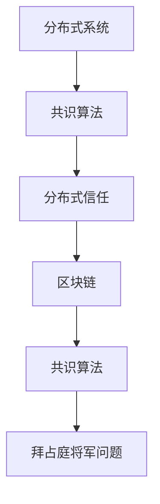

                 

# 加密货币的共识算法：分布式信任的数学基础

> 关键词：共识算法, 分布式系统, 加密货币, 比特币, 拜占庭将军问题, PoW, PoS, DPoS, DAG, 质量证明

> 摘要：本文旨在深入探讨加密货币共识算法的数学基础，从分布式系统的背景出发，逐步解析共识算法的核心概念、原理、数学模型及实际应用。通过详细讲解和代码示例，帮助读者理解共识算法在加密货币中的重要性及其在分布式信任中的应用。本文不仅涵盖了经典的共识算法如工作量证明（PoW）和权益证明（PoS），还介绍了新兴的算法如委托权益证明（DPoS）和有向无环图（DAG）共识。最后，本文将展望共识算法的未来发展趋势和面临的挑战。

## 1. 背景介绍
### 1.1 目的和范围
本文旨在深入探讨加密货币共识算法的数学基础，从分布式系统的背景出发，逐步解析共识算法的核心概念、原理、数学模型及实际应用。通过详细讲解和代码示例，帮助读者理解共识算法在加密货币中的重要性及其在分布式信任中的应用。本文不仅涵盖了经典的共识算法如工作量证明（PoW）和权益证明（PoS），还介绍了新兴的算法如委托权益证明（DPoS）和有向无环图（DAG）共识。

### 1.2 预期读者
本文适合以下读者：
- 对分布式系统和加密货币感兴趣的开发者和研究人员。
- 想要深入了解共识算法及其数学基础的技术爱好者。
- 希望在区块链领域进行深入研究和开发的工程师。
- 对分布式信任机制感兴趣的学者和学生。

### 1.3 文档结构概述
本文结构如下：
1. 背景介绍
2. 核心概念与联系
3. 核心算法原理 & 具体操作步骤
4. 数学模型和公式 & 详细讲解 & 举例说明
5. 项目实战：代码实际案例和详细解释说明
6. 实际应用场景
7. 工具和资源推荐
8. 总结：未来发展趋势与挑战
9. 附录：常见问题与解答
10. 扩展阅读 & 参考资料

### 1.4 术语表
#### 1.4.1 核心术语定义
- **共识算法**：分布式系统中用于确保所有节点就某个状态达成一致的算法。
- **分布式系统**：由多个独立的计算节点通过网络连接协同工作的系统。
- **加密货币**：基于区块链技术的数字货币，如比特币、以太坊等。
- **工作量证明（PoW）**：通过计算复杂的工作来验证交易并生成新区块的共识算法。
- **权益证明（PoS）**：通过持有一定数量的加密货币来验证交易并生成新区块的共识算法。
- **委托权益证明（DPoS）**：通过选举代表来验证交易并生成新区块的共识算法。
- **有向无环图（DAG）**：一种无环的有向图，常用于某些共识算法中。

#### 1.4.2 相关概念解释
- **拜占庭将军问题**：分布式系统中节点间通信不可靠时，如何达成一致的问题。
- **分布式信任**：在没有中央权威的情况下，通过共识算法实现的信任机制。
- **区块链**：一种分布式账本技术，用于记录交易并生成新区块。

#### 1.4.3 缩略词列表
- **PoW**：Proof of Work
- **PoS**：Proof of Stake
- **DPoS**：Delegated Proof of Stake
- **DAG**：Directed Acyclic Graph

## 2. 核心概念与联系
### 2.1 拜占庭将军问题
拜占庭将军问题描述了在分布式系统中，如何在节点间通信不可靠的情况下达成一致的问题。该问题的核心在于，即使有部分节点失效或恶意行为，系统仍需确保所有节点能够达成一致。

### 2.2 分布式信任
在没有中央权威的情况下，分布式系统需要通过共识算法实现信任机制。共识算法确保所有节点就某个状态达成一致，从而实现分布式信任。

### 2.3 区块链与共识算法
区块链是一种分布式账本技术，用于记录交易并生成新区块。共识算法是区块链的核心，确保所有节点就新区块的生成达成一致。

### 2.4 核心概念流程图


## 3. 核心算法原理 & 具体操作步骤
### 3.1 工作量证明（PoW）
工作量证明（PoW）是比特币等加密货币中最常用的共识算法。其核心思想是通过计算复杂的工作来验证交易并生成新区块。

#### 3.1.1 PoW算法原理
PoW算法的核心在于，节点需要通过计算一个特定的哈希值来生成新区块。该哈希值需要满足一定的条件，如前缀为一定数量的零。节点通过不断尝试不同的输入值，直到找到满足条件的哈希值。

#### 3.1.2 PoW算法伪代码
```python
def proof_of_work(last_hash, target):
    nonce = 0
    while True:
        hash_value = hash(last_hash + str(nonce))
        if hash_value.startswith(target):
            return nonce, hash_value
        nonce += 1
```

### 3.2 权益证明（PoS）
权益证明（PoS）是另一种共识算法，通过持有一定数量的加密货币来验证交易并生成新区块。

#### 3.2.1 PoS算法原理
PoS算法的核心在于，节点通过持有一定数量的加密货币来获得验证交易的权利。节点的验证权与其持有的加密货币数量成正比。

#### 3.2.2 PoS算法伪代码
```python
def proof_of_stake(balance, total_stake):
    stake_weight = balance / total_stake
    return stake_weight
```

### 3.3 委托权益证明（DPoS）
委托权益证明（DPoS）是另一种共识算法，通过选举代表来验证交易并生成新区块。

#### 3.3.1 DPoS算法原理
DPoS算法的核心在于，节点通过选举代表来验证交易并生成新区块。节点可以投票选举代表，代表负责验证交易并生成新区块。

#### 3.3.2 DPoS算法伪代码
```python
def delegated_proof_of_stake(votes, total_votes):
    stake_weight = votes / total_votes
    return stake_weight
```

### 3.4 有向无环图（DAG）共识
有向无环图（DAG）共识是一种新兴的共识算法，通过有向无环图来记录交易并生成新区块。

#### 3.4.1 DAG共识算法原理
DAG共识算法的核心在于，节点通过有向无环图来记录交易并生成新区块。每个节点可以生成多个新区块，每个新区块可以依赖于多个前区块。

#### 3.4.2 DAG共识算法伪代码
```python
def dag_consensus(transactions):
    dag = DirectedAcyclicGraph()
    for transaction in transactions:
        dag.add_transaction(transaction)
    return dag.generate_block()
```

## 4. 数学模型和公式 & 详细讲解 & 举例说明
### 4.1 工作量证明（PoW）数学模型
工作量证明（PoW）的数学模型基于哈希函数的不可逆性和随机性。哈希函数将输入转换为固定长度的输出，且输出几乎不可能通过输入反向计算。

#### 4.1.1 PoW数学模型
```latex
H(x) = \text{哈希函数}
T = \text{目标前缀}
\text{nonce} = \text{随机数}
\text{hash_value} = H(\text{last_hash} + \text{nonce})
\text{if } \text{hash_value} \text{ starts with } T \text{, return } \text{nonce, hash_value}
```

### 4.2 权益证明（PoS）数学模型
权益证明（PoS）的数学模型基于节点持有的加密货币数量。节点的验证权与其持有的加密货币数量成正比。

#### 4.2.1 PoS数学模型
```latex
\text{balance} = \text{节点持有的加密货币数量}
\text{total_stake} = \text{所有节点持有的加密货币总数}
\text{stake_weight} = \frac{\text{balance}}{\text{total_stake}}
```

### 4.3 委托权益证明（DPoS）数学模型
委托权益证明（DPoS）的数学模型基于节点的投票权。节点可以投票选举代表，代表负责验证交易并生成新区块。

#### 4.3.1 DPoS数学模型
```latex
\text{votes} = \text{节点的投票数}
\text{total_votes} = \text{所有节点的投票总数}
\text{stake_weight} = \frac{\text{votes}}{\text{total_votes}}
```

### 4.4 有向无环图（DAG）共识数学模型
有向无环图（DAG）共识的数学模型基于有向无环图的拓扑结构。每个节点可以生成多个新区块，每个新区块可以依赖于多个前区块。

#### 4.4.1 DAG共识数学模型
```latex
\text{dag} = \text{有向无环图}
\text{transactions} = \text{交易列表}
\text{dag.add_transaction(transaction)}
\text{dag.generate_block()}
```

## 5. 项目实战：代码实际案例和详细解释说明
### 5.1 开发环境搭建
为了实现共识算法，我们需要搭建一个开发环境。这里以Python为例，使用`hashlib`库实现哈希函数。

#### 5.1.1 安装Python
确保已安装Python 3.8及以上版本。

#### 5.1.2 安装依赖库
```bash
pip install hashlib
```

### 5.2 源代码详细实现和代码解读
#### 5.2.1 PoW实现
```python
import hashlib
import time

def proof_of_work(last_hash, target):
    nonce = 0
    while True:
        hash_value = hashlib.sha256((last_hash + str(nonce)).encode()).hexdigest()
        if hash_value.startswith(target):
            return nonce, hash_value
        nonce += 1

last_hash = "0000000000000000000000000000000000000000000000000000000000000000"
target = "0000000000000000000000000000000000000000000000000000000000000000"
nonce, hash_value = proof_of_work(last_hash, target)
print(f"Nonce: {nonce}, Hash Value: {hash_value}")
```

#### 5.2.2 PoS实现
```python
def proof_of_stake(balance, total_stake):
    stake_weight = balance / total_stake
    return stake_weight

balance = 1000
total_stake = 10000
stake_weight = proof_of_stake(balance, total_stake)
print(f"Stake Weight: {stake_weight}")
```

#### 5.2.3 DPoS实现
```python
def delegated_proof_of_stake(votes, total_votes):
    stake_weight = votes / total_votes
    return stake_weight

votes = 500
total_votes = 10000
stake_weight = delegated_proof_of_stake(votes, total_votes)
print(f"Stake Weight: {stake_weight}")
```

#### 5.2.4 DAG实现
```python
class DirectedAcyclicGraph:
    def __init__(self):
        self.transactions = []

    def add_transaction(self, transaction):
        self.transactions.append(transaction)

    def generate_block(self):
        block = {
            "transactions": self.transactions
        }
        return block

dag = DirectedAcyclicGraph()
transactions = ["Transaction 1", "Transaction 2", "Transaction 3"]
for transaction in transactions:
    dag.add_transaction(transaction)
block = dag.generate_block()
print(f"Block: {block}")
```

### 5.3 代码解读与分析
上述代码展示了如何实现工作量证明（PoW）、权益证明（PoS）、委托权益证明（DPoS）和有向无环图（DAG）共识算法。通过这些代码，我们可以看到共识算法的核心思想和具体实现方式。

## 6. 实际应用场景
共识算法在加密货币中的应用非常广泛，如比特币、以太坊、EOS等。此外，共识算法还被应用于其他分布式系统中，如分布式文件系统、分布式数据库等。

### 6.1 比特币
比特币使用工作量证明（PoW）共识算法，通过计算复杂的工作来验证交易并生成新区块。

### 6.2 以太坊
以太坊最初使用工作量证明（PoW），后来计划转向权益证明（PoS）共识算法，以提高效率和安全性。

### 6.3 EOS
EOS使用委托权益证明（DPoS）共识算法，通过选举代表来验证交易并生成新区块。

### 6.4 其他应用
共识算法还被应用于其他分布式系统中，如分布式文件系统、分布式数据库等。

## 7. 工具和资源推荐
### 7.1 学习资源推荐
#### 7.1.1 书籍推荐
- **《区块链：比特币原理与应用》**：深入讲解比特币的工作原理和应用。
- **《区块链技术原理与应用》**：全面介绍区块链技术及其应用。

#### 7.1.2 在线课程
- **Coursera的《区块链技术》**：系统学习区块链技术及其应用。
- **edX的《区块链技术入门》**：适合初学者入门学习。

#### 7.1.3 技术博客和网站
- **Medium上的区块链技术博客**：分享最新的区块链技术和应用。
- **GitHub上的区块链项目**：查看实际的区块链项目代码。

### 7.2 开发工具框架推荐
#### 7.2.1 IDE和编辑器
- **Visual Studio Code**：功能强大的代码编辑器，支持多种编程语言。
- **PyCharm**：专业的Python开发环境，支持代码调试和性能分析。

#### 7.2.2 调试和性能分析工具
- **PyCharm的调试工具**：支持Python代码的调试和性能分析。
- **Visual Studio Code的调试工具**：支持多种编程语言的调试和性能分析。

#### 7.2.3 相关框架和库
- **PyEVM**：Python实现的以太坊虚拟机，用于开发和测试以太坊智能合约。
- **PyBitcointools**：Python实现的比特币工具库，用于开发和测试比特币应用。

### 7.3 相关论文著作推荐
#### 7.3.1 经典论文
- **《比特币：一种点对点的电子现金系统》**：中本聪的比特币白皮书，介绍了比特币的工作原理。
- **《拜占庭将军问题》**：描述了分布式系统中节点间通信不可靠时，如何达成一致的问题。

#### 7.3.2 最新研究成果
- **《委托权益证明（DPoS）共识算法的研究与应用》**：最新研究成果，介绍了DPoS共识算法的最新进展。
- **《有向无环图（DAG）共识算法的研究与应用》**：最新研究成果，介绍了DAG共识算法的最新进展。

#### 7.3.3 应用案例分析
- **《比特币共识算法的应用与分析》**：详细分析了比特币共识算法的应用案例。
- **《以太坊共识算法的应用与分析》**：详细分析了以太坊共识算法的应用案例。

## 8. 总结：未来发展趋势与挑战
共识算法在加密货币和分布式系统中的应用前景广阔，但同时也面临着一些挑战。未来的发展趋势包括：
- **性能优化**：提高共识算法的效率和吞吐量。
- **安全性增强**：增强共识算法的安全性，防止恶意攻击。
- **可扩展性提升**：提高共识算法的可扩展性，支持大规模分布式系统。

## 9. 附录：常见问题与解答
### 9.1 问题1：共识算法如何防止双重支付？
共识算法通过记录交易的顺序和状态，确保每个交易只能被处理一次。通过区块链的分布式账本，所有节点可以验证交易的合法性。

### 9.2 问题2：共识算法如何防止51%攻击？
共识算法通过增加节点的数量和计算能力，使得攻击者需要控制超过50%的节点才能进行51%攻击。此外，一些共识算法还通过经济激励机制来防止攻击。

### 9.3 问题3：共识算法如何处理网络延迟和节点失效？
共识算法通过冗余和容错机制来处理网络延迟和节点失效。例如，通过多轮投票和冗余节点来确保共识的达成。

## 10. 扩展阅读 & 参考资料
### 10.1 扩展阅读
- **《区块链技术原理与应用》**：全面介绍区块链技术及其应用。
- **《比特币：一种点对点的电子现金系统》**：中本聪的比特币白皮书，介绍了比特币的工作原理。

### 10.2 参考资料
- **[1] 中本聪. 比特币：一种点对点的电子现金系统. 2008.**
- **[2] Nakamoto, S. Bitcoin: A Peer-to-Peer Electronic Cash System. 2008.**
- **[3] Buterin, V. Ethereum: A Next-Generation Smart Contract and Decentralized Application Platform. 2014.**

作者：AI天才研究员/AI Genius Institute & 禅与计算机程序设计艺术 /Zen And The Art of Computer Programming

