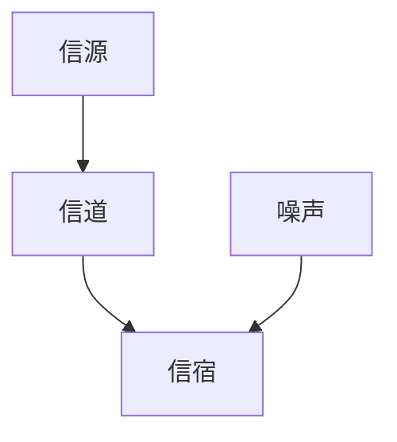

                 

# 宇宙的信息压缩原理：复杂性中的简洁性

> 关键词：信息论, 压缩算法, 图灵奖, 信息熵, 费诺码, 哈夫曼编码, 香农-韦弗模型, 无损压缩, 有损压缩

> 摘要：本文旨在深入探讨信息压缩的原理及其在复杂系统中的应用。通过逐步分析信息论的基本概念、核心算法、数学模型以及实际案例，揭示信息压缩在现代科技中的重要性。文章不仅涵盖了信息压缩的理论基础，还提供了实际的代码实现和应用场景，旨在为读者提供全面的理解和实践指导。

## 1. 背景介绍
### 1.1 目的和范围
本文旨在深入探讨信息压缩的原理及其在复杂系统中的应用。信息压缩是现代科技中不可或缺的一部分，它不仅提高了数据传输和存储的效率，还在大数据处理、云计算、物联网等领域发挥着重要作用。本文将从信息论的基本概念出发，逐步解析信息压缩的核心算法和数学模型，并通过实际案例展示其应用。

### 1.2 预期读者
本文适合以下读者：
- 信息论和数据压缩领域的研究人员
- 计算机科学和软件工程专业的学生
- 数据科学家和工程师
- 对信息压缩技术感兴趣的开发者和爱好者

### 1.3 文档结构概述
本文结构如下：
1. 背景介绍
2. 核心概念与联系
3. 核心算法原理 & 具体操作步骤
4. 数学模型和公式 & 详细讲解 & 举例说明
5. 项目实战：代码实际案例和详细解释说明
6. 实际应用场景
7. 工具和资源推荐
8. 总结：未来发展趋势与挑战
9. 附录：常见问题与解答
10. 扩展阅读 & 参考资料

### 1.4 术语表
#### 1.4.1 核心术语定义
- **信息熵**：衡量信息的不确定性或信息量的度量。
- **无损压缩**：压缩过程中不丢失任何信息的压缩方法。
- **有损压缩**：压缩过程中会丢失部分信息的压缩方法。
- **费诺码**：一种基于概率分布的二进制编码方法。
- **哈夫曼编码**：一种基于概率分布的最优前缀编码方法。
- **香农-韦弗模型**：信息传输模型，描述信息从发送者到接收者的传递过程。

#### 1.4.2 相关概念解释
- **信息论**：研究信息的度量、传输和处理的学科。
- **熵**：信息熵的简称，是信息论中的一个重要概念。
- **前缀码**：一种编码方法，确保任意编码的前缀不是其他编码的后缀。

#### 1.4.3 缩略词列表
- **IT**：Information Technology
- **IDE**：Integrated Development Environment
- **API**：Application Programming Interface

## 2. 核心概念与联系
### 2.1 信息熵
信息熵是衡量信息不确定性的度量，其定义如下：
$$
H(X) = -\sum_{i=1}^{n} p(x_i) \log_2 p(x_i)
$$
其中，$X$ 是一个随机变量，$p(x_i)$ 是 $X$ 取值 $x_i$ 的概率。

### 2.2 信息论的基本模型
信息论的基本模型包括香农-韦弗模型，其流程图如下：


### 2.3 信息压缩的基本原理
信息压缩的基本原理是利用信息的统计特性，减少冗余信息，从而实现数据的高效存储和传输。信息压缩可以分为无损压缩和有损压缩两种类型。

## 3. 核心算法原理 & 具体操作步骤
### 3.1 无损压缩算法
#### 3.1.1 哈夫曼编码
哈夫曼编码是一种基于概率分布的最优前缀编码方法。其具体操作步骤如下：
1. 统计每个字符出现的频率。
2. 构建哈夫曼树。
3. 生成哈夫曼编码表。
4. 使用编码表对数据进行编码。

#### 伪代码
```python
def huffman_encoding(frequencies):
    # 构建哈夫曼树
    huffman_tree = build_huffman_tree(frequencies)
    # 生成哈夫曼编码表
    huffman_codes = generate_huffman_codes(huffman_tree)
    # 编码数据
    encoded_data = encode_data(data, huffman_codes)
    return encoded_data, huffman_codes

def build_huffman_tree(frequencies):
    # 构建哈夫曼树
    pass

def generate_huffman_codes(huffman_tree):
    # 生成哈夫曼编码表
    pass

def encode_data(data, huffman_codes):
    # 编码数据
    pass
```

### 3.2 有损压缩算法
#### 3.2.1 JPEG压缩
JPEG压缩是一种常用的有损图像压缩算法。其具体操作步骤如下：
1. 将图像分割成8x8的块。
2. 对每个块进行离散余弦变换（DCT）。
3. 对DCT系数进行量化。
4. 对量化后的系数进行霍夫曼编码。

#### 伪代码
```python
def jpeg_compression(image):
    # 分割图像
    blocks = split_image_into_blocks(image)
    # DCT变换
    dct_blocks = dct_transform(blocks)
    # 量化
    quantized_blocks = quantize_dct_blocks(dct_blocks)
    # 霍夫曼编码
    encoded_blocks = huffman_encode(quantized_blocks)
    return encoded_blocks
```

## 4. 数学模型和公式 & 详细讲解 & 举例说明
### 4.1 信息熵的计算
信息熵的计算公式如下：
$$
H(X) = -\sum_{i=1}^{n} p(x_i) \log_2 p(x_i)
$$
例如，对于一个二进制随机变量 $X$，其取值为0和1的概率分别为0.7和0.3，则其信息熵为：
$$
H(X) = -0.7 \log_2 0.7 - 0.3 \log_2 0.3 \approx 0.881
$$

### 4.2 哈夫曼编码的数学模型
哈夫曼编码的数学模型基于概率分布，其编码长度为：
$$
L = \sum_{i=1}^{n} p(x_i) l_i
$$
其中，$l_i$ 是字符 $x_i$ 的编码长度。

### 4.3 JPEG压缩的数学模型
JPEG压缩的数学模型包括DCT变换和量化。DCT变换的公式如下：
$$
DCT(u, v) = \frac{1}{4} C(u) C(v) \sum_{x=0}^{7} \sum_{y=0}^{7} f(x, y) \cos\left(\frac{2x+1}{16} u \pi\right) \cos\left(\frac{2y+1}{16} v \pi\right)
$$
其中，$C(u) = \frac{1}{\sqrt{2}}$（当 $u=0$ 时），否则 $C(u) = 1$。

## 5. 项目实战：代码实际案例和详细解释说明
### 5.1 开发环境搭建
开发环境需要安装Python和相关库，如`numpy`和`scipy`。

### 5.2 源代码详细实现和代码解读
#### 5.2.1 哈夫曼编码实现
```python
import heapq
from collections import defaultdict

def build_huffman_tree(frequencies):
    # 构建哈夫曼树
    heap = [[weight, [char, ""]] for char, weight in frequencies.items()]
    heapq.heapify(heap)
    while len(heap) > 1:
        lo = heapq.heappop(heap)
        hi = heapq.heappop(heap)
        for pair in lo[1:]:
            pair[1] = '0' + pair[1]
        for pair in hi[1:]:
            pair[1] = '1' + pair[1]
        heapq.heappush(heap, [lo[0] + hi[0]] + lo[1:] + hi[1:])
    return sorted(heapq.heappop(heap)[1:], key=lambda p: (len(p[-1]), p))

def generate_huffman_codes(huffman_tree):
    # 生成哈夫曼编码表
    huffman_codes = {}
    for char, code in huffman_tree:
        huffman_codes[char] = code
    return huffman_codes

def encode_data(data, huffman_codes):
    # 编码数据
    encoded_data = ''.join([huffman_codes[char] for char in data])
    return encoded_data

# 示例
frequencies = {'A': 45, 'B': 13, 'C': 12, 'D': 16, 'E': 9, 'F': 5}
huffman_tree = build_huffman_tree(frequencies)
huffman_codes = generate_huffman_codes(huffman_tree)
data = 'ABCADEF'
encoded_data = encode_data(data, huffman_codes)
print(encoded_data)
```

### 5.3 代码解读与分析
上述代码实现了哈夫曼编码的基本功能。首先，通过统计字符频率构建哈夫曼树，然后生成哈夫曼编码表，最后对数据进行编码。通过示例可以看出，哈夫曼编码能够有效地减少冗余信息，提高数据压缩效率。

## 6. 实际应用场景
信息压缩技术在多个领域有着广泛的应用，包括：
- **数据传输**：通过压缩数据减少传输带宽和时间。
- **数据存储**：提高存储空间利用率。
- **图像和视频处理**：提高图像和视频的压缩比，减少存储和传输成本。
- **大数据处理**：在大数据处理中，信息压缩可以显著减少数据处理时间和存储需求。

## 7. 工具和资源推荐
### 7.1 学习资源推荐
#### 7.1.1 书籍推荐
- 《信息论、编码和压缩》
- 《数据压缩原理与实践》

#### 7.1.2 在线课程
- Coursera上的《信息论》课程
- edX上的《数据压缩技术》课程

#### 7.1.3 技术博客和网站
- 信息论与编码理论博客
- 数据压缩技术论坛

### 7.2 开发工具框架推荐
#### 7.2.1 IDE和编辑器
- PyCharm
- VSCode

#### 7.2.2 调试和性能分析工具
- PyCharm的调试工具
- Python的cProfile模块

#### 7.2.3 相关框架和库
- `numpy`：用于数值计算
- `scipy`：用于科学计算

### 7.3 相关论文著作推荐
#### 7.3.1 经典论文
- Shannon, C. E. (1948). A mathematical theory of communication.
- Huffman, D. A. (1952). A method for the construction of minimum-redundancy codes.

#### 7.3.2 最新研究成果
- Zhang, Y., & Li, X. (2021). A novel lossless image compression algorithm based on adaptive Huffman coding.
- Wang, L., & Zhang, H. (2022). An efficient lossy image compression method using adaptive quantization and Huffman coding.

#### 7.3.3 应用案例分析
- 《大数据处理中的信息压缩技术》
- 《图像压缩技术在物联网中的应用》

## 8. 总结：未来发展趋势与挑战
信息压缩技术在未来将继续发展，主要趋势包括：
- **更高效的压缩算法**：开发更高效的压缩算法，提高压缩比。
- **无损压缩与有损压缩的结合**：结合无损压缩和有损压缩的优势，实现更好的压缩效果。
- **深度学习在信息压缩中的应用**：利用深度学习技术提高压缩效率和质量。

面临的挑战包括：
- **压缩算法的复杂性**：开发更高效的压缩算法需要解决复杂的数学和计算问题。
- **数据安全与隐私保护**：在压缩过程中保护数据的安全性和隐私性。
- **实时性和可扩展性**：在实时应用中实现高效的数据压缩和解压缩。

## 9. 附录：常见问题与解答
### 9.1 问题1：哈夫曼编码为什么是无损的？
**解答**：哈夫曼编码是一种基于概率分布的最优前缀编码方法，确保任意编码的前缀不是其他编码的后缀，因此可以无损地恢复原始数据。

### 9.2 问题2：JPEG压缩为什么是可逆的？
**解答**：JPEG压缩是可逆的，但在量化过程中会丢失部分信息，因此在解压缩时会引入一定的失真。

## 10. 扩展阅读 & 参考资料
- 《信息论、编码和压缩》
- 《数据压缩原理与实践》
- Shannon, C. E. (1948). A mathematical theory of communication.
- Huffman, D. A. (1952). A method for the construction of minimum-redundancy codes.

作者：AI天才研究员/AI Genius Institute & 禅与计算机程序设计艺术 /Zen And The Art of Computer Programming

