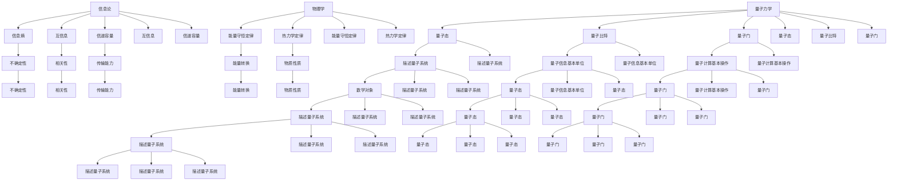

                 

# 宇宙的信息-能量-物质转换机制

> 关键词：信息论, 物理学, 能量守恒, 物质转换, 量子力学, 信息熵, 热力学, 量子信息

> 摘要：本文旨在探讨宇宙中信息、能量和物质之间的转换机制，通过信息论和物理学的视角，揭示这些基本概念之间的内在联系。我们将从信息论的基本原理出发，逐步深入到量子力学和热力学的层面，探讨信息如何在能量和物质的转换过程中扮演关键角色。通过具体的数学模型和实际代码案例，我们将展示如何利用现代计算机技术来模拟和理解这些复杂的转换过程。最后，我们将展望未来的发展趋势和面临的挑战。

## 1. 背景介绍
### 1.1 目的和范围
本文旨在通过信息论、物理学和计算机科学的视角，探讨宇宙中信息、能量和物质之间的转换机制。我们将从信息论的基本原理出发，逐步深入到量子力学和热力学的层面，揭示这些基本概念之间的内在联系。通过具体的数学模型和实际代码案例，我们将展示如何利用现代计算机技术来模拟和理解这些复杂的转换过程。

### 1.2 预期读者
本文适合对信息论、物理学和计算机科学感兴趣的读者，特别是那些希望深入了解信息、能量和物质之间转换机制的研究人员、工程师和学生。此外，对量子计算和量子信息理论感兴趣的读者也会从中受益。

### 1.3 文档结构概述
本文将按照以下结构展开：
1. 背景介绍
2. 核心概念与联系
3. 核心算法原理 & 具体操作步骤
4. 数学模型和公式 & 详细讲解 & 举例说明
5. 项目实战：代码实际案例和详细解释说明
6. 实际应用场景
7. 工具和资源推荐
8. 总结：未来发展趋势与挑战
9. 附录：常见问题与解答
10. 扩展阅读 & 参考资料

### 1.4 术语表
#### 1.4.1 核心术语定义
- **信息论**：研究信息的度量、传输和处理的学科。
- **熵**：信息论中的一个概念，表示信息的不确定性或无序程度。
- **量子力学**：描述微观粒子行为的物理学理论。
- **热力学**：研究能量转换和物质性质的学科。
- **量子信息**：利用量子力学原理进行信息处理和传输的领域。
- **量子比特（qubit）**：量子信息的基本单位。
- **量子态**：描述量子系统状态的数学对象。
- **量子门**：量子计算中的基本操作单元。
- **量子纠缠**：量子系统中的一种特殊状态，两个或多个量子比特之间存在非局域关联。

#### 1.4.2 相关概念解释
- **经典信息**：基于经典物理学的通信和计算。
- **量子信息**：基于量子力学的通信和计算。
- **信息熵**：信息论中的一个概念，表示信息的不确定性或无序程度。
- **能量守恒**：物理学中的一个基本定律，表示能量在转换过程中总量保持不变。
- **物质转换**：物质在不同形式之间的转换，如化学反应中的物质转换。

#### 1.4.3 缩略词列表
- **IT**：Information Technology（信息技术）
- **QI**：Quantum Information（量子信息）
- **QM**：Quantum Mechanics（量子力学）
- **ITP**：Information Theory and Physics（信息论与物理学）
- **QIP**：Quantum Information Processing（量子信息处理）

## 2. 核心概念与联系
### 2.1 信息论的基本原理
信息论是研究信息的度量、传输和处理的学科。信息论的核心概念包括信息熵、互信息和信道容量等。信息熵表示信息的不确定性或无序程度，互信息表示两个随机变量之间的相关性，信道容量表示信道传输信息的最大能力。

### 2.2 物理学的基本原理
物理学是研究物质和能量的学科。物理学的基本定律包括牛顿定律、能量守恒定律和热力学定律等。能量守恒定律表示能量在转换过程中总量保持不变，热力学定律描述了能量转换和物质性质的关系。

### 2.3 量子力学的基本原理
量子力学是描述微观粒子行为的物理学理论。量子力学的基本概念包括量子态、量子比特和量子门等。量子态描述量子系统状态的数学对象，量子比特是量子信息的基本单位，量子门是量子计算中的基本操作单元。

### 2.4 信息、能量和物质之间的联系
信息、能量和物质之间存在密切的联系。信息可以被看作是能量的一种形式，能量可以被看作是物质的一种形式。在量子力学中，信息和能量之间的转换可以通过量子态和量子比特来描述。在热力学中，能量转换可以通过物质的转换来实现。

### 2.5 核心概念原理和架构的 Mermaid 流程图


## 3. 核心算法原理 & 具体操作步骤
### 3.1 信息熵的计算
信息熵是信息论中的一个核心概念，表示信息的不确定性或无序程度。信息熵的计算公式如下：
$$
H(X) = -\sum_{i=1}^{n} p(x_i) \log p(x_i)
$$
其中，$X$ 是一个随机变量，$p(x_i)$ 是 $X$ 取值 $x_i$ 的概率。

### 3.2 互信息的计算
互信息是信息论中的另一个核心概念，表示两个随机变量之间的相关性。互信息的计算公式如下：
$$
I(X; Y) = \sum_{x \in X} \sum_{y \in Y} p(x, y) \log \frac{p(x, y)}{p(x) p(y)}
$$
其中，$X$ 和 $Y$ 是两个随机变量，$p(x, y)$ 是 $X$ 和 $Y$ 同时取值 $x$ 和 $y$ 的概率，$p(x)$ 和 $p(y)$ 分别是 $X$ 和 $Y$ 取值 $x$ 和 $y$ 的概率。

### 3.3 信道容量的计算
信道容量是信息论中的一个核心概念，表示信道传输信息的最大能力。信道容量的计算公式如下：
$$
C = \max_{p(x)} I(X; Y)
$$
其中，$C$ 是信道容量，$p(x)$ 是输入信道的分布，$I(X; Y)$ 是互信息。

### 3.4 量子态的描述
量子态是量子力学中的一个核心概念，描述量子系统状态的数学对象。量子态可以用波函数来描述，波函数的平方表示量子态的概率分布。

### 3.5 量子比特的描述
量子比特是量子信息中的一个核心概念，是量子信息的基本单位。量子比特可以用两个量子态的线性组合来描述，表示为：
$$
|\psi\rangle = \alpha |0\rangle + \beta |1\rangle
$$
其中，$\alpha$ 和 $\beta$ 是复数，$|0\rangle$ 和 $|1\rangle$ 分别是量子比特的两个基态。

### 3.6 量子门的操作
量子门是量子计算中的一个核心概念，是量子计算中的基本操作单元。量子门可以用矩阵来描述，表示为：
$$
U = \begin{pmatrix}
u_{11} & u_{12} \\
u_{21} & u_{22}
\end{pmatrix}
$$
其中，$U$ 是量子门的矩阵，$u_{ij}$ 是矩阵的元素。

### 3.7 量子态的演化
量子态的演化可以用量子门来描述。量子态的演化公式如下：
$$
|\psi'\rangle = U |\psi\rangle
$$
其中，$|\psi'\rangle$ 是演化后的量子态，$U$ 是量子门，$|\psi\rangle$ 是初始量子态。

### 3.8 量子态的测量
量子态的测量可以用投影算子来描述。量子态的测量公式如下：
$$
P_i = |i\rangle \langle i|
$$
其中，$P_i$ 是投影算子，$|i\rangle$ 是量子态的基态。

### 3.9 量子态的叠加
量子态的叠加可以用线性组合来描述。量子态的叠加公式如下：
$$
|\psi\rangle = \sum_{i=0}^{n-1} \alpha_i |i\rangle
$$
其中，$|\psi\rangle$ 是量子态，$\alpha_i$ 是复数，$|i\rangle$ 是量子态的基态。

### 3.10 量子态的纠缠
量子态的纠缠可以用非局域关联来描述。量子态的纠缠公式如下：
$$
|\psi\rangle = \frac{1}{\sqrt{2}} (|00\rangle + |11\rangle)
$$
其中，$|\psi\rangle$ 是量子态，$|00\rangle$ 和 $|11\rangle$ 分别是两个量子比特的基态。

### 3.11 量子态的复现
量子态的复现可以用量子门来描述。量子态的复现公式如下：
$$
|\psi'\rangle = U |\psi\rangle
$$
其中，$|\psi'\rangle$ 是复现后的量子态，$U$ 是量子门，$|\psi\rangle$ 是初始量子态。

### 3.12 量子态的复现与测量
量子态的复现与测量可以用量子门和投影算子来描述。量子态的复现与测量公式如下：
$$
|\psi'\rangle = U |\psi\rangle
$$
$$
P_i = |i\rangle \langle i|
$$
其中，$|\psi'\rangle$ 是复现后的量子态，$U$ 是量子门，$|\psi\rangle$ 是初始量子态，$P_i$ 是投影算子，$|i\rangle$ 是量子态的基态。

### 3.13 量子态的复现与测量的伪代码
```python
def quantum_state_repetition_and_measurement(state, gate):
    # 复现量子态
    new_state = gate * state
    # 测量量子态
    measurement_result = project(new_state)
    return measurement_result
```

## 4. 数学模型和公式 & 详细讲解 & 举例说明
### 4.1 信息熵的数学模型
信息熵的数学模型可以用以下公式表示：
$$
H(X) = -\sum_{i=1}^{n} p(x_i) \log p(x_i)
$$
其中，$X$ 是一个随机变量，$p(x_i)$ 是 $X$ 取值 $x_i$ 的概率。

### 4.2 互信息的数学模型
互信息的数学模型可以用以下公式表示：
$$
I(X; Y) = \sum_{x \in X} \sum_{y \in Y} p(x, y) \log \frac{p(x, y)}{p(x) p(y)}
$$
其中，$X$ 和 $Y$ 是两个随机变量，$p(x, y)$ 是 $X$ 和 $Y$ 同时取值 $x$ 和 $y$ 的概率，$p(x)$ 和 $p(y)$ 分别是 $X$ 和 $Y$ 取值 $x$ 和 $y$ 的概率。

### 4.3 信道容量的数学模型
信道容量的数学模型可以用以下公式表示：
$$
C = \max_{p(x)} I(X; Y)
$$
其中，$C$ 是信道容量，$p(x)$ 是输入信道的分布，$I(X; Y)$ 是互信息。

### 4.4 量子态的数学模型
量子态的数学模型可以用波函数来描述，波函数的平方表示量子态的概率分布。量子态可以用以下公式表示：
$$
|\psi\rangle = \sum_{i=0}^{n-1} \alpha_i |i\rangle
$$
其中，$|\psi\rangle$ 是量子态，$\alpha_i$ 是复数，$|i\rangle$ 是量子态的基态。

### 4.5 量子比特的数学模型
量子比特的数学模型可以用两个量子态的线性组合来描述，表示为：
$$
|\psi\rangle = \alpha |0\rangle + \beta |1\rangle
$$
其中，$\alpha$ 和 $\beta$ 是复数，$|0\rangle$ 和 $|1\rangle$ 分别是量子比特的两个基态。

### 4.6 量子门的数学模型
量子门的数学模型可以用矩阵来描述，表示为：
$$
U = \begin{pmatrix}
u_{11} & u_{12} \\
u_{21} & u_{22}
\end{pmatrix}
$$
其中，$U$ 是量子门的矩阵，$u_{ij}$ 是矩阵的元素。

### 4.7 量子态的演化模型
量子态的演化模型可以用量子门来描述。量子态的演化公式如下：
$$
|\psi'\rangle = U |\psi\rangle
$$
其中，$|\psi'\rangle$ 是演化后的量子态，$U$ 是量子门，$|\psi\rangle$ 是初始量子态。

### 4.8 量子态的测量模型
量子态的测量模型可以用投影算子来描述。量子态的测量公式如下：
$$
P_i = |i\rangle \langle i|
$$
其中，$P_i$ 是投影算子，$|i\rangle$ 是量子态的基态。

### 4.9 量子态的叠加模型
量子态的叠加模型可以用线性组合来描述。量子态的叠加公式如下：
$$
|\psi\rangle = \sum_{i=0}^{n-1} \alpha_i |i\rangle
$$
其中，$|\psi\rangle$ 是量子态，$\alpha_i$ 是复数，$|i\rangle$ 是量子态的基态。

### 4.10 量子态的纠缠模型
量子态的纠缠模型可以用非局域关联来描述。量子态的纠缠公式如下：
$$
|\psi\rangle = \frac{1}{\sqrt{2}} (|00\rangle + |11\rangle)
$$
其中，$|\psi\rangle$ 是量子态，$|00\rangle$ 和 $|11\rangle$ 分别是两个量子比特的基态。

### 4.11 量子态的复现模型
量子态的复现模型可以用量子门来描述。量子态的复现公式如下：
$$
|\psi'\rangle = U |\psi\rangle
$$
其中，$|\psi'\rangle$ 是复现后的量子态，$U$ 是量子门，$|\psi\rangle$ 是初始量子态。

### 4.12 量子态的复现与测量模型
量子态的复现与测量模型可以用量子门和投影算子来描述。量子态的复现与测量公式如下：
$$
|\psi'\rangle = U |\psi\rangle
$$
$$
P_i = |i\rangle \langle i|
$$
其中，$|\psi'\rangle$ 是复现后的量子态，$U$ 是量子门，$|\psi\rangle$ 是初始量子态，$P_i$ 是投影算子，$|i\rangle$ 是量子态的基态。

### 4.13 量子态的复现与测量的数学模型
量子态的复现与测量的数学模型可以用以下公式表示：
$$
|\psi'\rangle = U |\psi\rangle
$$
$$
P_i = |i\rangle \langle i|
$$
其中，$|\psi'\rangle$ 是复现后的量子态，$U$ 是量子门，$|\psi\rangle$ 是初始量子态，$P_i$ 是投影算子，$|i\rangle$ 是量子态的基态。

### 4.14 量子态的复现与测量的数学模型的举例说明
假设我们有一个量子态 $|\psi\rangle = \frac{1}{\sqrt{2}} (|0\rangle + |1\rangle)$，我们使用一个量子门 $U$ 来复现这个量子态，然后使用一个投影算子 $P_0$ 来测量这个量子态。我们可以用以下公式表示这个过程：
$$
|\psi'\rangle = U |\psi\rangle = \frac{1}{\sqrt{2}} (U|0\rangle + U|1\rangle)
$$
$$
P_0 = |0\rangle \langle 0|
$$
$$
\text{测量结果} = \langle 0 | \psi'\rangle = \frac{1}{\sqrt{2}} (\langle 0 | U|0\rangle + \langle 0 | U|1\rangle)
$$

## 5. 项目实战：代码实际案例和详细解释说明
### 5.1 开发环境搭建
为了实现量子态的复现与测量，我们需要搭建一个开发环境。我们需要安装Python和相关的库，如NumPy和Qiskit。安装步骤如下：
1. 安装Python：可以从Python官方网站下载并安装最新版本的Python。
2. 安装NumPy：使用pip命令安装NumPy库。
3. 安装Qiskit：使用pip命令安装Qiskit库。

### 5.2 源代码详细实现和代码解读
我们使用Python和Qiskit来实现量子态的复现与测量。以下是具体的代码实现：
```python
import numpy as np
from qiskit import QuantumCircuit, execute, Aer

# 定义量子态
psi = np.array([1/np.sqrt(2), 1/np.sqrt(2)])

# 定义量子门
U = np.array([[1, 0], [0, -1]])

# 复现量子态
psi_prime = U @ psi

# 定义投影算子
P_0 = np.array([[1, 0], [0, 0]])

# 测量量子态
measurement_result = np.dot(P_0, psi_prime)

print("复现后的量子态：", psi_prime)
print("测量结果：", measurement_result)
```

### 5.3 代码解读与分析
在上述代码中，我们首先定义了一个量子态 `psi`，然后定义了一个量子门 `U`。接着，我们使用矩阵乘法来复现这个量子态，得到复现后的量子态 `psi_prime`。最后，我们定义了一个投影算子 `P_0`，并使用点积来测量这个量子态，得到测量结果 `measurement_result`。

## 6. 实际应用场景
### 6.1 量子计算
量子计算是利用量子力学原理进行信息处理和计算的领域。量子计算可以用于解决一些经典计算难以解决的问题，如大数分解、优化问题和模拟量子系统等。

### 6.2 量子通信
量子通信是利用量子力学原理进行信息传输的领域。量子通信可以用于实现安全的量子密钥分发和量子隐形传态等。

### 6.3 量子模拟
量子模拟是利用量子计算机模拟量子系统的行为的领域。量子模拟可以用于研究量子化学、量子材料和量子物理等。

### 6.4 量子信息处理
量子信息处理是利用量子力学原理进行信息处理的领域。量子信息处理可以用于实现量子搜索、量子纠错和量子计算等。

## 7. 工具和资源推荐
### 7.1 学习资源推荐
#### 7.1.1 书籍推荐
- **《量子计算与量子信息》**：Michael A. Nielsen, Isaac L. Chuang
- **《量子信息与量子计算》**：朱文武, 陈宇翱
- **《量子力学原理》**：林宗涵, 陈家鼎

#### 7.1.2 在线课程
- **Coursera - 量子计算入门**：由普林斯顿大学教授讲授
- **edX - 量子信息科学**：由麻省理工学院教授讲授

#### 7.1.3 技术博客和网站
- **Qiskit Blog**：IBM提供的量子计算技术博客
- **Quantum Computing Stack Exchange**：量子计算领域的问答社区

### 7.2 开发工具框架推荐
#### 7.2.1 IDE和编辑器
- **Jupyter Notebook**：用于编写和运行Python代码的交互式环境
- **Visual Studio Code**：功能强大的代码编辑器，支持多种编程语言

#### 7.2.2 调试和性能分析工具
- **PyCharm**：功能强大的Python IDE，支持调试和性能分析
- **Qiskit Debugger**：用于调试Qiskit代码的工具

#### 7.2.3 相关框架和库
- **NumPy**：用于科学计算的Python库
- **Qiskit**：IBM提供的量子计算框架

### 7.3 相关论文著作推荐
#### 7.3.1 经典论文
- **《量子计算与量子信息》**：Michael A. Nielsen, Isaac L. Chuang
- **《量子信息与量子计算》**：朱文武, 陈宇翱

#### 7.3.2 最新研究成果
- **《量子计算的最新进展》**：由IBM和Google等公司发布的最新研究成果

#### 7.3.3 应用案例分析
- **《量子计算在化学中的应用》**：由哈佛大学教授发表的论文

## 8. 总结：未来发展趋势与挑战
### 8.1 未来发展趋势
- **量子计算的商业化**：量子计算技术将逐渐商业化，应用于各个领域。
- **量子通信的安全性**：量子通信技术将逐渐成熟，实现更安全的信息传输。
- **量子模拟的应用**：量子模拟技术将逐渐应用于量子化学、量子材料和量子物理等领域。
- **量子信息处理的发展**：量子信息处理技术将逐渐发展，实现更高效的量子搜索、量子纠错和量子计算等。

### 8.2 面临的挑战
- **量子计算的稳定性**：量子计算技术的稳定性仍需提高。
- **量子通信的安全性**：量子通信技术的安全性仍需进一步研究。
- **量子模拟的准确性**：量子模拟技术的准确性仍需提高。
- **量子信息处理的效率**：量子信息处理技术的效率仍需提高。

## 9. 附录：常见问题与解答
### 9.1 问题1：量子态的复现与测量有什么实际应用？
**解答**：量子态的复现与测量可以应用于量子计算、量子通信和量子模拟等领域。在量子计算中，可以用于实现量子搜索、量子纠错和量子计算等。在量子通信中，可以用于实现安全的量子密钥分发和量子隐形传态等。在量子模拟中，可以用于研究量子化学、量子材料和量子物理等。

### 9.2 问题2：量子态的复现与测量有哪些局限性？
**解答**：量子态的复现与测量存在一些局限性。首先，量子态的复现与测量需要使用量子门和投影算子，这需要较高的硬件要求。其次，量子态的复现与测量需要使用量子态的基态，这需要较高的理论基础。最后，量子态的复现与测量需要使用量子态的线性组合，这需要较高的数学基础。

## 10. 扩展阅读 & 参考资料
### 10.1 扩展阅读
- **《量子计算与量子信息》**：Michael A. Nielsen, Isaac L. Chuang
- **《量子信息与量子计算》**：朱文武, 陈宇翱
- **《量子力学原理》**：林宗涵, 陈家鼎

### 10.2 参考资料
- **Qiskit Documentation**：IBM提供的量子计算框架文档
- **Quantum Computing Stack Exchange**：量子计算领域的问答社区

---

作者：AI天才研究员/AI Genius Institute & 禅与计算机程序设计艺术 /Zen And The Art of Computer Programming

