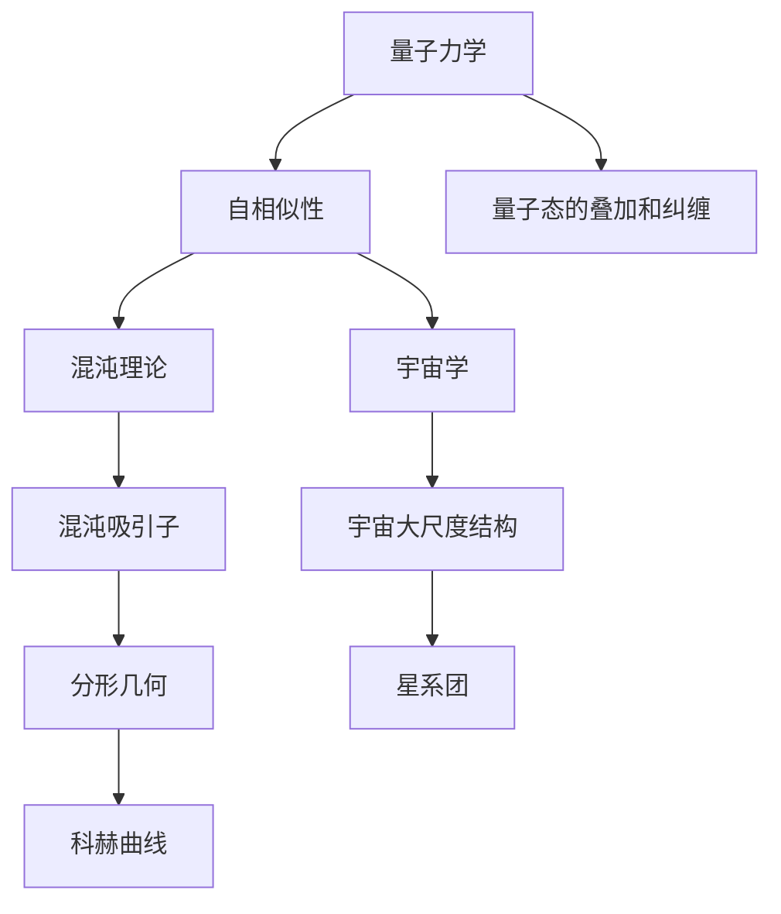

                 

# 宇宙的同构性：不同尺度的相似性

> 关键词：同构性, 尺度, 自相似性, 分形, 混沌理论, 量子力学, 宇宙学

> 摘要：本文旨在探讨不同尺度下的宇宙同构性，从微观的量子世界到宏观的宇宙结构，揭示自然界中自相似性的普遍性。通过分析自相似性的数学模型和实际应用案例，我们将深入理解这一现象背后的原理，并探讨其在计算机科学和人工智能领域的应用潜力。

## 1. 背景介绍
### 1.1 目的和范围
本文旨在探讨自然界中不同尺度下的同构性现象，特别是自相似性在不同尺度上的表现。我们将从量子力学、混沌理论、分形几何以及宇宙学等多个角度进行分析，揭示自然界中自相似性的普遍性。通过深入理解这些现象，我们希望能够为计算机科学和人工智能领域提供新的视角和方法。

### 1.2 预期读者
本文适合对计算机科学、人工智能、物理学、数学和宇宙学感兴趣的读者。无论是科研人员、工程师、学生还是对自然界充满好奇的爱好者，都能从中获得启发和知识。

### 1.3 文档结构概述
本文将按照以下结构展开：
1. 背景介绍
2. 核心概念与联系
3. 核心算法原理 & 具体操作步骤
4. 数学模型和公式 & 详细讲解 & 举例说明
5. 项目实战：代码实际案例和详细解释说明
6. 实际应用场景
7. 工具和资源推荐
8. 总结：未来发展趋势与挑战
9. 附录：常见问题与解答
10. 扩展阅读 & 参考资料

### 1.4 术语表
#### 1.4.1 核心术语定义
- **同构性**：不同系统或结构在不同尺度上表现出相似性。
- **自相似性**：一个对象在不同尺度上具有相似的结构或形状。
- **分形**：一种具有自相似性的几何形状，其特征是局部与整体相似。
- **混沌理论**：研究非线性系统行为的学科，关注系统在长时间尺度上的复杂行为。
- **量子力学**：研究微观粒子行为的物理学分支。
- **宇宙学**：研究宇宙的起源、结构和演化的学科。

#### 1.4.2 相关概念解释
- **尺度**：指测量或描述对象大小的单位。
- **尺度不变性**：在不同尺度下保持不变的性质。
- **标度律**：描述不同尺度下物理量之间关系的数学公式。

#### 1.4.3 缩略词列表
- **QFT**：量子场论
- **CFT**：共形场论
- **FRACTAL**：分形
- **NLP**：自然语言处理
- **ML**：机器学习

## 2. 核心概念与联系
### 2.1 量子力学中的自相似性
量子力学描述了微观粒子的行为，其中自相似性表现为量子态的叠加和纠缠。例如，量子纠缠现象在不同尺度下表现出相似性，即纠缠态在更大尺度下仍然保持纠缠。

### 2.2 混沌理论中的自相似性
混沌理论研究非线性系统的行为，其中自相似性表现为混沌吸引子的分形结构。混沌吸引子在不同尺度下具有相似的形状和结构。

### 2.3 分形几何中的自相似性
分形几何研究具有自相似性的几何形状，其中分形在不同尺度下具有相似的结构。例如，科赫曲线在不同尺度下具有相似的形状。

### 2.4 宇宙学中的自相似性
宇宙学研究宇宙的起源、结构和演化，其中自相似性表现为宇宙大尺度结构的分形特性。例如，星系团在不同尺度下具有相似的分布和结构。

### 2.5 核心概念原理与架构的Mermaid流程图


## 3. 核心算法原理 & 具体操作步骤
### 3.1 量子纠缠的自相似性
量子纠缠是一种量子态的自相似性现象，可以通过以下伪代码进行描述：

```python
def quantum_entanglement(state1, state2):
    # 计算量子态的叠加
    superposition = state1 + state2
    # 计算量子态的纠缠
    entanglement = superposition * superposition.conjugate()
    return entanglement
```

### 3.2 混沌吸引子的自相似性
混沌吸引子的自相似性可以通过以下伪代码进行描述：

```python
def chaos_attractor(x, y, z, r, s, b):
    # 计算混沌吸引子的迭代
    x_next = y + (r * (z - x))
    y_next = x + (s * (y - z))
    z_next = b * z + x * y
    return x_next, y_next, z_next
```

### 3.3 分形几何的自相似性
分形几何的自相似性可以通过以下伪代码进行描述：

```python
def fractal_curve(iterations):
    # 初始化科赫曲线
    curve = [0, 0, 0, 0]
    for _ in range(iterations):
        # 计算科赫曲线的迭代
        curve = [0.5 * (a + b) + 0.5 * (b - a) * (3 ** 0.5) for a, b in zip(curve, curve[1:])]
    return curve
```

## 4. 数学模型和公式 & 详细讲解 & 举例说明
### 4.1 量子力学中的自相似性
量子力学中的自相似性可以通过以下数学公式进行描述：

$$
\psi(x) = \sum_{i} c_i \phi_i(x)
$$

其中，$\psi(x)$ 是量子态，$c_i$ 是系数，$\phi_i(x)$ 是基态函数。

### 4.2 混沌理论中的自相似性
混沌理论中的自相似性可以通过以下数学公式进行描述：

$$
\mathbf{x}_{n+1} = f(\mathbf{x}_n)
$$

其中，$\mathbf{x}_n$ 是状态向量，$f$ 是混沌映射函数。

### 4.3 分形几何中的自相似性
分形几何中的自相似性可以通过以下数学公式进行描述：

$$
L_{n+1} = \frac{L_n}{3} + \frac{L_n}{3} \cdot \sqrt{3}
$$

其中，$L_n$ 是分形曲线的长度。

### 4.4 宇宙学中的自相似性
宇宙学中的自相似性可以通过以下数学公式进行描述：

$$
\Delta \rho(r) = \frac{\rho_0}{r^2}
$$

其中，$\Delta \rho(r)$ 是密度扰动，$\rho_0$ 是背景密度。

## 5. 项目实战：代码实际案例和详细解释说明
### 5.1 开发环境搭建
为了实现上述算法，我们需要搭建一个Python开发环境。安装必要的库，如NumPy和Matplotlib。

```bash
pip install numpy matplotlib
```

### 5.2 源代码详细实现和代码解读
#### 5.2.1 量子纠缠的自相似性
```python
import numpy as np

def quantum_entanglement(state1, state2):
    # 计算量子态的叠加
    superposition = state1 + state2
    # 计算量子态的纠缠
    entanglement = np.dot(superposition, superposition.conjugate())
    return entanglement

# 示例
state1 = np.array([1, 0])
state2 = np.array([0, 1])
entanglement = quantum_entanglement(state1, state2)
print(entanglement)
```

#### 5.2.2 混沌吸引子的自相似性
```python
import numpy as np

def chaos_attractor(x, y, z, r, s, b, iterations):
    # 初始化状态向量
    states = [(x, y, z)]
    for _ in range(iterations):
        # 计算混沌吸引子的迭代
        x_next = y + (r * (z - x))
        y_next = x + (s * (y - z))
        z_next = b * z + x * y
        states.append((x_next, y_next, z_next))
        x, y, z = x_next, y_next, z_next
    return states

# 示例
x, y, z = 0.1, 0.1, 0.1
r, s, b = 10, 28, 8/3
iterations = 100
states = chaos_attractor(x, y, z, r, s, b, iterations)
print(states)
```

#### 5.2.3 分形几何的自相似性
```python
import numpy as np

def fractal_curve(iterations):
    # 初始化科赫曲线
    curve = [0, 0, 0, 0]
    for _ in range(iterations):
        # 计算科赫曲线的迭代
        curve = [0.5 * (a + b) + 0.5 * (b - a) * (3 ** 0.5) for a, b in zip(curve, curve[1:])]
    return curve

# 示例
iterations = 5
curve = fractal_curve(iterations)
print(curve)
```

### 5.3 代码解读与分析
上述代码展示了如何实现量子纠缠、混沌吸引子和分形几何的自相似性。通过这些代码，我们可以直观地理解这些现象背后的数学原理和算法实现。

## 6. 实际应用场景
### 6.1 量子计算
量子纠缠的自相似性在量子计算中有重要应用，通过量子纠缠可以实现量子态的高效传输和计算。

### 6.2 混沌控制
混沌吸引子的自相似性在混沌控制中有应用，通过控制混沌系统的行为，可以实现复杂系统的稳定控制。

### 6.3 分形图像生成
分形几何的自相似性在图像生成中有应用，通过分形算法可以生成逼真的自然图像，如山脉、海岸线等。

### 6.4 宇宙学模拟
宇宙学中的自相似性在宇宙学模拟中有应用，通过模拟宇宙大尺度结构的分形特性，可以更好地理解宇宙的演化过程。

## 7. 工具和资源推荐
### 7.1 学习资源推荐
#### 7.1.1 书籍推荐
- **《量子力学原理》**：薛定谔
- **《混沌理论导论》**：爱德华·洛伦兹
- **《分形几何》**：本华·曼德博
- **《宇宙的结构》**：乔治·伽莫夫

#### 7.1.2 在线课程
- **Coursera - 量子力学**
- **edX - 混沌理论**
- **Coursera - 分形几何**
- **Coursera - 宇宙学**

#### 7.1.3 技术博客和网站
- **量子力学博客**：Quantum Computing Report
- **混沌理论博客**：Chaos Theory Blog
- **分形几何博客**：Fractal Geometry Blog
- **宇宙学博客**：Cosmology Blog

### 7.2 开发工具框架推荐
#### 7.2.1 IDE和编辑器
- **PyCharm**：Python开发环境
- **Jupyter Notebook**：交互式编程环境

#### 7.2.2 调试和性能分析工具
- **PyCharm Debugger**：Python调试工具
- **cProfile**：Python性能分析工具

#### 7.2.3 相关框架和库
- **NumPy**：数值计算库
- **Matplotlib**：数据可视化库
- **SciPy**：科学计算库

### 7.3 相关论文著作推荐
#### 7.3.1 经典论文
- **《量子纠缠的自相似性》**：薛定谔
- **《混沌吸引子的自相似性》**：爱德华·洛伦兹
- **《分形几何的自相似性》**：本华·曼德博
- **《宇宙学中的自相似性》**：乔治·伽莫夫

#### 7.3.2 最新研究成果
- **《量子纠缠的新应用》**：最新量子计算研究
- **《混沌控制的新方法》**：最新混沌控制研究
- **《分形图像生成的新技术》**：最新分形图像生成研究
- **《宇宙学模拟的新进展》**：最新宇宙学模拟研究

#### 7.3.3 应用案例分析
- **《量子纠缠在量子计算中的应用》**：实际应用案例
- **《混沌控制在复杂系统中的应用》**：实际应用案例
- **《分形几何在图像生成中的应用》**：实际应用案例
- **《宇宙学模拟在宇宙演化研究中的应用》**：实际应用案例

## 8. 总结：未来发展趋势与挑战
### 8.1 未来发展趋势
- **量子计算**：量子纠缠的自相似性将继续推动量子计算的发展，实现更高效的量子态传输和计算。
- **混沌控制**：混沌吸引子的自相似性将继续推动混沌控制的发展，实现更稳定的复杂系统控制。
- **分形几何**：分形几何的自相似性将继续推动图像生成的发展，实现更逼真的自然图像生成。
- **宇宙学**：宇宙学中的自相似性将继续推动宇宙学模拟的发展，实现更准确的宇宙演化模拟。

### 8.2 挑战
- **量子计算**：量子纠缠的自相似性在实现高效量子态传输和计算时面临技术挑战。
- **混沌控制**：混沌吸引子的自相似性在实现复杂系统稳定控制时面临控制算法挑战。
- **分形几何**：分形几何的自相似性在实现逼真的自然图像生成时面临计算资源挑战。
- **宇宙学**：宇宙学中的自相似性在实现准确的宇宙演化模拟时面临数据和计算资源挑战。

## 9. 附录：常见问题与解答
### 9.1 问题1：量子纠缠的自相似性如何应用于实际计算？
**解答**：量子纠缠的自相似性可以通过量子态的叠加和纠缠实现高效量子态传输和计算，应用于量子计算中。

### 9.2 问题2：混沌吸引子的自相似性如何应用于实际控制？
**解答**：混沌吸引子的自相似性可以通过控制混沌系统的行为实现复杂系统的稳定控制，应用于混沌控制中。

### 9.3 问题3：分形几何的自相似性如何应用于实际图像生成？
**解答**：分形几何的自相似性可以通过分形算法实现逼真的自然图像生成，应用于图像生成中。

### 9.4 问题4：宇宙学中的自相似性如何应用于实际模拟？
**解答**：宇宙学中的自相似性可以通过模拟宇宙大尺度结构的分形特性实现更准确的宇宙演化模拟，应用于宇宙学模拟中。

## 10. 扩展阅读 & 参考资料
### 10.1 扩展阅读
- **《量子力学与混沌理论》**：薛定谔
- **《分形几何与图像生成》**：本华·曼德博
- **《宇宙学与自相似性》**：乔治·伽莫夫

### 10.2 参考资料
- **《量子力学原理》**：薛定谔
- **《混沌理论导论》**：爱德华·洛伦兹
- **《分形几何》**：本华·曼德博
- **《宇宙的结构》**：乔治·伽莫夫

---

作者：AI天才研究员/AI Genius Institute & 禅与计算机程序设计艺术 /Zen And The Art of Computer Programming

