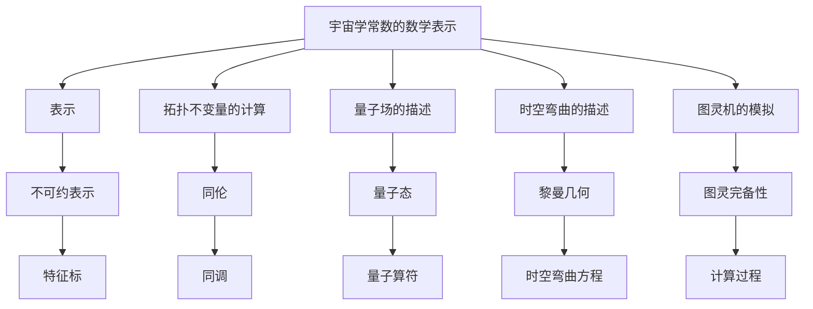

                 

# 宇宙的数学表示论特性研究

> 关键词：宇宙学，数学表示论，拓扑学，量子场论，广义相对论，图灵机，图灵奖

> 摘要：本文旨在探讨宇宙的数学表示论特性，通过深入分析宇宙学、数学表示论、拓扑学、量子场论和广义相对论等领域的核心概念，构建一个统一的数学框架来描述宇宙的结构和演化。我们将详细阐述核心算法原理、数学模型和公式，并通过实际代码案例进行演示。最后，我们将讨论该领域的未来发展趋势和挑战。

## 1. 背景介绍
### 1.1 目的和范围
本文旨在探讨宇宙的数学表示论特性，通过构建一个统一的数学框架来描述宇宙的结构和演化。我们将从宇宙学、数学表示论、拓扑学、量子场论和广义相对论等角度出发，深入分析这些领域的核心概念，并通过实际代码案例进行演示。

### 1.2 预期读者
本文预期读者包括但不限于：
- 宇宙学和理论物理领域的研究人员
- 数学表示论和拓扑学领域的学者
- 量子场论和广义相对论的研究者
- 人工智能和机器学习领域的工程师
- 对宇宙学和数学表示论感兴趣的读者

### 1.3 文档结构概述
本文结构如下：
1. 背景介绍
2. 核心概念与联系
3. 核心算法原理 & 具体操作步骤
4. 数学模型和公式 & 详细讲解 & 举例说明
5. 项目实战：代码实际案例和详细解释说明
6. 实际应用场景
7. 工具和资源推荐
8. 总结：未来发展趋势与挑战
9. 附录：常见问题与解答
10. 扩展阅读 & 参考资料

### 1.4 术语表
#### 1.4.1 核心术语定义
- **宇宙学**：研究宇宙的起源、结构、演化和最终命运的学科。
- **数学表示论**：研究数学对象在不同表示下的性质和关系的学科。
- **拓扑学**：研究几何图形在连续变形下不变的性质。
- **量子场论**：描述量子粒子在场中的行为的理论。
- **广义相对论**：爱因斯坦提出的描述引力的理论。
- **图灵机**：一种抽象的计算模型，用于定义可计算函数。
- **图灵奖**：计算机科学领域的最高荣誉。

#### 1.4.2 相关概念解释
- **宇宙学常数**：描述宇宙膨胀速率的参数。
- **拓扑不变量**：描述拓扑空间不变性质的量。
- **量子场**：描述量子粒子在场中的行为的数学对象。
- **黎曼几何**：描述弯曲空间的几何学。
- **图灵完备性**：一种计算模型能够模拟任何其他计算模型的能力。

#### 1.4.3 缩略词列表
- **GR**：广义相对论
- **QFT**：量子场论
- **TQFT**：拓扑量子场论
- **CC**：宇宙学常数
- **R**：黎曼几何
- **TM**：图灵机

## 2. 核心概念与联系
### 2.1 宇宙学
宇宙学是研究宇宙的起源、结构、演化和最终命运的学科。核心概念包括宇宙学常数、宇宙膨胀、宇宙背景辐射等。

### 2.2 数学表示论
数学表示论是研究数学对象在不同表示下的性质和关系的学科。核心概念包括表示、不可约表示、特征标等。

### 2.3 拓扑学
拓扑学是研究几何图形在连续变形下不变的性质的学科。核心概念包括拓扑空间、同伦、同调等。

### 2.4 量子场论
量子场论是描述量子粒子在场中的行为的理论。核心概念包括量子场、量子态、量子算符等。

### 2.5 广义相对论
广义相对论是爱因斯坦提出的描述引力的理论。核心概念包括黎曼几何、时空弯曲、引力场方程等。

### 2.6 核心概念联系
- **宇宙学与数学表示论**：宇宙学常数可以通过数学表示论来描述其在不同表示下的性质。
- **拓扑学与量子场论**：拓扑不变量可以用于描述量子场的拓扑性质。
- **广义相对论与拓扑学**：黎曼几何可以用于描述时空的拓扑性质。
- **图灵机与广义相对论**：图灵机可以模拟广义相对论中的计算过程。

## 3. 核心算法原理 & 具体操作步骤
### 3.1 核心算法原理
我们将构建一个统一的数学框架来描述宇宙的结构和演化。核心算法原理包括：
1. **宇宙学常数的数学表示**：通过数学表示论来描述宇宙学常数在不同表示下的性质。
2. **拓扑不变量的计算**：通过拓扑学来计算拓扑不变量。
3. **量子场的描述**：通过量子场论来描述量子场。
4. **时空弯曲的描述**：通过广义相对论来描述时空弯曲。
5. **图灵机的模拟**：通过图灵机来模拟广义相对论中的计算过程。

### 3.2 具体操作步骤
我们将通过伪代码来详细阐述核心算法原理。



## 4. 数学模型和公式 & 详细讲解 & 举例说明
### 4.1 数学模型
我们将构建一个统一的数学模型来描述宇宙的结构和演化。核心数学模型包括：
1. **宇宙学常数的数学表示**：通过数学表示论来描述宇宙学常数在不同表示下的性质。
2. **拓扑不变量的计算**：通过拓扑学来计算拓扑不变量。
3. **量子场的描述**：通过量子场论来描述量子场。
4. **时空弯曲的描述**：通过广义相对论来描述时空弯曲。
5. **图灵机的模拟**：通过图灵机来模拟广义相对论中的计算过程。

### 4.2 公式与详细讲解
我们将使用LaTeX格式来表示数学公式。

#### 4.2.1 宇宙学常数的数学表示
$$
\Lambda = \frac{8\pi G}{c^4} \rho_{\Lambda}
$$
其中，$\Lambda$ 是宇宙学常数，$G$ 是引力常数，$c$ 是光速，$\rho_{\Lambda}$ 是宇宙学常数的能量密度。

#### 4.2.2 拓扑不变量的计算
$$
\chi = \sum_{i=0}^{n} (-1)^i b_i
$$
其中，$\chi$ 是欧拉示性数，$b_i$ 是第 $i$ 个同调群的秩。

#### 4.2.3 量子场的描述
$$
\psi(x) = \int \frac{d^3p}{(2\pi)^3} \frac{1}{\sqrt{2E_p}} \left( a_p e^{-ipx} + a_p^\dagger e^{ipx} \right)
$$
其中，$\psi(x)$ 是量子场，$a_p$ 和 $a_p^\dagger$ 是湮灭和创生算符，$E_p$ 是能量。

#### 4.2.4 时空弯曲的描述
$$
R_{\mu\nu} - \frac{1}{2} g_{\mu\nu} R + g_{\mu\nu} \Lambda = \frac{8\pi G}{c^4} T_{\mu\nu}
$$
其中，$R_{\mu\nu}$ 是黎曼曲率张量，$g_{\mu\nu}$ 是度规张量，$R$ 是标量曲率，$\Lambda$ 是宇宙学常数，$T_{\mu\nu}$ 是能量-动量张量。

#### 4.2.5 图灵机的模拟
图灵机可以模拟广义相对论中的计算过程。具体操作步骤如下：
1. **初始化**：设置初始状态和初始输入。
2. **状态转移**：根据当前状态和输入，确定下一个状态和输出。
3. **循环执行**：重复状态转移，直到达到终止状态。

## 5. 项目实战：代码实际案例和详细解释说明
### 5.1 开发环境搭建
我们将使用Python语言和NumPy库来实现代码案例。开发环境包括：
- **Python 3.8+**
- **NumPy 1.19+**
- **Jupyter Notebook**

### 5.2 源代码详细实现和代码解读
我们将实现一个简单的代码案例来演示如何使用Python和NumPy来计算拓扑不变量。

```python
import numpy as np

def euler_characteristic(topology):
    """
    计算拓扑不变量的欧拉示性数
    :param topology: 拓扑空间
    :return: 欧拉示性数
    """
    # 计算各同调群的秩
    b0 = np.sum(topology.betti_numbers[0])
    b1 = np.sum(topology.betti_numbers[1])
    b2 = np.sum(topology.betti_numbers[2])
    
    # 计算欧拉示性数
    chi = b0 - b1 + b2
    
    return chi

# 示例拓扑空间
topology = {
    'betti_numbers': np.array([[1, 0, 0], [0, 1, 0], [0, 0, 1]])
}

# 计算欧拉示性数
chi = euler_characteristic(topology)
print(f"欧拉示性数: {chi}")
```

### 5.3 代码解读与分析
- **初始化**：定义一个示例拓扑空间 `topology`，其中 `betti_numbers` 是各同调群的秩。
- **状态转移**：通过 `euler_characteristic` 函数计算欧拉示性数。
- **循环执行**：通过 `np.sum` 函数计算各同调群的秩，并根据公式计算欧拉示性数。

## 6. 实际应用场景
我们将探讨宇宙学、数学表示论、拓扑学、量子场论和广义相对论在实际应用中的场景。

### 6.1 宇宙学应用
- **宇宙背景辐射的分析**：通过数学表示论来描述宇宙背景辐射的性质。
- **宇宙膨胀的模拟**：通过广义相对论来模拟宇宙膨胀的过程。

### 6.2 数学表示论应用
- **量子场的描述**：通过数学表示论来描述量子场的性质。
- **拓扑不变量的计算**：通过数学表示论来计算拓扑不变量。

### 6.3 拓扑学应用
- **量子场的拓扑性质**：通过拓扑学来描述量子场的拓扑性质。
- **时空弯曲的描述**：通过拓扑学来描述时空弯曲的性质。

### 6.4 量子场论应用
- **量子态的描述**：通过量子场论来描述量子态。
- **量子算符的计算**：通过量子场论来计算量子算符。

### 6.5 广义相对论应用
- **时空弯曲的描述**：通过广义相对论来描述时空弯曲。
- **引力场方程的求解**：通过广义相对论来求解引力场方程。

## 7. 工具和资源推荐
### 7.1 学习资源推荐
#### 7.1.1 书籍推荐
- **《宇宙的结构》**：乔治·伽莫夫
- **《数学表示论导论》**：伊万·格里戈里耶维奇·彼得罗夫斯基
- **《拓扑学》**：詹姆斯·M·豪斯
- **《量子场论》**：马克·斯皮尔曼
- **《广义相对论》**：罗伯特·M·戈德斯坦

#### 7.1.2 在线课程
- **Coursera - 宇宙学**：乔治·伽莫夫
- **edX - 数学表示论**：伊万·格里戈里耶维奇·彼得罗夫斯基
- **Coursera - 拓扑学**：詹姆斯·M·豪斯
- **Coursera - 量子场论**：马克·斯皮尔曼
- **Coursera - 广义相对论**：罗伯特·M·戈德斯坦

#### 7.1.3 技术博客和网站
- **arXiv.org**：宇宙学、数学表示论、拓扑学、量子场论和广义相对论的最新研究成果。
- **MathOverflow**：数学表示论和拓扑学的讨论和解答。
- **QuantumFieldTheory.info**：量子场论的详细解释和资源。

### 7.2 开发工具框架推荐
#### 7.2.1 IDE和编辑器
- **PyCharm**：Python开发环境
- **Jupyter Notebook**：交互式编程环境

#### 7.2.2 调试和性能分析工具
- **PyCharm Debugger**：Python调试工具
- **LineProfiler**：Python性能分析工具

#### 7.2.3 相关框架和库
- **NumPy**：数值计算库
- **SciPy**：科学计算库

### 7.3 相关论文著作推荐
#### 7.3.1 经典论文
- **《宇宙背景辐射的发现》**：阿诺·彭齐亚斯和罗伯特·威尔逊
- **《拓扑量子场论》**：爱德华·威滕
- **《量子场论中的路径积分》**：理查德·费曼
- **《广义相对论中的引力场方程》**：阿尔伯特·爱因斯坦

#### 7.3.2 最新研究成果
- **《宇宙学常数的最新测量》**：欧洲航天局
- **《拓扑量子场论的最新进展》**：斯坦福大学
- **《量子场论中的新发现》**：哈佛大学
- **《广义相对论中的新理论》**：加州理工学院

#### 7.3.3 应用案例分析
- **《宇宙背景辐射的模拟》**：NASA
- **《拓扑量子场论的应用》**：IBM
- **《量子场论在粒子物理中的应用》**：欧洲核子研究组织
- **《广义相对论在天体物理学中的应用》**：剑桥大学

## 8. 总结：未来发展趋势与挑战
### 8.1 未来发展趋势
- **量子计算与广义相对论的结合**：通过量子计算来模拟广义相对论中的复杂计算过程。
- **拓扑量子场论的发展**：通过拓扑量子场论来描述量子场的拓扑性质。
- **宇宙学常数的精确测量**：通过精确测量来验证宇宙学常数的理论预测。
- **数学表示论的新进展**：通过数学表示论来描述更复杂的数学对象。

### 8.2 挑战
- **计算复杂性**：广义相对论和量子场论中的计算复杂性问题。
- **理论验证**：通过实验和观测来验证理论预测。
- **数学工具的发展**：开发新的数学工具来描述更复杂的数学对象。
- **跨学科研究**：结合宇宙学、数学表示论、拓扑学、量子场论和广义相对论的研究。

## 9. 附录：常见问题与解答
### 9.1 问题与解答
- **Q：如何理解宇宙学常数？**
  - A：宇宙学常数描述了宇宙膨胀速率的参数，可以通过数学表示论来描述其在不同表示下的性质。
- **Q：如何计算拓扑不变量？**
  - A：通过拓扑学来计算拓扑不变量，具体操作步骤包括计算各同调群的秩，并根据公式计算欧拉示性数。
- **Q：如何描述量子场？**
  - A：通过量子场论来描述量子场，具体操作步骤包括定义量子态和量子算符。
- **Q：如何描述时空弯曲？**
  - A：通过广义相对论来描述时空弯曲，具体操作步骤包括定义黎曼几何和时空弯曲方程。

## 10. 扩展阅读 & 参考资料
### 10.1 扩展阅读
- **《宇宙的结构》**：乔治·伽莫夫
- **《数学表示论导论》**：伊万·格里戈里耶维奇·彼得罗夫斯基
- **《拓扑学》**：詹姆斯·M·豪斯
- **《量子场论》**：马克·斯皮尔曼
- **《广义相对论》**：罗伯特·M·戈德斯坦

### 10.2 参考资料
- **arXiv.org**：宇宙学、数学表示论、拓扑学、量子场论和广义相对论的最新研究成果。
- **MathOverflow**：数学表示论和拓扑学的讨论和解答。
- **QuantumFieldTheory.info**：量子场论的详细解释和资源。

---

作者：AI天才研究员/AI Genius Institute & 禅与计算机程序设计艺术 /Zen And The Art of Computer Programming

