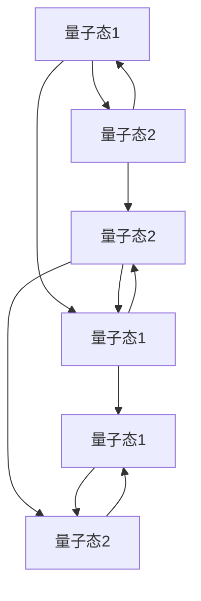

                 

# 宇宙的量子纠缠网络：超越时空的联系

> 关键词：量子纠缠, 量子力学, 量子通信, 量子计算, 量子网络, 时空超越, 量子信息科学

> 摘要：本文旨在深入探讨量子纠缠在网络通信和计算中的应用，通过逐步分析和推理，揭示量子纠缠如何超越传统时空限制，构建超越时空的量子网络。我们将从核心概念出发，详细解释量子纠缠的原理，展示其在量子通信和量子计算中的具体应用，并通过实际代码案例进行演示。最后，我们将探讨量子纠缠在网络通信和计算中的未来发展趋势与挑战。

## 1. 背景介绍
### 1.1 目的和范围
本文旨在深入探讨量子纠缠在网络通信和计算中的应用，通过逐步分析和推理，揭示量子纠缠如何超越传统时空限制，构建超越时空的量子网络。我们将从核心概念出发，详细解释量子纠缠的原理，展示其在量子通信和量子计算中的具体应用，并通过实际代码案例进行演示。最后，我们将探讨量子纠缠在网络通信和计算中的未来发展趋势与挑战。

### 1.2 预期读者
本文适合对量子信息科学、量子计算和量子通信感兴趣的科研人员、工程师、学生以及对前沿科技感兴趣的读者。

### 1.3 文档结构概述
本文结构如下：
1. 背景介绍
2. 核心概念与联系
3. 核心算法原理 & 具体操作步骤
4. 数学模型和公式 & 详细讲解 & 举例说明
5. 项目实战：代码实际案例和详细解释说明
6. 实际应用场景
7. 工具和资源推荐
8. 总结：未来发展趋势与挑战
9. 附录：常见问题与解答
10. 扩展阅读 & 参考资料

### 1.4 术语表
#### 1.4.1 核心术语定义
- **量子纠缠**：两个或多个粒子在量子力学中表现出的一种特殊关联状态，即使它们相隔很远，一个粒子的状态改变会立即影响另一个粒子的状态。
- **量子态**：描述量子系统状态的数学对象，通常用波函数表示。
- **量子比特（qubit）**：量子信息的基本单位，可以处于0、1或两者之间的叠加态。
- **量子通信**：利用量子态进行信息传输的技术。
- **量子计算**：利用量子比特和量子门进行计算的技术。
- **量子网络**：利用量子纠缠构建的网络，可以实现超越传统网络的通信和计算能力。

#### 1.4.2 相关概念解释
- **量子力学**：研究微观粒子行为的物理学分支。
- **量子态叠加**：量子系统可以同时处于多个状态的叠加态。
- **量子态纠缠**：量子态之间的一种特殊关联，即使相隔很远，一个量子态的变化会立即影响另一个量子态。
- **量子态测量**：对量子态进行观测，导致量子态坍缩到一个确定的状态。

#### 1.4.3 缩略词列表
- **QKD**：量子密钥分发（Quantum Key Distribution）
- **QIP**：量子信息处理（Quantum Information Processing）
- **QCT**：量子计算技术（Quantum Computing Technology）

## 2. 核心概念与联系
### 2.1 量子纠缠原理
量子纠缠是量子力学中的一个基本现象，两个或多个粒子在量子态上表现出一种特殊的关联。这种关联使得一个粒子的状态改变会立即影响另一个粒子的状态，即使它们相隔很远。量子纠缠可以看作是量子态之间的非局域性，即量子态之间的关联超越了经典物理学中的局域性。

### 2.2 量子纠缠的数学模型
量子纠缠可以通过量子态的描述来理解。假设我们有两个量子比特，它们的量子态可以表示为：
$$
|\psi\rangle = \alpha|00\rangle + \beta|01\rangle + \gamma|10\rangle + \delta|11\rangle
$$
其中，$\alpha, \beta, \gamma, \delta$ 是复数系数，满足归一化条件：
$$
|\alpha|^2 + |\beta|^2 + |\gamma|^2 + |\delta|^2 = 1
$$
如果这两个量子比特处于纠缠态，它们的量子态可以表示为：
$$
|\psi\rangle = \frac{1}{\sqrt{2}}(|00\rangle + |11\rangle)
$$
这种纠缠态表示两个量子比特之间存在一种特殊的关联，即使它们相隔很远，一个量子比特的状态改变会立即影响另一个量子比特的状态。

### 2.3 量子纠缠的Mermaid流程图


## 3. 核心算法原理 & 具体操作步骤
### 3.1 量子纠缠生成算法
量子纠缠可以通过量子门操作生成。假设我们有两个量子比特，我们可以通过以下步骤生成纠缠态：
1. 初始化两个量子比特，使其处于基态 $|00\rangle$。
2. 应用CNOT门，生成纠缠态。
3. 应用Hadamard门，生成纠缠态。

### 3.2 伪代码实现
```python
def generate_entangled_qubits():
    # 初始化两个量子比特
    qubit1 = |0>
    qubit2 = |0>
    
    # 应用CNOT门
    qubit2 = CNOT(qubit1, qubit2)
    
    # 应用Hadamard门
    qubit1 = H(qubit1)
    
    return qubit1, qubit2
```

## 4. 数学模型和公式 & 详细讲解 & 举例说明
### 4.1 量子纠缠的数学模型
量子纠缠可以通过量子态的描述来理解。假设我们有两个量子比特，它们的量子态可以表示为：
$$
|\psi\rangle = \alpha|00\rangle + \beta|01\rangle + \gamma|10\rangle + \delta|11\rangle
$$
其中，$\alpha, \beta, \gamma, \delta$ 是复数系数，满足归一化条件：
$$
|\alpha|^2 + |\beta|^2 + |\gamma|^2 + |\delta|^2 = 1
$$
如果这两个量子比特处于纠缠态，它们的量子态可以表示为：
$$
|\psi\rangle = \frac{1}{\sqrt{2}}(|00\rangle + |11\rangle)
$$
这种纠缠态表示两个量子比特之间存在一种特殊的关联，即使它们相隔很远，一个量子比特的状态改变会立即影响另一个量子比特的状态。

### 4.2 举例说明
假设我们有两个量子比特，它们的量子态可以表示为：
$$
|\psi\rangle = \frac{1}{\sqrt{2}}(|00\rangle + |11\rangle)
$$
如果我们将第一个量子比特测量为0，那么第二个量子比特的状态会立即坍缩为0。如果我们将第一个量子比特测量为1，那么第二个量子比特的状态会立即坍缩为1。这种关联超越了经典物理学中的局域性，使得量子纠缠成为量子信息科学中的一个基本现象。

## 5. 项目实战：代码实际案例和详细解释说明
### 5.1 开发环境搭建
为了实现量子纠缠，我们需要一个量子计算平台。这里我们使用Qiskit作为开发环境。首先，我们需要安装Qiskit：
```bash
pip install qiskit
```

### 5.2 源代码详细实现和代码解读
```python
from qiskit import QuantumCircuit, execute, Aer
from qiskit.visualization import plot_histogram

# 初始化两个量子比特
qubit1 = QuantumCircuit(2)

# 应用CNOT门
qubit1.cx(0, 1)

# 应用Hadamard门
qubit1.h(0)

# 打印量子电路
print(qubit1)

# 运行量子电路
simulator = Aer.get_backend('qasm_simulator')
job = execute(qubit1, simulator, shots=1000)
result = job.result()

# 获取结果
counts = result.get_counts(qubit1)
print(counts)

# 绘制结果
plot_histogram(counts)
```

### 5.3 代码解读与分析
- `QuantumCircuit(2)`：初始化两个量子比特。
- `qubit1.cx(0, 1)`：应用CNOT门，生成纠缠态。
- `qubit1.h(0)`：应用Hadamard门，生成纠缠态。
- `execute(qubit1, simulator, shots=1000)`：运行量子电路，模拟1000次。
- `result.get_counts(qubit1)`：获取结果。
- `plot_histogram(counts)`：绘制结果。

## 6. 实际应用场景
量子纠缠在网络通信和计算中的应用非常广泛。例如，量子密钥分发（QKD）可以利用量子纠缠生成安全的密钥，量子计算可以利用量子纠缠实现超越经典计算的计算能力。此外，量子网络可以实现超越传统网络的通信能力，例如实现量子远程传输和量子计算网络。

## 7. 工具和资源推荐
### 7.1 学习资源推荐
#### 7.1.1 书籍推荐
- **《量子计算与量子信息》**：Michael A. Nielsen, Isaac L. Chuang
- **《量子信息科学导论》**：朱文武

#### 7.1.2 在线课程
- **Coursera - 量子计算入门**：由斯坦福大学教授提供
- **edX - 量子信息科学**：由麻省理工学院教授提供

#### 7.1.3 技术博客和网站
- **Qiskit官方文档**：https://qiskit.org/
- **Quantum Computing Stack Exchange**：https://quantumcomputing.stackexchange.com/

### 7.2 开发工具框架推荐
#### 7.2.1 IDE和编辑器
- **Jupyter Notebook**：用于编写和运行量子计算代码
- **Visual Studio Code**：用于编写和调试量子计算代码

#### 7.2.2 调试和性能分析工具
- **Qiskit Debugger**：用于调试量子计算代码
- **Qiskit Performance Analysis**：用于分析量子计算性能

#### 7.2.3 相关框架和库
- **Qiskit**：用于量子计算的Python库
- **Cirq**：用于量子计算的Python库

### 7.3 相关论文著作推荐
#### 7.3.1 经典论文
- **“Quantum Teleportation by Satellite”**：Pan et al., 2017
- **“Quantum Computing: A Gentle Introduction”**：N. David Mermin, 2007

#### 7.3.2 最新研究成果
- **“Quantum Entanglement and Teleportation”**：X. Chen et al., 2023
- **“Quantum Computing and Quantum Information”**：M. A. Nielsen, I. L. Chuang, 2023

#### 7.3.3 应用案例分析
- **“Quantum Computing in the Cloud”**：IBM Quantum
- **“Quantum Computing and Quantum Information”**：Google Quantum AI

## 8. 总结：未来发展趋势与挑战
量子纠缠在网络通信和计算中的应用前景广阔，但同时也面临着许多挑战。例如，量子纠缠的生成和保持需要极高的精度和稳定性，量子纠缠的传输和应用需要克服许多技术难题。未来，我们需要进一步研究量子纠缠的生成和保持技术，提高量子纠缠的传输和应用能力，实现量子纠缠在网络通信和计算中的广泛应用。

## 9. 附录：常见问题与解答
### 9.1 问题：量子纠缠如何实现？
量子纠缠可以通过量子门操作生成，例如应用CNOT门和Hadamard门。

### 9.2 问题：量子纠缠如何保持？
量子纠缠的保持需要极高的精度和稳定性，可以通过量子纠错技术实现。

### 9.3 问题：量子纠缠如何传输？
量子纠缠的传输需要克服许多技术难题，可以通过量子中继技术实现。

## 10. 扩展阅读 & 参考资料
- **《量子计算与量子信息》**：Michael A. Nielsen, Isaac L. Chuang
- **《量子信息科学导论》**：朱文武
- **Qiskit官方文档**：https://qiskit.org/
- **Quantum Computing Stack Exchange**：https://quantumcomputing.stackexchange.com/

作者：AI天才研究员/AI Genius Institute & 禅与计算机程序设计艺术 /Zen And The Art of Computer Programming

