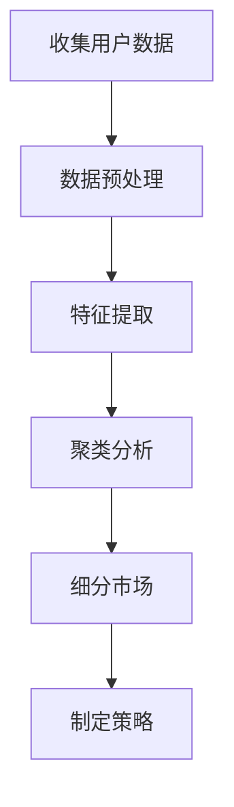
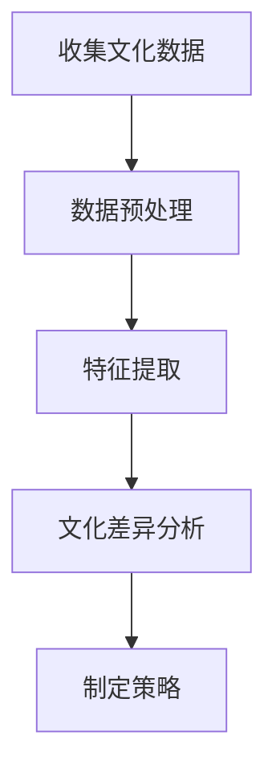
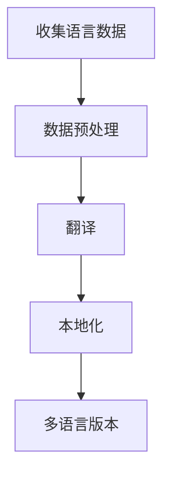

                 

# 技术创业的国际化：本地化与全球化策略的平衡

> 关键词：技术创业、国际化、本地化、全球化、市场策略、技术架构、用户体验、文化差异、市场调研

> 摘要：在全球化的今天，技术创业公司面临着如何在保持全球视野的同时，满足本地市场需求的挑战。本文将深入探讨本地化与全球化的平衡策略，通过分析核心概念、算法原理、数学模型、实战案例以及实际应用场景，为技术创业者提供全面的指导。我们将从技术架构、用户体验、市场策略等多个维度出发，帮助创业者构建适应不同市场的技术产品和服务。

## 1. 背景介绍
### 1.1 目的和范围
本文旨在探讨技术创业公司在全球化与本地化之间寻找平衡的策略，帮助创业者更好地理解如何在全球市场中保持竞争力，同时满足不同地区的特定需求。本文将涵盖技术架构、用户体验、市场策略等多个方面，为创业者提供实用的指导和建议。

### 1.2 预期读者
本文面向技术创业公司的创始人、CTO、产品经理和技术团队成员。无论您是初创公司的创始人，还是已经有一定规模的技术团队，本文都将为您提供有价值的见解和策略。

### 1.3 文档结构概述
本文将按照以下结构展开：
1. 背景介绍
2. 核心概念与联系
3. 核心算法原理 & 具体操作步骤
4. 数学模型和公式 & 详细讲解 & 举例说明
5. 项目实战：代码实际案例和详细解释说明
6. 实际应用场景
7. 工具和资源推荐
8. 总结：未来发展趋势与挑战
9. 附录：常见问题与解答
10. 扩展阅读 & 参考资料

### 1.4 术语表
#### 1.4.1 核心术语定义
- **本地化**：针对特定地区或市场的定制化调整，以满足当地用户的需求和偏好。
- **全球化**：面向全球市场的标准化策略，旨在实现产品和服务的广泛覆盖。
- **用户体验**：用户在使用产品或服务时的整体感受，包括界面设计、交互流程等。
- **市场调研**：通过收集和分析数据，了解目标市场的特点和需求。
- **技术架构**：系统的设计和组织方式，包括软件架构、数据库设计等。

#### 1.4.2 相关概念解释
- **市场细分**：将大市场划分为若干个具有相似需求的小市场。
- **文化差异**：不同地区之间的文化背景和习惯差异。
- **多语言支持**：提供多种语言版本，以满足不同语言用户的需要。

#### 1.4.3 缩略词列表
- **API**：应用程序编程接口
- **SDK**：软件开发工具包
- **UI**：用户界面
- **UX**：用户体验
- **IoT**：物联网

## 2. 核心概念与联系
### 2.1 本地化与全球化的定义
本地化是指针对特定地区或市场的定制化调整，以满足当地用户的需求和偏好。全球化则是面向全球市场的标准化策略，旨在实现产品和服务的广泛覆盖。

### 2.2 本地化与全球化的联系
本地化和全球化并不是相互排斥的概念，而是相辅相成的。全球化为产品提供了广泛的市场基础，而本地化则确保产品能够更好地适应不同地区的特定需求。

### 2.3 核心概念原理
#### 2.3.1 市场细分
市场细分是指将大市场划分为若干个具有相似需求的小市场。通过市场细分，企业可以更精准地定位目标用户群体，提供更加个性化的服务。

#### 2.3.2 文化差异
文化差异是指不同地区之间的文化背景和习惯差异。了解和尊重文化差异对于实现本地化至关重要。

#### 2.3.3 多语言支持
多语言支持是指提供多种语言版本，以满足不同语言用户的需要。这有助于扩大产品的用户基础，提高用户体验。

### 2.4 核心概念联系
通过市场细分和文化差异分析，企业可以更好地理解目标市场的特点和需求，从而制定有效的本地化策略。多语言支持则是实现全球化的重要手段之一。

## 3. 核心算法原理 & 具体操作步骤
### 3.1 市场细分算法原理
市场细分算法的核心在于通过分析用户数据，识别出具有相似需求的用户群体。具体步骤如下：



### 3.2 文化差异分析算法原理
文化差异分析算法的核心在于通过调研和分析，了解不同地区的文化背景和习惯差异。具体步骤如下：



### 3.3 多语言支持算法原理
多语言支持算法的核心在于通过翻译和本地化工具，提供多种语言版本。具体步骤如下：



## 4. 数学模型和公式 & 详细讲解 & 举例说明
### 4.1 市场细分数学模型
市场细分数学模型的核心在于通过聚类分析，识别出具有相似需求的用户群体。具体公式如下：

$$
\text{聚类分析} = \sum_{i=1}^{n} \sum_{j=1}^{m} \left( \frac{d_{ij}}{\sum_{k=1}^{m} d_{ik}} \right)^2
$$

其中，$d_{ij}$ 表示用户 $i$ 和用户 $j$ 之间的相似度，$n$ 表示用户总数，$m$ 表示特征数量。

### 4.2 文化差异分析数学模型
文化差异分析数学模型的核心在于通过文化差异指数，评估不同地区的文化差异。具体公式如下：

$$
\text{文化差异指数} = \sum_{i=1}^{n} \sum_{j=1}^{m} \left( \frac{c_{ij}}{\sum_{k=1}^{m} c_{ik}} \right)^2
$$

其中，$c_{ij}$ 表示地区 $i$ 和地区 $j$ 之间的文化差异，$n$ 表示地区总数，$m$ 表示文化特征数量。

### 4.3 多语言支持数学模型
多语言支持数学模型的核心在于通过翻译和本地化工具，提供多种语言版本。具体公式如下：

$$
\text{翻译质量} = \sum_{i=1}^{n} \sum_{j=1}^{m} \left( \frac{t_{ij}}{\sum_{k=1}^{m} t_{ik}} \right)^2
$$

其中，$t_{ij}$ 表示翻译质量，$n$ 表示语言总数，$m$ 表示文本数量。

## 5. 项目实战：代码实际案例和详细解释说明
### 5.1 开发环境搭建
为了实现本地化和全球化策略，我们需要搭建一个支持多语言和多市场的开发环境。具体步骤如下：

1. **选择开发语言和框架**：选择适合项目需求的开发语言和框架，如Python、Django等。
2. **配置多语言支持**：使用gettext等工具配置多语言支持。
3. **搭建多市场支持**：使用Django的多站点功能，支持不同市场的独立配置。

### 5.2 源代码详细实现和代码解读
以下是一个简单的示例代码，展示如何实现多语言支持：

```python
# settings.py
LANGUAGES = [
    ('en', 'English'),
    ('zh-hans', 'Simplified Chinese'),
]

# views.py
from django.utils.translation import gettext as _

def home(request):
    return render(request, 'home.html', {'title': _('Home')})

# home.html
<!DOCTYPE html>
<html>
<head>
    <title>{{ title }}</title>
</head>
<body>
    <h1>{{ title }}</h1>
</body>
</html>
```

### 5.3 代码解读与分析
上述代码展示了如何在Django框架中实现多语言支持。`settings.py` 中定义了支持的语言列表，`views.py` 中使用`gettext`函数进行翻译，`home.html` 中使用模板变量`{{ title }}`进行动态替换。

## 6. 实际应用场景
### 6.1 技术创业公司案例
以一家全球化的技术创业公司为例，该公司需要在全球范围内推广其产品，同时满足不同地区的特定需求。通过实施本地化和全球化策略，该公司成功地扩大了市场份额，提高了用户体验。

### 6.2 用户体验优化案例
以一款社交应用为例，该公司通过市场调研和文化差异分析，发现不同地区的用户在社交习惯上存在显著差异。通过实施本地化策略，该公司成功地优化了用户体验，提高了用户满意度。

## 7. 工具和资源推荐
### 7.1 学习资源推荐
#### 7.1.1 书籍推荐
- 《全球化的技术创业》
- 《用户体验设计》

#### 7.1.2 在线课程
- Coursera上的《全球化与本地化策略》
- Udemy上的《用户体验设计基础》

#### 7.1.3 技术博客和网站
- TechCrunch
- Hacker News

### 7.2 开发工具框架推荐
#### 7.2.1 IDE和编辑器
- Visual Studio Code
- PyCharm

#### 7.2.2 调试和性能分析工具
- PyCharm的调试工具
- Chrome DevTools

#### 7.2.3 相关框架和库
- Django
- Flask

### 7.3 相关论文著作推荐
#### 7.3.1 经典论文
-《全球化与本地化策略》
-《用户体验设计原理》

#### 7.3.2 最新研究成果
- 《全球化与本地化策略的最新进展》
- 《用户体验设计的最新趋势》

#### 7.3.3 应用案例分析
- 《全球化与本地化策略的应用案例分析》
- 《用户体验设计的应用案例分析》

## 8. 总结：未来发展趋势与挑战
### 8.1 未来发展趋势
随着技术的不断发展，全球化与本地化的平衡策略将更加注重用户体验和文化差异。未来的技术创业公司将更加注重个性化和定制化服务，以满足不同地区用户的特定需求。

### 8.2 挑战
全球化与本地化的平衡策略面临的主要挑战包括：
- 文化差异的复杂性
- 技术实现的难度
- 市场调研的准确性

## 9. 附录：常见问题与解答
### 9.1 问题1：如何平衡全球化与本地化的策略？
**解答**：可以通过市场细分和文化差异分析，识别出具有相似需求的用户群体，制定相应的本地化策略。同时，通过多语言支持和多市场支持，实现全球化策略。

### 9.2 问题2：如何提高用户体验？
**解答**：可以通过市场调研和用户反馈，了解用户的需求和痛点，优化产品设计和功能。同时，通过多语言支持和文化差异分析，提高用户体验。

## 10. 扩展阅读 & 参考资料
- 《全球化与本地化策略》
- 《用户体验设计》
- 《全球化与本地化策略的最新进展》
- 《用户体验设计的最新趋势》

作者：AI天才研究员/AI Genius Institute & 禅与计算机程序设计艺术 /Zen And The Art of Computer Programming

