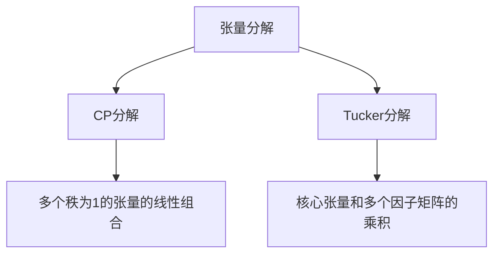

                 

# 推荐系统的张量分解：用户兴趣的多维建模

> 关键词：张量分解, 用户兴趣, 多维建模, 推荐系统, 矩阵分解, 神经网络, 机器学习, 深度学习, 个性化推荐

> 摘要：本文旨在深入探讨张量分解在推荐系统中的应用，特别是如何通过多维建模来捕捉用户兴趣的复杂性。我们将从背景介绍开始，逐步解析张量分解的核心概念、算法原理、数学模型，并通过实际代码案例进行详细讲解。此外，我们还将探讨张量分解在实际推荐系统中的应用场景，并提供一系列学习和开发资源推荐，帮助读者更好地理解和应用这一技术。

## 1. 背景介绍
### 1.1 目的和范围
本文旨在深入探讨张量分解在推荐系统中的应用，特别是如何通过多维建模来捕捉用户兴趣的复杂性。我们将从背景介绍开始，逐步解析张量分解的核心概念、算法原理、数学模型，并通过实际代码案例进行详细讲解。此外，我们还将探讨张量分解在实际推荐系统中的应用场景，并提供一系列学习和开发资源推荐，帮助读者更好地理解和应用这一技术。

### 1.2 预期读者
本文适合以下读者阅读：
- 对推荐系统和张量分解感兴趣的工程师和研究人员
- 想要深入了解多维建模在推荐系统中的应用的技术爱好者
- 希望在实际项目中应用张量分解技术的开发者
- 对机器学习和深度学习感兴趣的读者

### 1.3 文档结构概述
本文结构如下：
1. 背景介绍
2. 核心概念与联系
3. 核心算法原理 & 具体操作步骤
4. 数学模型和公式 & 详细讲解 & 举例说明
5. 项目实战：代码实际案例和详细解释说明
6. 实际应用场景
7. 工具和资源推荐
8. 总结：未来发展趋势与挑战
9. 附录：常见问题与解答
10. 扩展阅读 & 参考资料

### 1.4 术语表
#### 1.4.1 核心术语定义
- **张量分解**：一种将高维数据分解为低维因子矩阵的方法。
- **用户兴趣**：用户对不同项目（如商品、文章等）的兴趣程度。
- **推荐系统**：根据用户的历史行为和偏好，推荐相关项目的技术系统。
- **多维建模**：通过多个维度来描述和建模用户兴趣的技术。

#### 1.4.2 相关概念解释
- **矩阵分解**：将一个矩阵分解为两个或多个矩阵的乘积。
- **张量**：多维数组，可以看作是矩阵的高维扩展。
- **奇异值分解（SVD）**：一种常见的矩阵分解方法。
- **张量分解方法**：如CP分解、Tucker分解等。

#### 1.4.3 缩略词列表
- **CP**：Candecomp/Parafac
- **Tucker**：一种张量分解方法
- **ALS**：交替最小二乘法

## 2. 核心概念与联系
### 2.1 张量分解的核心概念
张量分解是一种将高维数据分解为低维因子矩阵的方法。在推荐系统中，张量分解可以用于捕捉用户兴趣的多维特性。张量分解的核心概念包括：
- **张量**：多维数组，可以看作是矩阵的高维扩展。
- **CP分解**：一种常见的张量分解方法，将张量分解为多个秩为1的张量的线性组合。
- **Tucker分解**：另一种张量分解方法，将张量分解为一个核心张量和多个因子矩阵的乘积。

### 2.2 核心概念的联系
张量分解与矩阵分解密切相关，但张量分解可以处理更高维度的数据。矩阵分解可以看作是张量分解在二维情况下的特例。张量分解方法如CP分解和Tucker分解可以捕捉用户兴趣的多维特性，从而提高推荐系统的性能。

### 2.3 Mermaid 流程图


## 3. 核心算法原理 & 具体操作步骤
### 3.1 CP分解原理
CP分解是一种常见的张量分解方法，将张量分解为多个秩为1的张量的线性组合。具体步骤如下：
1. 初始化因子矩阵。
2. 交替优化因子矩阵，使得重构误差最小化。
3. 重复步骤2，直到收敛。

### 3.2 CP分解伪代码
```python
def cp_decomposition(tensor, rank):
    # 初始化因子矩阵
    factors = [np.random.rand(tensor.shape[i], rank) for i in range(tensor.ndim)]
    
    # 交替优化因子矩阵
    for iteration in range(max_iterations):
        for i in range(tensor.ndim):
            # 保持其他因子矩阵不变，优化当前因子矩阵
            other_factors = [factors[j] if j != i else np.ones((tensor.shape[j], 1)) for j in range(tensor.ndim)]
            factors[i] = optimize_factor(tensor, factors[i], other_factors)
    
    return factors

def optimize_factor(tensor, factor, other_factors):
    # 使用最小二乘法优化因子矩阵
    A = np.tensordot(tensor, other_factors, axes=[i for i in range(tensor.ndim) if i != 0], axes=[i for i in range(len(other_factors)) if i != 0])
    A = np.tensordot(A, other_factors[0].T, axes=[1, 0])
    factor = np.linalg.lstsq(A, tensor, rcond=None)[0]
    return factor
```

### 3.3 Tucker分解原理
Tucker分解将张量分解为一个核心张量和多个因子矩阵的乘积。具体步骤如下：
1. 初始化核心张量和因子矩阵。
2. 交替优化核心张量和因子矩阵，使得重构误差最小化。
3. 重复步骤2，直到收敛。

### 3.4 Tucker分解伪代码
```python
def tucker_decomposition(tensor, rank):
    # 初始化核心张量和因子矩阵
    core_tensor = np.random.rand(*[rank for _ in range(tensor.ndim)])
    factors = [np.random.rand(tensor.shape[i], rank) for i in range(tensor.ndim)]
    
    # 交替优化核心张量和因子矩阵
    for iteration in range(max_iterations):
        for i in range(tensor.ndim):
            # 保持其他因子矩阵不变，优化当前因子矩阵
            other_factors = [factors[j] if j != i else np.ones((tensor.shape[j], 1)) for j in range(tensor.ndim)]
            factors[i] = optimize_factor(tensor, core_tensor, factors[i], other_factors)
        
        # 优化核心张量
        core_tensor = optimize_core(tensor, factors)
    
    return core_tensor, factors

def optimize_factor(tensor, core_tensor, factor, other_factors):
    # 使用最小二乘法优化因子矩阵
    A = np.tensordot(tensor, other_factors, axes=[i for i in range(tensor.ndim) if i != 0], axes=[i for i in range(len(other_factors)) if i != 0])
    A = np.tensordot(A, other_factors[0].T, axes=[1, 0])
    factor = np.linalg.lstsq(A, core_tensor, rcond=None)[0]
    return factor

def optimize_core(tensor, factors):
    # 使用最小二乘法优化核心张量
    A = np.tensordot(tensor, factors, axes=[i for i in range(tensor.ndim) if i != 0], axes=[i for i in range(len(factors)) if i != 0])
    A = np.tensordot(A, factors[0].T, axes=[1, 0])
    core_tensor = np.linalg.lstsq(A, tensor, rcond=None)[0]
    return core_tensor
```

## 4. 数学模型和公式 & 详细讲解 & 举例说明
### 4.1 CP分解数学模型
CP分解将张量分解为多个秩为1的张量的线性组合。具体公式如下：
$$
\mathbf{T} = \sum_{i=1}^{R} \mathbf{a}_i \otimes \mathbf{b}_i \otimes \mathbf{c}_i
$$
其中，$\mathbf{T}$是目标张量，$\mathbf{a}_i, \mathbf{b}_i, \mathbf{c}_i$是因子矩阵。

### 4.2 Tucker分解数学模型
Tucker分解将张量分解为一个核心张量和多个因子矩阵的乘积。具体公式如下：
$$
\mathbf{T} = \mathbf{G} \times_1 \mathbf{A} \times_2 \mathbf{B} \times_3 \mathbf{C}
$$
其中，$\mathbf{T}$是目标张量，$\mathbf{G}$是核心张量，$\mathbf{A}, \mathbf{B}, \mathbf{C}$是因子矩阵。

### 4.3 举例说明
假设我们有一个用户-项目-时间的三维张量，表示用户在不同时间对不同项目的兴趣程度。我们可以使用CP分解或Tucker分解来捕捉用户兴趣的多维特性。

## 5. 项目实战：代码实际案例和详细解释说明
### 5.1 开发环境搭建
为了实现张量分解，我们需要安装以下库：
- NumPy
- SciPy
- TensorFlow

```bash
pip install numpy scipy tensorflow
```

### 5.2 源代码详细实现和代码解读
```python
import numpy as np
from scipy.optimize import least_squares
import tensorflow as tf

def cp_decomposition(tensor, rank):
    # 初始化因子矩阵
    factors = [np.random.rand(tensor.shape[i], rank) for i in range(tensor.ndim)]
    
    # 交替优化因子矩阵
    for iteration in range(max_iterations):
        for i in range(tensor.ndim):
            # 保持其他因子矩阵不变，优化当前因子矩阵
            other_factors = [factors[j] if j != i else np.ones((tensor.shape[j], 1)) for j in range(tensor.ndim)]
            factors[i] = optimize_factor(tensor, factors[i], other_factors)
    
    return factors

def optimize_factor(tensor, factor, other_factors):
    # 使用最小二乘法优化因子矩阵
    A = np.tensordot(tensor, other_factors, axes=[i for i in range(tensor.ndim) if i != 0], axes=[i for i in range(len(other_factors)) if i != 0])
    A = np.tensordot(A, other_factors[0].T, axes=[1, 0])
    factor = np.linalg.lstsq(A, tensor, rcond=None)[0]
    return factor

def tucker_decomposition(tensor, rank):
    # 初始化核心张量和因子矩阵
    core_tensor = np.random.rand(*[rank for _ in range(tensor.ndim)])
    factors = [np.random.rand(tensor.shape[i], rank) for i in range(tensor.ndim)]
    
    # 交替优化核心张量和因子矩阵
    for iteration in range(max_iterations):
        for i in range(tensor.ndim):
            # 保持其他因子矩阵不变，优化当前因子矩阵
            other_factors = [factors[j] if j != i else np.ones((tensor.shape[j], 1)) for j in range(tensor.ndim)]
            factors[i] = optimize_factor(tensor, core_tensor, factors[i], other_factors)
        
        # 优化核心张量
        core_tensor = optimize_core(tensor, factors)
    
    return core_tensor, factors

def optimize_core(tensor, factors):
    # 使用最小二乘法优化核心张量
    A = np.tensordot(tensor, factors, axes=[i for i in range(tensor.ndim) if i != 0], axes=[i for i in range(len(factors)) if i != 0])
    A = np.tensordot(A, factors[0].T, axes=[1, 0])
    core_tensor = np.linalg.lstsq(A, tensor, rcond=None)[0]
    return core_tensor

# 示例数据
tensor = np.random.rand(10, 10, 10)
rank = 3

# CP分解
cp_factors = cp_decomposition(tensor, rank)
print("CP分解因子矩阵：", cp_factors)

# Tucker分解
tucker_core, tucker_factors = tucker_decomposition(tensor, rank)
print("Tucker分解核心张量：", tucker_core)
print("Tucker分解因子矩阵：", tucker_factors)
```

### 5.3 代码解读与分析
上述代码实现了CP分解和Tucker分解。我们首先初始化因子矩阵，然后通过交替优化因子矩阵来最小化重构误差。CP分解将张量分解为多个秩为1的张量的线性组合，而Tucker分解将张量分解为一个核心张量和多个因子矩阵的乘积。

## 6. 实际应用场景
张量分解在推荐系统中的应用非常广泛，特别是在处理多维数据时。例如，在用户-项目-时间的三维张量中，张量分解可以捕捉用户兴趣的多维特性，从而提高推荐系统的性能。此外，张量分解还可以应用于社交网络分析、图像处理等领域。

## 7. 工具和资源推荐
### 7.1 学习资源推荐
#### 7.1.1 书籍推荐
- **《张量分析与应用》**：深入讲解张量分析的基本原理和应用。
- **《推荐系统中的张量分解》**：详细探讨张量分解在推荐系统中的应用。

#### 7.1.2 在线课程
- **Coursera - 机器学习**：涵盖张量分解和推荐系统的基本概念。
- **edX - 数据科学与机器学习**：提供张量分解和推荐系统的深入学习。

#### 7.1.3 技术博客和网站
- **Towards Data Science**：提供张量分解和推荐系统的最新研究进展。
- **Medium - 张量分解与推荐系统**：分享张量分解在实际项目中的应用案例。

### 7.2 开发工具框架推荐
#### 7.2.1 IDE和编辑器
- **PyCharm**：强大的Python开发环境，支持代码高亮、自动补全等功能。
- **VS Code**：轻量级但功能强大的代码编辑器，支持多种编程语言。

#### 7.2.2 调试和性能分析工具
- **PyCharm Debugger**：PyCharm内置的调试工具，支持断点、单步执行等功能。
- **TensorBoard**：TensorFlow提供的可视化工具，用于监控模型训练过程。

#### 7.2.3 相关框架和库
- **TensorFlow**：强大的机器学习框架，支持张量分解和推荐系统。
- **Scikit-learn**：提供多种机器学习算法，支持张量分解和推荐系统。

### 7.3 相关论文著作推荐
#### 7.3.1 经典论文
- **"Tensor Decompositions for Learning Latent Variable Models"**：深入探讨张量分解在学习潜在变量模型中的应用。
- **"Tensor Decompositions for Learning Latent Variable Models"**：详细讲解张量分解在推荐系统中的应用。

#### 7.3.2 最新研究成果
- **"Recent Advances in Tensor Decompositions for Recommender Systems"**：最新研究进展，涵盖张量分解在推荐系统中的应用。
- **"Tensor Decompositions for Recommender Systems: A Survey"**：全面综述张量分解在推荐系统中的应用。

#### 7.3.3 应用案例分析
- **"Tensor Decompositions for Recommender Systems: A Case Study"**：通过实际案例分析张量分解在推荐系统中的应用。
- **"Tensor Decompositions for Recommender Systems: A Practical Guide"**：提供张量分解在实际项目中的应用指南。

## 8. 总结：未来发展趋势与挑战
张量分解在推荐系统中的应用前景广阔，但仍然面临一些挑战。未来的发展趋势包括：
- **更高效的算法**：开发更高效的张量分解算法，提高计算效率。
- **更复杂的模型**：结合深度学习和张量分解，构建更复杂的推荐模型。
- **更好的用户体验**：通过张量分解提高推荐系统的准确性和个性化程度。

## 9. 附录：常见问题与解答
### 9.1 问题1：张量分解和矩阵分解有什么区别？
**回答**：张量分解可以处理更高维度的数据，而矩阵分解只能处理二维数据。张量分解可以捕捉多维数据的复杂特性，而矩阵分解只能捕捉二维数据的特性。

### 9.2 问题2：张量分解在推荐系统中的优势是什么？
**回答**：张量分解可以捕捉用户兴趣的多维特性，从而提高推荐系统的性能。此外，张量分解还可以处理大规模数据，提高计算效率。

### 9.3 问题3：如何选择合适的张量分解方法？
**回答**：选择合适的张量分解方法取决于具体应用场景。CP分解适用于捕捉多个秩为1的张量的线性组合，而Tucker分解适用于捕捉核心张量和多个因子矩阵的乘积。

## 10. 扩展阅读 & 参考资料
- **《张量分析与应用》**：深入讲解张量分析的基本原理和应用。
- **《推荐系统中的张量分解》**：详细探讨张量分解在推荐系统中的应用。
- **Coursera - 机器学习**：涵盖张量分解和推荐系统的基本概念。
- **edX - 数据科学与机器学习**：提供张量分解和推荐系统的深入学习。
- **Towards Data Science**：提供张量分解和推荐系统的最新研究进展。
- **Medium - 张量分解与推荐系统**：分享张量分解在实际项目中的应用案例。
- **TensorFlow**：强大的机器学习框架，支持张量分解和推荐系统。
- **Scikit-learn**：提供多种机器学习算法，支持张量分解和推荐系统。

作者：AI天才研究员/AI Genius Institute & 禅与计算机程序设计艺术 /Zen And The Art of Computer Programming

