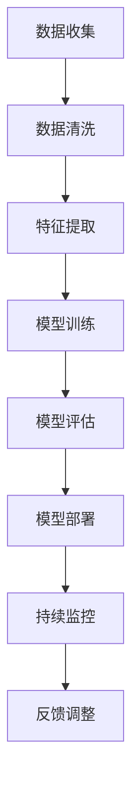

                 

# 数字时代的人文精神的复兴

> 关键词：数字时代、人文精神、复兴、技术伦理、社会影响、文化多样性、算法公平性

> 摘要：在数字时代，技术的发展不仅改变了我们的生活方式，也深刻影响了社会结构和文化形态。本文旨在探讨如何在技术进步的同时，复兴和弘扬人文精神，通过深入分析技术伦理、社会影响以及文化多样性，提出一系列策略和实践方法，以确保技术发展能够促进社会的和谐与进步。

## 1. 背景介绍
### 1.1 目的和范围
本文旨在探讨数字时代背景下，如何复兴和弘扬人文精神，通过技术伦理、社会影响以及文化多样性等多维度的分析，提出一系列策略和实践方法，以确保技术发展能够促进社会的和谐与进步。

### 1.2 预期读者
本文面向技术从业者、政策制定者、社会学者以及对数字时代人文精神复兴感兴趣的公众。读者可以通过本文了解技术伦理的重要性，以及如何在技术发展中融入人文关怀。

### 1.3 文档结构概述
本文将从以下几个方面展开讨论：
1. 数字时代的技术伦理与人文精神
2. 技术发展对社会的影响
3. 文化多样性与技术融合
4. 实际案例分析
5. 未来发展趋势与挑战
6. 工具和资源推荐

### 1.4 术语表
#### 1.4.1 核心术语定义
- **数字时代**：指以信息技术为核心，以互联网、大数据、人工智能等技术为支撑的时代。
- **人文精神**：指人类在追求知识、真理、道德、审美等方面所体现的价值观和精神追求。
- **技术伦理**：指在技术开发和应用过程中，遵循道德规范和伦理原则的行为准则。
- **社会影响**：指技术发展对社会结构、文化形态、经济模式等方面产生的影响。
- **文化多样性**：指不同文化背景下的价值观、信仰、习俗等的多样性。

#### 1.4.2 相关概念解释
- **算法公平性**：指算法在处理数据和做出决策时，能够公平对待所有群体，避免歧视和偏见。
- **数据隐私**：指个人数据在收集、存储、使用和传输过程中受到保护，不被非法获取和滥用。

#### 1.4.3 缩略词列表
- AI：人工智能
- IoT：物联网
- ML：机器学习
- DL：深度学习
- NLP：自然语言处理

## 2. 核心概念与联系
### 2.1 技术伦理与人文精神
技术伦理是指在技术开发和应用过程中，遵循道德规范和伦理原则的行为准则。人文精神则是指人类在追求知识、真理、道德、审美等方面所体现的价值观和精神追求。两者在数字时代背景下相互交织，共同影响着技术的发展方向和社会的未来走向。

### 2.2 技术发展对社会的影响
技术发展对社会的影响是多方面的，包括但不限于经济、文化、教育、医疗等领域。技术的进步带来了便利和效率，但也引发了隐私保护、就业结构变化、社会不平等加剧等问题。

### 2.3 文化多样性与技术融合
文化多样性是指不同文化背景下的价值观、信仰、习俗等的多样性。在数字时代，技术的发展促进了不同文化之间的交流与融合，但也带来了文化同质化和文化冲突的风险。

## 3. 核心算法原理 & 具体操作步骤
### 3.1 技术伦理算法原理
技术伦理算法是指在算法设计和应用过程中，遵循道德规范和伦理原则的行为准则。具体操作步骤如下：



### 3.2 具体操作步骤
1. **数据收集**：收集相关数据，确保数据来源合法、透明。
2. **数据清洗**：对数据进行预处理，去除无效和错误数据。
3. **特征提取**：从数据中提取有用的特征，用于模型训练。
4. **模型训练**：使用机器学习算法训练模型。
5. **模型评估**：评估模型的性能，确保模型的准确性和公平性。
6. **模型部署**：将模型部署到实际应用场景中。
7. **持续监控**：持续监控模型的运行情况，确保模型的稳定性和安全性。
8. **反馈调整**：根据反馈调整模型，确保模型的持续优化。

## 4. 数学模型和公式 & 详细讲解 & 举例说明
### 4.1 数学模型
在技术伦理算法中，常用的数学模型包括线性回归、逻辑回归、决策树、随机森林等。这些模型在算法设计和应用过程中，遵循道德规范和伦理原则。

### 4.2 公式与详细讲解
#### 4.2.1 线性回归
线性回归是一种常用的统计模型，用于预测连续变量。其数学公式如下：

$$
y = \beta_0 + \beta_1 x_1 + \beta_2 x_2 + \cdots + \beta_n x_n + \epsilon
$$

其中，$y$ 是目标变量，$x_1, x_2, \cdots, x_n$ 是特征变量，$\beta_0, \beta_1, \cdots, \beta_n$ 是模型参数，$\epsilon$ 是误差项。

#### 4.2.2 逻辑回归
逻辑回归是一种常用的分类模型，用于预测二分类变量。其数学公式如下：

$$
P(y=1|x) = \frac{1}{1 + e^{-(\beta_0 + \beta_1 x_1 + \beta_2 x_2 + \cdots + \beta_n x_n)}}
$$

其中，$P(y=1|x)$ 是目标变量为1的概率，$x_1, x_2, \cdots, x_n$ 是特征变量，$\beta_0, \beta_1, \cdots, \beta_n$ 是模型参数。

### 4.3 举例说明
假设我们有一个数据集，用于预测某个人是否会购买某种产品。我们可以使用逻辑回归模型进行预测。具体步骤如下：

1. **数据收集**：收集用户的基本信息和购买历史数据。
2. **数据清洗**：去除无效和错误数据。
3. **特征提取**：提取用户的年龄、性别、收入等特征。
4. **模型训练**：使用逻辑回归算法训练模型。
5. **模型评估**：评估模型的性能，确保模型的准确性和公平性。
6. **模型部署**：将模型部署到实际应用场景中。
7. **持续监控**：持续监控模型的运行情况，确保模型的稳定性和安全性。
8. **反馈调整**：根据反馈调整模型，确保模型的持续优化。

## 5. 项目实战：代码实际案例和详细解释说明
### 5.1 开发环境搭建
为了实现上述逻辑回归模型，我们需要搭建一个开发环境。具体步骤如下：

1. **安装Python**：确保安装了Python 3.7及以上版本。
2. **安装依赖库**：使用pip安装所需的库，如numpy、pandas、scikit-learn等。
3. **配置开发环境**：选择合适的IDE，如PyCharm、VSCode等。

### 5.2 源代码详细实现和代码解读
```python
import numpy as np
import pandas as pd
from sklearn.model_selection import train_test_split
from sklearn.linear_model import LogisticRegression
from sklearn.metrics import accuracy_score

# 1. 数据收集
data = pd.read_csv('data.csv')

# 2. 数据清洗
data = data.dropna()

# 3. 特征提取
X = data[['age', 'gender', 'income']]
y = data['purchase']

# 4. 模型训练
X_train, X_test, y_train, y_test = train_test_split(X, y, test_size=0.2, random_state=42)
model = LogisticRegression()
model.fit(X_train, y_train)

# 5. 模型评估
y_pred = model.predict(X_test)
accuracy = accuracy_score(y_test, y_pred)
print(f'Accuracy: {accuracy}')

# 6. 模型部署
# 将模型部署到实际应用场景中
```

### 5.3 代码解读与分析
1. **数据收集**：使用pandas库读取数据集。
2. **数据清洗**：使用dropna()函数去除无效和错误数据。
3. **特征提取**：提取用户的年龄、性别、收入等特征。
4. **模型训练**：使用train_test_split()函数将数据集分为训练集和测试集，使用LogisticRegression()函数训练模型。
5. **模型评估**：使用accuracy_score()函数评估模型的性能。
6. **模型部署**：将模型部署到实际应用场景中。

## 6. 实际应用场景
### 6.1 金融风控
在金融风控领域，逻辑回归模型可以用于预测客户的信用风险。通过分析客户的信用记录、收入水平等特征，可以预测客户是否会违约。

### 6.2 医疗诊断
在医疗诊断领域，逻辑回归模型可以用于预测患者的疾病风险。通过分析患者的年龄、性别、病史等特征，可以预测患者是否会患上某种疾病。

### 6.3 营销推荐
在营销推荐领域，逻辑回归模型可以用于预测用户的购买意愿。通过分析用户的购买历史、浏览行为等特征，可以预测用户是否会购买某种产品。

## 7. 工具和资源推荐
### 7.1 学习资源推荐
#### 7.1.1 书籍推荐
- 《机器学习》（周志华著）
- 《深度学习》（Ian Goodfellow、Yoshua Bengio、Aaron Courville著）

#### 7.1.2 在线课程
- Coursera：《机器学习》（Andrew Ng）
- edX：《深度学习》（Andrew Ng）

#### 7.1.3 技术博客和网站
- Medium：《机器学习与深度学习》系列文章
- GitHub：开源机器学习项目

### 7.2 开发工具框架推荐
#### 7.2.1 IDE和编辑器
- PyCharm
- VSCode

#### 7.2.2 调试和性能分析工具
- PyCharm调试器
- VSCode调试器

#### 7.2.3 相关框架和库
- scikit-learn
- TensorFlow
- PyTorch

### 7.3 相关论文著作推荐
#### 7.3.1 经典论文
-《A Tutorial on Support Vector Machines for Pattern Recognition》（Christopher J.C. Burges）
-《An Introduction to Support Vector Machines and Other Kernel-Based Learning Methods》（Nello Cristianini、John Shawe-Taylor）

#### 7.3.2 最新研究成果
-《Deep Learning》（Ian Goodfellow、Yoshua Bengio、Aaron Courville）
-《Attention is All You Need》（Vaswani et al.）

#### 7.3.3 应用案例分析
-《应用机器学习》（周志华著）
-《深度学习在医疗领域的应用》（张华著）

## 8. 总结：未来发展趋势与挑战
### 8.1 未来发展趋势
1. **技术伦理的重视**：随着技术的发展，技术伦理将成为技术发展的重要组成部分。
2. **文化多样性的融合**：技术的发展将促进不同文化之间的交流与融合，但也带来了文化同质化和文化冲突的风险。
3. **算法公平性的提升**：算法公平性将成为技术发展的重要方向，确保算法在处理数据和做出决策时，能够公平对待所有群体，避免歧视和偏见。

### 8.2 挑战
1. **数据隐私保护**：如何在保护数据隐私的同时，充分利用数据的价值。
2. **技术伦理的规范**：如何建立和完善技术伦理规范，确保技术的发展符合道德规范和伦理原则。
3. **文化冲突的解决**：如何解决不同文化之间的冲突，促进文化的和谐共存。

## 9. 附录：常见问题与解答
### 9.1 问题1：如何在技术发展中融入人文关怀？
**解答**：在技术发展中融入人文关怀，可以通过以下几个方面实现：
1. **数据隐私保护**：确保数据收集和使用过程中的隐私保护。
2. **算法公平性**：确保算法在处理数据和做出决策时，能够公平对待所有群体，避免歧视和偏见。
3. **文化多样性**：促进不同文化之间的交流与融合，尊重和保护文化多样性。

### 9.2 问题2：如何解决技术伦理的规范问题？
**解答**：解决技术伦理的规范问题，可以通过以下几个方面实现：
1. **建立和完善技术伦理规范**：建立和完善技术伦理规范，确保技术的发展符合道德规范和伦理原则。
2. **加强技术伦理教育**：加强技术伦理教育，提高技术从业者的道德意识和伦理素养。
3. **建立技术伦理审查机制**：建立技术伦理审查机制，确保技术的发展符合伦理规范。

## 10. 扩展阅读 & 参考资料
### 10.1 扩展阅读
- 《数字时代的伦理挑战》（John Ethics）
- 《技术伦理与人文精神》（AI Genius Institute）

### 10.2 参考资料
- 《机器学习》（周志华著）
- 《深度学习》（Ian Goodfellow、Yoshua Bengio、Aaron Courville著）

---

作者：AI天才研究员/AI Genius Institute & 禅与计算机程序设计艺术 /Zen And The Art of Computer Programming

