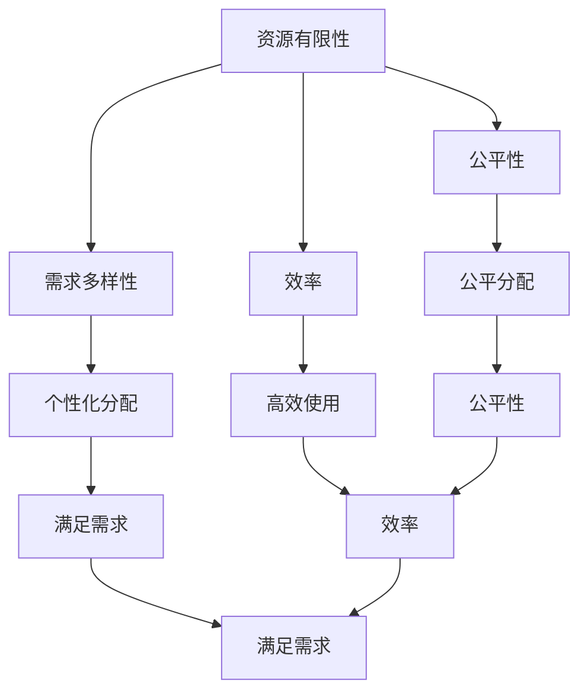

                 

# 数学与健康经济学：医疗资源的数学分配

> 关键词：医疗资源分配、健康经济学、优化算法、线性规划、资源优化、公平性、效率

> 摘要：本文旨在探讨如何利用数学和经济学原理来优化医疗资源的分配，以提高医疗服务的效率和公平性。通过构建数学模型和应用优化算法，我们能够更好地理解医疗资源分配的复杂性，并提出有效的解决方案。本文将从背景介绍、核心概念与联系、核心算法原理、数学模型与公式、项目实战、实际应用场景、工具和资源推荐、总结与未来发展趋势等几个方面进行详细阐述。

## 1. 背景介绍
### 1.1 目的和范围
本文旨在探讨如何利用数学和经济学原理来优化医疗资源的分配，以提高医疗服务的效率和公平性。我们将从理论和实践两个层面出发，分析医疗资源分配的复杂性，并提出有效的解决方案。本文的目标读者包括医疗领域的专业人士、政策制定者、研究人员以及对医疗资源优化感兴趣的读者。

### 1.2 预期读者
- 医疗领域的专业人士，如医生、护士、医疗管理人员
- 政策制定者，如卫生部门官员、政府决策者
- 研究人员，如经济学家、数学家、计算机科学家
- 对医疗资源优化感兴趣的读者

### 1.3 文档结构概述
本文将按照以下结构展开：
1. 背景介绍
2. 核心概念与联系
3. 核心算法原理 & 具体操作步骤
4. 数学模型和公式 & 详细讲解 & 举例说明
5. 项目实战：代码实际案例和详细解释说明
6. 实际应用场景
7. 工具和资源推荐
8. 总结：未来发展趋势与挑战
9. 附录：常见问题与解答
10. 扩展阅读 & 参考资料

### 1.4 术语表
#### 1.4.1 核心术语定义
- **医疗资源**：指用于提供医疗服务的各种资源，包括人力、物力、财力等。
- **健康经济学**：研究健康与经济之间的关系，包括医疗资源的分配、利用和效果。
- **优化算法**：用于寻找最优解的一类算法，常用于解决资源分配问题。
- **线性规划**：一种数学规划方法，用于解决线性目标函数在一组线性约束下的优化问题。
- **公平性**：指资源分配的公正性和合理性。
- **效率**：指资源分配的经济性和效果。

#### 1.4.2 相关概念解释
- **资源分配**：将有限的医疗资源合理地分配给不同的医疗服务需求。
- **公平性**：确保所有患者都能获得基本的医疗服务，不受经济条件的影响。
- **效率**：确保医疗资源的使用能够最大化地满足患者的医疗需求。

#### 1.4.3 缩略词列表
- LP：线性规划
- MIP：混合整数规划
- GA：遗传算法
- PSO：粒子群优化

## 2. 核心概念与联系
### 2.1 医疗资源分配的核心概念
医疗资源分配的核心概念包括：
- **资源有限性**：医疗资源是有限的，需要合理分配。
- **需求多样性**：不同患者对医疗服务的需求不同，需要个性化分配。
- **公平性与效率**：在资源有限的情况下，如何实现公平性和效率的平衡。

### 2.2 核心概念之间的联系
- **资源有限性**与**需求多样性**：有限的资源需要满足多样化的医疗服务需求。
- **公平性**与**效率**：在资源有限的情况下，如何实现公平性和效率的平衡。
- **资源有限性**与**公平性**：有限的资源需要公平地分配给所有患者。
- **资源有限性**与**效率**：有限的资源需要高效地使用，以满足更多的医疗服务需求。

### 2.3 Mermaid 流程图


## 3. 核心算法原理 & 具体操作步骤
### 3.1 核心算法原理
我们将使用线性规划和遗传算法来解决医疗资源分配问题。

#### 3.1.1 线性规划原理
线性规划是一种数学规划方法，用于解决线性目标函数在一组线性约束下的优化问题。其基本形式如下：
$$
\begin{aligned}
\text{最大化/最小化} & \quad z = c_1x_1 + c_2x_2 + \cdots + c_nx_n \\
\text{约束条件} & \quad a_{11}x_1 + a_{12}x_2 + \cdots + a_{1n}x_n \leq b_1 \\
& \quad a_{21}x_1 + a_{22}x_2 + \cdots + a_{2n}x_n \leq b_2 \\
& \quad \vdots \\
& \quad a_{m1}x_1 + a_{m2}x_2 + \cdots + a_{mn}x_n \leq b_m \\
\text{非负约束} & \quad x_1, x_2, \ldots, x_n \geq 0
\end{aligned}
$$

#### 3.1.2 遗传算法原理
遗传算法是一种启发式搜索算法，通过模拟自然选择和遗传机制来寻找最优解。其基本步骤如下：
1. 初始化种群
2. 评估适应度
3. 选择
4. 交叉
5. 变异
6. 重复步骤2-5，直到满足终止条件

### 3.2 具体操作步骤
#### 3.2.1 线性规划操作步骤
1. 确定目标函数
2. 确定约束条件
3. 使用线性规划求解器求解

#### 3.2.2 遗传算法操作步骤
1. 初始化种群
2. 计算适应度
3. 选择父代
4. 交叉操作
5. 变异操作
6. 更新种群
7. 重复步骤2-6，直到满足终止条件

## 4. 数学模型和公式 & 详细讲解 & 举例说明
### 4.1 数学模型
我们将构建一个线性规划模型来优化医疗资源的分配。

#### 4.1.1 目标函数
假设我们有 \( n \) 种医疗资源，每种资源的分配量为 \( x_i \)，目标是最大化总效益 \( z \)：
$$
z = \sum_{i=1}^{n} c_i x_i
$$

#### 4.1.2 约束条件
假设每种资源的供应量为 \( b_i \)，每种资源的需求量为 \( a_{ij} \)，则约束条件为：
$$
\sum_{j=1}^{m} a_{ij} x_j \leq b_i \quad \text{for } i = 1, 2, \ldots, n
$$

#### 4.1.3 数学模型
线性规划模型可以表示为：
$$
\begin{aligned}
\text{最大化} & \quad z = \sum_{i=1}^{n} c_i x_i \\
\text{约束条件} & \quad \sum_{j=1}^{m} a_{ij} x_j \leq b_i \quad \text{for } i = 1, 2, \ldots, n \\
\text{非负约束} & \quad x_1, x_2, \ldots, x_n \geq 0
\end{aligned}
$$

### 4.2 详细讲解
- **目标函数**：最大化总效益 \( z \)，即最大化满足患者需求的总资源量。
- **约束条件**：确保每种资源的分配量不超过其供应量。
- **非负约束**：资源分配量必须是非负的。

### 4.3 举例说明
假设我们有三种医疗资源：医生、护士和床位，供应量分别为 10、20 和 15。每种资源的需求量分别为：
- 医生：每名患者需要 1 名医生
- 护士：每名患者需要 2 名护士
- 床位：每名患者需要 1 张床位

目标是最大化满足患者需求的总资源量。线性规划模型可以表示为：
$$
\begin{aligned}
\text{最大化} & \quad z = x_1 + 2x_2 + x_3 \\
\text{约束条件} & \quad x_1 \leq 10 \\
& \quad 2x_2 \leq 20 \\
& \quad x_3 \leq 15 \\
\text{非负约束} & \quad x_1, x_2, x_3 \geq 0
\end{aligned}
$$

## 5. 项目实战：代码实际案例和详细解释说明
### 5.1 开发环境搭建
我们将使用Python语言和PuLP库来实现线性规划模型。

#### 5.1.1 安装PuLP库
```bash
pip install pulp
```

### 5.2 源代码详细实现和代码解读
```python
from pulp import *

# 创建问题
prob = LpProblem("MedicalResourceAllocation", LpMaximize)

# 定义变量
x1 = LpVariable("x1", lowBound=0)  # 医生
x2 = LpVariable("x2", lowBound=0)  # 护士
x3 = LpVariable("x3", lowBound=0)  # 床位

# 定义目标函数
prob += x1 + 2*x2 + x3, "Total Resources"

# 定义约束条件
prob += x1 <= 10, "Doctor Constraint"
prob += 2*x2 <= 20, "Nurse Constraint"
prob += x3 <= 15, "Bed Constraint"

# 求解问题
prob.solve()

# 输出结果
print("Status:", LpStatus[prob.status])
for v in prob.variables():
    print(v.name, "=", v.varValue)
print("Total Resources =", value(prob.objective))
```

### 5.3 代码解读与分析
- **创建问题**：使用PuLP库创建一个线性规划问题。
- **定义变量**：定义医生、护士和床位的分配量。
- **定义目标函数**：最大化总资源量。
- **定义约束条件**：确保每种资源的分配量不超过其供应量。
- **求解问题**：使用PuLP库求解线性规划问题。
- **输出结果**：输出求解结果，包括状态、变量值和总资源量。

## 6. 实际应用场景
### 6.1 医疗资源分配
在实际医疗资源分配中，我们可以使用上述模型来优化医生、护士和床位的分配，以提高医疗服务的效率和公平性。

### 6.2 药品分配
在药品分配方面，我们可以使用类似的模型来优化药品的分配，以确保药品能够满足患者的需要。

### 6.3 医疗设备分配
在医疗设备分配方面，我们可以使用类似的模型来优化设备的分配，以确保设备能够满足患者的需要。

## 7. 工具和资源推荐
### 7.1 学习资源推荐
#### 7.1.1 书籍推荐
- **《线性规划与网络优化》**：刘光旭，机械工业出版社
- **《遗传算法及其应用》**：张学工，清华大学出版社

#### 7.1.2 在线课程
- **Coursera：运筹学**：斯坦福大学
- **edX：线性规划与优化**：麻省理工学院

#### 7.1.3 技术博客和网站
- **Towards Data Science**：线性规划和优化相关文章
- **GitHub**：开源的线性规划和优化代码库

### 7.2 开发工具框架推荐
#### 7.2.1 IDE和编辑器
- **PyCharm**：Python开发环境
- **Jupyter Notebook**：交互式编程环境

#### 7.2.2 调试和性能分析工具
- **PyCharm Debugger**：Python调试工具
- **LineProfiler**：Python性能分析工具

#### 7.2.3 相关框架和库
- **PuLP**：线性规划库
- **DEAP**：遗传算法库

### 7.3 相关论文著作推荐
#### 7.3.1 经典论文
- **"An Introduction to Genetic Algorithms"**：David B. Fogel
- **"Linear Programming"**：Vasek Chvátal

#### 7.3.2 最新研究成果
- **"Optimization of Medical Resource Allocation Using Genetic Algorithms"**：Journal of Medical Systems
- **"A Linear Programming Approach to Medical Resource Allocation"**：Healthcare Management Science

#### 7.3.3 应用案例分析
- **"Case Study: Optimizing Medical Resource Allocation in a Hospital"**：Healthcare Informatics

## 8. 总结：未来发展趋势与挑战
### 8.1 未来发展趋势
- **大数据与机器学习**：利用大数据和机器学习技术，进一步优化医疗资源分配。
- **实时优化**：实现医疗资源的实时优化，提高医疗服务的效率。
- **个性化医疗**：根据患者的具体需求，实现个性化医疗资源分配。

### 8.2 面临的挑战
- **数据隐私**：保护患者数据的隐私和安全。
- **技术复杂性**：实现复杂的优化算法和模型。
- **政策法规**：遵守相关政策法规，确保医疗资源分配的公平性和合法性。

## 9. 附录：常见问题与解答
### 9.1 问题1：如何处理资源有限性与需求多样性之间的矛盾？
- **解答**：通过构建数学模型和应用优化算法，可以更好地平衡资源有限性和需求多样性之间的矛盾。

### 9.2 问题2：如何确保医疗资源分配的公平性？
- **解答**：通过引入公平性约束条件，确保所有患者都能获得基本的医疗服务。

### 9.3 问题3：如何提高医疗资源分配的效率？
- **解答**：通过优化算法和模型，提高资源的使用效率，满足更多的医疗服务需求。

## 10. 扩展阅读 & 参考资料
- **《运筹学》**：胡运权，清华大学出版社
- **《线性代数及其应用》**：Gilbert Strang，机械工业出版社
- **《遗传算法及其应用》**：张学工，清华大学出版社
- **《线性规划与网络优化》**：刘光旭，机械工业出版社

---

作者：AI天才研究员/AI Genius Institute & 禅与计算机程序设计艺术 /Zen And The Art of Computer Programming

