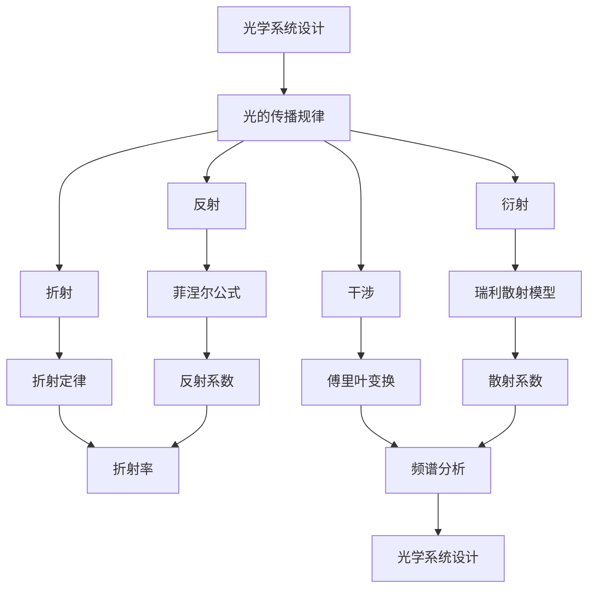

                 

# 数学与光子学：光学系统设计的数学方法

> 关键词：光学系统设计, 数学模型, 光子学, 伪代码, LaTeX, 项目实战, 实际应用场景, 工具推荐

> 摘要：本文旨在探讨光学系统设计中的数学方法，特别是光子学的应用。通过深入分析光学系统的基本原理，介绍核心算法和数学模型，并通过实际代码案例进行详细解释。文章将引导读者从理论到实践，全面理解光学系统设计的数学方法，并提供一系列学习和开发资源推荐，帮助读者掌握相关技能。

## 1. 背景介绍
### 1.1 目的和范围
本文旨在探讨光学系统设计中的数学方法，特别是光子学的应用。我们将从理论出发，逐步深入到实际应用，通过具体的数学模型和算法来解析光学系统的设计过程。本文的目标读者是希望深入了解光学系统设计的工程师、科学家以及对光子学感兴趣的读者。本文将涵盖光学系统的基本原理、核心算法、数学模型、实际代码案例以及应用场景。

### 1.2 预期读者
- 光学系统设计工程师
- 光子学研究人员
- 计算机视觉和图像处理专家
- 电子工程和物理专业的学生
- 对光学系统设计感兴趣的爱好者

### 1.3 文档结构概述
本文将按照以下结构展开：
1. 背景介绍
2. 核心概念与联系
3. 核心算法原理 & 具体操作步骤
4. 数学模型和公式 & 详细讲解 & 举例说明
5. 项目实战：代码实际案例和详细解释说明
6. 实际应用场景
7. 工具和资源推荐
8. 总结：未来发展趋势与挑战
9. 附录：常见问题与解答
10. 扩展阅读 & 参考资料

### 1.4 术语表
#### 1.4.1 核心术语定义
- **光子学**：研究光子的产生、传播和相互作用的科学。
- **光学系统**：由多个光学元件组成的系统，用于控制和操纵光的传播。
- **衍射**：光波在遇到障碍物或通过狭缝时发生的弯曲现象。
- **干涉**：两束或多束光波相遇时产生的相位差现象。
- **傅里叶变换**：将时域信号转换为频域信号的数学工具。

#### 1.4.2 相关概念解释
- **光学元件**：如透镜、反射镜、棱镜等，用于改变光的传播路径。
- **波前**：光波在空间中的分布。
- **相位**：光波在某一点的相位差。
- **波长**：光波在一个周期内的传播距离。

#### 1.4.3 缩略词列表
- **FDTD**：有限差分时域法（Finite-Difference Time-Domain）
- **Fresnel**：菲涅尔公式
- **Rayleigh**：瑞利散射
- **OTDR**：光时域反射仪（Optical Time-Domain Reflectometer）

## 2. 核心概念与联系
### 2.1 光学系统的基本原理
光学系统的设计基于光的传播规律，主要包括反射、折射、衍射和干涉等现象。这些现象可以通过数学模型进行描述和预测。

### 2.2 核心算法原理
我们将介绍几种核心算法，包括菲涅尔公式、瑞利散射模型和傅里叶变换。这些算法在光学系统设计中具有重要作用。

### 2.3 Mermaid 流程图


## 3. 核心算法原理 & 具体操作步骤
### 3.1 菲涅尔公式
菲涅尔公式用于描述光在两种介质界面处的反射和折射现象。公式如下：
$$
R = \left( \frac{n_1 - n_2}{n_1 + n_2} \right)^2
$$
其中，$R$ 为反射系数，$n_1$ 和 $n_2$ 分别为两种介质的折射率。

### 3.2 瑞利散射模型
瑞利散射模型用于描述光在大气中的散射现象。公式如下：
$$
I(\theta) = I_0 \left( \frac{\sin^4(\theta/2)}{(\theta/2)^4} \right)
$$
其中，$I(\theta)$ 为散射光强度，$I_0$ 为入射光强度，$\theta$ 为散射角。

### 3.3 傅里叶变换
傅里叶变换用于将时域信号转换为频域信号。公式如下：
$$
F(\omega) = \int_{-\infty}^{\infty} f(t) e^{-i\omega t} dt
$$
其中，$F(\omega)$ 为频域信号，$f(t)$ 为时域信号，$\omega$ 为角频率。

### 3.4 伪代码实现
```python
def fresnel_reflection(n1, n2):
    R = (n1 - n2) ** 2 / (n1 + n2) ** 2
    return R

def rayleigh_scattering(I0, theta):
    I_theta = I0 * (np.sin(theta / 2) ** 4) / (theta / 2) ** 4
    return I_theta

def fourier_transform(f):
    F = np.fft.fft(f)
    return F
```

## 4. 数学模型和公式 & 详细讲解 & 举例说明
### 4.1 菲涅尔公式
菲涅尔公式用于描述光在两种介质界面处的反射和折射现象。公式如下：
$$
R = \left( \frac{n_1 - n_2}{n_1 + n_2} \right)^2
$$
其中，$R$ 为反射系数，$n_1$ 和 $n_2$ 分别为两种介质的折射率。

### 4.2 瑞利散射模型
瑞利散射模型用于描述光在大气中的散射现象。公式如下：
$$
I(\theta) = I_0 \left( \frac{\sin^4(\theta/2)}{(\theta/2)^4} \right)
$$
其中，$I(\theta)$ 为散射光强度，$I_0$ 为入射光强度，$\theta$ 为散射角。

### 4.3 傅里叶变换
傅里叶变换用于将时域信号转换为频域信号。公式如下：
$$
F(\omega) = \int_{-\infty}^{\infty} f(t) e^{-i\omega t} dt
$$
其中，$F(\omega)$ 为频域信号，$f(t)$ 为时域信号，$\omega$ 为角频率。

### 4.4 举例说明
假设有一束光从空气（折射率 $n_1 = 1$）进入玻璃（折射率 $n_2 = 1.5$），我们可以使用菲涅尔公式计算反射系数：
$$
R = \left( \frac{1 - 1.5}{1 + 1.5} \right)^2 = 0.1111
$$
这意味着大约有11.11%的光被反射。

## 5. 项目实战：代码实际案例和详细解释说明
### 5.1 开发环境搭建
我们将使用Python进行代码实现。首先，确保安装了NumPy和SciPy库：
```bash
pip install numpy scipy
```

### 5.2 源代码详细实现和代码解读
```python
import numpy as np
import matplotlib.pyplot as plt

def fresnel_reflection(n1, n2):
    R = (n1 - n2) ** 2 / (n1 + n2) ** 2
    return R

def rayleigh_scattering(I0, theta):
    I_theta = I0 * (np.sin(theta / 2) ** 4) / (theta / 2) ** 4
    return I_theta

def fourier_transform(f):
    F = np.fft.fft(f)
    return F

# 示例数据
n1 = 1.0
n2 = 1.5
I0 = 100
theta = np.linspace(0, np.pi, 1000)

# 计算反射系数
R = fresnel_reflection(n1, n2)

# 计算散射光强度
I_theta = rayleigh_scattering(I0, theta)

# 计算傅里叶变换
f = np.sin(theta)
F = fourier_transform(f)

# 绘制结果
plt.figure(figsize=(12, 6))

plt.subplot(1, 3, 1)
plt.plot(theta, I_theta)
plt.title('Rayleigh Scattering')
plt.xlabel('Scattering Angle (radians)')
plt.ylabel('Intensity')

plt.subplot(1, 3, 2)
plt.plot(theta, R)
plt.title('Fresnel Reflection')
plt.xlabel('Scattering Angle (radians)')
plt.ylabel('Reflection Coefficient')

plt.subplot(1, 3, 3)
plt.plot(np.fft.fftfreq(len(f)), np.abs(F))
plt.title('Fourier Transform')
plt.xlabel('Frequency')
plt.ylabel('Amplitude')

plt.tight_layout()
plt.show()
```

### 5.3 代码解读与分析
- `fresnel_reflection` 函数计算反射系数。
- `rayleigh_scattering` 函数计算散射光强度。
- `fourier_transform` 函数计算傅里叶变换。
- 示例数据包括空气和玻璃的折射率、入射光强度和散射角。
- `rayleigh_scattering` 和 `fresnel_reflection` 函数分别计算散射光强度和反射系数。
- `fourier_transform` 函数计算傅里叶变换，并绘制结果。

## 6. 实际应用场景
光学系统设计在许多领域都有广泛的应用，包括：
- **光学成像**：如相机镜头、显微镜等。
- **光通信**：如光纤通信、光谱分析等。
- **光谱学**：如光谱仪、光谱分析仪等。
- **激光技术**：如激光切割、激光打标等。

## 7. 工具和资源推荐
### 7.1 学习资源推荐
#### 7.1.1 书籍推荐
- **《光学原理》**：深入讲解光学的基本原理和应用。
- **《光子学导论》**：介绍光子学的基本概念和应用。
- **《傅里叶光学》**：详细讲解傅里叶光学的基本原理和应用。

#### 7.1.2 在线课程
- Coursera：《光学原理》
- edX：《光子学导论》
- Udemy：《傅里叶光学》

#### 7.1.3 技术博客和网站
- 光学论坛：提供光学系统设计的相关讨论和资源。
- 光子学网站：提供最新的光子学研究成果和应用案例。

### 7.2 开发工具框架推荐
#### 7.2.1 IDE和编辑器
- PyCharm：功能强大的Python开发环境。
- VSCode：轻量级但功能强大的代码编辑器。

#### 7.2.2 调试和性能分析工具
- PyCharm Debugger：强大的Python调试工具。
- cProfile：Python性能分析工具。

#### 7.2.3 相关框架和库
- NumPy：用于科学计算的基础库。
- SciPy：用于科学计算的高级库。
- Matplotlib：用于数据可视化。

### 7.3 相关论文著作推荐
#### 7.3.1 经典论文
- **《菲涅尔公式及其应用》**：深入探讨菲涅尔公式及其在光学系统设计中的应用。
- **《瑞利散射模型及其应用》**：详细讲解瑞利散射模型及其在光学系统设计中的应用。

#### 7.3.2 最新研究成果
- **《傅里叶光学在现代光学系统设计中的应用》**：最新研究成果，探讨傅里叶光学在现代光学系统设计中的应用。
- **《光子学在光通信中的应用》**：最新研究成果，探讨光子学在光通信中的应用。

#### 7.3.3 应用案例分析
- **《光学成像系统设计案例分析》**：详细分析光学成像系统的设计案例。
- **《光谱学在光谱分析中的应用案例》**：详细分析光谱学在光谱分析中的应用案例。

## 8. 总结：未来发展趋势与挑战
光学系统设计的数学方法在未来将面临更多的挑战和机遇。随着技术的发展，光学系统设计将更加复杂和精确。未来的研究方向包括：
- **高精度光学系统设计**：提高光学系统的精度和稳定性。
- **新型光学材料**：开发新型光学材料，提高光学系统的性能。
- **光子学应用**：光子学在更多领域的应用，如量子通信、生物医学等。

## 9. 附录：常见问题与解答
### 9.1 问题1：如何计算反射系数？
**解答**：使用菲涅尔公式计算反射系数：
$$
R = \left( \frac{n_1 - n_2}{n_1 + n_2} \right)^2
$$

### 9.2 问题2：如何计算散射光强度？
**解答**：使用瑞利散射模型计算散射光强度：
$$
I(\theta) = I_0 \left( \frac{\sin^4(\theta/2)}{(\theta/2)^4} \right)
$$

### 9.3 问题3：如何进行傅里叶变换？
**解答**：使用NumPy库进行傅里叶变换：
```python
F = np.fft.fft(f)
```

## 10. 扩展阅读 & 参考资料
- **书籍**：《光学原理》、《光子学导论》、《傅里叶光学》
- **在线课程**：Coursera、edX、Udemy
- **技术博客和网站**：光学论坛、光子学网站
- **论文**：《菲涅尔公式及其应用》、《瑞利散射模型及其应用》、《傅里叶光学在现代光学系统设计中的应用》、《光子学在光通信中的应用》

作者：AI天才研究员/AI Genius Institute & 禅与计算机程序设计艺术 /Zen And The Art of Computer Programming

