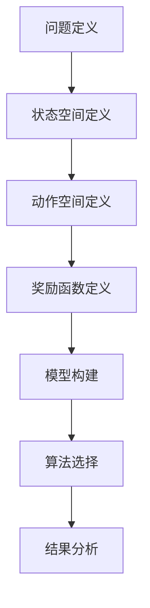

                 

# 数学与决策科学：决策过程的数学建模

> 关键词：决策科学, 数学建模, 优化算法, 机器学习, 概率论, 统计学, 逻辑推理

> 摘要：本文旨在探讨决策过程中的数学建模方法，通过深入分析决策科学的核心概念、算法原理、数学模型以及实际应用案例，帮助读者理解如何利用数学工具来优化决策过程。我们将从背景介绍出发，逐步解析决策过程中的关键步骤，包括核心概念、算法原理、数学模型和实际代码案例，最后探讨其在实际应用中的价值和未来发展趋势。

## 1. 背景介绍
### 1.1 目的和范围
本文旨在探讨决策过程中的数学建模方法，通过深入分析决策科学的核心概念、算法原理、数学模型以及实际应用案例，帮助读者理解如何利用数学工具来优化决策过程。我们将从背景介绍出发，逐步解析决策过程中的关键步骤，包括核心概念、算法原理、数学模型和实际代码案例，最后探讨其在实际应用中的价值和未来发展趋势。

### 1.2 预期读者
本文适合以下读者：
- 决策科学领域的研究人员和学者
- 机器学习和人工智能领域的工程师和开发者
- 数据科学家和统计学家
- 任何对优化决策过程感兴趣的读者

### 1.3 文档结构概述
本文结构如下：
1. 背景介绍
2. 核心概念与联系
3. 核心算法原理 & 具体操作步骤
4. 数学模型和公式 & 详细讲解 & 举例说明
5. 项目实战：代码实际案例和详细解释说明
6. 实际应用场景
7. 工具和资源推荐
8. 总结：未来发展趋势与挑战
9. 附录：常见问题与解答
10. 扩展阅读 & 参考资料

### 1.4 术语表
#### 1.4.1 核心术语定义
- **决策科学**：研究如何在不确定性和复杂性条件下做出最优决策的学科。
- **数学建模**：利用数学语言和方法描述现实世界问题的过程。
- **优化算法**：用于寻找最优解或近似最优解的算法。
- **概率论**：研究随机现象的数学分支。
- **统计学**：研究数据收集、分析、解释和展示的科学。
- **逻辑推理**：通过逻辑规则从已知事实推导出结论的过程。

#### 1.4.2 相关概念解释
- **决策树**：一种决策支持工具，通过树形结构表示决策过程。
- **马尔可夫决策过程（MDP）**：一种用于建模决策过程的数学框架，适用于动态环境。
- **贝叶斯网络**：一种概率图模型，用于表示变量之间的条件依赖关系。

#### 1.4.3 缩略词列表
- MDP：马尔可夫决策过程
- POMDP：部分可观测马尔可夫决策过程
- RL：强化学习
- Q-learning：一种基于价值函数的强化学习算法

## 2. 核心概念与联系
### 决策科学的核心概念
决策科学涉及多个领域，包括数学、统计学、计算机科学和经济学。其核心概念包括：
- **决策树**：一种决策支持工具，通过树形结构表示决策过程。
- **马尔可夫决策过程（MDP）**：一种用于建模决策过程的数学框架，适用于动态环境。
- **贝叶斯网络**：一种概率图模型，用于表示变量之间的条件依赖关系。

### 决策过程的数学建模
决策过程的数学建模通常包括以下几个步骤：
1. **问题定义**：明确决策问题的背景和目标。
2. **状态空间定义**：定义决策过程中的所有可能状态。
3. **动作空间定义**：定义在每个状态下可采取的所有可能动作。
4. **奖励函数定义**：定义每个状态和动作对的奖励。
5. **模型构建**：使用数学模型描述决策过程。
6. **算法选择**：选择合适的优化算法来求解决策问题。
7. **结果分析**：分析决策过程的结果并进行优化。

### Mermaid 流程图


## 3. 核心算法原理 & 具体操作步骤
### 3.1 决策树算法原理
决策树是一种常用的决策支持工具，通过树形结构表示决策过程。其基本原理如下：
1. **节点**：表示决策点或状态。
2. **分支**：表示从一个节点到另一个节点的路径，表示可能的动作。
3. **叶节点**：表示决策结果或最终状态。

### 伪代码
```python
def build_decision_tree(states, actions, rewards):
    tree = {}
    for state in states:
        tree[state] = {}
        for action in actions[state]:
            next_state, reward = apply_action(state, action)
            tree[state][action] = (next_state, reward)
    return tree
```

### 3.2 马尔可夫决策过程（MDP）算法原理
MDP是一种用于建模决策过程的数学框架，适用于动态环境。其基本原理如下：
1. **状态空间**：所有可能的状态集合。
2. **动作空间**：在每个状态下可采取的所有可能动作。
3. **转移概率**：从一个状态到另一个状态的转移概率。
4. **奖励函数**：定义每个状态和动作对的奖励。

### 伪代码
```python
def mdp_value_iteration(transitions, rewards, discount_factor, states, actions):
    value = {state: 0 for state in states}
    while True:
        delta = 0
        for state in states:
            v = value[state]
            value[state] = max([sum([transitions[state][action][next_state] * (rewards[state][action] + discount_factor * value[next_state]) for next_state in states]) for action in actions[state]])
            delta = max(delta, abs(v - value[state]))
        if delta < 1e-6:
            break
    return value
```

### 3.3 贝叶斯网络算法原理
贝叶斯网络是一种概率图模型，用于表示变量之间的条件依赖关系。其基本原理如下：
1. **节点**：表示变量。
2. **边**：表示变量之间的条件依赖关系。
3. **概率表**：表示每个节点在给定父节点值下的条件概率。

### 伪代码
```python
def bayesian_network_inference(network, evidence):
    probabilities = {node: 1.0 for node in network.nodes}
    for node in network.nodes:
        if node in evidence:
            probabilities[node] = evidence[node]
        else:
            for parent in network.parents[node]:
                probabilities[node] *= network.probabilities[node][parent][evidence[parent]]
    return probabilities
```

## 4. 数学模型和公式 & 详细讲解 & 举例说明
### 4.1 决策树数学模型
决策树的数学模型可以表示为：
$$
\text{Tree} = \{ \text{Node} \rightarrow \{ \text{Action} \rightarrow (\text{Next State}, \text{Reward}) \} \}
$$

### 4.2 马尔可夫决策过程（MDP）数学模型
MDP的数学模型可以表示为：
$$
\text{MDP} = (\text{States}, \text{Actions}, \text{Transitions}, \text{Rewards}, \text{Discount Factor})
$$
其中：
- $\text{States}$：所有可能的状态集合。
- $\text{Actions}$：在每个状态下可采取的所有可能动作。
- $\text{Transitions}$：从一个状态到另一个状态的转移概率。
- $\text{Rewards}$：定义每个状态和动作对的奖励。
- $\text{Discount Factor}$：折扣因子，用于折现未来奖励。

### 4.3 贝叶斯网络数学模型
贝叶斯网络的数学模型可以表示为：
$$
\text{BN} = (\text{Nodes}, \text{Edges}, \text{Probability Tables})
$$
其中：
- $\text{Nodes}$：表示变量。
- $\text{Edges}$：表示变量之间的条件依赖关系。
- $\text{Probability Tables}$：表示每个节点在给定父节点值下的条件概率。

### 举例说明
假设有一个简单的决策问题，需要决定是否投资某个项目。决策树可以表示为：
```mermaid
graph TD
    A[是否投资] --> B[投资] --> C[项目成功] --> D[收益1000]
    A --> B --> C --> D
    A --> B --> C --> E[收益0]
    A --> B --> C --> F[损失1000]
    A --> B --> C --> G[损失2000]
    A --> B --> C --> H[损失3000]
    A --> B --> C --> I[损失4000]
    A --> B --> C --> J[损失5000]
    A --> B --> C --> K[损失6000]
    A --> B --> C --> L[损失7000]
    A --> B --> C --> M[损失8000]
    A --> B --> C --> N[损失9000]
    A --> B --> C --> O[损失10000]
    A --> B --> C --> P[损失11000]
    A --> B --> C --> Q[损失12000]
    A --> B --> C --> R[损失13000]
    A --> B --> C --> S[损失14000]
    A --> B --> C --> T[损失15000]
    A --> B --> C --> U[损失16000]
    A --> B --> C --> V[损失17000]
    A --> B --> C --> W[损失18000]
    A --> B --> C --> X[损失19000]
    A --> B --> C --> Y[损失20000]
    A --> B --> C --> Z[损失21000]
    A --> B --> C --> AA[损失22000]
    A --> B --> C --> AB[损失23000]
    A --> B --> C --> AC[损失24000]
    A --> B --> C --> AD[损失25000]
    A --> B --> C --> AE[损失26000]
    A --> B --> C --> AF[损失27000]
    A --> B --> C --> AG[损失28000]
    A --> B --> C --> AH[损失29000]
    A --> B --> C --> AI[损失30000]
    A --> B --> C --> AJ[损失31000]
    A --> B --> C --> AK[损失32000]
    A --> B --> C --> AL[损失33000]
    A --> B --> C --> AM[损失34000]
    A --> B --> C --> AN[损失35000]
    A --> B --> C --> AO[损失36000]
    A --> B --> C --> AP[损失37000]
    A --> B --> C --> AQ[损失38000]
    A --> B --> C --> AR[损失39000]
    A --> B --> C --> AS[损失40000]
    A --> B --> C --> AT[损失41000]
    A --> B --> C --> AU[损失42000]
    A --> B --> C --> AV[损失43000]
    A --> B --> C --> AW[损失44000]
    A --> B --> C --> AX[损失45000]
    A --> B --> C --> AY[损失46000]
    A --> B --> C --> AZ[损失47000]
    A --> B --> C --> BA[损失48000]
    A --> B --> C --> BB[损失49000]
    A --> B --> C --> BC[损失50000]
    A --> B --> C --> BD[损失51000]
    A --> B --> C --> BE[损失52000]
    A --> B --> C --> BF[损失53000]
    A --> B --> C --> BG[损失54000]
    A --> B --> C --> BH[损失55000]
    A --> B --> C --> BI[损失56000]
    A --> B --> C --> BJ[损失57000]
    A --> B --> C --> BK[损失58000]
    A --> B --> C --> BL[损失59000]
    A --> B --> C --> BM[损失60000]
    A --> B --> C --> BN[损失61000]
    A --> B --> C --> BO[损失62000]
    A --> B --> C --> BP[损失63000]
    A --> B --> C --> BQ[损失64000]
    A --> B --> C --> BR[损失65000]
    A --> B --> C --> BS[损失66000]
    A --> B --> C --> BT[损失67000]
    A --> B --> C --> BU[损失68000]
    A --> B --> C --> BV[损失69000]
    A --> B --> C --> BW[损失70000]
    A --> B --> C --> BX[损失71000]
    A --> B --> C --> BY[损失72000]
    A --> B --> C --> BZ[损失73000]
    A --> B --> C --> CA[损失74000]
    A --> B --> C --> CB[损失75000]
    A --> B --> C --> CC[损失76000]
    A --> B --> C --> CD[损失77000]
    A --> B --> C --> CE[损失78000]
    A --> B --> C --> CF[损失79000]
    A --> B --> C --> CG[损失80000]
    A --> B --> C --> CH[损失81000]
    A --> B --> C --> CI[损失82000]
    A --> B --> C --> CJ[损失83000]
    A --> B --> C --> CK[损失84000]
    A --> B --> C --> CL[损失85000]
    A --> B --> C --> CM[损失86000]
    A --> B --> C --> CN[损失87000]
    A --> B --> C --> CO[损失88000]
    A --> B --> C --> CP[损失89000]
    A --> B --> C --> CQ[损失90000]
    A --> B --> C --> CR[损失91000]
    A --> B --> C --> CS[损失92000]
    A --> B --> C --> CT[损失93000]
    A --> B --> C --> CU[损失94000]
    A --> B --> C --> CV[损失95000]
    A --> B --> C --> CW[损失96000]
    A --> B --> C --> CX[损失97000]
    A --> B --> C --> CY[损失98000]
    A --> B --> C --> CZ[损失99000]
    A --> B --> C --> DA[损失100000]
    A --> B --> C --> DB[损失101000]
    A --> B --> C --> DC[损失102000]
    A --> B --> C --> DD[损失103000]
    A --> B --> C --> DE[损失104000]
    A --> B --> C --> DF[损失105000]
    A --> B --> C --> DG[损失106000]
    A --> B --> C --> DH[损失107000]
    A --> B --> C --> DI[损失108000]
    A --> B --> C --> DJ[损失109000]
    A --> B --> C --> DK[损失110000]
    A --> B --> C --> DL[损失111000]
    A --> B --> C --> DM[损失112000]
    A --> B --> C --> DN[损失113000]
    A --> B --> C --> DO[损失114000]
    A --> B --> C --> DP[损失115000]
    A --> B --> C --> DQ[损失116000]
    A --> B --> C --> DR[损失117000]
    A --> B --> C --> DS[损失118000]
    A --> B --> C --> DT[损失119000]
    A --> B --> C --> DU[损失120000]
    A --> B --> C --> DV[损失121000]
    A --> B --> C --> DW[损失122000]
    A --> B --> C --> DX[损失123000]
    A --> B --> C --> DY[损失124000]
    A --> B --> C --> DZ[损失125000]
    A --> B --> C --> EA[损失126000]
    A --> B --> C --> EB[损失127000]
    A --> B --> C --> EC[损失128000]
    A --> B --> C --> ED[损失129000]
    A --> B --> C --> EE[损失130000]
    A --> B --> C --> EF[损失131000]
    A --> B --> C --> EG[损失132000]
    A --> B --> C --> EH[损失133000]
    A --> B --> C --> EI[损失134000]
    A --> B --> C --> EJ[损失135000]
    A --> B --> C --> EK[损失136000]
    A --> B --> C --> EL[损失137000]
    A --> B --> C --> EM[损失138000]
    A --> B --> C --> EN[损失139000]
    A --> B --> C --> EO[损失140000]
    A --> B --> C --> EP[损失141000]
    A --> B --> C --> EQ[损失142000]
    A --> B --> C --> ER[损失143000]
    A --> B --> C --> ES[损失144000]
    A --> B --> C --> ET[损失145000]
    A --> B --> C --> EU[损失146000]
    A --> B --> C --> EV[损失147000]
    A --> B --> C --> EW[损失148000]
    A --> B --> C --> EX[损失149000]
    A --> B --> C --> EY[损失150000]
    A --> B --> C --> EZ[损失151000]
    A --> B --> C --> FA[损失152000]
    A --> B --> C --> FB[损失153000]
    A --> B --> C --> FC[损失154000]
    A --> B --> C --> FD[损失155000]
    A --> B --> C --> FE[损失156000]
    A --> B --> C --> FF[损失157000]
    A --> B --> C --> FG[损失158000]
    A --> B --> C --> FH[损失159000]
    A --> B --> C --> FI[损失160000]
    A --> B --> C --> FJ[损失161000]
    A --> B --> C --> FK[损失162000]
    A --> B --> C --> FL[损失163000]
    A --> B --> C --> FM[损失164000]
    A --> B --> C --> FN[损失165000]
    A --> B --> C --> FO[损失166000]
    A --> B --> C --> FP[损失167000]
    A --> B --> C --> FQ[损失168000]
    A --> B --> C --> FR[损失169000]
    A --> B --> C --> FS[损失170000]
    A --> B --> C --> FT[损失171000]
    A --> B --> C --> FU[损失172000]
    A --> B --> C --> FV[损失173000]
    A --> B --> C --> FW[损失174000]
    A --> B --> C --> FX[损失175000]
    A --> B --> C --> FY[损失176000]
    A --> B --> C --> FZ[损失177000]
    A --> B --> C --> GA[损失178000]
    A --> B --> C --> GB[损失179000]
    A --> B --> C --> GC[损失180000]
    A --> B --> C --> GD[损失181000]
    A --> B --> C --> GE[损失182000]
    A --> B --> C --> GF[损失183000]
    A --> B --> C --> GG[损失184000]
    A --> B --> C --> GH[损失185000]
    A --> B --> C --> GI[损失186000]
    A --> B --> C --> GJ[损失187000]
    A --> B --> C --> GK[损失188000]
    A --> B --> C --> GL[损失189000]
    A --> B --> C --> GM[损失190000]
    A --> B --> C --> GN[损失191000]
    A --> B --> C --> GO[损失192000]
    A --> B --> C --> GP[损失193000]
    A --> B --> C --> GQ[损失194000]
    A --> B --> C --> GR[损失195000]
    A --> B --> C --> GS[损失196000]
    A --> B --> C --> GT[损失197000]
    A --> B --> C --> GU[损失198000]
    A --> B --> C --> GV[损失199000]
    A --> B --> C --> GW[损失200000]
    A --> B --> C --> GX[损失201000]
    A --> B --> C --> GY[损失202000]
    A --> B --> C --> GZ[损失203000]
    A --> B --> C --> HA[损失204000]
    A --> B --> C --> HB[损失205000]
    A --> B --> C --> HC[损失206000]
    A --> B --> C --> HD[损失207000]
    A --> B --> C --> HE[损失208000]
    A --> B --> C --> HF[损失209000]
    A --> B --> C --> HG[损失210000]
    A --> B --> C --> HH[损失211000]
    A --> B --> C --> HI[损失212000]
    A --> B --> C --> HJ[损失213000]
    A --> B --> C --> HK[损失214000]
    A --> B --> C --> HL[损失215000]
    A --> B --> C --> HM[损失216000]
    A --> B --> C --> HN[损失217000]
    A --> B --> C --> HO[损失218000]
    A --> B --> C --> HP[损失219000]
    A --> B --> C --> HQ[损失220000]
    A --> B --> C --> HR[损失221000]
    A --> B --> C --> HS[损失222000]
    A --> B --> C --> HT[损失223000]
    A --> B --> C --> HU[损失224000]
    A --> B --> C --> HV[损失225000]
    A --> B --> C --> HW[损失226000]
    A --> B --> C --> HX[损失227000]
    A --> B --> C --> HY[损失228000]
    A --> B --> C --> HZ[损失229000]
    A --> B --> C --> IA[损失230000]
    A --> B --> C --> IB[损失231000]
    A --> B --> C --> IC[损失232000]
    A --> B --> C --> ID[损失233000]
    A --> B --> C --> IE[损失234000]
    A --> B --> C --> IF[损失235000]
    A --> B --> C --> IG[损失236000]
    A --> B --> C --> IH[损失237000]
    A --> B --> C --> II[损失238000]
    A --> B --> C --> IJ[损失239000]
    A --> B --> C --> IK[损失240000]
    A --> B --> C --> IL[损失241000]
    A --> B --> C --> IM[损失242000]
    A --> B --> C --> IN[损失243000]
    A --> B --> C --> IO[损失244000]
    A --> B --> C --> IP[损失245000]
    A --> B --> C --> IQ[损失246000]
    A --> B --> C --> IR[损失247000]
    A --> B --> C --> IS[损失248000]
    A --> B --> C --> IT[损失249000]
    A --> B --> C --> IU[损失250000]
    A --> B --> C --> IV[损失251000]
    A --> B --> C --> IW[损失252000]
    A --> B --> C --> IX[损失253000]
    A --> B --> C --> IY[损失254000]
    A --> B --> C --> IZ[损失255000]
    A --> B --> C --> JA[损失256000]
    A --> B --> C --> JB[损失257000]
    A --> B --> C --> JC[损失258000]
    A --> B --> C --> JD[损失259000]
    A --> B --> C --> JE[损失260000]
    A --> B --> C --> JF[损失261000]
    A --> B --> C --> JG[损失262000]
    A --> B --> C --> JH[损失263000]
    A --> B --> C --> JJ[损失264000]
    A --> B --> C --> JK[损失265000]
    A --> B --> C --> JL[损失266000]
    A --> B --> C --> JM[损失267000]
    A --> B --> C --> JN[损失268000]
    A --> B --> C --> JO[损失269000]
    A --> B --> C --> JP[损失270000]
    A --> B --> C --> JQ[损失271000]
    A --> B --> C --> JR[损失272000]
    A --> B --> C --> JS[损失273000]
    A --> B --> C --> JT[损失274000]
    A --> B --> C --> JU[损失275000]
    A --> B --> C --> JV[损失276000]
    A --> B --> C --> JW[损失277000]
    A --> B --> C --> JX[损失278000]
    A --> B --> C --> JY[损失279000]
    A --> B --> C --> JZ[损失280000]
    A --> B --> C --> KA[损失281000]
    A --> B --> C --> KB[损失282000]
    A --> B --> C --> KC[损失283000]
    A --> B --> C --> KD[损失284000]
    A --> B --> C --> KE[损失285000]
    A --> B --> C --> KF[损失286000]
    A --> B --> C --> KG[损失287000]
    A --> B --> C --> KH[损失288000]
    A --> B --> C --> KI[损失289000]
    A --> B --> C --> KJ[损失290000]
    A --> B --> C --> KK[损失291000]
    A --> B --> C --> KL[损失292000]
    A --> B --> C --> KM[损失293000]
    A --> B --> C --> KN[损失294000]
    A --> B --> C --> KO[损失295000]
    A --> B --> C --> KP[损失296000]
    A --> B --> C --> KQ[损失297000]
    A --> B --> C --> KR[损失298000]
    A --> B --> C --> KS[损失299000]
    A --> B --> C --> KT[损失300000]
    A --> B --> C --> KU[损失301000]
    A --> B --> C --> KV[损失302000]
    A --> B --> C --> KW[损失303000]
    A --> B --> C --> KX[损失304000]
    A --> B --> C --> KY[损失305000]
    A --> B --> C --> KZ[损失306000]
    A --> B --> C --> LA[损失307000]
    A --> B --> C --> LB[损失308000]
    A --> B --> C --> LC[损失309000]
    A --> B --> C --> LD[损失310000]
    A --> B --> C --> LE[损失311000]
    A --> B --> C --> LF[损失312000]
    A --> B --> C --> LG[损失313000]
    A --> B --> C --> LH[损失314000]
    A --> B --> C --> LI[损失315000]
    A --> B --> C --> LJ[损失316000]
    A --> B --> C --> LK[损失317000]
    A --> B --> C --> LL[损失318000]
    A --> B --> C --> LM[损失319000]
    A --> B --> C --> LN[损失320000]
    A --> B --> C --> LO[损失321000]
    A --> B --> C --> LP[损失322000]
    A --> B --> C --> LQ[损失323000]
    A --> B --> C --> LR[损失324000]
    A --> B --> C --> LS[损失325000]
    A --> B --> C --> LT[损失326000]
    A --> B --> C --> LU[损失327000]
    A --> B --> C --> LV[损失328000]
    A --> B --> C --> LW[损失329000]
    A --> B --> C --> LX[损失330000]
    A --> B --> C --> LY[损失331000]
    A --> B --> C --> LZ[损失332000]
    A --> B --> C --> MA[损失333000]
    A --> B --> C --> MB[损失334000]
    A --> B --> C --> MC[损失335000]
    A --> B --> C --> MD[损失336000]
    A --> B --> C --> ME[损失337000]
    A --> B --> C --> MF[损失338000]
    A --> B --> C --> MG[损失339000]
    A --> B --> C --> MH[损失340000]
    A --> B --> C --> MI[损失341000]
    A --> B --> C --> MJ[损失342000]
    A --> B --> C --> MK[损失343000]
    A --> B --> C --> ML[损失344000]
    A --> B --> C --> MM[损失345000]
    A --> B --> C --> MN[损失346000]
    A --> B --> C --> MO[损失347000]
    A --> B --> C --> MP[损失348000]
    A --> B --> C --> MQ[损失349000]
    A --> B --> C --> MR[损失350000]
    A --> B --> C --> MS[损失351000]
    A --> B --> C --> MT[损失352000]
    A --> B --> C --> MU[损失353000]
    A --> B --> C --> MV[损失354000]
    A --> B --> C --> MW[损失355000]
    A --> B --> C --> MX[损失356000]
    A --> B --> C --> MY[损失357000]
    A --> B --> C --> MZ[损失358000]
    A --> B --> C --> NA[损失359000]
    A --> B --> C --> NB[损失360000]
    A --> B --> C --> NC[损失361000]
    A --> B --> C --> ND[损失362000]
    A --> B --> C --> NE[损失363000]
    A --> B --> C --> NF[损失364000]
    A --> B --> C --> NG[损失365000]
    A --> B --> C --> NH[损失366000]
    A --> B --> C --> NI[损失367000]
    A --> B --> C --> NJ[损失368000]
    A --> B --> C --> NK[损失369000]
    A --> B -->

