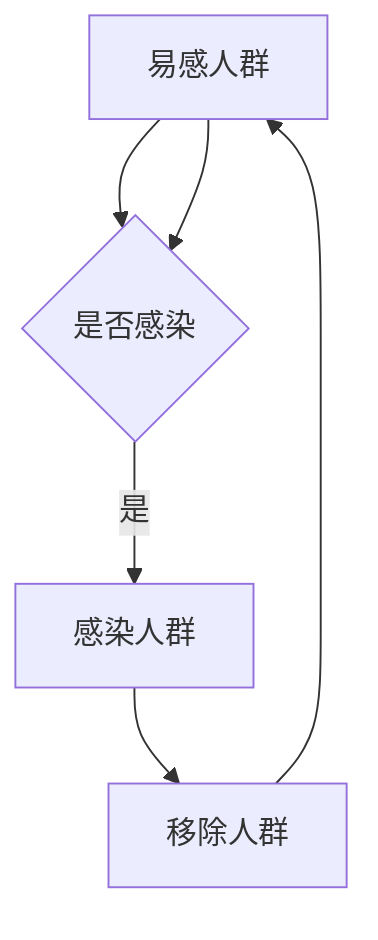

                 

# 数学与流行病学：疾病传播的数学预测

> 关键词：流行病学, 数学模型, 疾病传播, SIR模型, 传染病动力学, 伪代码, Python编程, 代码实现

> 摘要：本文旨在通过数学与流行病学的结合，探讨疾病传播的预测模型。我们将详细解释SIR模型的核心原理，并通过伪代码和Python代码实现来展示其具体操作步骤。此外，我们还将讨论实际应用场景，并推荐相关的学习资源和开发工具，帮助读者更好地理解和应用这些模型。

## 1. 背景介绍
### 1.1 目的和范围
本文的目标是通过数学模型来预测疾病传播的过程，特别是SIR模型。SIR模型是一种经典的传染病动力学模型，用于描述传染病在人群中的传播过程。本文将从理论到实践，逐步介绍SIR模型的原理、实现方法，并通过实际案例进行演示。

### 1.2 预期读者
本文适合以下读者：
- 对流行病学和传染病动力学感兴趣的科研人员
- 计算机科学和人工智能领域的工程师
- 公共卫生领域的专业人士
- 对数学建模和编程感兴趣的爱好者

### 1.3 文档结构概述
本文将按照以下结构展开：
1. 背景介绍
2. 核心概念与联系
3. 核心算法原理 & 具体操作步骤
4. 数学模型和公式 & 详细讲解 & 举例说明
5. 项目实战：代码实际案例和详细解释说明
6. 实际应用场景
7. 工具和资源推荐
8. 总结：未来发展趋势与挑战
9. 附录：常见问题与解答
10. 扩展阅读 & 参考资料

### 1.4 术语表
#### 1.4.1 核心术语定义
- **SIR模型**：一种经典的传染病动力学模型，用于描述传染病在人群中的传播过程。
- **S（Susceptible）**：易感人群，指未感染但可能被感染的人群。
- **I（Infected）**：感染人群，指已经感染并具有传染性的人群。
- **R（Removed）**：移除人群，指已经康复或死亡的人群。
- **传播率**：指单位时间内感染人群增加的比例。
- **恢复率**：指单位时间内移除人群增加的比例。

#### 1.4.2 相关概念解释
- **传染病动力学**：研究传染病在人群中的传播规律及其影响因素的学科。
- **微分方程**：描述系统变化的数学工具，常用于建模传染病传播过程。
- **数值解法**：通过计算机模拟微分方程的解，以预测传染病的传播过程。

#### 1.4.3 缩略词列表
- SIR：Susceptible-Infected-Removed
- ODE：Ordinary Differential Equation
- Numpy：Python科学计算库
- Matplotlib：Python绘图库

## 2. 核心概念与联系
### 流行病学与传染病动力学
流行病学是研究疾病在人群中的分布、传播规律及其预防控制的科学。传染病动力学则是流行病学的一个分支，专注于描述传染病在人群中的传播过程。SIR模型是传染病动力学中最经典的模型之一，它通过微分方程描述了易感人群、感染人群和移除人群的变化规律。

### SIR模型的流程图


## 3. 核心算法原理 & 具体操作步骤
### 核心算法原理
SIR模型通过微分方程描述传染病在人群中的传播过程。假设总人口数为N，易感人群数为S(t)，感染人群数为I(t)，移除人群数为R(t)，则SIR模型可以表示为以下微分方程组：
$$
\begin{cases}
\frac{dS}{dt} = -\beta \frac{S I}{N} \\
\frac{dI}{dt} = \beta \frac{S I}{N} - \gamma I \\
\frac{dR}{dt} = \gamma I
\end{cases}
$$
其中，$\beta$ 是传播率，$\gamma$ 是恢复率。

### 具体操作步骤
1. **初始化参数**：设定总人口数N，初始易感人群数S(0)，初始感染人群数I(0)，初始移除人群数R(0)，传播率$\beta$，恢复率$\gamma$。
2. **定义微分方程**：使用微分方程描述SIR模型。
3. **数值解法**：使用数值方法（如欧拉法或龙格-库塔法）求解微分方程。
4. **绘制结果**：绘制易感人群、感染人群和移除人群随时间的变化曲线。

### 伪代码
```python
# 初始化参数
N = 1000  # 总人口数
S0 = 999  # 初始易感人群数
I0 = 1    # 初始感染人群数
R0 = 0    # 初始移除人群数
beta = 0.3  # 传播率
gamma = 0.1  # 恢复率
t = 0  # 初始时间
dt = 0.1  # 时间步长
T = 100  # 总时间

# 初始化结果数组
S = [S0]
I = [I0]
R = [R0]

# 求解微分方程
for t in range(T):
    dS = -beta * S[-1] * I[-1] / N
    dI = beta * S[-1] * I[-1] / N - gamma * I[-1]
    dR = gamma * I[-1]
    S.append(S[-1] + dS * dt)
    I.append(I[-1] + dI * dt)
    R.append(R[-1] + dR * dt)

# 绘制结果
import matplotlib.pyplot as plt
plt.plot(S, label='Susceptible')
plt.plot(I, label='Infected')
plt.plot(R, label='Removed')
plt.xlabel('Time')
plt.ylabel('Population')
plt.legend()
plt.show()
```

## 4. 数学模型和公式 & 详细讲解 & 举例说明
### 数学模型
SIR模型的核心在于描述传染病在人群中的传播过程。通过微分方程组，我们可以精确地描述易感人群、感染人群和移除人群的变化规律。

### 公式详细讲解
- **传播率** $\beta$：表示单位时间内感染人群增加的比例。假设每个感染人群每天可以感染$\beta$个易感人群。
- **恢复率** $\gamma$：表示单位时间内移除人群增加的比例。假设每个感染人群每天有$\gamma$的概率康复或死亡。

### 举例说明
假设总人口数N=1000，初始易感人群数S(0)=999，初始感染人群数I(0)=1，初始移除人群数R(0)=0，传播率$\beta=0.3$，恢复率$\gamma=0.1$。通过上述伪代码，我们可以求解并绘制易感人群、感染人群和移除人群随时间的变化曲线。

## 5. 项目实战：代码实际案例和详细解释说明
### 5.1 开发环境搭建
- **Python版本**：Python 3.8
- **依赖库**：Numpy, Matplotlib

### 5.2 源代码详细实现和代码解读
```python
import numpy as np
import matplotlib.pyplot as plt

# 初始化参数
N = 1000  # 总人口数
S0 = 999  # 初始易感人群数
I0 = 1    # 初始感染人群数
R0 = 0    # 初始移除人群数
beta = 0.3  # 传播率
gamma = 0.1  # 恢复率
t = 0  # 初始时间
dt = 0.1  # 时间步长
T = 100  # 总时间

# 初始化结果数组
S = [S0]
I = [I0]
R = [R0]

# 求解微分方程
for t in range(T):
    dS = -beta * S[-1] * I[-1] / N
    dI = beta * S[-1] * I[-1] / N - gamma * I[-1]
    dR = gamma * I[-1]
    S.append(S[-1] + dS * dt)
    I.append(I[-1] + dI * dt)
    R.append(R[-1] + dR * dt)

# 绘制结果
plt.plot(S, label='Susceptible')
plt.plot(I, label='Infected')
plt.plot(R, label='Removed')
plt.xlabel('Time')
plt.ylabel('Population')
plt.legend()
plt.show()
```

### 5.3 代码解读与分析
- **初始化参数**：设定总人口数N，初始易感人群数S0，初始感染人群数I0，初始移除人群数R0，传播率$\beta$，恢复率$\gamma$，初始时间t，时间步长dt，总时间T。
- **初始化结果数组**：使用列表S, I, R分别存储易感人群、感染人群和移除人群的数量。
- **求解微分方程**：通过循环迭代求解微分方程，更新易感人群、感染人群和移除人群的数量。
- **绘制结果**：使用Matplotlib库绘制易感人群、感染人群和移除人群随时间的变化曲线。

## 6. 实际应用场景
SIR模型在公共卫生领域有着广泛的应用，例如：
- **疫情预测**：通过SIR模型预测疫情的发展趋势，为公共卫生政策提供依据。
- **疫苗接种策略**：通过模型分析不同疫苗接种策略的效果，优化疫苗接种计划。
- **疾病控制**：通过模型评估不同控制措施的效果，制定有效的疾病控制策略。

## 7. 工具和资源推荐
### 7.1 学习资源推荐
#### 7.1.1 书籍推荐
- 《流行病学原理》
- 《传染病动力学模型》

#### 7.1.2 在线课程
- Coursera: 传染病动力学模型
- edX: 流行病学基础

#### 7.1.3 技术博客和网站
- Kaggle: 流行病学数据集
- GitHub: 传染病模型代码库

### 7.2 开发工具框架推荐
#### 7.2.1 IDE和编辑器
- PyCharm
- VSCode

#### 7.2.2 调试和性能分析工具
- pdb
- PySnooper

#### 7.2.3 相关框架和库
- SciPy
- Pandas

### 7.3 相关论文著作推荐
#### 7.3.1 经典论文
- Kermack, W. O., & McKendrick, A. G. (1927). A contribution to the mathematical theory of epidemics. Proceedings of the Royal Society of London. Series A, Containing Papers of a Mathematical and Physical Character, 115(772), 700-721.

#### 7.3.2 最新研究成果
- Li, Q., & Fisman, D. N. (2020). Modeling the impact of non-pharmaceutical interventions on the dynamics of the 2019-nCoV outbreak in China. Journal of the Royal Society Interface, 17(165), 20200276.

#### 7.3.3 应用案例分析
- Ferguson, N. M., Laydon, D., Nedjati-Gilani, G., Imai, N., Ainslie, K., Baguelin, M., ... & Edmunds, W. J. (2020). Impact of non-pharmaceutical interventions (NPIs) to reduce COVID-19 mortality and healthcare demand. Imperial College COVID-19 Response Team, 2020.

## 8. 总结：未来发展趋势与挑战
SIR模型作为一种经典的传染病动力学模型，已经在公共卫生领域得到了广泛的应用。未来的发展趋势包括：
- **更复杂的模型**：引入更多变量和参数，如年龄结构、空间分布等，以更精确地描述传染病的传播过程。
- **数据驱动的模型**：利用大数据和机器学习技术，提高模型的预测精度。
- **实时预测**：通过实时数据更新模型参数，实现更及时的疫情预测。

面临的挑战包括：
- **数据质量**：高质量的数据是模型预测准确性的关键，但实际数据可能存在缺失或不准确的问题。
- **模型复杂性**：更复杂的模型虽然更精确，但也更难以理解和实现。
- **政策制定**：如何将模型预测结果转化为有效的公共卫生政策，是一个重要的挑战。

## 9. 附录：常见问题与解答
### 问题1：SIR模型是否适用于所有传染病？
**解答**：SIR模型适用于大多数传染病，但对于某些特定的传染病（如艾滋病、疟疾等），可能需要引入更复杂的模型。

### 问题2：如何选择合适的参数？
**解答**：参数的选择需要根据实际情况进行调整，可以通过历史数据拟合模型参数，或者通过专家经验进行估计。

### 问题3：如何提高模型的预测精度？
**解答**：可以通过引入更多变量和参数，利用大数据和机器学习技术，以及实时更新模型参数来提高模型的预测精度。

## 10. 扩展阅读 & 参考资料
- Kermack, W. O., & McKendrick, A. G. (1927). A contribution to the mathematical theory of epidemics. Proceedings of the Royal Society of London. Series A, Containing Papers of a Mathematical and Physical Character, 115(772), 700-721.
- Ferguson, N. M., Laydon, D., Nedjati-Gilani, G., Imai, N., Ainslie, K., Baguelin, M., ... & Edmunds, W. J. (2020). Impact of non-pharmaceutical interventions (NPIs) to reduce COVID-19 mortality and healthcare demand. Imperial College COVID-19 Response Team, 2020.
- Li, Q., & Fisman, D. N. (2020). Modeling the impact of non-pharmaceutical interventions on the dynamics of the 2019-nCoV outbreak in China. Journal of the Royal Society Interface, 17(165), 20200276.

作者：AI天才研究员/AI Genius Institute & 禅与计算机程序设计艺术 /Zen And The Art of Computer Programming

