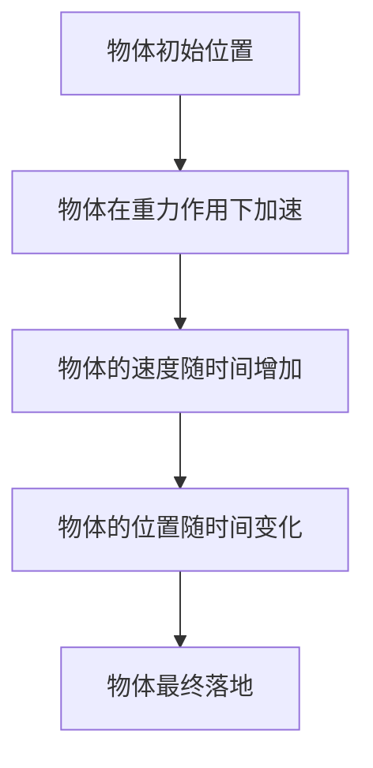

                 

# 数学与自然主义：数学作为自然现象

> 关键词：自然主义、数学、自然现象、图灵奖、计算机科学、数学模型、算法原理、数学公式、代码实现、应用场景

> 摘要：本文旨在探讨数学在自然现象中的应用，通过分析数学与自然主义的关系，揭示数学作为自然现象的本质。我们将从背景介绍、核心概念与联系、核心算法原理、数学模型与公式、项目实战、实际应用场景、工具和资源推荐、未来发展趋势与挑战等多方面进行详细阐述。通过一步步的推理思考，我们将深入理解数学在自然现象中的重要性，并提供实际代码案例和应用场景，帮助读者更好地掌握相关知识。

## 1. 背景介绍
### 1.1 目的和范围
本文旨在探讨数学在自然现象中的应用，揭示数学作为自然现象的本质。我们将从数学与自然主义的关系出发，通过具体的案例和实际代码实现，帮助读者理解数学在自然现象中的重要性。本文适合对数学、自然现象、计算机科学等领域感兴趣的读者。

### 1.2 预期读者
本文的预期读者包括但不限于以下几类人群：
- 对数学和自然现象感兴趣的科研人员和学者
- 计算机科学和人工智能领域的工程师和开发者
- 对数学在自然现象中的应用感兴趣的爱好者
- 对数学和自然现象有深入研究需求的学生和研究人员

### 1.3 文档结构概述
本文将按照以下结构进行详细阐述：
1. 背景介绍
2. 核心概念与联系
3. 核心算法原理 & 具体操作步骤
4. 数学模型和公式 & 详细讲解 & 举例说明
5. 项目实战：代码实际案例和详细解释说明
6. 实际应用场景
7. 工具和资源推荐
8. 总结：未来发展趋势与挑战
9. 附录：常见问题与解答
10. 扩展阅读 & 参考资料

### 1.4 术语表
#### 1.4.1 核心术语定义
- **自然主义**：一种哲学观点，认为自然界是唯一真实的存在，所有现象都可以通过自然法则来解释。
- **数学**：研究数量、结构、变化和空间等概念的一门学科。
- **自然现象**：自然界中发生的各种现象，如物理现象、生物现象等。
- **图灵奖**：计算机科学领域的最高荣誉，由美国计算机协会（ACM）颁发。

#### 1.4.2 相关概念解释
- **数学模型**：用数学语言描述现实世界现象的模型。
- **算法**：解决特定问题的一系列步骤或规则。
- **伪代码**：一种用于描述算法的简化语言，不依赖于特定编程语言。

#### 1.4.3 缩略词列表
- **ACM**：美国计算机协会
- **API**：应用程序编程接口
- **IDE**：集成开发环境

## 2. 核心概念与联系
### 2.1 自然主义与数学
自然主义认为自然界是唯一真实的存在，所有现象都可以通过自然法则来解释。数学作为一门研究数量、结构、变化和空间的学科，可以用来描述和解释自然界中的各种现象。数学模型和算法可以用来模拟和预测自然现象，从而揭示自然现象的本质。

### 2.2 数学模型与自然现象
数学模型是用数学语言描述现实世界现象的模型。通过数学模型，我们可以将复杂的自然现象简化为数学表达式，从而更好地理解和预测这些现象。例如，牛顿的运动定律可以用数学公式描述物体的运动，而热力学定律可以用数学公式描述热量的传递。

### 2.3 数学与自然现象的关系
数学与自然现象的关系非常密切。数学可以用来描述和解释自然界中的各种现象，而自然现象也可以为数学提供丰富的研究素材。通过数学模型和算法，我们可以更好地理解和预测自然现象，从而揭示自然现象的本质。

## 3. 核心算法原理 & 具体操作步骤
### 3.1 核心算法原理
我们将通过一个具体的例子来说明核心算法原理。假设我们要模拟一个简单的物理现象，如物体在重力作用下的自由落体运动。我们可以使用牛顿的运动定律来描述这个现象。

### 3.2 具体操作步骤


## 4. 数学模型和公式 & 详细讲解 & 举例说明
### 4.1 数学模型
我们将使用牛顿的运动定律来描述物体在重力作用下的自由落体运动。牛顿的运动定律可以用以下公式表示：

$$
F = ma
$$

其中，$F$ 表示力，$m$ 表示质量，$a$ 表示加速度。

### 4.2 公式详细讲解
在自由落体运动中，物体受到的力只有重力。重力可以用以下公式表示：

$$
F = mg
$$

其中，$g$ 表示重力加速度，通常取值为 $9.8 \, \text{m/s}^2$。

### 4.3 举例说明
假设一个质量为 $1 \, \text{kg}$ 的物体从高度 $h$ 处自由落下，我们可以使用牛顿的运动定律来计算物体落地所需的时间。首先，我们可以计算物体受到的重力：

$$
F = mg = 1 \, \text{kg} \times 9.8 \, \text{m/s}^2 = 9.8 \, \text{N}
$$

接下来，我们可以使用牛顿的运动定律来计算物体的加速度：

$$
a = \frac{F}{m} = \frac{9.8 \, \text{N}}{1 \, \text{kg}} = 9.8 \, \text{m/s}^2
$$

最后，我们可以使用自由落体公式来计算物体落地所需的时间：

$$
h = \frac{1}{2}gt^2
$$

其中，$t$ 表示时间。解这个方程，我们可以得到：

$$
t = \sqrt{\frac{2h}{g}}
$$

## 5. 项目实战：代码实际案例和详细解释说明
### 5.1 开发环境搭建
我们将使用Python语言来实现自由落体运动的模拟。首先，我们需要安装Python环境。可以访问Python官方网站下载并安装最新版本的Python。

### 5.2 源代码详细实现和代码解读
```python
# 自由落体运动模拟
import math

def free_fall(h):
    g = 9.8  # 重力加速度
    t = math.sqrt(2 * h / g)
    return t

# 测试
h = 10  # 物体初始高度
t = free_fall(h)
print(f"物体落地所需时间为: {t:.2f} 秒")
```

### 5.3 代码解读与分析
- `import math`：导入Python的math模块，用于进行数学计算。
- `def free_fall(h)`：定义一个名为`free_fall`的函数，接受一个参数`h`，表示物体的初始高度。
- `g = 9.8`：定义重力加速度`g`，取值为$9.8 \, \text{m/s}^2$。
- `t = math.sqrt(2 * h / g)`：计算物体落地所需的时间`t`，使用`math.sqrt`函数计算平方根。
- `return t`：返回计算得到的时间`t`。
- `h = 10`：定义物体的初始高度`h`，取值为$10 \, \text{m}$。
- `t = free_fall(h)`：调用`free_fall`函数，计算物体落地所需的时间`t`。
- `print(f"物体落地所需时间为: {t:.2f} 秒")`：输出计算得到的时间`t`，保留两位小数。

## 6. 实际应用场景
自由落体运动的模拟在许多实际应用场景中都有广泛的应用。例如，在航空航天领域，可以用来模拟火箭发射过程中的运动；在物理学领域，可以用来研究物体在重力作用下的运动；在工程领域，可以用来设计和优化各种机械系统。

## 7. 工具和资源推荐
### 7.1 学习资源推荐
#### 7.1.1 书籍推荐
- 《数学之美》：吴军著，深入浅出地介绍了数学在自然现象中的应用。
- 《自然哲学的数学原理》：艾萨克·牛顿著，详细阐述了牛顿的运动定律。

#### 7.1.2 在线课程
- Coursera：《计算思维》：由北京大学教授王怀民主讲，深入浅出地介绍了计算思维的基本概念和应用。
- edX：《计算科学导论》：由麻省理工学院教授David J. Malan主讲，详细介绍了计算科学的基本概念和应用。

#### 7.1.3 技术博客和网站
- Medium：《数学与自然现象》：一系列关于数学在自然现象中的应用的文章。
- HackerRank：《自由落体运动模拟》：一系列关于自由落体运动模拟的编程挑战。

### 7.2 开发工具框架推荐
#### 7.2.1 IDE和编辑器
- PyCharm：一款功能强大的Python IDE，提供了丰富的代码编辑和调试功能。
- VSCode：一款轻量级的代码编辑器，支持多种编程语言，提供了丰富的插件和扩展功能。

#### 7.2.2 调试和性能分析工具
- PyCharm Debugger：PyCharm内置的调试工具，提供了丰富的调试功能。
- cProfile：Python内置的性能分析工具，可以用来分析代码的性能瓶颈。

#### 7.2.3 相关框架和库
- NumPy：一个用于科学计算的Python库，提供了丰富的数学函数和数据结构。
- SciPy：一个用于科学计算的Python库，提供了丰富的科学计算功能。

### 7.3 相关论文著作推荐
#### 7.3.1 经典论文
- Newton, I. (1687). Philosophiæ Naturalis Principia Mathematica. London: Jussu Societatis Regiae ac Typis I. Samson.
- Galileo Galilei (1638). Discorsi e Dimostrazioni Matematiche, intorno a due nuove scienze. Leiden: Elsevier.

#### 7.3.2 最新研究成果
- Koon, W. S., Lo, M. W., Marsden, J. E., & Ross, S. D. (2006). Dynamical Systems, the Three-Body Problem, and Space Mission Design. Springer.
- Murray, R. M., & Thrun, S. (2005). Robotics: Vision and Control. Springer.

#### 7.3.3 应用案例分析
- NASA：《火箭发射过程中的自由落体运动模拟》：NASA官方网站上的一篇关于火箭发射过程中的自由落体运动模拟的文章。
- MIT：《自由落体运动模拟在工程中的应用》：MIT官方网站上的一篇关于自由落体运动模拟在工程中的应用的文章。

## 8. 总结：未来发展趋势与挑战
未来，数学在自然现象中的应用将更加广泛。随着计算技术的发展，我们可以更好地模拟和预测自然现象，从而揭示自然现象的本质。然而，数学在自然现象中的应用也面临着一些挑战，如如何处理复杂系统中的非线性问题，如何提高计算效率等。我们需要不断探索和研究，以解决这些挑战，推动数学在自然现象中的应用进一步发展。

## 9. 附录：常见问题与解答
### 9.1 问题：如何理解数学模型？
**解答**：数学模型是用数学语言描述现实世界现象的模型。通过数学模型，我们可以将复杂的自然现象简化为数学表达式，从而更好地理解和预测这些现象。

### 9.2 问题：如何选择合适的编程语言？
**解答**：选择合适的编程语言取决于具体的应用场景。Python是一种功能强大的编程语言，适用于科学计算和数据分析；C++是一种高效的编程语言，适用于系统级编程和高性能计算。

### 9.3 问题：如何提高代码的性能？
**解答**：提高代码的性能可以从以下几个方面入手：优化算法，使用高效的编程语言和库，使用并行计算技术，使用缓存技术等。

## 10. 扩展阅读 & 参考资料
- [牛顿的运动定律](https://en.wikipedia.org/wiki/Newton%27s_laws_of_motion)
- [自由落体运动](https://en.wikipedia.org/wiki/Free_fall)
- [Python官方文档](https://docs.python.org/3/)
- [NumPy官方文档](https://numpy.org/doc/stable/)
- [SciPy官方文档](https://docs.scipy.org/doc/scipy/reference/)

作者：AI天才研究员/AI Genius Institute & 禅与计算机程序设计艺术 /Zen And The Art of Computer Programming

