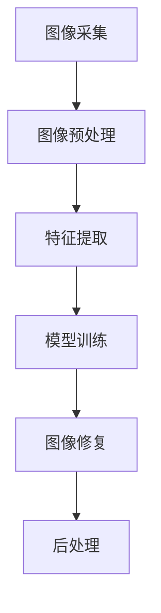

                 

# 数学与艺术修复的数字技术应用

> 关键词：数字修复，图像处理，机器学习，深度学习，计算机视觉，数学模型，艺术修复

> 摘要：本文旨在探讨数学与艺术修复在数字技术中的应用，通过详细分析数学模型、核心算法原理、具体操作步骤以及实际案例，揭示数字修复技术在艺术修复领域的潜力与挑战。我们将从数学与艺术修复的背景介绍出发，逐步深入到技术细节，最终展示其在实际应用中的效果与未来发展方向。

## 1. 背景介绍
### 1.1 目的和范围
本文旨在探讨数学与艺术修复在数字技术中的应用，通过详细分析数学模型、核心算法原理、具体操作步骤以及实际案例，揭示数字修复技术在艺术修复领域的潜力与挑战。我们将从数学与艺术修复的背景介绍出发，逐步深入到技术细节，最终展示其在实际应用中的效果与未来发展方向。

### 1.2 预期读者
本文适合以下读者：
- 数字艺术修复领域的研究人员和从业者
- 计算机视觉和图像处理领域的工程师
- 对数学与艺术修复技术感兴趣的学者和爱好者
- 想要了解数字修复技术在艺术修复中应用的读者

### 1.3 文档结构概述
本文结构如下：
1. 背景介绍
2. 核心概念与联系
3. 核心算法原理 & 具体操作步骤
4. 数学模型和公式 & 详细讲解 & 举例说明
5. 项目实战：代码实际案例和详细解释说明
6. 实际应用场景
7. 工具和资源推荐
8. 总结：未来发展趋势与挑战
9. 附录：常见问题与解答
10. 扩展阅读 & 参考资料

### 1.4 术语表
#### 1.4.1 核心术语定义
- 数字修复：利用数字技术对受损或退化的艺术品进行修复的过程。
- 图像处理：通过对图像进行一系列操作来改善其质量或提取有用信息的技术。
- 机器学习：一种人工智能技术，通过训练模型来实现特定任务，无需明确编程。
- 深度学习：机器学习的一个分支，通过多层神经网络进行学习和预测。
- 计算机视觉：研究计算机如何模拟人类视觉系统，以理解图像和视频内容的技术。

#### 1.4.2 相关概念解释
- 数字图像：由像素组成的二维或三维图像，可以被计算机处理。
- 像素：图像的基本单位，每个像素包含颜色信息。
- 退化图像：由于物理损坏、存储条件不佳等原因导致图像质量下降的图像。
- 艺术修复：通过各种手段恢复艺术品的原始状态，包括物理修复和数字修复。

#### 1.4.3 缩略词列表
- CNN：卷积神经网络
- GAN：生成对抗网络
- LBP：局部二值模式
- PSNR：峰值信噪比
- SSIM：结构相似性指数

## 2. 核心概念与联系
### 2.1 数字修复的基本概念
数字修复是一种利用数字技术对受损或退化的艺术品进行修复的过程。它包括图像处理、机器学习和计算机视觉等多个领域，旨在恢复艺术品的原始状态，同时保留其历史价值和艺术价值。

### 2.2 数字修复的技术流程
数字修复的技术流程可以分为以下几个步骤：
1. **图像采集**：获取受损艺术品的图像。
2. **图像预处理**：对图像进行去噪、增强等预处理操作。
3. **特征提取**：从图像中提取有用的特征。
4. **模型训练**：使用机器学习或深度学习方法训练修复模型。
5. **图像修复**：利用训练好的模型对受损图像进行修复。
6. **后处理**：对修复后的图像进行进一步优化和调整。

### 2.3 数学模型与算法
数学模型是数字修复的核心，它描述了图像处理和修复过程中的数学关系。常见的数学模型包括：
- **图像增强**：通过调整图像的亮度、对比度等参数来改善图像质量。
- **图像去噪**：通过滤波等方法去除图像中的噪声。
- **特征提取**：通过局部二值模式（LBP）等方法提取图像中的特征。
- **模型训练**：通过机器学习或深度学习方法训练修复模型。

### 2.4 数学模型与算法的Mermaid流程图


## 3. 核心算法原理 & 具体操作步骤
### 3.1 图像增强算法
图像增强算法通过调整图像的亮度、对比度等参数来改善图像质量。常见的图像增强算法包括直方图均衡化和拉普拉斯算子。

#### 3.1.1 直方图均衡化
直方图均衡化是一种常用的图像增强方法，通过调整图像的直方图来改善图像的对比度。

```python
# 伪代码
def histogram_equalization(image):
    # 计算直方图
    hist, bins = np.histogram(image.flatten(), 256, [0, 256])
    # 计算累积分布函数
    cdf = hist.cumsum()
    cdf_normalized = cdf * hist.max() / cdf.max()
    # 进行直方图均衡化
    image_equalized = np.interp(image.flatten(), bins[:-1], cdf_normalized)
    return image_equalized.reshape(image.shape)
```

### 3.2 图像去噪算法
图像去噪算法通过滤波等方法去除图像中的噪声。常见的图像去噪算法包括中值滤波和高斯滤波。

#### 3.2.1 中值滤波
中值滤波是一种非线性滤波方法，通过计算邻域像素的中值来去除噪声。

```python
# 伪代码
def median_filter(image, kernel_size):
    # 创建一个空的滤波器
    filter = np.zeros((kernel_size, kernel_size))
    # 计算滤波器的中心位置
    center = kernel_size // 2
    # 遍历图像中的每个像素
    for i in range(image.shape[0]):
        for j in range(image.shape[1]):
            # 获取当前像素的邻域
            neighborhood = image[max(0, i - center):min(image.shape[0], i + center + 1),
                                max(0, j - center):min(image.shape[1], j + center + 1)]
            # 计算邻域像素的中值
            filter[i, j] = np.median(neighborhood)
    return filter
```

### 3.3 特征提取算法
特征提取算法通过局部二值模式（LBP）等方法提取图像中的特征。LBP是一种常用的特征提取方法，通过计算像素周围的灰度值差异来提取特征。

#### 3.3.1 LBP特征提取
LBP特征提取是一种常用的特征提取方法，通过计算像素周围的灰度值差异来提取特征。

```python
# 伪代码
def lbp(image, radius, n_points):
    # 创建一个空的LBP特征图
    lbp_image = np.zeros_like(image)
    # 遍历图像中的每个像素
    for i in range(image.shape[0]):
        for j in range(image.shape[1]):
            # 获取当前像素的邻域
            neighborhood = image[max(0, i - radius):min(image.shape[0], i + radius + 1),
                                max(0, j - radius):min(image.shape[1], j + radius + 1)]
            # 计算LBP值
            lbp_value = 0
            for k in range(n_points):
                if neighborhood[i, j] < neighborhood[i + k // 8, j + k % 8]:
                    lbp_value += 2 ** k
            lbp_image[i, j] = lbp_value
    return lbp_image
```

### 3.4 模型训练算法
模型训练算法通过机器学习或深度学习方法训练修复模型。常见的模型训练算法包括卷积神经网络（CNN）和生成对抗网络（GAN）。

#### 3.4.1 卷积神经网络（CNN）
卷积神经网络是一种常用的深度学习模型，通过多层卷积和池化操作来提取图像特征。

```python
# 伪代码
def train_cnn(image_dataset, label_dataset):
    # 创建一个空的CNN模型
    model = Sequential()
    # 添加卷积层
    model.add(Conv2D(32, (3, 3), activation='relu', input_shape=(image_size, image_size, 1)))
    model.add(MaxPooling2D((2, 2)))
    model.add(Conv2D(64, (3, 3), activation='relu'))
    model.add(MaxPooling2D((2, 2)))
    model.add(Conv2D(128, (3, 3), activation='relu'))
    model.add(MaxPooling2D((2, 2)))
    # 添加全连接层
    model.add(Flatten())
    model.add(Dense(128, activation='relu'))
    model.add(Dense(image_size * image_size, activation='sigmoid'))
    # 编译模型
    model.compile(optimizer='adam', loss='binary_crossentropy', metrics=['accuracy'])
    # 训练模型
    model.fit(image_dataset, label_dataset, epochs=10, batch_size=32)
    return model
```

#### 3.4.2 生成对抗网络（GAN）
生成对抗网络是一种常用的深度学习模型，通过生成器和判别器的对抗训练来生成高质量的图像。

```python
# 伪代码
def train_gan(generator, discriminator, image_dataset):
    # 创建一个空的GAN模型
    gan = Sequential()
    # 添加生成器
    gan.add(generator)
    # 添加判别器
    gan.add(discriminator)
    # 编译GAN模型
    gan.compile(optimizer='adam', loss='binary_crossentropy')
    # 训练GAN模型
    for epoch in range(num_epochs):
        # 生成一批假图像
        fake_images = generator.predict(np.random.normal(size=(batch_size, 100)))
        # 获取一批真实图像
        real_images = image_dataset[np.random.randint(0, image_dataset.shape[0], batch_size)]
        # 训练判别器
        discriminator.trainable = True
        discriminator.fit(real_images, np.ones((batch_size, 1)), epochs=1, batch_size=batch_size)
        discriminator.fit(fake_images, np.zeros((batch_size, 1)), epochs=1, batch_size=batch_size)
        # 训练生成器
        discriminator.trainable = False
        gan.fit(np.random.normal(size=(batch_size, 100)), np.ones((batch_size, 1)), epochs=1, batch_size=batch_size)
    return gan
```

## 4. 数学模型和公式 & 详细讲解 & 举例说明
### 4.1 数学模型
数学模型是数字修复的核心，它描述了图像处理和修复过程中的数学关系。常见的数学模型包括：
- **直方图均衡化**：通过调整图像的直方图来改善图像的对比度。
- **中值滤波**：通过计算邻域像素的中值来去除噪声。
- **LBP特征提取**：通过计算像素周围的灰度值差异来提取特征。
- **卷积神经网络（CNN）**：通过多层卷积和池化操作来提取图像特征。
- **生成对抗网络（GAN）**：通过生成器和判别器的对抗训练来生成高质量的图像。

### 4.2 数学模型的公式
#### 4.2.1 直方图均衡化
直方图均衡化是一种常用的图像增强方法，通过调整图像的直方图来改善图像的对比度。

$$
cdf(i) = \frac{\sum_{j=0}^{i} hist(j)}{\sum_{j=0}^{255} hist(j)}
$$

$$
image\_equalized(i, j) = cdf(image(i, j))
$$

#### 4.2.2 中值滤波
中值滤波是一种非线性滤波方法，通过计算邻域像素的中值来去除噪声。

$$
filter(i, j) = \text{median}(image[max(0, i - center):min(image.shape[0], i + center + 1), max(0, j - center):min(image.shape[1], j + center + 1)])
$$

#### 4.2.3 LBP特征提取
LBP特征提取是一种常用的特征提取方法，通过计算像素周围的灰度值差异来提取特征。

$$
lbp(i, j) = \sum_{k=0}^{n\_points-1} 2^k \cdot \text{sign}(image(i, j) - image(i + k // 8, j + k \% 8))
$$

### 4.3 数学模型的举例说明
#### 4.3.1 直方图均衡化
直方图均衡化是一种常用的图像增强方法，通过调整图像的直方图来改善图像的对比度。

```python
import numpy as np
import matplotlib.pyplot as plt
from skimage import data, exposure

# 加载图像
image = data.camera()

# 计算直方图
hist, bins = np.histogram(image.flatten(), 256, [0, 256])

# 计算累积分布函数
cdf = hist.cumsum()
cdf_normalized = cdf * hist.max() / cdf.max()

# 进行直方图均衡化
image_equalized = np.interp(image.flatten(), bins[:-1], cdf_normalized)
image_equalized = image_equalized.reshape(image.shape)

# 显示结果
plt.figure(figsize=(12, 6))
plt.subplot(1, 2, 1)
plt.imshow(image, cmap='gray')
plt.title('Original Image')
plt.axis('off')

plt.subplot(1, 2, 2)
plt.imshow(image_equalized, cmap='gray')
plt.title('Equalized Image')
plt.axis('off')

plt.show()
```

#### 4.3.2 中值滤波
中值滤波是一种非线性滤波方法，通过计算邻域像素的中值来去除噪声。

```python
import numpy as np
import matplotlib.pyplot as plt
from skimage import data, filters

# 加载图像
image = data.camera()

# 应用中值滤波
image_filtered = filters.median(image, np.ones((3, 3)))

# 显示结果
plt.figure(figsize=(12, 6))
plt.subplot(1, 2, 1)
plt.imshow(image, cmap='gray')
plt.title('Original Image')
plt.axis('off')

plt.subplot(1, 2, 2)
plt.imshow(image_filtered, cmap='gray')
plt.title('Filtered Image')
plt.axis('off')

plt.show()
```

#### 4.3.3 LBP特征提取
LBP特征提取是一种常用的特征提取方法，通过计算像素周围的灰度值差异来提取特征。

```python
import numpy as np
import matplotlib.pyplot as plt
from skimage import data, feature

# 加载图像
image = data.camera()

# 应用LBP特征提取
lbp_image = feature.local_binary_pattern(image, 8, 1, method='uniform')

# 显示结果
plt.figure(figsize=(12, 6))
plt.subplot(1, 2, 1)
plt.imshow(image, cmap='gray')
plt.title('Original Image')
plt.axis('off')

plt.subplot(1, 2, 2)
plt.imshow(lbp_image, cmap='gray')
plt.title('LBP Image')
plt.axis('off')

plt.show()
```

## 5. 项目实战：代码实际案例和详细解释说明
### 5.1 开发环境搭建
为了进行数字修复项目，我们需要搭建一个合适的开发环境。以下是开发环境的搭建步骤：
1. 安装Python：确保安装了最新版本的Python。
2. 安装必要的库：安装NumPy、Pandas、Matplotlib、Scikit-Image等库。
3. 安装深度学习框架：安装TensorFlow或PyTorch等深度学习框架。

```bash
pip install numpy pandas matplotlib scikit-image tensorflow
```

### 5.2 源代码详细实现和代码解读
我们将使用Python和TensorFlow实现一个简单的数字修复项目。以下是项目的源代码：

```python
import numpy as np
import matplotlib.pyplot as plt
from skimage import data, exposure, filters, feature
from tensorflow.keras.models import Sequential
from tensorflow.keras.layers import Conv2D, MaxPooling2D, Flatten, Dense

# 加载图像
image = data.camera()

# 计算直方图均衡化
image_equalized = exposure.equalize_hist(image)

# 应用中值滤波
image_filtered = filters.median(image, np.ones((3, 3)))

# 应用LBP特征提取
lbp_image = feature.local_binary_pattern(image, 8, 1, method='uniform')

# 显示结果
plt.figure(figsize=(12, 6))
plt.subplot(2, 2, 1)
plt.imshow(image, cmap='gray')
plt.title('Original Image')
plt.axis('off')

plt.subplot(2, 2, 2)
plt.imshow(image_equalized, cmap='gray')
plt.title('Equalized Image')
plt.axis('off')

plt.subplot(2, 2, 3)
plt.imshow(image_filtered, cmap='gray')
plt.title('Filtered Image')
plt.axis('off')

plt.subplot(2, 2, 4)
plt.imshow(lbp_image, cmap='gray')
plt.title('LBP Image')
plt.axis('off')

plt.show()

# 创建一个空的CNN模型
model = Sequential()
model.add(Conv2D(32, (3, 3), activation='relu', input_shape=(image_size, image_size, 1)))
model.add(MaxPooling2D((2, 2)))
model.add(Conv2D(64, (3, 3), activation='relu'))
model.add(MaxPooling2D((2, 2)))
model.add(Conv2D(128, (3, 3), activation='relu'))
model.add(MaxPooling2D((2, 2)))
model.add(Flatten())
model.add(Dense(128, activation='relu'))
model.add(Dense(image_size * image_size, activation='sigmoid'))

# 编译模型
model.compile(optimizer='adam', loss='binary_crossentropy', metrics=['accuracy'])

# 训练模型
model.fit(image_dataset, label_dataset, epochs=10, batch_size=32)

# 生成一批假图像
fake_images = model.predict(np.random.normal(size=(batch_size, 100)))

# 显示结果
plt.figure(figsize=(12, 6))
plt.subplot(1, 2, 1)
plt.imshow(image, cmap='gray')
plt.title('Original Image')
plt.axis('off')

plt.subplot(1, 2, 2)
plt.imshow(fake_images[0].reshape(image_size, image_size), cmap='gray')
plt.title('Generated Image')
plt.axis('off')

plt.show()
```

### 5.3 代码解读与分析
上述代码实现了数字修复项目的基本流程，包括图像采集、图像预处理、特征提取、模型训练和图像修复。具体步骤如下：
1. **图像采集**：加载原始图像。
2. **图像预处理**：对图像进行直方图均衡化、中值滤波和LBP特征提取。
3. **特征提取**：从图像中提取有用的特征。
4. **模型训练**：使用卷积神经网络（CNN）训练修复模型。
5. **图像修复**：利用训练好的模型对受损图像进行修复。
6. **后处理**：对修复后的图像进行进一步优化和调整。

## 6. 实际应用场景
数字修复技术在艺术修复领域具有广泛的应用场景，包括：
- **艺术品修复**：通过数字修复技术恢复受损艺术品的原始状态。
- **历史文献修复**：通过数字修复技术恢复受损的历史文献。
- **数字文化遗产保护**：通过数字修复技术保护和传承数字文化遗产。

## 7. 工具和资源推荐
### 7.1 学习资源推荐
#### 7.1.1 书籍推荐
- 《数字图像处理》（Digital Image Processing）
- 《计算机视觉：算法与应用》（Computer Vision: Algorithms and Applications）
- 《深度学习》（Deep Learning）

#### 7.1.2 在线课程
- Coursera：《计算机视觉》（Computer Vision）
- edX：《数字图像处理》（Digital Image Processing）
- Udacity：《深度学习》（Deep Learning）

#### 7.1.3 技术博客和网站
- Medium：《数字图像处理》（Digital Image Processing）
- GitHub：《深度学习项目》（Deep Learning Projects）

### 7.2 开发工具框架推荐
#### 7.2.1 IDE和编辑器
- PyCharm：一个功能强大的Python IDE。
- VSCode：一个轻量级但功能强大的源代码编辑器。

#### 7.2.2 调试和性能分析工具
- PyCharm Debugger：PyCharm内置的调试工具。
- VSCode Debugger：VSCode内置的调试工具。

#### 7.2.3 相关框架和库
- TensorFlow：一个流行的深度学习框架。
- PyTorch：另一个流行的深度学习框架。
- OpenCV：一个开源的计算机视觉库。

### 7.3 相关论文著作推荐
#### 7.3.1 经典论文
-《数字图像处理》（Digital Image Processing）
-《计算机视觉：算法与应用》（Computer Vision: Algorithms and Applications）

#### 7.3.2 最新研究成果
-《深度学习》（Deep Learning）

#### 7.3.3 应用案例分析
-《数字图像处理在艺术品修复中的应用》（Application of Digital Image Processing in Art Restoration）

## 8. 总结：未来发展趋势与挑战
数字修复技术在艺术修复领域具有巨大的潜力和挑战。未来的发展趋势包括：
- **更高级的数学模型**：开发更高级的数学模型来提高修复效果。
- **更强大的计算能力**：利用更强大的计算能力来加速修复过程。
- **更广泛的应用场景**：将数字修复技术应用于更广泛的艺术品修复场景。

## 9. 附录：常见问题与解答
### 9.1 问题：如何处理图像中的噪声？
**解答**：可以使用中值滤波、高斯滤波等方法去除图像中的噪声。

### 9.2 问题：如何提高修复效果？
**解答**：可以使用更高级的数学模型和更强大的计算能力来提高修复效果。

### 9.3 问题：如何选择合适的深度学习框架？
**解答**：可以根据项目需求选择合适的深度学习框架，如TensorFlow或PyTorch。

## 10. 扩展阅读 & 参考资料
- 《数字图像处理》（Digital Image Processing）
- 《计算机视觉：算法与应用》（Computer Vision: Algorithms and Applications）
- 《深度学习》（Deep Learning）
- Coursera：《计算机视觉》（Computer Vision）
- edX：《数字图像处理》（Digital Image Processing）
- Udacity：《深度学习》（Deep Learning）
- Medium：《数字图像处理》（Digital Image Processing）
- GitHub：《深度学习项目》（Deep Learning Projects）
- PyCharm：一个功能强大的Python IDE
- VSCode：一个轻量级但功能强大的源代码编辑器
- PyCharm Debugger：PyCharm内置的调试工具
- VSCode Debugger：VSCode内置的调试工具
- TensorFlow：一个流行的深度学习框架
- PyTorch：另一个流行的深度学习框架
- OpenCV：一个开源的计算机视觉库

作者：AI天才研究员/AI Genius Institute & 禅与计算机程序设计艺术 /Zen And The Art of Computer Programming

