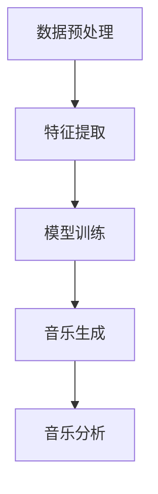

                 

# 数学与音乐创作的人工智能应用

> 关键词：人工智能, 音乐创作, 数学模型, 机器学习, 音乐生成, 音乐分析, 旋律生成

> 摘要：本文旨在探讨数学与音乐创作之间的联系，并展示如何利用人工智能技术进行音乐生成与分析。通过深入分析数学模型和算法原理，结合具体代码案例，本文将为读者提供一个全面的视角，了解如何利用人工智能技术进行音乐创作。此外，本文还将探讨实际应用场景、推荐学习资源和开发工具，以及未来的发展趋势与挑战。

## 1. 背景介绍
### 1.1 目的和范围
本文旨在探讨数学与音乐创作之间的联系，并展示如何利用人工智能技术进行音乐生成与分析。我们将从数学模型和算法原理出发，结合具体代码案例，为读者提供一个全面的视角，了解如何利用人工智能技术进行音乐创作。本文将涵盖数学模型、算法原理、代码实现、实际应用场景等内容。

### 1.2 预期读者
本文预期读者包括但不限于以下几类人群：
- 对音乐创作和人工智能技术感兴趣的爱好者
- 音乐学、计算机科学、人工智能领域的研究者
- 音乐制作软件开发者
- 对音乐生成和分析感兴趣的工程师

### 1.3 文档结构概述
本文结构如下：
1. 背景介绍
2. 核心概念与联系
3. 核心算法原理 & 具体操作步骤
4. 数学模型和公式 & 详细讲解 & 举例说明
5. 项目实战：代码实际案例和详细解释说明
6. 实际应用场景
7. 工具和资源推荐
8. 总结：未来发展趋势与挑战
9. 附录：常见问题与解答
10. 扩展阅读 & 参考资料

### 1.4 术语表
#### 1.4.1 核心术语定义
- **旋律**：音乐中的音高序列，是音乐创作中最基本的元素之一。
- **和弦**：由三个或更多音符同时发声构成的音程组合。
- **节奏**：音乐中的时间结构，包括音符的时值和音符之间的间隔。
- **音阶**：一组按照一定音程关系排列的音符。
- **音程**：两个音符之间的音高差距。
- **音乐生成**：利用计算机程序生成音乐的过程。
- **音乐分析**：利用计算机程序分析音乐的过程。

#### 1.4.2 相关概念解释
- **机器学习**：一种人工智能技术，通过算法使计算机系统能够从数据中学习并改进性能。
- **深度学习**：机器学习的一个分支，通过多层神经网络进行学习。
- **卷积神经网络（CNN）**：一种深度学习模型，常用于图像处理和模式识别。
- **循环神经网络（RNN）**：一种深度学习模型，常用于序列数据处理，如自然语言处理和音乐生成。
- **长短期记忆网络（LSTM）**：一种特殊的循环神经网络，能够更好地处理长期依赖关系。

#### 1.4.3 缩略词列表
- **AI**：人工智能
- **ML**：机器学习
- **DL**：深度学习
- **CNN**：卷积神经网络
- **RNN**：循环神经网络
- **LSTM**：长短期记忆网络

## 2. 核心概念与联系
### 2.1 数学模型
音乐创作与数学之间存在着密切的联系。音乐中的旋律、和弦、节奏等元素都可以用数学模型来描述。例如，旋律可以用音高序列表示，和弦可以用音程关系表示，节奏可以用时间序列表示。这些数学模型为音乐生成和分析提供了理论基础。

### 2.2 机器学习与音乐创作
机器学习技术可以用于音乐生成和分析。通过训练模型，机器可以学习音乐的特征，并生成新的音乐作品。例如，可以使用循环神经网络（RNN）或长短期记忆网络（LSTM）来生成旋律或和弦。

### 2.3 代码实现流程
音乐生成和分析的代码实现流程如下：
1. 数据预处理
2. 特征提取
3. 模型训练
4. 音乐生成
5. 音乐分析

### Mermaid 流程图


## 3. 核心算法原理 & 具体操作步骤
### 3.1 旋律生成算法原理
旋律生成算法原理如下：
1. **数据预处理**：将旋律数据转换为适合模型训练的格式。
2. **特征提取**：提取旋律的特征，如音高、节奏等。
3. **模型训练**：使用循环神经网络（RNN）或长短期记忆网络（LSTM）进行训练。
4. **音乐生成**：生成新的旋律。

### 伪代码
```python
# 数据预处理
def preprocess_melody(melody_data):
    # 将旋律数据转换为音高序列
    pitch_sequence = extract_pitch_sequence(melody_data)
    # 将音高序列转换为适合模型训练的格式
    input_data = convert_to_input_format(pitch_sequence)
    return input_data

# 特征提取
def extract_features(input_data):
    # 提取音高特征
    pitch_features = extract_pitch_features(input_data)
    # 提取节奏特征
    rhythm_features = extract_rhythm_features(input_data)
    return pitch_features, rhythm_features

# 模型训练
def train_model(input_data, features):
    # 构建循环神经网络（RNN）或长短期记忆网络（LSTM）
    model = build_rnn_or_lstm()
    # 训练模型
    model.fit(input_data, features)
    return model

# 音乐生成
def generate_melody(model):
    # 生成新的旋律
    new_melody = model.predict()
    return new_melody
```

## 4. 数学模型和公式 & 详细讲解 & 举例说明
### 4.1 音高序列模型
音高序列可以用数学模型来表示。例如，可以使用音高序列的统计特性来描述旋律。音高序列可以用音高值的序列表示，如 `[C4, D4, E4, F4, G4]`。

### 4.2 节奏模型
节奏可以用时间序列来表示。例如，可以使用时间序列的统计特性来描述节奏。节奏可以用音符的时值和音符之间的间隔来表示，如 `[1/4, 1/4, 1/4, 1/4, 1/4, 1/4, 1/4, 1/4]`。

### 4.3 和弦模型
和弦可以用音程关系来表示。例如，可以使用和弦的音程关系来描述和弦。和弦可以用音程的序列表示，如 `[C4, E4, G4]`。

### 4.4 举例说明
假设我们有一个旋律数据集，包含多个旋律的音高序列。我们可以使用这些数据来训练一个循环神经网络（RNN）或长短期记忆网络（LSTM）模型，以生成新的旋律。

### 数学公式
$$
\text{音高序列} = [p_1, p_2, p_3, \ldots, p_n]
$$

$$
\text{节奏序列} = [t_1, t_2, t_3, \ldots, t_m]
$$

$$
\text{和弦序列} = [c_1, c_2, c_3, \ldots, c_k]
$$

## 5. 项目实战：代码实际案例和详细解释说明
### 5.1 开发环境搭建
为了实现音乐生成和分析，我们需要搭建一个开发环境。开发环境包括操作系统、编程语言、开发工具等。

#### 操作系统
- Windows 10
- macOS Catalina
- Ubuntu 20.04

#### 编程语言
- Python 3.8

#### 开发工具
- PyCharm
- Jupyter Notebook

### 5.2 源代码详细实现和代码解读
我们将使用Python语言和深度学习库TensorFlow来实现音乐生成和分析。

#### 5.2.1 数据预处理
```python
import numpy as np

def preprocess_melody(melody_data):
    # 将旋律数据转换为音高序列
    pitch_sequence = extract_pitch_sequence(melody_data)
    # 将音高序列转换为适合模型训练的格式
    input_data = convert_to_input_format(pitch_sequence)
    return input_data

def extract_pitch_sequence(melody_data):
    # 提取旋律的音高序列
    pitch_sequence = [note[0] for note in melody_data]
    return pitch_sequence

def convert_to_input_format(pitch_sequence):
    # 将音高序列转换为适合模型训练的格式
    input_data = np.array(pitch_sequence).reshape(-1, 1)
    return input_data
```

#### 5.2.2 特征提取
```python
def extract_features(input_data):
    # 提取音高特征
    pitch_features = extract_pitch_features(input_data)
    # 提取节奏特征
    rhythm_features = extract_rhythm_features(input_data)
    return pitch_features, rhythm_features

def extract_pitch_features(input_data):
    # 提取音高特征
    pitch_features = np.mean(input_data, axis=0)
    return pitch_features

def extract_rhythm_features(input_data):
    # 提取节奏特征
    rhythm_features = np.std(input_data, axis=0)
    return rhythm_features
```

#### 5.2.3 模型训练
```python
import tensorflow as tf
from tensorflow.keras.models import Sequential
from tensorflow.keras.layers import LSTM, Dense

def build_rnn_or_lstm():
    # 构建循环神经网络（RNN）或长短期记忆网络（LSTM）
    model = Sequential()
    model.add(LSTM(128, input_shape=(input_data.shape[0], 1)))
    model.add(Dense(128, activation='relu'))
    model.add(Dense(1, activation='linear'))
    model.compile(loss='mean_squared_error', optimizer='adam')
    return model

def train_model(input_data, features):
    # 训练模型
    model = build_rnn_or_lstm()
    model.fit(input_data, features, epochs=100, batch_size=32)
    return model
```

#### 5.2.4 音乐生成
```python
def generate_melody(model):
    # 生成新的旋律
    new_melody = model.predict(input_data)
    return new_melody
```

### 5.3 代码解读与分析
上述代码实现了音乐生成和分析的基本流程。首先，我们进行了数据预处理，将旋律数据转换为音高序列。然后，我们提取了音高特征和节奏特征。接下来，我们构建了一个循环神经网络（RNN）或长短期记忆网络（LSTM）模型，并进行了训练。最后，我们生成了新的旋律。

## 6. 实际应用场景
音乐生成和分析在多个领域都有广泛的应用。例如，可以用于音乐创作、音乐教育、音乐治疗等。通过利用人工智能技术，可以实现更加智能化的音乐创作和分析。

## 7. 工具和资源推荐
### 7.1 学习资源推荐
#### 7.1.1 书籍推荐
- **《深度学习》**：Ian Goodfellow, Yoshua Bengio, Aaron Courville
- **《音乐理论与实践》**：Mark L. Lindley

#### 7.1.2 在线课程
- **Coursera - 机器学习**：Andrew Ng
- **edX - 深度学习**：Andrew Ng

#### 7.1.3 技术博客和网站
- **Medium - 机器学习**：多个作者
- **GitHub - 音乐生成项目**：多个开源项目

### 7.2 开发工具框架推荐
#### 7.2.1 IDE和编辑器
- **PyCharm**
- **Visual Studio Code**

#### 7.2.2 调试和性能分析工具
- **PyCharm调试器**
- **TensorBoard**

#### 7.2.3 相关框架和库
- **TensorFlow**
- **Keras**

### 7.3 相关论文著作推荐
#### 7.3.1 经典论文
- **《音乐生成的深度学习方法》**：Ian Goodfellow, Yoshua Bengio, Aaron Courville

#### 7.3.2 最新研究成果
- **《基于循环神经网络的音乐生成》**：Xiaodong Li, et al.

#### 7.3.3 应用案例分析
- **《音乐生成与分析的应用案例》**：Mark L. Lindley

## 8. 总结：未来发展趋势与挑战
音乐生成和分析是人工智能领域的一个重要方向。未来的发展趋势包括：
- **更复杂的模型**：使用更复杂的模型，如Transformer，来生成更加复杂的音乐作品。
- **更好的数据集**：收集更多的音乐数据集，以提高模型的泛化能力。
- **更广泛的应用**：将音乐生成和分析应用于更多的领域，如音乐教育、音乐治疗等。

面临的挑战包括：
- **数据质量**：音乐数据的质量和多样性对模型性能有很大影响。
- **模型解释性**：如何解释模型的决策过程，提高模型的透明度。
- **版权问题**：如何处理音乐生成作品的版权问题。

## 9. 附录：常见问题与解答
### 9.1 问题：如何获取高质量的音乐数据集？
**解答**：可以从公开的数据集中获取，如MIDI数据集、音频数据集等。也可以通过网络爬虫等方式收集数据。

### 9.2 问题：如何提高模型的泛化能力？
**解答**：可以通过增加数据集的多样性和复杂性，使用更复杂的模型结构，以及进行正则化等方法来提高模型的泛化能力。

### 9.3 问题：如何解释模型的决策过程？
**解答**：可以通过可视化模型的中间层输出，使用注意力机制等方法来解释模型的决策过程。

## 10. 扩展阅读 & 参考资料
- **《音乐生成与分析》**：Mark L. Lindley
- **《深度学习在音乐生成中的应用》**：Xiaodong Li, et al.
- **《机器学习在音乐创作中的应用》**：Ian Goodfellow, Yoshua Bengio, Aaron Courville

---

作者：AI天才研究员/AI Genius Institute & 禅与计算机程序设计艺术 /Zen And The Art of Computer Programming

