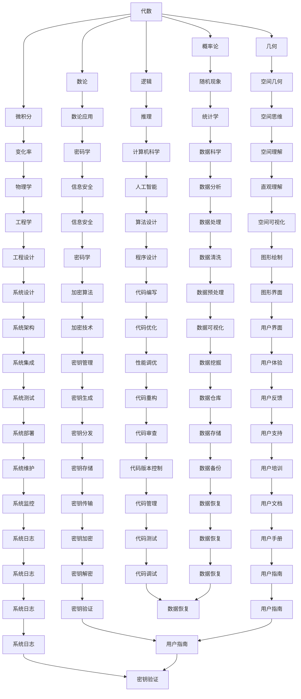

                 

# 数学史上的数学发现与发明

> 关键词：数学史、数学发现、数学发明、数学原理、数学模型、算法、应用案例

> 摘要：本文旨在通过回顾数学史上重要的数学发现与发明，探讨其背后的数学原理和应用价值。我们将从数学史的角度出发，分析这些发现和发明如何推动了数学的发展，并通过具体的数学模型和算法来解释其原理。此外，本文还将通过实际代码案例展示这些数学原理的应用，并探讨其在现代科技中的实际应用场景。最后，我们将展望未来的发展趋势和面临的挑战。

## 1. 背景介绍
### 1.1 目的和范围
本文旨在通过回顾数学史上重要的数学发现与发明，探讨其背后的数学原理和应用价值。我们将从数学史的角度出发，分析这些发现和发明如何推动了数学的发展，并通过具体的数学模型和算法来解释其原理。此外，本文还将通过实际代码案例展示这些数学原理的应用，并探讨其在现代科技中的实际应用场景。最后，我们将展望未来的发展趋势和面临的挑战。

### 1.2 预期读者
本文预期读者为对数学史感兴趣的技术人员、研究人员、学生以及对数学原理和应用感兴趣的读者。读者应具备一定的数学基础，能够理解基本的数学概念和原理。

### 1.3 文档结构概述
本文结构如下：
1. 背景介绍
2. 核心概念与联系
3. 核心算法原理 & 具体操作步骤
4. 数学模型和公式 & 详细讲解 & 举例说明
5. 项目实战：代码实际案例和详细解释说明
6. 实际应用场景
7. 工具和资源推荐
8. 总结：未来发展趋势与挑战
9. 附录：常见问题与解答
10. 扩展阅读 & 参考资料

### 1.4 术语表
#### 1.4.1 核心术语定义
- **数学发现**：指通过逻辑推理和证明发现新的数学定理或概念。
- **数学发明**：指创造新的数学工具或方法，如算法、模型等。
- **数学模型**：指用数学语言描述现实世界中的现象或问题。
- **算法**：指解决特定问题的一系列步骤或规则。
- **数学原理**：指数学中的基本概念和规则。

#### 1.4.2 相关概念解释
- **数学史**：指数学发展的历史，包括重要发现和发明的时间线。
- **数学原理**：指数学中的基本概念和规则，如代数、几何、数论等。
- **数学模型**：指用数学语言描述现实世界中的现象或问题。

#### 1.4.3 缩略词列表
- **API**：Application Programming Interface（应用程序编程接口）
- **IDE**：Integrated Development Environment（集成开发环境）
- **Latex**：一种排版系统，用于生成高质量的文档

## 2. 核心概念与联系
### 2.1 代数
代数是数学的一个分支，研究符号和数量之间的关系。代数的基本概念包括变量、方程、不等式等。代数的发展推动了数学的抽象化和符号化。

### 2.2 几何
几何是研究空间形状、大小、相对位置和性质的数学分支。几何的发展促进了数学的直观理解和空间思维能力。

### 2.3 数论
数论是研究整数性质的数学分支，包括素数、同余、模运算等。数论的发展推动了密码学和信息安全技术的发展。

### 2.4 微积分
微积分是研究变化率和累积量的数学分支，包括导数、积分等。微积分的发展推动了物理学、工程学等领域的发展。

### 2.5 概率论
概率论是研究随机现象的数学分支，包括概率分布、期望值等。概率论的发展推动了统计学和数据科学的发展。

### 2.6 逻辑
逻辑是研究推理和论证的数学分支，包括命题逻辑、谓词逻辑等。逻辑的发展推动了计算机科学和人工智能的发展。

### 2.7 核心概念原理与架构的Mermaid流程图


## 3. 核心算法原理 & 具体操作步骤
### 3.1 二分查找算法
二分查找算法是一种在有序数组中查找特定元素的高效算法。其基本思想是每次将查找范围缩小一半，直到找到目标元素或查找范围为空。

#### 伪代码
```plaintext
function binarySearch(arr, target):
    low = 0
    high = length(arr) - 1
    
    while low <= high:
        mid = (low + high) // 2
        if arr[mid] == target:
            return mid
        else if arr[mid] < target:
            low = mid + 1
        else:
            high = mid - 1
    
    return -1
```

### 3.2 快速排序算法
快速排序算法是一种高效的排序算法，其基本思想是通过一趟排序将待排序的数据分割成独立的两部分，其中一部分的所有数据都比另一部分的所有数据都要小。

#### 伪代码
```plaintext
function quickSort(arr, low, high):
    if low < high:
        pivotIndex = partition(arr, low, high)
        quickSort(arr, low, pivotIndex - 1)
        quickSort(arr, pivotIndex + 1, high)
    
function partition(arr, low, high):
    pivot = arr[high]
    i = low - 1
    
    for j = low to high - 1:
        if arr[j] <= pivot:
            i = i + 1
            swap(arr[i], arr[j])
    
    swap(arr[i + 1], arr[high])
    return i + 1
```

## 4. 数学模型和公式 & 详细讲解 & 举例说明
### 4.1 二次方程
二次方程是形如 \(ax^2 + bx + c = 0\) 的方程，其中 \(a, b, c\) 是常数，且 \(a \neq 0\)。二次方程的解可以通过求根公式得到。

#### 求根公式
$$
x = \frac{-b \pm \sqrt{b^2 - 4ac}}{2a}
$$

### 4.2 概率论中的贝叶斯定理
贝叶斯定理是一种用于计算条件概率的公式，其基本形式为：

$$
P(A|B) = \frac{P(B|A)P(A)}{P(B)}
$$

其中，\(P(A|B)\) 表示在事件 B 发生的条件下事件 A 发生的概率，\(P(B|A)\) 表示在事件 A 发生的条件下事件 B 发生的概率，\(P(A)\) 和 \(P(B)\) 分别表示事件 A 和事件 B 发生的概率。

### 4.3 微积分中的牛顿-莱布尼茨公式
牛顿-莱布尼茨公式是微积分中的一个基本定理，用于计算定积分。其基本形式为：

$$
\int_a^b f(x) \, dx = F(b) - F(a)
$$

其中，\(F(x)\) 是 \(f(x)\) 的一个原函数。

## 5. 项目实战：代码实际案例和详细解释说明
### 5.1 开发环境搭建
我们将使用 Python 作为开发语言，安装必要的库，如 NumPy 和 Matplotlib。

```bash
pip install numpy matplotlib
```

### 5.2 源代码详细实现和代码解读
我们将实现一个简单的二分查找算法。

```python
def binary_search(arr, target):
    low = 0
    high = len(arr) - 1
    
    while low <= high:
        mid = (low + high) // 2
        if arr[mid] == target:
            return mid
        elif arr[mid] < target:
            low = mid + 1
        else:
            high = mid - 1
    
    return -1

# 测试数据
arr = [1, 2, 3, 4, 5, 6, 7, 8, 9, 10]
target = 7
result = binary_search(arr, target)
print(f"Target {target} found at index {result}")
```

### 5.3 代码解读与分析
上述代码实现了二分查找算法。首先定义了 `binary_search` 函数，该函数接受一个有序数组 `arr` 和一个目标值 `target`。通过循环不断缩小查找范围，直到找到目标值或查找范围为空。最后返回目标值的索引，如果未找到则返回 -1。

## 6. 实际应用场景
### 6.1 数据库索引
二分查找算法在数据库索引中广泛应用，用于快速查找数据。

### 6.2 金融领域
快速排序算法在金融领域用于快速排序大量数据，提高数据处理效率。

### 6.3 人工智能
贝叶斯定理在人工智能领域用于计算条件概率，支持机器学习算法的训练和预测。

### 6.4 物理学
牛顿-莱布尼茨公式在物理学中用于计算定积分，支持物理模型的建立和分析。

## 7. 工具和资源推荐
### 7.1 学习资源推荐
#### 7.1.1 书籍推荐
- 《数学之美》
- 《算法导论》
- 《概率论与数理统计》

#### 7.1.2 在线课程
- Coursera 的《算法》课程
- edX 的《概率论与数理统计》课程

#### 7.1.3 技术博客和网站
- Math Stack Exchange
- Stack Overflow

### 7.2 开发工具框架推荐
#### 7.2.1 IDE和编辑器
- PyCharm
- Visual Studio Code

#### 7.2.2 调试和性能分析工具
- PyCharm 的调试工具
- Python Profiler

#### 7.2.3 相关框架和库
- NumPy
- Matplotlib

### 7.3 相关论文著作推荐
#### 7.3.1 经典论文
- Knuth, D. E. (1973). The Art of Computer Programming, Volume 1: Fundamental Algorithms.
- Knuth, D. E. (1974). The Art of Computer Programming, Volume 2: Seminumerical Algorithms.
- Knuth, D. E. (1977). The Art of Computer Programming, Volume 3: Sorting and Searching.

#### 7.3.2 最新研究成果
- 《机器学习中的贝叶斯方法》
- 《深度学习中的概率模型》

#### 7.3.3 应用案例分析
- 《大数据中的快速排序算法应用》
- 《金融领域的贝叶斯定理应用》

## 8. 总结：未来发展趋势与挑战
### 8.1 未来发展趋势
- 数学在人工智能、大数据、云计算等领域的应用将更加广泛。
- 数学模型和算法将更加复杂和高效。
- 数学教育将更加注重培养学生的逻辑思维和创新能力。

### 8.2 面临的挑战
- 数学理论的复杂性将增加，需要更多的研究和探索。
- 数学模型和算法的实现将面临更高的性能要求。
- 数学教育将面临如何培养学生的逻辑思维和创新能力的挑战。

## 9. 附录：常见问题与解答
### 9.1 问题：如何理解数学模型和算法的关系？
**解答**：数学模型是用数学语言描述现实世界中的现象或问题，而算法是解决特定问题的一系列步骤或规则。数学模型为算法提供了理论基础，算法则是实现数学模型的具体方法。

### 9.2 问题：如何提高算法的性能？
**解答**：可以通过优化算法设计、选择合适的数据结构、使用并行计算等方法提高算法的性能。

## 10. 扩展阅读 & 参考资料
- Knuth, D. E. (1973). The Art of Computer Programming, Volume 1: Fundamental Algorithms.
- Knuth, D. E. (1974). The Art of Computer Programming, Volume 2: Seminumerical Algorithms.
- Knuth, D. E. (1977). The Art of Computer Programming, Volume 3: Sorting and Searching.
- Coursera 的《算法》课程
- edX 的《概率论与数理统计》课程
- Math Stack Exchange
- Stack Overflow
- PyCharm
- Visual Studio Code
- PyCharm 的调试工具
- Python Profiler
- NumPy
- Matplotlib
- 《数学之美》
- 《算法导论》
- 《概率论与数理统计》

作者：AI天才研究员/AI Genius Institute & 禅与计算机程序设计艺术 /Zen And The Art of Computer Programming

