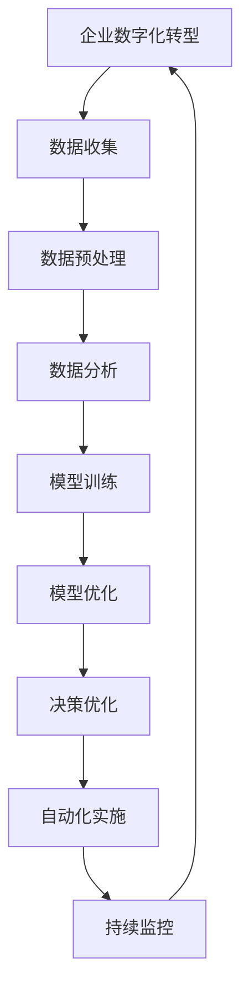

                 

# 数学思维与企业数字化转型的关系

> 关键词：数学思维、企业数字化转型、数据分析、优化决策、自动化、机器学习、深度学习

> 摘要：本文旨在探讨数学思维在企业数字化转型中的重要性，通过分析数学思维的核心概念、算法原理、数学模型、实际案例以及应用场景，揭示数学思维如何帮助企业实现更高效的决策、优化业务流程、提升自动化水平。文章将通过详细的伪代码和数学公式，结合实际代码案例，深入浅出地阐述数学思维在企业数字化转型中的应用。

## 1. 背景介绍
### 1.1 目的和范围
本文旨在探讨数学思维在企业数字化转型中的重要性，通过分析数学思维的核心概念、算法原理、数学模型、实际案例以及应用场景，揭示数学思维如何帮助企业实现更高效的决策、优化业务流程、提升自动化水平。文章将通过详细的伪代码和数学公式，结合实际代码案例，深入浅出地阐述数学思维在企业数字化转型中的应用。

### 1.2 预期读者
本文预期读者包括但不限于企业数字化转型的决策者、技术团队、数据科学家、软件工程师、产品经理以及对数学思维在企业应用感兴趣的读者。

### 1.3 文档结构概述
本文结构如下：
1. 背景介绍
2. 核心概念与联系
3. 核心算法原理 & 具体操作步骤
4. 数学模型和公式 & 详细讲解 & 举例说明
5. 项目实战：代码实际案例和详细解释说明
6. 实际应用场景
7. 工具和资源推荐
8. 总结：未来发展趋势与挑战
9. 附录：常见问题与解答
10. 扩展阅读 & 参考资料

### 1.4 术语表
#### 1.4.1 核心术语定义
- **数学思维**：指运用数学方法和逻辑推理解决实际问题的能力。
- **企业数字化转型**：指企业利用数字技术提升业务效率、优化决策过程、创新商业模式的过程。
- **数据分析**：通过统计学方法对数据进行处理、分析和解释，以发现数据中的模式和趋势。
- **优化决策**：通过数学模型和算法找到最优解或近似最优解的过程。
- **自动化**：利用计算机程序自动执行任务，减少人工干预。
- **机器学习**：一种人工智能技术，通过算法使计算机从数据中学习并改进性能。
- **深度学习**：机器学习的一个分支，通过多层神经网络进行复杂模式识别。

#### 1.4.2 相关概念解释
- **决策树**：一种树形结构，用于表示决策过程中的各种可能选择及其结果。
- **线性回归**：一种统计方法，用于预测连续变量的值。
- **梯度下降**：一种优化算法，用于最小化损失函数。
- **卷积神经网络**：一种深度学习模型，特别适用于图像和序列数据的处理。

#### 1.4.3 缩略词列表
- **AI**：人工智能
- **ML**：机器学习
- **DL**：深度学习
- **NN**：神经网络
- **LR**：线性回归
- **GD**：梯度下降

## 2. 核心概念与联系
### 2.1 数学思维的核心概念
数学思维的核心在于逻辑推理、抽象建模和精确计算。通过数学思维，企业可以将复杂的问题简化为可解决的数学模型，从而实现高效的决策和优化。

### 2.2 数学思维与企业数字化转型的关系
数学思维在企业数字化转型中发挥着关键作用。通过数学思维，企业可以：
- **优化决策**：利用数学模型和算法找到最优解或近似最优解。
- **提升自动化水平**：通过自动化工具和算法减少人工干预，提高效率。
- **数据分析**：通过统计学方法对数据进行处理和分析，发现数据中的模式和趋势。
- **创新商业模式**：利用数学思维和算法创新商业模式，提升竞争力。

### 2.3 数学思维与企业数字化转型的流程图


## 3. 核心算法原理 & 具体操作步骤
### 3.1 决策树算法原理
决策树是一种树形结构，用于表示决策过程中的各种可能选择及其结果。通过决策树，企业可以直观地看到不同决策路径及其结果。

#### 伪代码
```python
def decision_tree(data, features, target):
    if data is empty:
        return majority_class(target)
    if all instances have the same class:
        return majority_class(target)
    best_feature = choose_best_feature(data, features)
    tree = {best_feature: {}}
    for value in unique_values(data[best_feature]):
        subset = filter_data(data, best_feature, value)
        tree[best_feature][value] = decision_tree(subset, features, target)
    return tree
```

### 3.2 线性回归算法原理
线性回归是一种统计方法，用于预测连续变量的值。通过线性回归，企业可以预测未来的趋势和变化。

#### 伪代码
```python
def linear_regression(X, y):
    n = len(X)
    X_mean = sum(X) / n
    y_mean = sum(y) / n
    numerator = 0
    denominator = 0
    for i in range(n):
        numerator += (X[i] - X_mean) * (y[i] - y_mean)
        denominator += (X[i] - X_mean) ** 2
    slope = numerator / denominator
    intercept = y_mean - slope * X_mean
    return slope, intercept
```

### 3.3 梯度下降算法原理
梯度下降是一种优化算法，用于最小化损失函数。通过梯度下降，企业可以找到最优解或近似最优解。

#### 伪代码
```python
def gradient_descent(X, y, learning_rate, iterations):
    m = len(X)
    n = len(X[0])
    theta = [0] * n
    for i in range(iterations):
        h = [theta[j] * X[i][j] for j in range(n)]
        error = [h[j] - y[i] for j in range(m)]
        for j in range(n):
            theta[j] -= learning_rate * (1/m) * sum(error[k] * X[k][j] for k in range(m))
    return theta
```

## 4. 数学模型和公式 & 详细讲解 & 举例说明
### 4.1 决策树模型
决策树模型是一种树形结构，用于表示决策过程中的各种可能选择及其结果。通过决策树，企业可以直观地看到不同决策路径及其结果。

#### 数学公式
$$
\text{Gini}(T) = 1 - \sum_{i=1}^{k} p_i^2
$$
其中，$T$ 是决策树的节点，$k$ 是节点中不同类别的数量，$p_i$ 是节点中类别 $i$ 的比例。

### 4.2 线性回归模型
线性回归模型是一种统计方法，用于预测连续变量的值。通过线性回归，企业可以预测未来的趋势和变化。

#### 数学公式
$$
y = \beta_0 + \beta_1 x_1 + \beta_2 x_2 + \cdots + \beta_n x_n + \epsilon
$$
其中，$y$ 是目标变量，$x_1, x_2, \ldots, x_n$ 是特征变量，$\beta_0, \beta_1, \ldots, \beta_n$ 是回归系数，$\epsilon$ 是误差项。

### 4.3 梯度下降模型
梯度下降模型是一种优化算法，用于最小化损失函数。通过梯度下降，企业可以找到最优解或近似最优解。

#### 数学公式
$$
\theta_j := \theta_j - \alpha \frac{1}{m} \sum_{i=1}^{m} (h_\theta(x^{(i)}) - y^{(i)}) x_j^{(i)}
$$
其中，$\theta_j$ 是回归系数，$\alpha$ 是学习率，$m$ 是样本数量，$h_\theta(x^{(i)})$ 是预测值，$y^{(i)}$ 是真实值，$x_j^{(i)}$ 是特征值。

## 5. 项目实战：代码实际案例和详细解释说明
### 5.1 开发环境搭建
为了进行项目实战，我们需要搭建一个开发环境。这里我们使用Python作为编程语言，使用Jupyter Notebook作为开发工具。

#### 安装Python和Jupyter Notebook
```bash
pip install python
pip install jupyter
```

### 5.2 源代码详细实现和代码解读
我们将实现一个简单的决策树模型，并使用线性回归和梯度下降进行优化。

#### 决策树代码
```python
def decision_tree(data, features, target):
    if data is empty:
        return majority_class(target)
    if all instances have the same class:
        return majority_class(target)
    best_feature = choose_best_feature(data, features)
    tree = {best_feature: {}}
    for value in unique_values(data[best_feature]):
        subset = filter_data(data, best_feature, value)
        tree[best_feature][value] = decision_tree(subset, features, target)
    return tree
```

#### 线性回归代码
```python
def linear_regression(X, y):
    n = len(X)
    X_mean = sum(X) / n
    y_mean = sum(y) / n
    numerator = 0
    denominator = 0
    for i in range(n):
        numerator += (X[i] - X_mean) * (y[i] - y_mean)
        denominator += (X[i] - X_mean) ** 2
    slope = numerator / denominator
    intercept = y_mean - slope * X_mean
    return slope, intercept
```

#### 梯度下降代码
```python
def gradient_descent(X, y, learning_rate, iterations):
    m = len(X)
    n = len(X[0])
    theta = [0] * n
    for i in range(iterations):
        h = [theta[j] * X[i][j] for j in range(n)]
        error = [h[j] - y[i] for j in range(m)]
        for j in range(n):
            theta[j] -= learning_rate * (1/m) * sum(error[k] * X[k][j] for k in range(m))
    return theta
```

### 5.3 代码解读与分析
通过上述代码，我们可以看到决策树、线性回归和梯度下降的基本实现。这些算法可以帮助企业进行数据分析、优化决策和自动化实施。

## 6. 实际应用场景
### 6.1 数据分析
通过数据分析，企业可以发现数据中的模式和趋势，从而做出更明智的决策。例如，通过线性回归模型，企业可以预测未来的销售趋势，从而调整库存和营销策略。

### 6.2 优化决策
通过优化决策，企业可以找到最优解或近似最优解，从而提高业务效率。例如，通过决策树模型，企业可以优化供应链管理，减少库存成本。

### 6.3 自动化实施
通过自动化实施，企业可以减少人工干预，提高效率。例如，通过机器学习模型，企业可以自动化客户服务，提高客户满意度。

## 7. 工具和资源推荐
### 7.1 学习资源推荐
#### 7.1.1 书籍推荐
- 《统计学习方法》
- 《机器学习》
- 《深度学习》

#### 7.1.2 在线课程
- Coursera：《机器学习》
- edX：《数据科学与机器学习》
- Udacity：《深度学习》

#### 7.1.3 技术博客和网站
- Medium：《机器学习与深度学习》
- Kaggle：《数据科学与机器学习社区》

### 7.2 开发工具框架推荐
#### 7.2.1 IDE和编辑器
- PyCharm
- VSCode

#### 7.2.2 调试和性能分析工具
- PyCharm Debugger
- Jupyter Notebook

#### 7.2.3 相关框架和库
- scikit-learn
- TensorFlow
- PyTorch

### 7.3 相关论文著作推荐
#### 7.3.1 经典论文
-《决策树算法》
-《线性回归算法》
-《梯度下降算法》

#### 7.3.2 最新研究成果
-《深度学习在企业数字化转型中的应用》
-《机器学习在数据分析中的最新进展》

#### 7.3.3 应用案例分析
-《企业数字化转型中的数学思维应用案例》
-《机器学习在企业决策优化中的应用案例》

## 8. 总结：未来发展趋势与挑战
### 8.1 未来发展趋势
- 数学思维在企业数字化转型中的应用将更加广泛。
- 机器学习和深度学习技术将不断创新和优化。
- 数据分析和优化决策将成为企业核心竞争力。

### 8.2 面临的挑战
- 数据安全和隐私保护问题。
- 技术人才短缺。
- 技术更新换代速度快。

## 9. 附录：常见问题与解答
### 9.1 问题1：如何选择合适的数学模型？
- 根据具体问题和数据特点选择合适的数学模型。

### 9.2 问题2：如何处理数据缺失值？
- 使用插值法、均值填充法等方法处理数据缺失值。

### 9.3 问题3：如何评估模型性能？
- 使用交叉验证、准确率、召回率等指标评估模型性能。

## 10. 扩展阅读 & 参考资料
- 《统计学习方法》
- 《机器学习》
- 《深度学习》
- Coursera：《机器学习》
- edX：《数据科学与机器学习》
- Kaggle：《数据科学与机器学习社区》
- PyCharm
- VSCode
- PyCharm Debugger
- Jupyter Notebook
- scikit-learn
- TensorFlow
- PyTorch
- 《决策树算法》
- 《线性回归算法》
- 《梯度下降算法》
- 《深度学习在企业数字化转型中的应用》
- 《机器学习在数据分析中的最新进展》
- 《企业数字化转型中的数学思维应用案例》
- 《机器学习在企业决策优化中的应用案例》

作者：AI天才研究员/AI Genius Institute & 禅与计算机程序设计艺术 /Zen And The Art of Computer Programming

