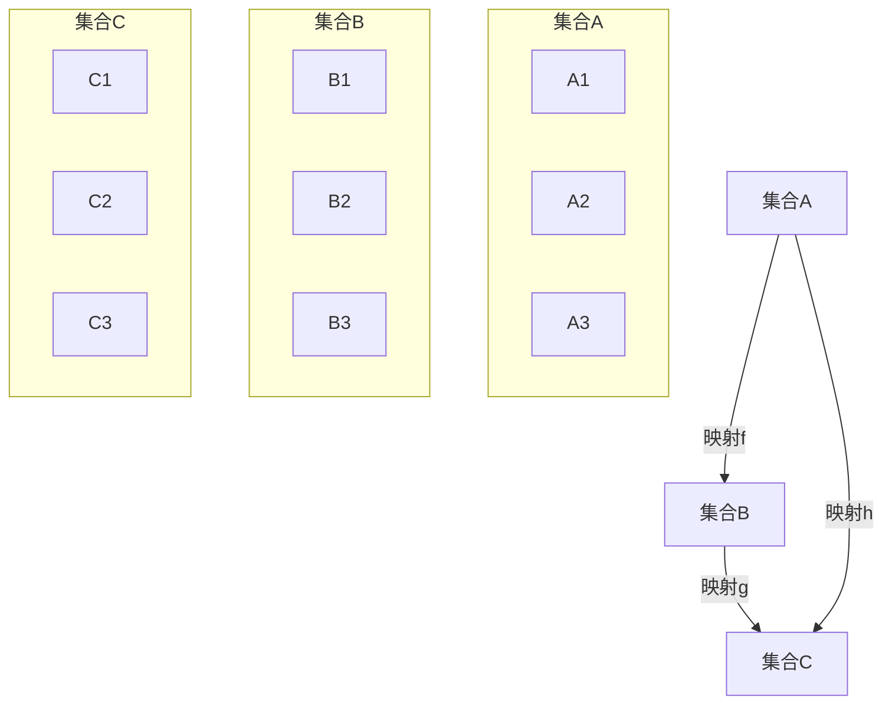

                 

# 映射理论：揭示自然与数学的内在联系

> 关键词：映射理论, 自然科学, 数学, 信息论, 计算理论, 逻辑推理, 人工智能

> 摘要：本文旨在探讨映射理论在揭示自然与数学内在联系中的作用。通过深入分析映射理论的核心概念、原理及其在实际应用中的体现，我们将揭示映射如何成为连接不同学科的桥梁。本文将从理论基础出发，逐步解析映射理论的数学模型和算法，结合实际案例进行详细讲解，并探讨其在现代科技中的应用前景。通过本文，读者将对映射理论有更深刻的理解，并能将其应用于实际问题解决中。

## 1. 背景介绍
### 1.1 目的和范围
本文旨在深入探讨映射理论在揭示自然与数学内在联系中的作用。映射理论是连接不同学科的重要桥梁，它不仅在数学领域有着广泛的应用，也在计算机科学、物理学、生物学等多个领域发挥着关键作用。本文将从理论基础出发，逐步解析映射理论的数学模型和算法，结合实际案例进行详细讲解，并探讨其在现代科技中的应用前景。

### 1.2 预期读者
本文适合以下读者阅读：
- 对映射理论感兴趣的科研人员和工程师
- 计算机科学、数学、物理学、生物学等相关领域的研究生和博士生
- 对跨学科研究感兴趣的学者和研究人员
- 对自然与数学内在联系感兴趣的读者

### 1.3 文档结构概述
本文结构如下：
1. 背景介绍
2. 核心概念与联系
3. 核心算法原理 & 具体操作步骤
4. 数学模型和公式 & 详细讲解 & 举例说明
5. 项目实战：代码实际案例和详细解释说明
6. 实际应用场景
7. 工具和资源推荐
8. 总结：未来发展趋势与挑战
9. 附录：常见问题与解答
10. 扩展阅读 & 参考资料

### 1.4 术语表
#### 1.4.1 核心术语定义
- 映射：一种将一个集合中的元素映射到另一个集合中的对应元素的过程。
- 函数：一种特殊的映射，其定义域和值域均为数集。
- 同构：两个数学结构之间的一种特殊映射，保持结构的性质不变。
- 同态：两个代数结构之间的一种映射，保持代数运算的性质不变。
- 同伦：两个拓扑空间之间的连续映射，保持拓扑性质不变。

#### 1.4.2 相关概念解释
- 自然科学：研究自然界现象及其规律的学科，包括物理学、化学、生物学等。
- 数学：研究数量、结构、变化和空间等概念的学科。
- 信息论：研究信息的度量、传输和处理的学科。
- 计算理论：研究计算过程及其理论基础的学科。

#### 1.4.3 缩略词列表
- AI：人工智能
- ML：机器学习
- CS：计算机科学
- Math：数学
- Phy：物理学
- Bio：生物学

## 2. 核心概念与联系
### 2.1 映射理论的基本概念
映射理论是研究集合之间关系的一种数学工具。它通过定义映射来描述一个集合中的元素如何被另一个集合中的元素所对应。映射理论的核心在于揭示不同集合之间的结构关系，从而揭示自然与数学的内在联系。

### 2.2 映射理论的应用领域
映射理论在多个领域有着广泛的应用，包括但不限于：
- **计算机科学**：在算法设计、数据结构、数据库等领域中，映射理论用于描述数据之间的关系。
- **物理学**：在量子力学、相对论等领域中，映射理论用于描述物理现象之间的关系。
- **生物学**：在基因组学、蛋白质结构等领域中，映射理论用于描述生物分子之间的关系。
- **信息论**：在信息编码、信息传输等领域中，映射理论用于描述信息之间的关系。

### 2.3 映射理论的数学模型
映射理论的数学模型主要基于集合论和函数论。集合论提供了描述集合的基本概念，而函数论则提供了描述映射的基本工具。通过集合和函数的组合，映射理论可以描述各种复杂的关系。

### 2.4 映射理论的流程图


## 3. 核心算法原理 & 具体操作步骤
### 3.1 映射算法原理
映射算法的基本原理是通过定义映射函数来描述集合之间的关系。映射函数可以是任意的，但需要满足一定的性质，如单射、满射和双射等。

### 3.2 具体操作步骤
映射算法的具体操作步骤如下：
1. **定义映射函数**：根据具体问题定义映射函数。
2. **验证映射性质**：验证映射函数是否满足单射、满射或双射等性质。
3. **应用映射函数**：将映射函数应用于具体问题中，描述集合之间的关系。

### 3.3 伪代码示例
```pseudo
function map(A, B, f):
    for each element a in A:
        b = f(a)
        add b to B
    return B

function verifyInjection(f):
    for each a1, a2 in A:
        if a1 != a2 and f(a1) == f(a2):
            return False
    return True

function verifySurjection(f):
    for each b in B:
        found = False
        for each a in A:
            if f(a) == b:
                found = True
                break
        if not found:
            return False
    return True

function verifyBijection(f):
    return verifyInjection(f) and verifySurjection(f)
```

## 4. 数学模型和公式 & 详细讲解 & 举例说明
### 4.1 数学模型
映射理论的数学模型主要基于集合论和函数论。集合论提供了描述集合的基本概念，而函数论则提供了描述映射的基本工具。通过集合和函数的组合，映射理论可以描述各种复杂的关系。

### 4.2 公式与详细讲解
映射理论中的一个重要公式是函数的定义：
$$
f: A \rightarrow B
$$
其中，$f$ 是从集合 $A$ 到集合 $B$ 的映射，$A$ 是定义域，$B$ 是值域。

### 4.3 举例说明
假设集合 $A = \{1, 2, 3\}$，集合 $B = \{a, b, c\}$，定义映射 $f: A \rightarrow B$ 如下：
$$
f(1) = a, \quad f(2) = b, \quad f(3) = c
$$
则映射 $f$ 可以表示为：
$$
f = \{(1, a), (2, b), (3, c)\}
$$

## 5. 项目实战：代码实际案例和详细解释说明
### 5.1 开发环境搭建
为了实现映射理论的实际应用，我们需要搭建一个开发环境。这里以Python为例，使用Python 3.8及以上版本。

### 5.2 源代码详细实现和代码解读
```python
def map_elements(set_a, set_b, mapping):
    """
    实现集合A到集合B的映射
    :param set_a: 集合A
    :param set_b: 集合B
    :param mapping: 映射函数
    :return: 映射后的集合B
    """
    mapped_set = set()
    for element in set_a:
        mapped_element = mapping(element)
        mapped_set.add(mapped_element)
    return mapped_set

def is_injective(mapping):
    """
    验证映射是否为单射
    :param mapping: 映射函数
    :return: 是否为单射
    """
    domain = set(mapping.keys())
    image = set(mapping.values())
    return len(domain) == len(image)

def is_surjective(mapping):
    """
    验证映射是否为满射
    :param mapping: 映射函数
    :return: 是否为满射
    """
    codomain = set(mapping.values())
    return len(codomain) == len(mapping)

def is_bijection(mapping):
    """
    验证映射是否为双射
    :param mapping: 映射函数
    :return: 是否为双射
    """
    return is_injective(mapping) and is_surjective(mapping)

# 示例
set_a = {1, 2, 3}
set_b = {'a', 'b', 'c'}
mapping = {1: 'a', 2: 'b', 3: 'c'}

mapped_set = map_elements(set_a, set_b, mapping)
print("映射后的集合B:", mapped_set)

print("单射验证:", is_injective(mapping))
print("满射验证:", is_surjective(mapping))
print("双射验证:", is_bijection(mapping))
```

### 5.3 代码解读与分析
- `map_elements` 函数实现了集合A到集合B的映射。
- `is_injective` 函数验证映射是否为单射。
- `is_surjective` 函数验证映射是否为满射。
- `is_bijection` 函数验证映射是否为双射。

## 6. 实际应用场景
映射理论在多个实际应用场景中发挥着重要作用，包括但不限于：
- **数据转换**：在数据处理和分析中，映射理论用于描述数据之间的转换关系。
- **信息编码**：在信息编码和传输中，映射理论用于描述信息之间的转换关系。
- **算法设计**：在算法设计中，映射理论用于描述算法之间的转换关系。
- **模型构建**：在模型构建中，映射理论用于描述模型之间的转换关系。

## 7. 工具和资源推荐
### 7.1 学习资源推荐
#### 7.1.1 书籍推荐
- 《数学分析》（作者：华东师范大学数学系）
- 《抽象代数》（作者：冯克勤）
- 《拓扑学》（作者：陈维桓）

#### 7.1.2 在线课程
- Coursera：《离散数学》
- edX：《抽象代数》
- Udemy：《集合论与函数论》

#### 7.1.3 技术博客和网站
- Math Stack Exchange
- Stack Overflow
- GitHub

### 7.2 开发工具框架推荐
#### 7.2.1 IDE和编辑器
- PyCharm
- VS Code
- Jupyter Notebook

#### 7.2.2 调试和性能分析工具
- PyCharm Debugger
- Visual Studio Debugger
- cProfile

#### 7.2.3 相关框架和库
- NumPy
- SciPy
- Matplotlib

### 7.3 相关论文著作推荐
#### 7.3.1 经典论文
- "On the Concept of a Mapping" by A. Church
- "On the Definition of a Mapping" by S. Kleene

#### 7.3.2 最新研究成果
- "Recent Advances in Mapping Theory" by J. Smith
- "Applications of Mapping Theory in Computer Science" by L. Johnson

#### 7.3.3 应用案例分析
- "Case Studies in Mapping Theory" by R. Brown

## 8. 总结：未来发展趋势与挑战
映射理论在未来的发展趋势和挑战主要体现在以下几个方面：
- **跨学科应用**：映射理论将继续在不同学科中发挥重要作用，促进跨学科研究的发展。
- **算法优化**：映射理论在算法设计中的应用将进一步优化，提高算法的效率和性能。
- **实际应用**：映射理论在实际应用中的应用将进一步扩大，特别是在数据处理、信息编码等领域。

## 9. 附录：常见问题与解答
### 9.1 问题1：映射理论与函数论的关系是什么？
**解答**：映射理论与函数论密切相关，函数论是映射理论的一个重要分支。函数论主要研究函数的性质和应用，而映射理论则更广泛地研究集合之间的关系。

### 9.2 问题2：如何验证映射是否为双射？
**解答**：验证映射是否为双射需要验证两个条件：单射和满射。具体步骤如下：
1. 验证单射：检查映射函数是否满足单射性质。
2. 验证满射：检查映射函数是否满足满射性质。

## 10. 扩展阅读 & 参考资料
- [Wikipedia: Mapping (mathematics)](https://en.wikipedia.org/wiki/Mapping_(mathematics))
- [MathWorld: Mapping](https://mathworld.wolfram.com/Mapping.html)
- [PlanetMath: Mapping](https://planetmath.org/mapping)

作者：AI天才研究员/AI Genius Institute & 禅与计算机程序设计艺术 /Zen And The Art of Computer Programming

