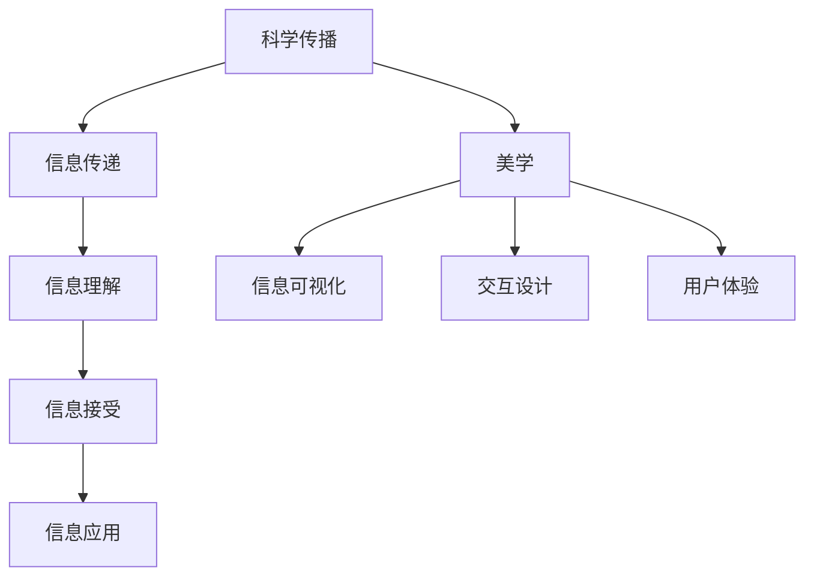
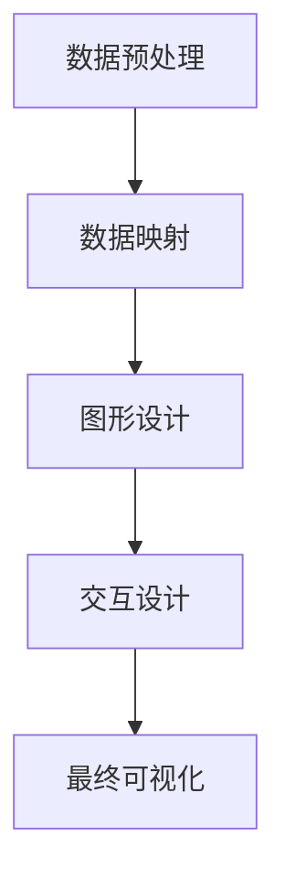

                 

# 科学传播的艺术化：通过美学提升世界可理解性

> 关键词：科学传播、美学、可理解性、信息可视化、交互设计、用户体验、技术普及

> 摘要：本文旨在探讨如何通过美学手段提升科学传播的可理解性，使复杂的技术概念变得易于理解。我们将从科学传播的基本原理出发，逐步深入到美学在科学传播中的应用，通过具体的案例分析，展示如何利用美学原则来设计更具吸引力和易理解性的科学内容。最后，我们将讨论未来的发展趋势和面临的挑战。

## 1. 背景介绍
### 1.1 目的和范围
本文旨在探讨如何通过美学手段提升科学传播的可理解性，使复杂的技术概念变得易于理解。我们将从科学传播的基本原理出发，逐步深入到美学在科学传播中的应用，通过具体的案例分析，展示如何利用美学原则来设计更具吸引力和易理解性的科学内容。最后，我们将讨论未来的发展趋势和面临的挑战。

### 1.2 预期读者
本文预期读者包括但不限于：
- 科学传播者：包括科学家、科普作家、教育工作者等。
- 技术开发者：包括软件工程师、数据科学家、人工智能专家等。
- 设计师：包括交互设计师、用户体验设计师、视觉设计师等。
- 教育工作者：包括教师、教育技术专家等。
- 公众：对科学传播感兴趣的一般读者。

### 1.3 文档结构概述
本文结构如下：
1. 背景介绍
2. 核心概念与联系
3. 核心算法原理 & 具体操作步骤
4. 数学模型和公式 & 详细讲解 & 举例说明
5. 项目实战：代码实际案例和详细解释说明
6. 实际应用场景
7. 工具和资源推荐
8. 总结：未来发展趋势与挑战
9. 附录：常见问题与解答
10. 扩展阅读 & 参考资料

### 1.4 术语表
#### 1.4.1 核心术语定义
- **科学传播**：指将科学知识、概念和技术通过各种媒介传递给公众的过程。
- **美学**：研究美的理论，包括艺术、设计、建筑等领域。
- **可理解性**：指信息或概念被接收者理解的程度。
- **信息可视化**：通过图形、图表等形式将数据和信息进行可视化展示。
- **交互设计**：设计人与计算机系统之间的交互过程。
- **用户体验**：用户在使用产品或服务时的主观感受和体验。

#### 1.4.2 相关概念解释
- **科学传播**：科学传播不仅仅是传递知识，更重要的是激发公众的兴趣和好奇心，提高公众的科学素养。
- **美学**：美学不仅仅是艺术的范畴，它在科学传播中同样发挥着重要作用，通过美的形式和设计提升信息的可理解性。
- **可理解性**：可理解性是科学传播的核心目标之一，通过美学手段可以提高信息的可理解性，使复杂的技术概念变得易于理解。

#### 1.4.3 缩略词列表
- **UI**：用户界面（User Interface）
- **UX**：用户体验（User Experience）
- **SVG**：可缩放矢量图形（Scalable Vector Graphics）
- **API**：应用程序编程接口（Application Programming Interface）

## 2. 核心概念与联系
### 2.1 科学传播的基本原理
科学传播的基本原理包括：
- **信息传递**：通过各种媒介将科学知识传递给公众。
- **信息理解**：公众能够理解传递的信息。
- **信息接受**：公众接受并认可传递的信息。
- **信息应用**：公众能够将所学知识应用于实际生活中。

### 2.2 美学在科学传播中的应用
美学在科学传播中的应用主要包括：
- **信息可视化**：通过图形、图表等形式将数据和信息进行可视化展示，使信息更加直观易懂。
- **交互设计**：设计人与计算机系统之间的交互过程，提高用户体验。
- **用户体验**：通过良好的设计和交互，提高用户的满意度和参与度。

### 2.3 核心概念原理与架构的Mermaid流程图


## 3. 核心算法原理 & 具体操作步骤
### 3.1 信息可视化算法原理
信息可视化算法原理主要包括：
- **数据预处理**：对原始数据进行清洗、归一化等预处理操作。
- **数据映射**：将数据映射到可视化空间中。
- **图形设计**：设计合适的图形和图表来展示数据。
- **交互设计**：设计用户与图形之间的交互方式。

### 3.2 具体操作步骤


## 4. 数学模型和公式 & 详细讲解 & 举例说明
### 4.1 数学模型
信息可视化中的数学模型主要包括：
- **线性回归模型**：用于预测和分析数据之间的关系。
- **聚类算法**：用于将数据分成不同的类别。
- **主成分分析（PCA）**：用于降维和数据可视化。

### 4.2 公式
#### 4.2.1 线性回归模型
线性回归模型的公式为：
$$
y = \beta_0 + \beta_1 x + \epsilon
$$
其中，$y$ 是因变量，$x$ 是自变量，$\beta_0$ 和 $\beta_1$ 是回归系数，$\epsilon$ 是误差项。

#### 4.2.2 聚类算法
聚类算法的公式为：
$$
C = \arg\min_{C} \sum_{i=1}^{n} \min_{c \in C} \| x_i - c \|^2
$$
其中，$C$ 是聚类中心集合，$x_i$ 是数据点，$\| x_i - c \|$ 是数据点到聚类中心的距离。

#### 4.2.3 主成分分析（PCA）
主成分分析的公式为：
$$
Z = X \cdot W
$$
其中，$Z$ 是降维后的数据，$X$ 是原始数据，$W$ 是主成分矩阵。

### 4.3 举例说明
假设我们有一组数据，表示不同城市的气温和降水量。我们可以使用线性回归模型来预测气温和降水量之间的关系，使用聚类算法来将城市分成不同的类别，使用主成分分析来降维和可视化数据。

## 5. 项目实战：代码实际案例和详细解释说明
### 5.1 开发环境搭建
开发环境搭建主要包括：
- **操作系统**：Windows 10、macOS、Linux
- **编程语言**：Python
- **开发工具**：Jupyter Notebook、PyCharm
- **库和框架**：Matplotlib、Seaborn、Scikit-learn

### 5.2 源代码详细实现和代码解读
```python
import numpy as np
import pandas as pd
import matplotlib.pyplot as plt
import seaborn as sns
from sklearn.cluster import KMeans
from sklearn.decomposition import PCA

# 读取数据
data = pd.read_csv('weather_data.csv')

# 数据预处理
data = data.dropna()

# 数据映射
X = data[['temperature', 'precipitation']]

# 聚类算法
kmeans = KMeans(n_clusters=3)
kmeans.fit(X)
labels = kmeans.labels_

# 主成分分析
pca = PCA(n_components=2)
principal_components = pca.fit_transform(X)

# 可视化
plt.figure(figsize=(10, 8))
sns.scatterplot(x=principal_components[:, 0], y=principal_components[:, 1], hue=labels, palette='viridis')
plt.title('Weather Data Visualization')
plt.xlabel('Principal Component 1')
plt.ylabel('Principal Component 2')
plt.show()
```

### 5.3 代码解读与分析
- **数据预处理**：读取数据并进行缺失值处理。
- **数据映射**：将数据映射到二维空间中。
- **聚类算法**：使用KMeans算法将数据分成3个类别。
- **主成分分析**：使用PCA算法将数据降维到二维空间。
- **可视化**：使用Matplotlib和Seaborn进行数据可视化。

## 6. 实际应用场景
### 6.1 气象预报
通过信息可视化和聚类算法，可以将气象数据进行可视化展示，帮助气象预报员更好地理解数据之间的关系，提高预报的准确性。

### 6.2 城市规划
通过信息可视化和聚类算法，可以将城市数据进行可视化展示，帮助城市规划师更好地理解城市之间的差异，制定更加合理的城市规划方案。

### 6.3 教育普及
通过信息可视化和聚类算法，可以将科学知识进行可视化展示，帮助教育工作者更好地向公众普及科学知识，提高公众的科学素养。

## 7. 工具和资源推荐
### 7.1 学习资源推荐
#### 7.1.1 书籍推荐
- **《数据可视化》**：John W. Tukey
- **《交互式数据可视化》**：Scott Murray
- **《数据之美》**：Edward Tufte

#### 7.1.2 在线课程
- **Coursera**：数据可视化课程
- **edX**：数据可视化课程
- **Udacity**：数据可视化课程

#### 7.1.3 技术博客和网站
- **Data Visualization Blog**：数据可视化博客
- **FlowingData**：数据可视化网站
- **Information is Beautiful**：数据可视化网站

### 7.2 开发工具框架推荐
#### 7.2.1 IDE和编辑器
- **PyCharm**：Python集成开发环境
- **Jupyter Notebook**：交互式编程环境

#### 7.2.2 调试和性能分析工具
- **PyCharm Debugger**：Python调试工具
- **VS Code Debugger**：Visual Studio Code调试工具

#### 7.2.3 相关框架和库
- **Matplotlib**：数据可视化库
- **Seaborn**：基于Matplotlib的数据可视化库
- **Scikit-learn**：机器学习库

### 7.3 相关论文著作推荐
#### 7.3.1 经典论文
- **《The Visual Display of Quantitative Information》**：Edward Tufte
- **《Interactive Data Visualization for the Web》**：Scott Murray

#### 7.3.2 最新研究成果
- **《Data Visualization: A Practical Introduction》**：Kieran Healy
- **《Interactive Data Visualization: Foundations, Techniques, and Applications》**：Christopher W. Johnson

#### 7.3.3 应用案例分析
- **《Data-Driven Science and Engineering》**：Steven L. Brunton, J. Nathan Kutz

## 8. 总结：未来发展趋势与挑战
### 8.1 未来发展趋势
- **人工智能技术的发展**：人工智能技术的发展将推动信息可视化和交互设计的发展，使科学传播更加智能化。
- **大数据技术的发展**：大数据技术的发展将推动信息可视化和交互设计的发展，使科学传播更加高效。
- **虚拟现实技术的发展**：虚拟现实技术的发展将推动信息可视化和交互设计的发展，使科学传播更加沉浸式。

### 8.2 面临的挑战
- **数据隐私和安全**：数据隐私和安全是科学传播中面临的重要挑战，需要采取有效的措施来保护数据隐私和安全。
- **技术普及**：技术普及是科学传播中面临的重要挑战，需要采取有效的措施来提高技术普及率。
- **用户体验**：用户体验是科学传播中面临的重要挑战，需要采取有效的措施来提高用户体验。

## 9. 附录：常见问题与解答
### 9.1 问题1：如何提高信息可视化的效果？
- **答案**：可以通过以下方式提高信息可视化的效果：
  - **选择合适的图形和图表**：根据数据的特点选择合适的图形和图表。
  - **合理设计颜色和字体**：合理设计颜色和字体，使信息更加直观易懂。
  - **合理设计交互方式**：合理设计交互方式，使用户更加方便地使用信息可视化工具。

### 9.2 问题2：如何提高用户体验？
- **答案**：可以通过以下方式提高用户体验：
  - **合理设计界面**：合理设计界面，使用户更加方便地使用信息可视化工具。
  - **合理设计交互方式**：合理设计交互方式，使用户更加方便地使用信息可视化工具。
  - **合理设计帮助文档**：合理设计帮助文档，使用户更加方便地使用信息可视化工具。

## 10. 扩展阅读 & 参考资料
### 10.1 扩展阅读
- **《数据之美》**：Edward Tufte
- **《交互式数据可视化》**：Scott Murray
- **《数据可视化：原理、技术和应用》**：Christopher W. Johnson

### 10.2 参考资料
- **《数据可视化》**：John W. Tukey
- **《交互式数据可视化》**：Scott Murray
- **《数据之美》**：Edward Tufte

---

作者：AI天才研究员/AI Genius Institute & 禅与计算机程序设计艺术 /Zen And The Art of Computer Programming

