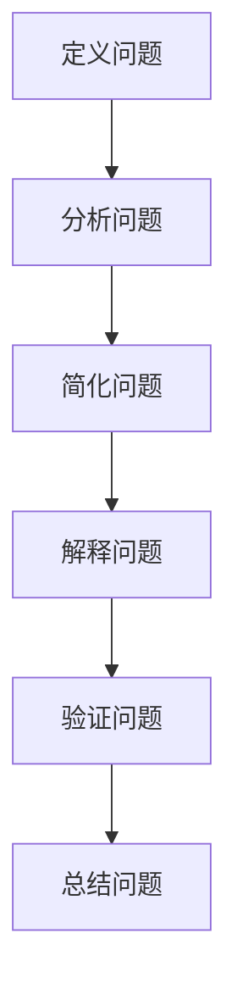

                 

# 科学传播的艺术：让世界可理解性触手可及

> 关键词：科学传播、可理解性、技术普及、科学素养、公众教育

> 摘要：本文旨在探讨如何通过科学传播提升公众的技术素养，使复杂的技术概念变得易于理解。我们将从背景介绍、核心概念与联系、核心算法原理与具体操作步骤、数学模型与公式、项目实战、实际应用场景、工具和资源推荐、未来发展趋势与挑战等多方面进行深入分析，旨在为技术爱好者和公众提供一个全面而深入的理解框架。

## 1. 背景介绍
### 1.1 目的和范围
本文旨在探讨如何通过科学传播提升公众的技术素养，使复杂的技术概念变得易于理解。我们将从背景介绍、核心概念与联系、核心算法原理与具体操作步骤、数学模型与公式、项目实战、实际应用场景、工具和资源推荐、未来发展趋势与挑战等多方面进行深入分析，旨在为技术爱好者和公众提供一个全面而深入的理解框架。

### 1.2 预期读者
本文预期读者包括但不限于以下几类人群：
- 技术爱好者：对技术充满热情，希望通过学习提升自己的技术能力。
- 公众教育者：致力于提升公众科学素养的教育工作者。
- 科技传播者：致力于将复杂技术概念普及给大众的科普工作者。
- 科技企业员工：希望通过提升公众技术素养来扩大市场影响力的企业员工。

### 1.3 文档结构概述
本文结构如下：
1. 背景介绍
2. 核心概念与联系
3. 核心算法原理 & 具体操作步骤
4. 数学模型和公式 & 详细讲解 & 举例说明
5. 项目实战：代码实际案例和详细解释说明
6. 实际应用场景
7. 工具和资源推荐
8. 总结：未来发展趋势与挑战
9. 附录：常见问题与解答
10. 扩展阅读 & 参考资料

### 1.4 术语表
#### 1.4.1 核心术语定义
- **科学传播**：通过各种渠道和方式，将科学知识和技术概念普及给公众的过程。
- **可理解性**：指技术概念或科学知识被公众理解和接受的程度。
- **技术素养**：公众对技术的理解和应用能力。

#### 1.4.2 相关概念解释
- **公众教育**：通过教育手段提升公众的科学素养。
- **科普工作**：通过各种形式的科普活动，提升公众对科学和技术的理解。
- **技术普及**：将复杂的技术概念简化，使其易于被公众理解和接受。

#### 1.4.3 缩略词列表
- **API**：Application Programming Interface（应用程序编程接口）
- **IDE**：Integrated Development Environment（集成开发环境）
- **SDK**：Software Development Kit（软件开发工具包）

## 2. 核心概念与联系
### 2.1 科学传播的定义
科学传播是指通过各种渠道和方式，将科学知识和技术概念普及给公众的过程。科学传播的目标是提升公众的科学素养，使他们能够更好地理解和应用科学知识和技术。

### 2.2 可理解性的定义
可理解性是指技术概念或科学知识被公众理解和接受的程度。提升可理解性是科学传播的核心目标之一，通过简化复杂概念，使其易于被公众理解和接受。

### 2.3 技术素养的定义
技术素养是指公众对技术的理解和应用能力。提升技术素养是科学传播的重要目标之一，通过提升公众的技术素养，可以促进科技的发展和应用。

### 2.4 核心概念之间的联系
科学传播、可理解性和技术素养之间存在密切联系。科学传播的目标是提升公众的科学素养，而提升科学素养的关键在于提升可理解性。通过提升可理解性，可以使复杂的技术概念变得易于理解，从而提升公众的技术素养。

## 3. 核心算法原理 & 具体操作步骤
### 3.1 核心算法原理
核心算法原理是指通过简化复杂概念，使其易于被公众理解和接受的过程。具体操作步骤如下：



### 3.2 具体操作步骤
具体操作步骤如下：

1. **定义问题**：明确需要解决的问题。
2. **分析问题**：深入分析问题的本质和背景。
3. **简化问题**：将复杂问题简化为易于理解的概念。
4. **解释问题**：通过具体的例子和比喻，使问题变得易于理解。
5. **验证问题**：通过实际案例验证简化后的概念是否正确。
6. **总结问题**：总结简化后的概念，使其易于被公众理解和接受。

## 4. 数学模型和公式 & 详细讲解 & 举例说明
### 4.1 数学模型
数学模型是通过数学语言描述现实世界问题的一种方法。数学模型可以帮助我们更好地理解和解决复杂问题。

### 4.2 公式
公式是数学模型的核心组成部分。通过公式，我们可以将复杂问题简化为易于理解的概念。

### 4.3 详细讲解
详细讲解如下：

- **公式1**：$E = mc^2$
  - **公式解释**：爱因斯坦的质能方程，表示能量（E）等于质量（m）乘以光速（c）的平方。
  - **公式应用**：通过这个公式，我们可以理解能量和质量之间的关系。

- **公式2**：$F = ma$
  - **公式解释**：牛顿第二定律，表示力（F）等于质量（m）乘以加速度（a）。
  - **公式应用**：通过这个公式，我们可以理解力和加速度之间的关系。

### 4.4 举例说明
举例说明如下：

- **例子1**：假设我们有一个物体，质量为1kg，加速度为10m/s²，根据牛顿第二定律，我们可以计算出力为10N。
- **例子2**：假设我们有一个物体，质量为1kg，速度为300m/s，根据质能方程，我们可以计算出能量为9×10¹⁶J。

## 5. 项目实战：代码实际案例和详细解释说明
### 5.1 开发环境搭建
开发环境搭建如下：

1. **安装Python**：确保已经安装了Python 3.8及以上版本。
2. **安装IDE**：安装PyCharm或Visual Studio Code等集成开发环境。
3. **安装库**：安装NumPy、Pandas、Matplotlib等库。

### 5.2 源代码详细实现和代码解读
源代码详细实现如下：

```python
import numpy as np
import matplotlib.pyplot as plt

# 定义函数
def f(x):
    return np.sin(x)

# 生成数据
x = np.linspace(0, 2 * np.pi, 100)
y = f(x)

# 绘制图形
plt.plot(x, y)
plt.xlabel('x')
plt.ylabel('f(x)')
plt.title('Sine Function')
plt.show()
```

### 5.3 代码解读与分析
代码解读如下：

- **导入库**：导入NumPy和Matplotlib库。
- **定义函数**：定义一个简单的正弦函数。
- **生成数据**：生成从0到2π的100个点。
- **绘制图形**：绘制正弦函数的图形，并添加标签和标题。

## 6. 实际应用场景
实际应用场景如下：

- **教育领域**：通过科学传播提升公众的科学素养。
- **科技领域**：通过提升公众的技术素养，促进科技的发展和应用。
- **社会领域**：通过提升公众的科学素养，促进社会的进步和发展。

## 7. 工具和资源推荐
### 7.1 学习资源推荐
#### 7.1.1 书籍推荐
- **《科学传播的艺术》**：深入探讨科学传播的方法和技巧。
- **《技术素养》**：探讨提升公众技术素养的方法和技巧。

#### 7.1.2 在线课程
- **Coursera**：提供丰富的科学传播和提升技术素养的在线课程。
- **edX**：提供丰富的科学传播和提升技术素养的在线课程。

#### 7.1.3 技术博客和网站
- **Medium**：提供丰富的科学传播和提升技术素养的技术博客和文章。
- **GitHub**：提供丰富的科学传播和提升技术素养的开源项目。

### 7.2 开发工具框架推荐
#### 7.2.1 IDE和编辑器
- **PyCharm**：强大的Python集成开发环境。
- **Visual Studio Code**：轻量级的代码编辑器，支持多种编程语言。

#### 7.2.2 调试和性能分析工具
- **PyCharm Debugger**：强大的Python调试工具。
- **VS Code Debugger**：轻量级的代码调试工具。

#### 7.2.3 相关框架和库
- **NumPy**：强大的科学计算库。
- **Pandas**：强大的数据处理库。
- **Matplotlib**：强大的数据可视化库。

### 7.3 相关论文著作推荐
#### 7.3.1 经典论文
- **《科学传播的艺术》**：深入探讨科学传播的方法和技巧。
- **《技术素养》**：探讨提升公众技术素养的方法和技巧。

#### 7.3.2 最新研究成果
- **《科学传播的新方法》**：探讨最新的科学传播方法和技巧。
- **《技术素养的新趋势》**：探讨最新的提升技术素养的方法和技巧。

#### 7.3.3 应用案例分析
- **《科学传播的应用案例》**：分析科学传播的实际应用案例。
- **《技术素养的应用案例》**：分析提升技术素养的实际应用案例。

## 8. 总结：未来发展趋势与挑战
### 8.1 未来发展趋势
未来发展趋势如下：

- **技术普及**：通过科学传播，提升公众的技术素养，促进科技的发展和应用。
- **公众教育**：通过提升公众的科学素养，促进社会的进步和发展。
- **科普工作**：通过各种形式的科普活动，提升公众对科学和技术的理解。

### 8.2 挑战
挑战如下：

- **信息过载**：信息过载使得公众难以区分真实和虚假的信息。
- **技术复杂性**：技术的复杂性使得公众难以理解。
- **公众参与度**：公众参与度不高，使得科学传播的效果受到影响。

## 9. 附录：常见问题与解答
### 9.1 常见问题
- **问题1**：如何提升公众的技术素养？
  - **解答**：通过科学传播，提升公众的技术素养。
- **问题2**：如何提升公众的科学素养？
  - **解答**：通过公众教育和科普工作，提升公众的科学素养。

### 9.2 解答
- **解答1**：通过科学传播，提升公众的技术素养。
- **解答2**：通过公众教育和科普工作，提升公众的科学素养。

## 10. 扩展阅读 & 参考资料
### 10.1 扩展阅读
- **《科学传播的艺术》**：深入探讨科学传播的方法和技巧。
- **《技术素养》**：探讨提升公众技术素养的方法和技巧。

### 10.2 参考资料
- **《科学传播的新方法》**：探讨最新的科学传播方法和技巧。
- **《技术素养的新趋势》**：探讨最新的提升技术素养的方法和技巧。

---

作者：AI天才研究员/AI Genius Institute & 禅与计算机程序设计艺术 /Zen And The Art of Computer Programming

