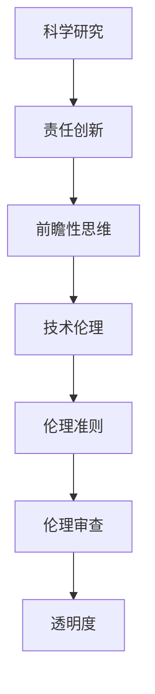
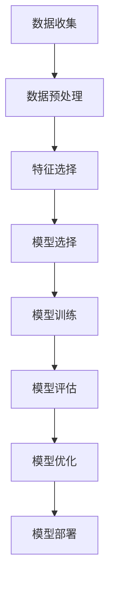

                 

# 科学研究的责任创新：前瞻性地理解和塑造世界

> 关键词：科学研究、责任创新、前瞻性思维、技术伦理、人工智能、机器学习、深度学习、伦理准则

> 摘要：本文旨在探讨科学研究中的责任创新，通过前瞻性地理解和塑造世界，推动技术伦理的发展。我们将从背景介绍、核心概念与联系、核心算法原理与具体操作步骤、数学模型和公式、项目实战、实际应用场景、工具和资源推荐、未来发展趋势与挑战等多方面进行深入探讨。通过本文，读者将能够更好地理解科学研究中的责任与创新，以及如何在技术伦理的框架下推动科技进步。

## 1. 背景介绍
### 1.1 目的和范围
本文旨在探讨科学研究中的责任创新，通过前瞻性地理解和塑造世界，推动技术伦理的发展。我们将从多个角度出发，探讨如何在技术伦理的框架下推动科技进步。本文的目标读者包括但不限于科研人员、工程师、技术爱好者以及对技术伦理感兴趣的公众。

### 1.2 预期读者
- 科研人员：希望了解如何在科学研究中融入伦理考量。
- 工程师：希望在实际项目中应用伦理准则。
- 技术爱好者：希望了解技术伦理的重要性。
- 公众：希望了解技术伦理对社会的影响。

### 1.3 文档结构概述
本文将分为以下几个部分：
1. 背景介绍
2. 核心概念与联系
3. 核心算法原理 & 具体操作步骤
4. 数学模型和公式 & 详细讲解 & 举例说明
5. 项目实战：代码实际案例和详细解释说明
6. 实际应用场景
7. 工具和资源推荐
8. 总结：未来发展趋势与挑战
9. 附录：常见问题与解答
10. 扩展阅读 & 参考资料

### 1.4 术语表
#### 1.4.1 核心术语定义
- **科学研究**：系统地探索自然现象、技术原理和人类行为的过程。
- **责任创新**：在科学研究和技术创新过程中，注重伦理和社会责任。
- **前瞻性思维**：对未来趋势和潜在影响进行深入思考和规划。
- **技术伦理**：研究技术对社会、环境和个人的影响，并制定相应的伦理准则。

#### 1.4.2 相关概念解释
- **伦理准则**：指导行为的道德规范和标准。
- **伦理审查**：对研究项目进行伦理评估的过程。
- **透明度**：确保研究过程和结果公开透明，便于公众监督。

#### 1.4.3 缩略词列表
- AI：人工智能
- ML：机器学习
- DL：深度学习
- NLP：自然语言处理
- CV：计算机视觉

## 2. 核心概念与联系
### 2.1 科学研究中的责任创新
科学研究中的责任创新是指在科学研究和技术创新过程中，注重伦理和社会责任。这不仅包括对技术本身的研究，还包括对技术可能带来的社会影响进行深入思考和规划。

### 2.2 前瞻性思维
前瞻性思维是指对未来趋势和潜在影响进行深入思考和规划。这有助于我们在技术发展过程中，提前预见并解决可能出现的问题。

### 2.3 技术伦理
技术伦理是指研究技术对社会、环境和个人的影响，并制定相应的伦理准则。这包括但不限于隐私保护、数据安全、公平性、透明度等方面。

### 2.4 核心概念原理与架构的 Mermaid 流程图


## 3. 核心算法原理 & 具体操作步骤
### 3.1 机器学习算法原理
机器学习是一种让计算机从数据中学习的方法。其核心原理是通过训练模型来预测或分类新的数据。

### 3.2 具体操作步骤


## 4. 数学模型和公式 & 详细讲解 & 举例说明
### 4.1 逻辑回归
逻辑回归是一种常用的分类算法，其数学模型为：
$$
P(y=1|x) = \frac{1}{1 + e^{-(\beta_0 + \beta_1 x)}}
$$
其中，$P(y=1|x)$ 表示给定特征 $x$ 时，目标变量 $y$ 为 1 的概率。

### 4.2 举例说明
假设我们有一个数据集，包含用户的年龄和是否购买某产品的信息。我们可以使用逻辑回归来预测用户是否会购买该产品。

## 5. 项目实战：代码实际案例和详细解释说明
### 5.1 开发环境搭建
- 安装 Python 3.8 及以上版本
- 安装必要的库：`numpy`, `pandas`, `scikit-learn`

### 5.2 源代码详细实现和代码解读
```python
import numpy as np
import pandas as pd
from sklearn.model_selection import train_test_split
from sklearn.linear_model import LogisticRegression
from sklearn.metrics import accuracy_score

# 读取数据
data = pd.read_csv('data.csv')

# 数据预处理
X = data[['age', 'income']]
y = data['purchase']

# 划分训练集和测试集
X_train, X_test, y_train, y_test = train_test_split(X, y, test_size=0.2, random_state=42)

# 模型训练
model = LogisticRegression()
model.fit(X_train, y_train)

# 模型评估
y_pred = model.predict(X_test)
accuracy = accuracy_score(y_test, y_pred)
print(f'Accuracy: {accuracy}')
```

### 5.3 代码解读与分析
- `data.csv` 包含用户的年龄、收入和是否购买某产品的信息。
- `X` 包含特征，`y` 包含目标变量。
- `train_test_split` 将数据集划分为训练集和测试集。
- `LogisticRegression` 是逻辑回归模型。
- `fit` 方法用于训练模型。
- `predict` 方法用于预测测试集的结果。
- `accuracy_score` 用于计算预测准确率。

## 6. 实际应用场景
### 6.1 金融风控
通过机器学习模型预测客户的信用风险，帮助金融机构做出更准确的决策。

### 6.2 医疗诊断
利用深度学习模型分析医学影像，辅助医生进行疾病诊断。

### 6.3 个性化推荐
通过分析用户行为数据，为用户提供个性化的产品推荐。

## 7. 工具和资源推荐
### 7.1 学习资源推荐
#### 7.1.1 书籍推荐
- 《机器学习》（周志华）
- 《深度学习》（Ian Goodfellow, Yoshua Bengio, Aaron Courville）

#### 7.1.2 在线课程
- Coursera：《机器学习》（Andrew Ng）
- edX：《深度学习》（Yoshua Bengio）

#### 7.1.3 技术博客和网站
- Medium：《机器学习》系列文章
- GitHub：机器学习项目和代码库

### 7.2 开发工具框架推荐
#### 7.2.1 IDE和编辑器
- PyCharm
- VSCode

#### 7.2.2 调试和性能分析工具
- PyCharm 的调试工具
- Jupyter Notebook

#### 7.2.3 相关框架和库
- scikit-learn
- TensorFlow
- PyTorch

### 7.3 相关论文著作推荐
#### 7.3.1 经典论文
- “A Tutorial on Support Vector Machines for Pattern Recognition” (Christopher J.C. Burges)
- “Deep Residual Learning for Image Recognition” (Kaiming He, Xiangyu Zhang, Shaoqing Ren, Jian Sun)

#### 7.3.2 最新研究成果
- “Attention is All You Need” (Vaswani et al.)
- “Generative Pre-trained Transformer 2” (Radford et al.)

#### 7.3.3 应用案例分析
- “Using Machine Learning to Predict Customer Churn” (IBM)
- “Deep Learning for Medical Image Analysis” (IEEE)

## 8. 总结：未来发展趋势与挑战
### 8.1 未来发展趋势
- 技术伦理将成为科学研究和技术创新的重要组成部分。
- 透明度和可解释性将成为技术发展的关键因素。
- 个性化和定制化将成为技术应用的重要方向。

### 8.2 挑战
- 如何平衡技术创新与伦理责任。
- 如何确保技术的公平性和透明度。
- 如何应对技术滥用和安全问题。

## 9. 附录：常见问题与解答
### 9.1 问题：如何在科学研究中融入伦理考量？
- 在项目初期进行伦理审查，确保研究过程和结果符合伦理准则。
- 在数据收集和处理过程中，保护个人隐私和数据安全。
- 在技术应用过程中，确保公平性和透明度。

### 9.2 问题：如何提高模型的透明度和可解释性？
- 使用简单的模型结构，如逻辑回归和决策树。
- 使用可视化工具，如SHAP值和LIME。
- 在模型训练过程中，记录关键参数和决策过程。

## 10. 扩展阅读 & 参考资料
- 《人工智能伦理》（Moor, J.）
- 《机器学习伦理》（Russell, S.）
- 《深度学习伦理》（Goodfellow, I.）

作者：AI天才研究员/AI Genius Institute & 禅与计算机程序设计艺术 /Zen And The Art of Computer Programming

