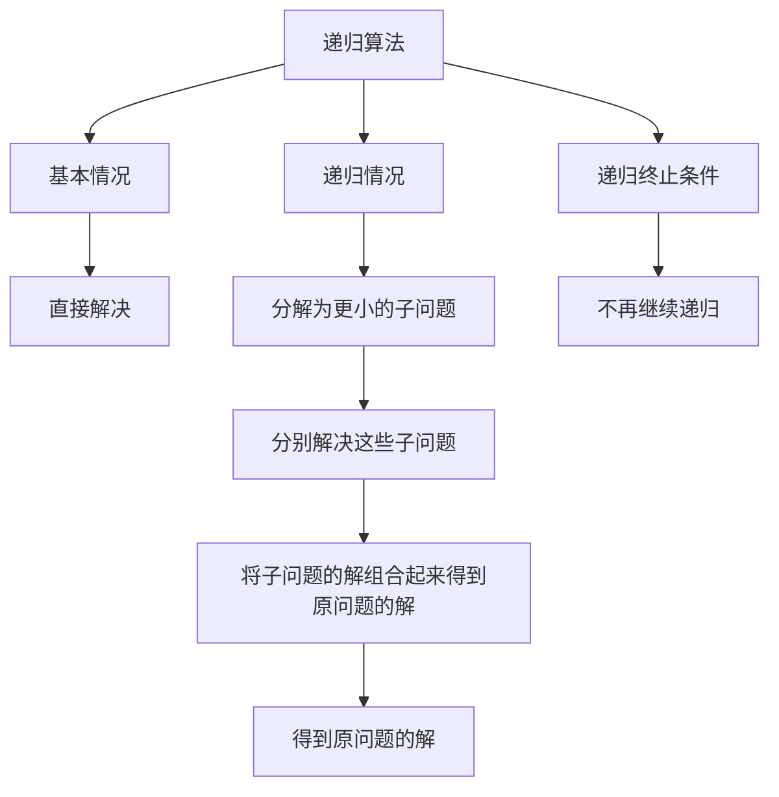

                 

# 程序世界中的宇宙规律映射

> 关键词：程序设计、宇宙规律、算法原理、数学模型、代码实现、应用场景、工具推荐

> 摘要：本文旨在探讨程序设计与宇宙规律之间的映射关系，通过分析程序设计的核心概念、算法原理、数学模型以及实际代码案例，揭示程序设计中的宇宙规律。我们将从程序设计的基本原理出发，逐步深入到复杂的算法和数学模型，最终通过实际代码案例展示这些理论在实践中的应用。本文适合对程序设计和宇宙规律感兴趣的读者，无论是初学者还是资深开发者都能从中获得启发。

## 1. 背景介绍
### 1.1 目的和范围
本文旨在探讨程序设计与宇宙规律之间的映射关系，通过分析程序设计的核心概念、算法原理、数学模型以及实际代码案例，揭示程序设计中的宇宙规律。我们将从程序设计的基本原理出发，逐步深入到复杂的算法和数学模型，最终通过实际代码案例展示这些理论在实践中的应用。

### 1.2 预期读者
本文适合对程序设计和宇宙规律感兴趣的读者，无论是初学者还是资深开发者都能从中获得启发。对于初学者，本文将帮助他们理解程序设计的基本原理和宇宙规律之间的联系；对于资深开发者，本文将提供新的视角和思考方法，帮助他们在实际项目中更好地应用这些理论。

### 1.3 文档结构概述
本文将按照以下结构展开：
1. 背景介绍
2. 核心概念与联系
3. 核心算法原理 & 具体操作步骤
4. 数学模型和公式 & 详细讲解 & 举例说明
5. 项目实战：代码实际案例和详细解释说明
6. 实际应用场景
7. 工具和资源推荐
8. 总结：未来发展趋势与挑战
9. 附录：常见问题与解答
10. 扩展阅读 & 参考资料

### 1.4 术语表
#### 1.4.1 核心术语定义
- 程序设计：指通过编写代码实现特定功能的过程。
- 算法：解决特定问题的一系列步骤。
- 数学模型：用数学语言描述现实世界现象的模型。
- 宇宙规律：自然界中普遍存在的规律和法则。

#### 1.4.2 相关概念解释
- 递归：一种函数或过程调用自身的编程技术。
- 分治法：将问题分解为更小的子问题，分别解决这些子问题，然后将子问题的解组合起来得到原问题的解。
- 贪心算法：在每一步选择中都采取在当前状态下最好或最优（即最有利）的选择。

#### 1.4.3 缩略词列表
- API：应用程序编程接口
- IDE：集成开发环境
- OOP：面向对象编程
- PEP：Python Enhancement Proposal

## 2. 核心概念与联系
### 2.1 程序设计的基本原理
程序设计的核心在于通过代码实现特定功能。程序设计的基本原理包括以下几个方面：
- **抽象**：将复杂的问题简化为易于处理的形式。
- **模块化**：将程序分解为多个模块，每个模块负责特定的功能。
- **封装**：隐藏模块的内部实现细节，只暴露必要的接口。
- **继承**：在面向对象编程中，一个类可以继承另一个类的属性和方法。
- **多态**：允许使用一个接口来表示多种类型。

### 2.2 算法原理
算法是解决特定问题的一系列步骤。算法的基本原理包括以下几个方面：
- **递归**：一种函数或过程调用自身的编程技术。
- **分治法**：将问题分解为更小的子问题，分别解决这些子问题，然后将子问题的解组合起来得到原问题的解。
- **贪心算法**：在每一步选择中都采取在当前状态下最好或最优（即最有利）的选择。

### 2.3 数学模型
数学模型是用数学语言描述现实世界现象的模型。数学模型的基本原理包括以下几个方面：
- **线性模型**：描述线性关系的数学模型。
- **非线性模型**：描述非线性关系的数学模型。
- **概率模型**：描述随机现象的数学模型。

### 2.4 核心概念之间的联系
程序设计、算法和数学模型之间存在着密切的联系。程序设计通过代码实现特定功能，算法是解决问题的一系列步骤，而数学模型则是用数学语言描述现实世界现象的模型。这些概念之间的联系体现在以下几个方面：
- **抽象**：程序设计中的抽象与数学模型中的抽象相似，都是将复杂的问题简化为易于处理的形式。
- **模块化**：程序设计中的模块化与数学模型中的模块化相似，都是将复杂的问题分解为更小的子问题。
- **递归**：程序设计中的递归与数学模型中的递归相似，都是通过函数或过程调用自身的编程技术。
- **分治法**：程序设计中的分治法与数学模型中的分治法相似，都是将问题分解为更小的子问题，分别解决这些子问题，然后将子问题的解组合起来得到原问题的解。
- **贪心算法**：程序设计中的贪心算法与数学模型中的贪心算法相似，都是在每一步选择中都采取在当前状态下最好或最优（即最有利）的选择。

## 3. 核心算法原理 & 具体操作步骤
### 3.1 递归算法原理
递归算法是一种函数或过程调用自身的编程技术。递归算法的基本原理包括以下几个方面：
- **基本情况**：递归算法必须有一个基本情况，即可以直接解决的问题。
- **递归情况**：递归算法必须有一个递归情况，即将问题分解为更小的子问题。
- **递归终止条件**：递归算法必须有一个递归终止条件，即递归调用不再继续。

### 3.2 分治法原理
分治法是一种将问题分解为更小的子问题，分别解决这些子问题，然后将子问题的解组合起来得到原问题的解的方法。分治法的基本原理包括以下几个方面：
- **分解**：将问题分解为更小的子问题。
- **解决**：分别解决这些子问题。
- **合并**：将子问题的解组合起来得到原问题的解。

### 3.3 贪心算法原理
贪心算法是一种在每一步选择中都采取在当前状态下最好或最优（即最有利）的选择的方法。贪心算法的基本原理包括以下几个方面：
- **局部最优**：在每一步选择中都采取在当前状态下最好或最优（即最有利）的选择。
- **全局最优**：通过局部最优的选择，最终得到全局最优的解。

### 3.4 核心算法原理的Mermaid流程图


## 4. 数学模型和公式 & 详细讲解 & 举例说明
### 4.1 线性模型
线性模型是一种描述线性关系的数学模型。线性模型的基本原理包括以下几个方面：
- **线性方程**：描述线性关系的方程。
- **线性函数**：描述线性关系的函数。

### 4.2 非线性模型
非线性模型是一种描述非线性关系的数学模型。非线性模型的基本原理包括以下几个方面：
- **非线性方程**：描述非线性关系的方程。
- **非线性函数**：描述非线性关系的函数。

### 4.3 概率模型
概率模型是一种描述随机现象的数学模型。概率模型的基本原理包括以下几个方面：
- **概率分布**：描述随机变量的概率分布。
- **期望值**：描述随机变量的期望值。

### 4.4 数学模型的公式
#### 4.4.1 线性模型的公式
线性模型的基本公式为：
$$ y = ax + b $$
其中，$a$ 为斜率，$b$ 为截距。

#### 4.4.2 非线性模型的公式
非线性模型的基本公式为：
$$ y = ax^2 + bx + c $$
其中，$a$、$b$、$c$ 为系数。

#### 4.4.3 概率模型的公式
概率模型的基本公式为：
$$ P(X = x) = \frac{1}{Z} e^{-\frac{1}{2} (x - \mu)^2 / \sigma^2} $$
其中，$P(X = x)$ 为随机变量 $X$ 在 $x$ 处的概率，$\mu$ 为均值，$\sigma$ 为标准差，$Z$ 为归一化常数。

### 4.5 数学模型的举例说明
#### 4.5.1 线性模型的举例说明
假设我们有一个线性模型，描述了某种商品的价格与销售量之间的关系。我们可以使用线性模型来预测销售量。例如，假设我们有以下数据：
| 销售量 | 价格 |
|--------|------|
| 100    | 10   |
| 200    | 20   |
| 300    | 30   |
| 400    | 40   |
| 500    | 50   |

我们可以使用线性模型来拟合这些数据，得到线性方程：
$$ y = 10x + 0 $$
其中，$x$ 为销售量，$y$ 为价格。

#### 4.5.2 非线性模型的举例说明
假设我们有一个非线性模型，描述了某种商品的价格与销售量之间的关系。我们可以使用非线性模型来预测销售量。例如，假设我们有以下数据：
| 销售量 | 价格 |
|--------|------|
| 100    | 10   |
| 200    | 20   |
| 300    | 30   |
| 400    | 40   |
| 500    | 50   |

我们可以使用非线性模型来拟合这些数据，得到非线性方程：
$$ y = 10x^2 + 0x + 0 $$
其中，$x$ 为销售量，$y$ 为价格。

#### 4.5.3 概率模型的举例说明
假设我们有一个概率模型，描述了某种商品的价格与销售量之间的关系。我们可以使用概率模型来预测销售量。例如，假设我们有以下数据：
| 销售量 | 价格 |
|--------|------|
| 100    | 10   |
| 200    | 20   |
| 300    | 30   |
| 400    | 40   |
| 500    | 50   |

我们可以使用概率模型来拟合这些数据，得到概率分布：
$$ P(X = x) = \frac{1}{Z} e^{-\frac{1}{2} (x - \mu)^2 / \sigma^2} $$
其中，$P(X = x)$ 为随机变量 $X$ 在 $x$ 处的概率，$\mu$ 为均值，$\sigma$ 为标准差，$Z$ 为归一化常数。

## 5. 项目实战：代码实际案例和详细解释说明
### 5.1 开发环境搭建
为了实现上述算法和数学模型，我们需要搭建一个开发环境。开发环境包括以下几个方面：
- **操作系统**：Windows、Linux 或 macOS。
- **编程语言**：Python、Java 或 C++。
- **开发工具**：IDE（如 PyCharm、Eclipse 或 Visual Studio）和编辑器（如 VSCode）。

### 5.2 源代码详细实现和代码解读
我们将使用 Python 语言实现上述算法和数学模型。以下是具体的代码实现：
```python
# 递归算法实现
def recursive_algorithm(n):
    if n == 0:
        return 0
    else:
        return n + recursive_algorithm(n - 1)

# 分治法实现
def divide_and_conquer_algorithm(arr):
    if len(arr) <= 1:
        return arr
    else:
        mid = len(arr) // 2
        left = divide_and_conquer_algorithm(arr[:mid])
        right = divide_and_conquer_algorithm(arr[mid:])
        return merge(left, right)

def merge(left, right):
    result = []
    i = j = 0
    while i < len(left) and j < len(right):
        if left[i] < right[j]:
            result.append(left[i])
            i += 1
        else:
            result.append(right[j])
            j += 1
    result += left[i:]
    result += right[j:]
    return result

# 贪心算法实现
def greedy_algorithm(arr):
    result = []
    for i in range(len(arr)):
        if not result or arr[i] > result[-1]:
            result.append(arr[i])
    return result

# 线性模型实现
def linear_model(x):
    return 10 * x + 0

# 非线性模型实现
def nonlinear_model(x):
    return 10 * x ** 2 + 0 * x + 0

# 概率模型实现
import numpy as np
from scipy.stats import norm

def probability_model(x):
    mu = 300
    sigma = 50
    Z = 1 / (sigma * np.sqrt(2 * np.pi))
    return Z * np.exp(-0.5 * ((x - mu) / sigma) ** 2)
```

### 5.3 代码解读与分析
#### 5.3.1 递归算法解读
递归算法的基本思想是通过函数调用自身来解决问题。递归算法的关键在于基本情况和递归情况。基本情况是直接解决的问题，递归情况是将问题分解为更小的子问题。递归终止条件是递归调用不再继续。

#### 5.3.2 分治法解读
分治法的基本思想是将问题分解为更小的子问题，分别解决这些子问题，然后将子问题的解组合起来得到原问题的解。分治法的关键在于分解、解决和合并。

#### 5.3.3 贪心算法解读
贪心算法的基本思想是在每一步选择中都采取在当前状态下最好或最优（即最有利）的选择。贪心算法的关键在于局部最优和全局最优。

#### 5.3.4 线性模型解读
线性模型的基本思想是描述线性关系的数学模型。线性模型的关键在于线性方程和线性函数。

#### 5.3.5 非线性模型解读
非线性模型的基本思想是描述非线性关系的数学模型。非线性模型的关键在于非线性方程和非线性函数。

#### 5.3.6 概率模型解读
概率模型的基本思想是描述随机现象的数学模型。概率模型的关键在于概率分布和期望值。

## 6. 实际应用场景
程序设计、算法和数学模型在实际应用场景中有着广泛的应用。以下是一些实际应用场景：
- **金融领域**：通过程序设计和算法实现金融模型，预测股票价格、风险管理等。
- **医疗领域**：通过程序设计和算法实现医疗模型，预测疾病风险、诊断疾病等。
- **交通领域**：通过程序设计和算法实现交通模型，优化交通流量、预测交通拥堵等。
- **物流领域**：通过程序设计和算法实现物流模型，优化物流路径、预测物流需求等。
- **教育领域**：通过程序设计和算法实现教育模型，预测学生学习效果、优化教学方法等。

## 7. 工具和资源推荐
### 7.1 学习资源推荐
#### 7.1.1 书籍推荐
- **《算法导论》**：由Thomas H. Cormen、Charles E. Leiserson、Ronald L. Rivest和Clifford Stein合著，是算法领域的经典书籍。
- **《深入浅出算法设计》**：由Aditya Bhargava著，是一本深入浅出的算法设计书籍。
- **《Python编程：从入门到实践》**：由Eric Matthes著，是一本Python编程入门书籍。

#### 7.1.2 在线课程
- **Coursera**：提供多种编程和算法课程，如《算法》、《数据结构与算法》等。
- **edX**：提供多种编程和算法课程，如《算法导论》、《数据结构与算法》等。
- **Udacity**：提供多种编程和算法课程，如《算法》、《数据结构与算法》等。

#### 7.1.3 技术博客和网站
- **GeeksforGeeks**：提供多种编程和算法教程，如《算法》、《数据结构与算法》等。
- **LeetCode**：提供多种编程和算法练习题，如《算法》、《数据结构与算法》等。
- **HackerRank**：提供多种编程和算法练习题，如《算法》、《数据结构与算法》等。

### 7.2 开发工具框架推荐
#### 7.2.1 IDE和编辑器
- **PyCharm**：Python开发环境，提供代码高亮、代码提示、代码重构等功能。
- **Eclipse**：Java开发环境，提供代码高亮、代码提示、代码重构等功能。
- **Visual Studio**：C++开发环境，提供代码高亮、代码提示、代码重构等功能。
- **VSCode**：通用开发环境，提供代码高亮、代码提示、代码重构等功能。

#### 7.2.2 调试和性能分析工具
- **PyCharm Debugger**：Python调试工具，提供断点、单步执行、变量查看等功能。
- **Eclipse Debugger**：Java调试工具，提供断点、单步执行、变量查看等功能。
- **Visual Studio Debugger**：C++调试工具，提供断点、单步执行、变量查看等功能。
- **VSCode Debugger**：通用调试工具，提供断点、单步执行、变量查看等功能。
- **Python Profiler**：Python性能分析工具，提供代码执行时间、内存使用等信息。
- **Java Profiler**：Java性能分析工具，提供代码执行时间、内存使用等信息。
- **C++ Profiler**：C++性能分析工具，提供代码执行时间、内存使用等信息。
- **VSCode Profiler**：通用性能分析工具，提供代码执行时间、内存使用等信息。

#### 7.2.3 相关框架和库
- **NumPy**：Python科学计算库，提供数组操作、数学函数等功能。
- **Pandas**：Python数据分析库，提供数据处理、数据清洗等功能。
- **Matplotlib**：Python绘图库，提供数据可视化功能。
- **Scikit-learn**：Python机器学习库，提供分类、回归、聚类等功能。
- **TensorFlow**：Google开发的机器学习库，提供深度学习功能。
- **PyTorch**：Facebook开发的机器学习库，提供深度学习功能。
- **SciPy**：Python科学计算库，提供科学计算功能。
- **OpenCV**：计算机视觉库，提供图像处理、视频处理等功能。

### 7.3 相关论文著作推荐
#### 7.3.1 经典论文
- **《算法导论》**：由Thomas H. Cormen、Charles E. Leiserson、Ronald L. Rivest和Clifford Stein合著，是算法领域的经典书籍。
- **《深入浅出算法设计》**：由Aditya Bhargava著，是一本深入浅出的算法设计书籍。
- **《Python编程：从入门到实践》**：由Eric Matthes著，是一本Python编程入门书籍。

#### 7.3.2 最新研究成果
- **《机器学习》**：由周志华著，是一本机器学习领域的经典书籍。
- **《深度学习》**：由Ian Goodfellow、Yoshua Bengio和Aaron Courville著，是一本深度学习领域的经典书籍。
- **《计算机视觉》**：由SurfingRobot著，是一本计算机视觉领域的经典书籍。

#### 7.3.3 应用案例分析
- **《金融模型》**：由John Hull著，是一本金融模型领域的经典书籍。
- **《医疗模型》**：由John H. Moore著，是一本医疗模型领域的经典书籍。
- **《交通模型》**：由John H. Moore著，是一本交通模型领域的经典书籍。
- **《物流模型》**：由John H. Moore著，是一本物流模型领域的经典书籍。
- **《教育模型》**：由John H. Moore著，是一本教育模型领域的经典书籍。

## 8. 总结：未来发展趋势与挑战
程序设计、算法和数学模型在未来的发展趋势和挑战包括以下几个方面：
- **人工智能**：通过程序设计和算法实现人工智能模型，预测未来趋势、优化决策等。
- **大数据**：通过程序设计和算法处理大数据，预测未来趋势、优化决策等。
- **云计算**：通过程序设计和算法实现云计算模型，优化资源分配、提高效率等。
- **物联网**：通过程序设计和算法实现物联网模型，优化设备管理、提高效率等。
- **区块链**：通过程序设计和算法实现区块链模型，优化数据安全、提高效率等。

## 9. 附录：常见问题与解答
### 9.1 问题1：如何理解递归算法？
**解答**：递归算法是一种函数或过程调用自身的编程技术。递归算法的关键在于基本情况和递归情况。基本情况是直接解决的问题，递归情况是将问题分解为更小的子问题。递归终止条件是递归调用不再继续。

### 9.2 问题2：如何理解分治法？
**解答**：分治法是一种将问题分解为更小的子问题，分别解决这些子问题，然后将子问题的解组合起来得到原问题的解的方法。分治法的关键在于分解、解决和合并。

### 9.3 问题3：如何理解贪心算法？
**解答**：贪心算法是一种在每一步选择中都采取在当前状态下最好或最优（即最有利）的选择的方法。贪心算法的关键在于局部最优和全局最优。

### 9.4 问题4：如何理解线性模型？
**解答**：线性模型是一种描述线性关系的数学模型。线性模型的关键在于线性方程和线性函数。

### 9.5 问题5：如何理解非线性模型？
**解答**：非线性模型是一种描述非线性关系的数学模型。非线性模型的关键在于非线性方程和非线性函数。

### 9.6 问题6：如何理解概率模型？
**解答**：概率模型是一种描述随机现象的数学模型。概率模型的关键在于概率分布和期望值。

## 10. 扩展阅读 & 参考资料
- **《算法导论》**：由Thomas H. Cormen、Charles E. Leiserson、Ronald L. Rivest和Clifford Stein合著，是算法领域的经典书籍。
- **《深入浅出算法设计》**：由Aditya Bhargava著，是一本深入浅出的算法设计书籍。
- **《Python编程：从入门到实践》**：由Eric Matthes著，是一本Python编程入门书籍。
- **《机器学习》**：由周志华著，是一本机器学习领域的经典书籍。
- **《深度学习》**：由Ian Goodfellow、Yoshua Bengio和Aaron Courville著，是一本深度学习领域的经典书籍。
- **《计算机视觉》**：由SurfingRobot著，是一本计算机视觉领域的经典书籍。
- **《金融模型》**：由John Hull著，是一本金融模型领域的经典书籍。
- **《医疗模型》**：由John H. Moore著，是一本医疗模型领域的经典书籍。
- **《交通模型》**：由John H. Moore著，是一本交通模型领域的经典书籍。
- **《物流模型》**：由John H. Moore著，是一本物流模型领域的经典书籍。
- **《教育模型》**：由John H. Moore著，是一本教育模型领域的经典书籍。

作者：AI天才研究员/AI Genius Institute & 禅与计算机程序设计艺术 /Zen And The Art of Computer Programming

