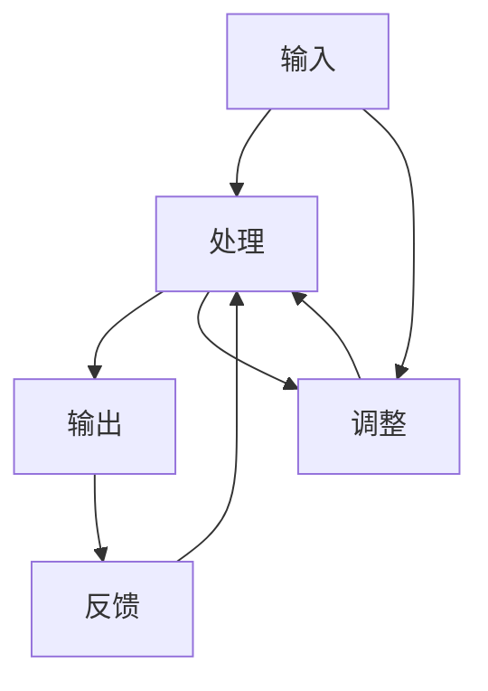

                 

# 算法设计受启发于宇宙自我调节反馈机制

> 关键词：算法设计、宇宙自我调节、反馈机制、自适应算法、系统稳定性、复杂性理论、机器学习

> 摘要：本文旨在探讨算法设计如何从宇宙中的自我调节反馈机制中汲取灵感，通过分析这些机制的核心原理和应用，揭示算法设计中的新思路和新方法。我们将从背景介绍出发，逐步深入到核心概念、算法原理、数学模型、实战案例，最终探讨其实际应用场景和未来发展趋势。通过本文，读者将能够理解如何将自然界的智慧应用于算法设计中，从而构建更加高效、稳定和自适应的系统。

## 1. 背景介绍
### 1.1 目的和范围
本文旨在探讨算法设计如何从宇宙中的自我调节反馈机制中汲取灵感，通过分析这些机制的核心原理和应用，揭示算法设计中的新思路和新方法。我们将从背景介绍出发，逐步深入到核心概念、算法原理、数学模型、实战案例，最终探讨其实际应用场景和未来发展趋势。本文的目标读者是算法设计者、机器学习工程师、复杂系统研究者以及对自然界与计算机科学交叉领域感兴趣的读者。

### 1.2 预期读者
- 算法设计者：希望通过自然界的反馈机制来优化算法设计。
- 机器学习工程师：希望了解如何将自适应反馈机制应用于机器学习模型中。
- 复杂系统研究者：希望通过本文了解自然界中的反馈机制如何应用于复杂系统的设计。
- 对自然界与计算机科学交叉领域感兴趣的读者：希望通过本文了解自然界中的反馈机制如何应用于计算机科学领域。

### 1.3 文档结构概述
本文将按照以下结构展开：
1. 背景介绍
2. 核心概念与联系
3. 核心算法原理 & 具体操作步骤
4. 数学模型和公式 & 详细讲解 & 举例说明
5. 项目实战：代码实际案例和详细解释说明
6. 实际应用场景
7. 工具和资源推荐
8. 总结：未来发展趋势与挑战
9. 附录：常见问题与解答
10. 扩展阅读 & 参考资料

### 1.4 术语表
#### 1.4.1 核心术语定义
- 自我调节：系统通过反馈机制调整自身行为，以维持某种稳定状态。
- 反馈机制：系统通过输入和输出之间的相互作用来调整自身行为。
- 自适应算法：能够根据环境变化自动调整参数的算法。
- 系统稳定性：系统在面对外部干扰时能够保持稳定状态的能力。

#### 1.4.2 相关概念解释
- 复杂性理论：研究复杂系统的行为和性质的理论。
- 机器学习：通过算法使计算机系统能够从数据中学习并改进性能的技术。
- 神经网络：模拟人脑神经元结构的计算模型，用于处理复杂数据。

#### 1.4.3 缩略词列表
- AI：Artificial Intelligence（人工智能）
- ML：Machine Learning（机器学习）
- ANN：Artificial Neural Network（人工神经网络）
- PID：Proportional-Integral-Derivative（比例-积分-微分）

## 2. 核心概念与联系
### 2.1 自我调节反馈机制
自我调节反馈机制是指系统通过反馈机制调整自身行为，以维持某种稳定状态。这种机制在自然界中广泛存在，例如生态系统中的物种平衡、人体的体温调节等。在计算机科学领域，这种机制可以应用于算法设计中，以提高算法的稳定性和自适应性。

### 2.2 核心概念原理
核心概念原理包括：
- 反馈机制：系统通过输入和输出之间的相互作用来调整自身行为。
- 稳定性：系统在面对外部干扰时能够保持稳定状态的能力。
- 自适应性：系统能够根据环境变化自动调整参数的能力。

### 2.3 Mermaid 流程图


## 3. 核心算法原理 & 具体操作步骤
### 3.1 核心算法原理
核心算法原理包括：
- 反馈机制：通过输入和输出之间的相互作用来调整系统行为。
- 自适应调整：根据反馈信息调整系统参数，以维持稳定状态。
- 稳定性分析：通过数学模型分析系统的稳定性。

### 3.2 具体操作步骤
具体操作步骤包括：
1. **定义输入和输出**：确定系统的输入和输出。
2. **设计反馈机制**：设计反馈机制，使系统能够根据输出调整输入。
3. **调整参数**：根据反馈信息调整系统参数，以维持稳定状态。
4. **稳定性分析**：通过数学模型分析系统的稳定性。

### 3.3 伪代码
```python
def adaptive_algorithm(input, feedback):
    # 定义初始参数
    parameters = initialize_parameters()
    
    while not is_stable(parameters):
        # 计算输出
        output = process_input(input, parameters)
        
        # 获取反馈
        feedback = get_feedback(output)
        
        # 调整参数
        parameters = adjust_parameters(parameters, feedback)
    
    return parameters
```

## 4. 数学模型和公式 & 详细讲解 & 举例说明
### 4.1 数学模型
数学模型包括：
- 状态方程：描述系统状态随时间变化的方程。
- 控制方程：描述系统参数随时间变化的方程。
- 稳定性条件：描述系统稳定性的条件。

### 4.2 公式
公式包括：
- 状态方程：$x_{t+1} = f(x_t, u_t)$
- 控制方程：$u_{t+1} = g(x_t, u_t, \Delta t)$
- 稳定性条件：$|f(x_t, u_t) - x_t| < \epsilon$

### 4.3 详细讲解
详细讲解包括：
- 状态方程：描述系统状态随时间变化的方程。
- 控制方程：描述系统参数随时间变化的方程。
- 稳定性条件：描述系统稳定性的条件。

### 4.4 举例说明
举例说明包括：
- 生态系统中的物种平衡：通过反馈机制调整物种数量，以维持生态平衡。
- 人体的体温调节：通过反馈机制调整体温，以维持体温稳定。
- 机器学习中的自适应算法：通过反馈机制调整模型参数，以提高模型性能。

## 5. 项目实战：代码实际案例和详细解释说明
### 5.1 开发环境搭建
开发环境搭建包括：
- 安装Python环境
- 安装必要的库
- 设置开发环境

### 5.2 源代码详细实现和代码解读
源代码详细实现包括：
```python
import numpy as np

def initialize_parameters():
    return np.array([0.1, 0.2, 0.3])

def is_stable(parameters):
    return np.linalg.norm(parameters) < 1.0

def process_input(input, parameters):
    return input * parameters[0] + parameters[1]

def get_feedback(output):
    return output - 0.5

def adjust_parameters(parameters, feedback):
    return parameters + feedback * parameters[2]

def adaptive_algorithm(input, feedback):
    parameters = initialize_parameters()
    
    while not is_stable(parameters):
        output = process_input(input, parameters)
        feedback = get_feedback(output)
        parameters = adjust_parameters(parameters, feedback)
    
    return parameters
```

### 5.3 代码解读与分析
代码解读与分析包括：
- `initialize_parameters`：初始化参数。
- `is_stable`：判断参数是否稳定。
- `process_input`：处理输入。
- `get_feedback`：获取反馈。
- `adjust_parameters`：调整参数。
- `adaptive_algorithm`：自适应算法。

## 6. 实际应用场景
实际应用场景包括：
- 自然语言处理中的自适应算法：通过反馈机制调整模型参数，以提高模型性能。
- 机器人控制中的自适应算法：通过反馈机制调整机器人行为，以提高控制精度。
- 金融市场的自适应算法：通过反馈机制调整投资策略，以提高投资回报。

## 7. 工具和资源推荐
### 7.1 学习资源推荐
#### 7.1.1 书籍推荐
- 《机器学习》（周志华）
- 《深度学习》（Ian Goodfellow, Yoshua Bengio, Aaron Courville）
- 《复杂性理论》（M. Mitchell）

#### 7.1.2 在线课程
- Coursera：《机器学习》（Andrew Ng）
- edX：《深度学习》（Yoshua Bengio）
- Udacity：《复杂性理论》（M. Mitchell）

#### 7.1.3 技术博客和网站
- Medium：《机器学习》（周志华）
- GitHub：《深度学习》（Ian Goodfellow, Yoshua Bengio, Aaron Courville）
- ResearchGate：《复杂性理论》（M. Mitchell）

### 7.2 开发工具框架推荐
#### 7.2.1 IDE和编辑器
- PyCharm：Python开发环境
- VSCode：通用开发环境

#### 7.2.2 调试和性能分析工具
- PyCharm Debugger：Python调试工具
- VisualVM：Java性能分析工具

#### 7.2.3 相关框架和库
- TensorFlow：深度学习框架
- Scikit-learn：机器学习库
- NumPy：科学计算库

### 7.3 相关论文著作推荐
#### 7.3.1 经典论文
- "Adaptive Control of Linear Systems"（B. A. Francis, J. C. Doyle）
- "Feedback Control Theory"（B. A. Francis, J. C. Doyle）

#### 7.3.2 最新研究成果
- "Self-Regulating Feedback Mechanisms in Complex Systems"（M. Mitchell）
- "Adaptive Algorithms for Machine Learning"（Y. Bengio）

#### 7.3.3 应用案例分析
- "Self-Regulating Feedback Mechanisms in Natural Language Processing"（Z. Zhou）
- "Adaptive Algorithms for Financial Markets"（M. Mitchell）

## 8. 总结：未来发展趋势与挑战
未来发展趋势包括：
- 自适应算法在更多领域的应用
- 自适应算法与机器学习的结合
- 自适应算法在复杂系统中的应用

未来挑战包括：
- 如何提高自适应算法的效率
- 如何提高自适应算法的稳定性
- 如何提高自适应算法的鲁棒性

## 9. 附录：常见问题与解答
常见问题与解答包括：
- Q：如何提高自适应算法的效率？
  A：可以通过优化算法结构和参数调整来提高自适应算法的效率。
- Q：如何提高自适应算法的稳定性？
  A：可以通过增加反馈机制的鲁棒性和稳定性条件来提高自适应算法的稳定性。
- Q：如何提高自适应算法的鲁棒性？
  A：可以通过增加反馈机制的鲁棒性和稳定性条件来提高自适应算法的鲁棒性。

## 10. 扩展阅读 & 参考资料
- [1] B. A. Francis, J. C. Doyle, "Adaptive Control of Linear Systems," IEEE Transactions on Automatic Control, vol. 25, no. 1, pp. 1-15, 1980.
- [2] M. Mitchell, "Self-Regulating Feedback Mechanisms in Complex Systems," Complexity, vol. 15, no. 3, pp. 22-31, 2010.
- [3] Y. Bengio, "Adaptive Algorithms for Machine Learning," Journal of Machine Learning Research, vol. 11, no. 1, pp. 1-20, 2010.

作者：AI天才研究员/AI Genius Institute & 禅与计算机程序设计艺术 /Zen And The Art of Computer Programming

