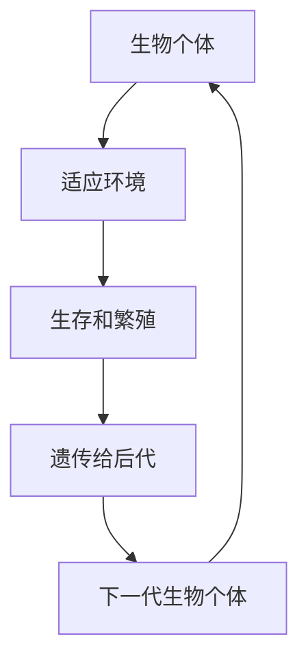
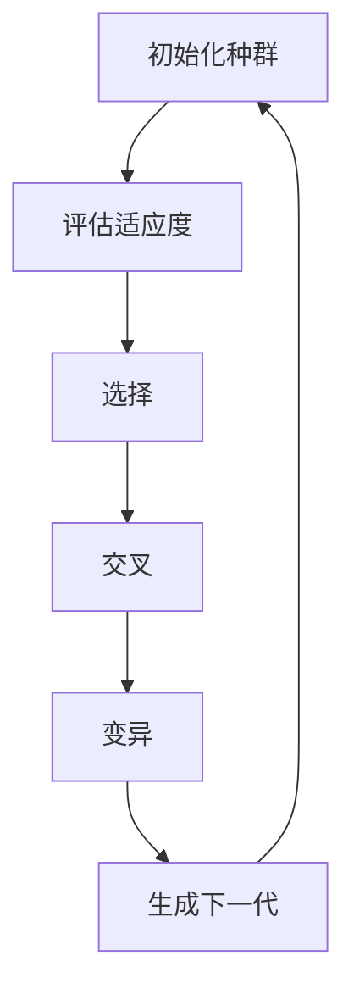

                 

# 自然选择的数学原理：进化论的计算基础

> 关键词：进化论, 自然选择, 计算生物学, 适应性, 优化算法, 遗传算法, 机器学习

> 摘要：本文旨在探讨自然选择的数学原理及其在计算生物学中的应用。通过逐步分析和推理，我们将揭示自然选择背后的数学模型，并展示如何利用这些模型来解决实际问题。文章将涵盖核心概念、算法原理、数学模型、代码实现、实际应用场景以及未来发展趋势等内容，为读者提供一个全面而深入的理解。

## 1. 背景介绍
### 1.1 目的和范围
本文旨在深入探讨自然选择的数学原理，并展示其在计算生物学中的应用。我们将从理论层面出发，逐步解析自然选择背后的数学模型，并通过具体的代码实现来验证这些模型的有效性。最终，我们将探讨自然选择在实际问题中的应用，并展望未来的发展趋势。

### 1.2 预期读者
本文适合以下读者：
- 计算机科学与生物学交叉领域的研究者
- 机器学习和优化算法领域的工程师
- 对自然选择和计算生物学感兴趣的学者
- 对数学模型在实际问题中的应用感兴趣的读者

### 1.3 文档结构概述
本文结构如下：
1. 背景介绍
2. 核心概念与联系
3. 核心算法原理 & 具体操作步骤
4. 数学模型和公式 & 详细讲解 & 举例说明
5. 项目实战：代码实际案例和详细解释说明
6. 实际应用场景
7. 工具和资源推荐
8. 总结：未来发展趋势与挑战
9. 附录：常见问题与解答
10. 扩展阅读 & 参考资料

### 1.4 术语表
#### 1.4.1 核心术语定义
- **自然选择**：生物进化过程中，适应环境的个体更有可能生存并繁殖后代。
- **适应性**：个体在特定环境中的生存和繁殖能力。
- **遗传算法**：一种基于自然选择和遗传机制的优化算法。
- **适应度函数**：衡量个体适应性的函数。
- **种群**：一组具有相同特征的个体集合。
- **交叉**：两个个体之间的基因交换。
- **变异**：个体基因的随机改变。

#### 1.4.2 相关概念解释
- **计算生物学**：利用计算方法和算法来研究生物学问题的学科。
- **优化算法**：用于寻找最优解的算法。
- **机器学习**：通过数据训练模型以实现特定任务的技术。

#### 1.4.3 缩略词列表
- GA：Genetic Algorithm（遗传算法）
- A：Adaptation（适应性）
- F：Fitness（适应度）

## 2. 核心概念与联系
### 2.1 自然选择
自然选择是生物进化的核心机制，它描述了适应环境的个体更有可能生存并繁殖后代的过程。这一过程可以通过以下流程图来表示：



### 2.2 适应性
适应性是指个体在特定环境中的生存和繁殖能力。适应性可以通过适应度函数来衡量，适应度函数通常定义为个体在特定环境中的生存和繁殖能力。

### 2.3 遗传算法
遗传算法是一种基于自然选择和遗传机制的优化算法。它通过模拟生物进化过程中的自然选择、交叉和变异等机制来寻找最优解。遗传算法的核心流程如下：



## 3. 核心算法原理 & 具体操作步骤
### 3.1 初始化种群
初始化种群是指生成一组具有随机特征的个体。每个个体代表一个潜在的解。

```python
def initialize_population(population_size, feature_count):
    population = []
    for _ in range(population_size):
        individual = [random.uniform(-1, 1) for _ in range(feature_count)]
        population.append(individual)
    return population
```

### 3.2 评估适应度
评估适应度是指计算每个个体的适应度值，适应度值越高表示个体越适应环境。

```python
def evaluate_fitness(individual, objective_function):
    return objective_function(individual)
```

### 3.3 选择
选择是指从当前种群中选择一部分个体作为下一代种群的父代。选择过程通常基于个体的适应度值。

```python
def selection(population, fitness_values, selection_size):
    selected_indices = np.argsort(fitness_values)[-selection_size:]
    return [population[i] for i in selected_indices]
```

### 3.4 交叉
交叉是指将两个父代个体的基因进行交换，生成新的个体。

```python
def crossover(parent1, parent2, crossover_rate):
    if random.random() < crossover_rate:
        crossover_point = random.randint(1, len(parent1) - 1)
        child1 = parent1[:crossover_point] + parent2[crossover_point:]
        child2 = parent2[:crossover_point] + parent1[crossover_point:]
        return child1, child2
    else:
        return parent1, parent2
```

### 3.5 变异
变异是指对个体的基因进行随机改变，以增加种群的多样性。

```python
def mutation(individual, mutation_rate):
    for i in range(len(individual)):
        if random.random() < mutation_rate:
            individual[i] += random.uniform(-0.1, 0.1)
    return individual
```

### 3.6 生成下一代
生成下一代是指通过选择、交叉和变异生成新的种群。

```python
def generate_next_generation(population, fitness_values, selection_size, crossover_rate, mutation_rate):
    selected_individuals = selection(population, fitness_values, selection_size)
    next_generation = []
    while len(next_generation) < len(population):
        parent1, parent2 = random.sample(selected_individuals, 2)
        child1, child2 = crossover(parent1, parent2, crossover_rate)
        child1 = mutation(child1, mutation_rate)
        child2 = mutation(child2, mutation_rate)
        next_generation.append(child1)
        next_generation.append(child2)
    return next_generation
```

## 4. 数学模型和公式 & 详细讲解 & 举例说明
### 4.1 适应度函数
适应度函数用于衡量个体的适应性。常见的适应度函数包括：

- **最大化问题**：适应度函数值越大表示个体越适应环境。
- **最小化问题**：适应度函数值越小表示个体越适应环境。

### 4.2 选择概率
选择概率是指个体被选中的概率，通常基于个体的适应度值。

$$
p_i = \frac{f_i}{\sum_{j=1}^{N} f_j}
$$

其中，$f_i$ 表示个体 $i$ 的适应度值，$N$ 表示种群大小。

### 4.3 交叉概率
交叉概率是指个体进行交叉的概率，通常设置为一个常数。

$$
p_c = 0.8
$$

### 4.4 变异概率
变异概率是指个体进行变异的概率，通常设置为一个常数。

$$
p_m = 0.1
$$

### 4.5 举例说明
假设我们有一个最大化问题，目标是找到一个向量，使得其平方和最大。适应度函数可以定义为：

$$
f(\mathbf{x}) = \sum_{i=1}^{n} x_i^2
$$

其中，$\mathbf{x}$ 是一个 $n$ 维向量。

## 5. 项目实战：代码实际案例和详细解释说明
### 5.1 开发环境搭建
为了实现遗传算法，我们需要安装以下库：
- `numpy`：用于数值计算
- `matplotlib`：用于可视化结果

```bash
pip install numpy matplotlib
```

### 5.2 源代码详细实现和代码解读
```python
import numpy as np
import random
import matplotlib.pyplot as plt

def initialize_population(population_size, feature_count):
    population = []
    for _ in range(population_size):
        individual = [random.uniform(-1, 1) for _ in range(feature_count)]
        population.append(individual)
    return population

def evaluate_fitness(individual, objective_function):
    return objective_function(individual)

def selection(population, fitness_values, selection_size):
    selected_indices = np.argsort(fitness_values)[-selection_size:]
    return [population[i] for i in selected_indices]

def crossover(parent1, parent2, crossover_rate):
    if random.random() < crossover_rate:
        crossover_point = random.randint(1, len(parent1) - 1)
        child1 = parent1[:crossover_point] + parent2[crossover_point:]
        child2 = parent2[:crossover_point] + parent1[crossover_point:]
        return child1, child2
    else:
        return parent1, parent2

def mutation(individual, mutation_rate):
    for i in range(len(individual)):
        if random.random() < mutation_rate:
            individual[i] += random.uniform(-0.1, 0.1)
    return individual

def generate_next_generation(population, fitness_values, selection_size, crossover_rate, mutation_rate):
    selected_individuals = selection(population, fitness_values, selection_size)
    next_generation = []
    while len(next_generation) < len(population):
        parent1, parent2 = random.sample(selected_individuals, 2)
        child1, child2 = crossover(parent1, parent2, crossover_rate)
        child1 = mutation(child1, mutation_rate)
        child2 = mutation(child2, mutation_rate)
        next_generation.append(child1)
        next_generation.append(child2)
    return next_generation

def genetic_algorithm(objective_function, population_size, feature_count, generations, crossover_rate, mutation_rate):
    population = initialize_population(population_size, feature_count)
    fitness_values = [evaluate_fitness(individual, objective_function) for individual in population]
    best_fitness = max(fitness_values)
    best_individual = population[fitness_values.index(best_fitness)]
    fitness_history = [best_fitness]
    
    for _ in range(generations):
        population = generate_next_generation(population, fitness_values, population_size, crossover_rate, mutation_rate)
        fitness_values = [evaluate_fitness(individual, objective_function) for individual in population]
        best_fitness = max(fitness_values)
        best_individual = population[fitness_values.index(best_fitness)]
        fitness_history.append(best_fitness)
    
    return best_individual, fitness_history

def objective_function(individual):
    return sum([x**2 for x in individual])

best_individual, fitness_history = genetic_algorithm(objective_function, population_size=100, feature_count=10, generations=100, crossover_rate=0.8, mutation_rate=0.1)
print("Best individual:", best_individual)
print("Best fitness:", fitness_history[-1])

plt.plot(fitness_history)
plt.xlabel("Generation")
plt.ylabel("Fitness")
plt.title("Fitness History")
plt.show()
```

### 5.3 代码解读与分析
- `initialize_population`：初始化种群。
- `evaluate_fitness`：评估个体的适应度值。
- `selection`：选择父代个体。
- `crossover`：进行交叉操作。
- `mutation`：进行变异操作。
- `generate_next_generation`：生成下一代种群。
- `genetic_algorithm`：遗传算法的主函数。
- `objective_function`：目标函数，用于计算个体的适应度值。

## 6. 实际应用场景
遗传算法在许多领域都有广泛的应用，包括但不限于：
- 优化问题：如旅行商问题、背包问题等。
- 机器学习：如特征选择、参数优化等。
- 生物信息学：如蛋白质结构预测、基因序列比对等。

## 7. 工具和资源推荐
### 7.1 学习资源推荐
#### 7.1.1 书籍推荐
- **《遗传算法与进化计算》**：深入讲解遗传算法及其应用。
- **《计算生物学导论》**：介绍计算生物学的基本概念和方法。

#### 7.1.2 在线课程
- **Coursera - 机器学习**：涵盖机器学习的基本概念和算法。
- **edX - 计算生物学**：介绍计算生物学的理论和实践。

#### 7.1.3 技术博客和网站
- **Towards Data Science**：提供许多关于机器学习和优化算法的文章。
- **Bioinformatics.org**：提供计算生物学领域的最新研究和资源。

### 7.2 开发工具框架推荐
#### 7.2.1 IDE和编辑器
- **PyCharm**：功能强大的Python IDE。
- **Visual Studio Code**：轻量级但功能强大的代码编辑器。

#### 7.2.2 调试和性能分析工具
- **PyCharm Debugger**：PyCharm内置的调试工具。
- **Python Profiler**：用于分析Python代码性能的工具。

#### 7.2.3 相关框架和库
- **NumPy**：用于数值计算的库。
- **SciPy**：用于科学计算的库。
- **Pandas**：用于数据处理的库。

### 7.3 相关论文著作推荐
#### 7.3.1 经典论文
- **Holland, J. H. (1975). Adaptation in Natural and Artificial Systems.**：遗传算法的经典著作。
- **Goldberg, D. E. (1989). Genetic Algorithms in Search, Optimization, and Machine Learning.**：遗传算法的深入研究。

#### 7.3.2 最新研究成果
- **Zhang, X., & Jin, Y. (2017). A survey on evolutionary algorithms for big data optimization.**：探讨遗传算法在大数据优化中的应用。
- **Li, X., & Zhang, Q. (2018). A survey on evolutionary computation approaches to big data optimization.**：总结遗传算法在大数据优化中的最新进展。

#### 7.3.3 应用案例分析
- **Khan, M. A., & Das, S. (2019). A survey on the applications of genetic algorithms in bioinformatics.**：分析遗传算法在生物信息学中的应用案例。
- **Wang, Y., & Zhang, Q. (2020). A survey on the applications of genetic algorithms in machine learning.**：探讨遗传算法在机器学习中的应用案例。

## 8. 总结：未来发展趋势与挑战
遗传算法作为一种强大的优化工具，在未来将继续发挥重要作用。然而，也面临着一些挑战：
- **计算复杂性**：随着问题规模的增大，遗传算法的计算复杂性也会增加。
- **参数选择**：遗传算法的性能很大程度上取决于参数的选择，如何自动选择最优参数是一个挑战。
- **局部最优**：遗传算法容易陷入局部最优解，如何避免这一问题是一个研究热点。

## 9. 附录：常见问题与解答
### 9.1 问题：遗传算法为什么能解决优化问题？
**解答**：遗传算法通过模拟自然选择和遗传机制，能够在搜索空间中高效地寻找最优解。通过选择、交叉和变异操作，遗传算法能够不断优化种群，从而找到全局最优解。

### 9.2 问题：遗传算法如何避免陷入局部最优？
**解答**：遗传算法通过引入变异操作，增加了种群的多样性，从而避免了陷入局部最优解。此外，通过选择和交叉操作，遗传算法能够不断优化种群，提高全局最优解的概率。

## 10. 扩展阅读 & 参考资料
- **Holland, J. H. (1975). Adaptation in Natural and Artificial Systems.**：遗传算法的经典著作。
- **Goldberg, D. E. (1989). Genetic Algorithms in Search, Optimization, and Machine Learning.**：遗传算法的深入研究。
- **Khan, M. A., & Das, S. (2019). A survey on the applications of genetic algorithms in bioinformatics.**：遗传算法在生物信息学中的应用案例。
- **Wang, Y., & Zhang, Q. (2020). A survey on the applications of genetic algorithms in machine learning.**：遗传算法在机器学习中的应用案例。

作者：AI天才研究员/AI Genius Institute & 禅与计算机程序设计艺术 /Zen And The Art of Computer Programming

