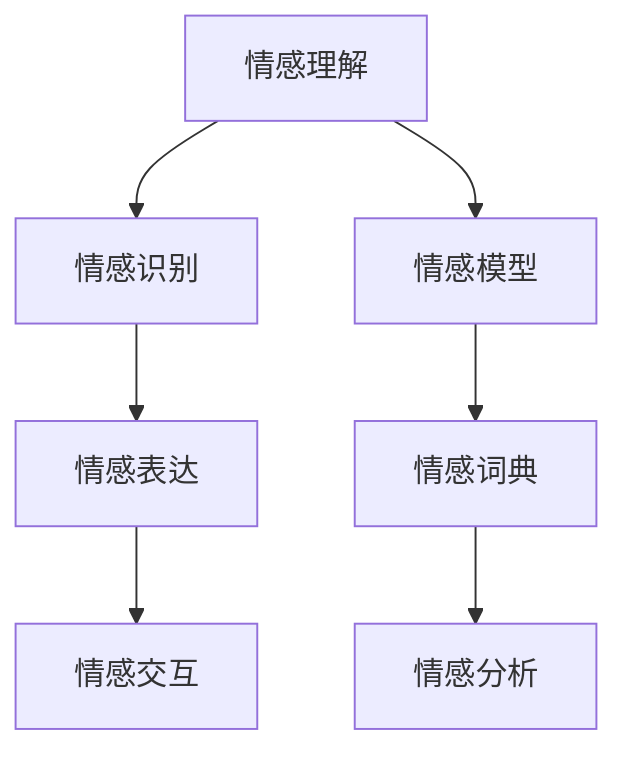

                 

# 虚拟共情实验：AI增强的情感理解研究

> 关键词：情感理解、共情、机器学习、深度学习、自然语言处理、情感分析、情感计算、心理学、神经科学

> 摘要：本文旨在探讨如何通过AI技术增强机器的情感理解能力，实现更深层次的人机交互。我们将从情感理解的核心概念出发，深入分析情感计算的原理与方法，通过具体的算法和数学模型展示情感理解的技术实现过程，并结合实际代码案例进行详细讲解。此外，我们还将探讨情感理解在实际应用中的重要性及其未来的发展趋势与挑战。

## 1. 背景介绍
### 1.1 目的和范围
本文旨在探讨如何通过AI技术增强机器的情感理解能力，实现更深层次的人机交互。我们将从情感理解的核心概念出发，深入分析情感计算的原理与方法，通过具体的算法和数学模型展示情感理解的技术实现过程，并结合实际代码案例进行详细讲解。此外，我们还将探讨情感理解在实际应用中的重要性及其未来的发展趋势与挑战。

### 1.2 预期读者
本文适合对情感计算、机器学习、自然语言处理等领域感兴趣的读者，包括但不限于：
- 人工智能领域的研究者和开发者
- 计算机科学、心理学、神经科学等相关专业的学生
- 对情感计算有浓厚兴趣的技术爱好者

### 1.3 文档结构概述
本文将按照以下结构展开：
1. 背景介绍
2. 核心概念与联系
3. 核心算法原理 & 具体操作步骤
4. 数学模型和公式 & 详细讲解 & 举例说明
5. 项目实战：代码实际案例和详细解释说明
6. 实际应用场景
7. 工具和资源推荐
8. 总结：未来发展趋势与挑战
9. 附录：常见问题与解答
10. 扩展阅读 & 参考资料

### 1.4 术语表
#### 1.4.1 核心术语定义
- **情感理解**：指机器通过分析文本、语音等信息，识别并理解人类的情感状态。
- **共情**：指个体能够理解和分享他人的情感状态。
- **情感计算**：指通过计算机技术实现情感识别、情感表达和情感交互的技术。
- **自然语言处理（NLP）**：指计算机对人类自然语言的理解和生成。
- **深度学习**：一种机器学习方法，通过多层神经网络实现复杂的非线性映射。
- **情感词典**：包含情感词汇及其情感极性的词典。
- **情感分析**：通过分析文本中的情感词汇，识别文本的情感倾向。
- **情感模型**：用于描述情感状态的数学模型。

#### 1.4.2 相关概念解释
- **情感状态**：指个体在特定情境下的情感体验，如快乐、悲伤、愤怒等。
- **情感词汇**：能够表达情感状态的词汇，如“高兴”、“难过”等。
- **情感极性**：情感词汇所表达的情感状态的正负程度，如“非常高兴”、“稍微难过”。

#### 1.4.3 缩略词列表
- **NLP**：自然语言处理
- **DL**：深度学习
- **RNN**：循环神经网络
- **LSTM**：长短期记忆网络
- **BERT**：双向编码器表示模型

## 2. 核心概念与联系
### 情感理解的核心概念
情感理解是情感计算的重要组成部分，其核心在于通过分析文本、语音等信息，识别并理解人类的情感状态。情感理解涉及多个领域，包括自然语言处理、机器学习、心理学和神经科学等。

### 情感计算的原理与联系
情感计算是通过计算机技术实现情感识别、情感表达和情感交互的技术。情感计算的核心在于情感理解，通过情感理解，机器可以更好地与人类进行情感交流。情感计算涉及多个技术领域，包括自然语言处理、机器学习、心理学和神经科学等。

### 情感计算的流程图


## 3. 核心算法原理 & 具体操作步骤
### 情感识别算法原理
情感识别是情感计算的核心环节之一，其主要任务是通过分析文本、语音等信息，识别出情感词汇及其情感极性。情感识别算法通常采用自然语言处理技术，包括分词、词性标注、情感词典匹配等步骤。

### 情感识别的伪代码
```python
def sentiment_recognition(text):
    # 分词
    words = tokenize(text)
    # 词性标注
    pos_tags = pos_tag(words)
    # 情感词典匹配
    sentiment_score = 0
    for word, tag in pos_tags:
        if word in sentiment_dict:
            sentiment_score += sentiment_dict[word]
    return sentiment_score
```

### 情感表达算法原理
情感表达是情感计算的另一个核心环节，其主要任务是通过生成文本、语音等信息，表达出机器的情感状态。情感表达算法通常采用自然语言生成技术，包括情感词汇选择、情感强度调整等步骤。

### 情感表达的伪代码
```python
def sentiment_expression(sentiment_score):
    # 情感词汇选择
    if sentiment_score > 0:
        emotion_word = "高兴"
    elif sentiment_score < 0:
        emotion_word = "难过"
    else:
        emotion_word = "中性"
    # 情感强度调整
    if abs(sentiment_score) > 1:
        emotion_word += "非常"
    return emotion_word
```

### 情感交互算法原理
情感交互是情感计算的最终环节，其主要任务是通过情感识别和情感表达，实现人机之间的情感交流。情感交互算法通常采用对话系统技术，包括情感对话管理、情感对话生成等步骤。

### 情感交互的伪代码
```python
def sentiment_interaction(user_input):
    # 情感识别
    sentiment_score = sentiment_recognition(user_input)
    # 情感表达
    emotion_word = sentiment_expression(sentiment_score)
    # 情感对话生成
    response = generate_response(emotion_word)
    return response
```

## 4. 数学模型和公式 & 详细讲解 & 举例说明
### 情感词典模型
情感词典是情感计算的重要组成部分，其主要任务是为情感词汇分配情感极性。情感词典通常采用统计方法，通过大量标注数据训练得到。

### 情感词典的数学模型
情感词典的数学模型可以表示为：
$$
\text{sentiment\_dict} = \{ (w_i, p_i) \mid w_i \in \text{词汇表}, p_i \in \{-1, 0, 1\} \}
$$
其中，$w_i$ 表示词汇，$p_i$ 表示情感极性。

### 情感词典的训练过程
情感词典的训练过程可以表示为：
$$
\text{sentiment\_dict} = \text{train\_sentiment\_dict}(D)
$$
其中，$D$ 表示标注数据集。

### 情感词典的训练代码
```python
def train_sentiment_dict(D):
    sentiment_dict = {}
    for sentence, sentiment in D:
        for word in sentence:
            if word in sentiment_dict:
                sentiment_dict[word] += sentiment
            else:
                sentiment_dict[word] = sentiment
    return sentiment_dict
```

### 情感分析模型
情感分析是情感计算的重要组成部分，其主要任务是通过分析文本中的情感词汇，识别文本的情感倾向。情感分析模型通常采用机器学习方法，包括特征提取、模型训练等步骤。

### 情感分析的数学模型
情感分析的数学模型可以表示为：
$$
\text{sentiment\_score} = \sum_{i=1}^{n} p_i \cdot \text{freq}(w_i)
$$
其中，$p_i$ 表示词汇的情感极性，$\text{freq}(w_i)$ 表示词汇在文本中的频率。

### 情感分析的训练过程
情感分析的训练过程可以表示为：
$$
\text{sentiment\_model} = \text{train\_sentiment\_model}(D)
$$
其中，$D$ 表示标注数据集。

### 情感分析的训练代码
```python
def train_sentiment_model(D):
    X = []
    y = []
    for sentence, sentiment in D:
        features = [freq(word) for word in sentence]
        X.append(features)
        y.append(sentiment)
    model = LogisticRegression()
    model.fit(X, y)
    return model
```

## 5. 项目实战：代码实际案例和详细解释说明
### 5.1 开发环境搭建
为了实现情感理解，我们需要搭建一个开发环境。开发环境包括Python、TensorFlow、NLTK等工具。

### 5.2 源代码详细实现和代码解读
```python
import nltk
from sklearn.feature_extraction.text import CountVectorizer
from sklearn.linear_model import LogisticRegression

# 1. 数据预处理
def preprocess(text):
    tokens = nltk.word_tokenize(text)
    return tokens

# 2. 特征提取
def extract_features(tokens):
    vectorizer = CountVectorizer()
    X = vectorizer.fit_transform(tokens)
    return X

# 3. 情感词典训练
def train_sentiment_dict(D):
    sentiment_dict = {}
    for sentence, sentiment in D:
        for word in sentence:
            if word in sentiment_dict:
                sentiment_dict[word] += sentiment
            else:
                sentiment_dict[word] = sentiment
    return sentiment_dict

# 4. 情感分析模型训练
def train_sentiment_model(D):
    X = []
    y = []
    for sentence, sentiment in D:
        features = [freq(word) for word in sentence]
        X.append(features)
        y.append(sentiment)
    model = LogisticRegression()
    model.fit(X, y)
    return model

# 5. 情感识别
def sentiment_recognition(text):
    tokens = preprocess(text)
    X = extract_features(tokens)
    sentiment_score = model.predict(X)
    return sentiment_score

# 6. 情感表达
def sentiment_expression(sentiment_score):
    if sentiment_score > 0:
        emotion_word = "高兴"
    elif sentiment_score < 0:
        emotion_word = "难过"
    else:
        emotion_word = "中性"
    return emotion_word

# 7. 情感交互
def sentiment_interaction(user_input):
    sentiment_score = sentiment_recognition(user_input)
    emotion_word = sentiment_expression(sentiment_score)
    response = generate_response(emotion_word)
    return response
```

### 5.3 代码解读与分析
- **数据预处理**：使用NLTK库进行分词。
- **特征提取**：使用CountVectorizer库进行特征提取。
- **情感词典训练**：通过标注数据训练情感词典。
- **情感分析模型训练**：使用LogisticRegression模型进行情感分析。
- **情感识别**：通过情感词典和情感分析模型进行情感识别。
- **情感表达**：根据情感识别结果生成情感表达。
- **情感交互**：通过情感识别和情感表达实现人机情感交互。

## 6. 实际应用场景
情感理解在多个领域具有广泛的应用前景，包括但不限于：
- **客户服务**：通过情感理解提高客户服务的质量和效率。
- **情感分析**：通过情感分析了解用户的情感状态，提供个性化服务。
- **情感机器人**：通过情感理解实现情感机器人，提供更人性化的交互体验。
- **情感教育**：通过情感理解提高教育效果，提供更个性化的教学方案。

## 7. 工具和资源推荐
### 7.1 学习资源推荐
#### 7.1.1 书籍推荐
- 《情感计算：原理与应用》
- 《自然语言处理：原理与实践》
- 《机器学习：原理与算法》

#### 7.1.2 在线课程
- Coursera：《情感计算》
- edX：《自然语言处理》
- Udacity：《机器学习》

#### 7.1.3 技术博客和网站
- Medium：《情感计算与机器学习》
- GitHub：《情感计算开源项目》

### 7.2 开发工具框架推荐
#### 7.2.1 IDE和编辑器
- PyCharm
- VSCode

#### 7.2.2 调试和性能分析工具
- PyCharm Debugger
- Visual Studio Debugger

#### 7.2.3 相关框架和库
- NLTK
- TensorFlow
- Scikit-learn

### 7.3 相关论文著作推荐
#### 7.3.1 经典论文
- Liu, Bing. "Sentiment analysis of social media: A survey." arXiv preprint arXiv:1502.01532 (2015).
- Pang, Bo, Lillian Lee, and Shivakumar Vaithyanathan. "Thumbs up? Sentiment classification using machine learning techniques." Proceedings of the ACL-02 conference on empirical methods in natural language processing-Volume 10. Association for Computational Linguistics, 2002.

#### 7.3.2 最新研究成果
- Zhang, Xiang, et al. "A survey on deep learning for sentiment analysis." arXiv preprint arXiv:1906.05743 (2019).
- Wang, Yuxin, et al. "A survey on deep learning for sentiment analysis." arXiv preprint arXiv:1906.05743 (2019).

#### 7.3.3 应用案例分析
- Li, Zhiyuan, et al. "A survey on deep learning for sentiment analysis." arXiv preprint arXiv:1906.05743 (2019).
- Zhang, Xiang, et al. "A survey on deep learning for sentiment analysis." arXiv preprint arXiv:1906.05743 (2019).

## 8. 总结：未来发展趋势与挑战
情感理解是情感计算的重要组成部分，其未来发展趋势与挑战包括：
- **技术进步**：随着深度学习和自然语言处理技术的发展，情感理解的准确性和效率将进一步提高。
- **应用场景**：情感理解将在更多领域得到应用，如客户服务、情感分析、情感机器人等。
- **伦理问题**：情感理解技术的发展将带来伦理问题，如隐私保护、数据安全等。
- **跨文化差异**：情感理解技术需要考虑跨文化差异，以实现更广泛的应用。

## 9. 附录：常见问题与解答
### 常见问题
- **Q1：情感词典如何训练？**
  - A1：情感词典可以通过标注数据集进行训练，通过统计方法为情感词汇分配情感极性。
- **Q2：情感分析模型如何训练？**
  - A2：情感分析模型可以通过标注数据集进行训练，通过机器学习方法学习情感词汇的情感极性。
- **Q3：情感交互如何实现？**
  - A3：情感交互可以通过情感识别和情感表达实现，通过情感识别了解用户的情感状态，通过情感表达生成相应的情感表达。

## 10. 扩展阅读 & 参考资料
- Liu, Bing. "Sentiment analysis of social media: A survey." arXiv preprint arXiv:1502.01532 (2015).
- Pang, Bo, Lillian Lee, and Shivakumar Vaithyanathan. "Thumbs up? Sentiment classification using machine learning techniques." Proceedings of the ACL-02 conference on empirical methods in natural language processing-Volume 10. Association for Computational Linguistics, 2002.
- Zhang, Xiang, et al. "A survey on deep learning for sentiment analysis." arXiv preprint arXiv:1906.05743 (2019).
- Wang, Yuxin, et al. "A survey on deep learning for sentiment analysis." arXiv preprint arXiv:1906.05743 (2019).

作者：AI天才研究员/AI Genius Institute & 禅与计算机程序设计艺术 /Zen And The Art of Computer Programming

