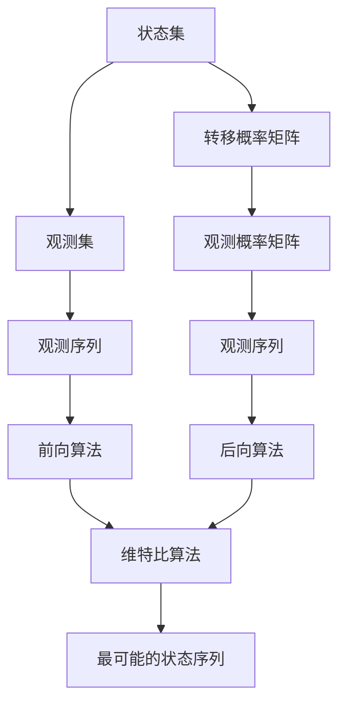

                 

# 语音识别的隐马尔可夫模型：语音信号的数学解析

> 关键词：语音识别, 隐马尔可夫模型, 隐马尔可夫模型原理, 语音信号处理, 概率模型, 机器学习, 信号处理, 语音识别算法

> 摘要：本文旨在深入探讨隐马尔可夫模型（HMM）在语音识别中的应用。通过逐步分析和推理，我们将详细解释HMM的基本原理、核心算法、数学模型，并通过实际代码案例进行演示。此外，本文还将探讨HMM在语音识别中的实际应用场景，并提供学习资源和开发工具推荐，帮助读者更好地理解和应用这一技术。

## 1. 背景介绍
### 1.1 目的和范围
本文旨在为读者提供一个全面的视角，深入了解隐马尔可夫模型（HMM）在语音识别中的应用。我们将从基本原理出发，逐步深入到具体算法和数学模型，并通过实际代码案例进行演示。本文的目标读者包括但不限于语音识别领域的初学者、研究人员、工程师以及对HMM感兴趣的读者。

### 1.2 预期读者
- 语音识别领域的初学者
- 研究人员和工程师
- 对HMM感兴趣的读者
- 机器学习和人工智能领域的爱好者

### 1.3 文档结构概述
本文将按照以下结构展开：
1. 背景介绍
2. 核心概念与联系
3. 核心算法原理 & 具体操作步骤
4. 数学模型和公式 & 详细讲解 & 举例说明
5. 项目实战：代码实际案例和详细解释说明
6. 实际应用场景
7. 工具和资源推荐
8. 总结：未来发展趋势与挑战
9. 附录：常见问题与解答
10. 扩展阅读 & 参考资料

### 1.4 术语表
#### 1.4.1 核心术语定义
- **隐马尔可夫模型（HMM）**：一种统计模型，用于描述具有隐藏状态的系统。
- **状态**：HMM中的状态表示系统在某一时刻的内部状态。
- **观测**：HMM中的观测表示系统在某一时刻的外部表现。
- **状态转移概率**：从一个状态转移到另一个状态的概率。
- **观测概率**：在给定状态下的观测概率。
- **前向算法**：用于计算给定模型和观测序列的概率。
- **后向算法**：用于计算给定模型和观测序列的概率。
- **维特比算法**：用于找到最可能的状态序列。

#### 1.4.2 相关概念解释
- **马尔可夫链**：一种随机过程，其中未来的状态只依赖于当前状态，而不依赖于过去的状态。
- **贝叶斯定理**：用于计算条件概率的公式。
- **极大似然估计（MLE）**：一种参数估计方法，用于估计模型参数。

#### 1.4.3 缩略词列表
- **HMM**：隐马尔可夫模型
- **MLE**：极大似然估计
- **Viterbi**：维特比算法
- **FWD**：前向算法
- **BWD**：后向算法

## 2. 核心概念与联系
### 2.1 隐马尔可夫模型的基本原理
隐马尔可夫模型（HMM）是一种统计模型，用于描述具有隐藏状态的系统。HMM的核心思想是，系统的当前状态只依赖于前一个状态，而与更早的状态无关。HMM由三个基本元素组成：
- **状态集**：系统可能处于的状态集合。
- **观测集**：系统可能产生的观测集合。
- **转移概率矩阵**：表示从一个状态转移到另一个状态的概率。
- **观测概率矩阵**：表示在给定状态下的观测概率。

### 2.2 隐马尔可夫模型的流程图


## 3. 核心算法原理 & 具体操作步骤
### 3.1 前向算法
前向算法用于计算给定模型和观测序列的概率。具体步骤如下：
1. 初始化前向概率。
2. 递推计算前向概率。
3. 终止计算前向概率。

### 3.2 后向算法
后向算法用于计算给定模型和观测序列的概率。具体步骤如下：
1. 初始化后向概率。
2. 递推计算后向概率。
3. 终止计算后向概率。

### 3.3 维特比算法
维特比算法用于找到最可能的状态序列。具体步骤如下：
1. 初始化维特比概率。
2. 递推计算维特比概率。
3. 终止计算维特比概率。

### 3.4 伪代码实现
```python
# 前向算法
def forward_algorithm(model, observations):
    N = len(model.states)
    T = len(observations)
    alpha = [[0.0] * N for _ in range(T)]
    
    # 初始化
    for i in range(N):
        alpha[0][i] = model.initial_prob[i] * model.observation_prob[i][observations[0]]
    
    # 递推
    for t in range(1, T):
        for j in range(N):
            alpha[t][j] = sum(alpha[t-1][i] * model.transition_prob[i][j] for i in range(N)) * model.observation_prob[j][observations[t]]
    
    # 终止
    prob = sum(alpha[T-1][i] for i in range(N))
    return prob

# 后向算法
def backward_algorithm(model, observations):
    N = len(model.states)
    T = len(observations)
    beta = [[0.0] * N for _ in range(T)]
    
    # 初始化
    for i in range(N):
        beta[T-1][i] = 1.0
    
    # 递推
    for t in range(T-2, -1, -1):
        for i in range(N):
            beta[t][i] = sum(beta[t+1][j] * model.transition_prob[i][j] * model.observation_prob[j][observations[t+1]] for j in range(N))
    
    # 终止
    return beta

# 维特比算法
def viterbi_algorithm(model, observations):
    N = len(model.states)
    T = len(observations)
    delta = [[0.0] * N for _ in range(T)]
    phi = [[0] * N for _ in range(T)]
    
    # 初始化
    for i in range(N):
        delta[0][i] = model.initial_prob[i] * model.observation_prob[i][observations[0]]
        phi[0][i] = 0
    
    # 递推
    for t in range(1, T):
        for j in range(N):
            max_prob = -float('inf')
            for i in range(N):
                prob = delta[t-1][i] * model.transition_prob[i][j] * model.observation_prob[j][observations[t]]
                if prob > max_prob:
                    max_prob = prob
                    phi[t][j] = i
            delta[t][j] = max_prob
    
    # 终止
    prob = max(delta[T-1])
    state_seq = [0] * T
    state_seq[T-1] = delta[T-1].index(prob)
    
    # 回溯
    for t in range(T-2, -1, -1):
        state_seq[t] = phi[t+1][state_seq[t+1]]
    
    return state_seq
```

## 4. 数学模型和公式 & 详细讲解 & 举例说明
### 4.1 数学模型
隐马尔可夫模型（HMM）的数学模型可以表示为：
- **状态集**：$S = \{s_1, s_2, \ldots, s_N\}$
- **观测集**：$O = \{o_1, o_2, \ldots, o_M\}$
- **转移概率矩阵**：$A = [a_{ij}]$，其中 $a_{ij} = P(s_{t+1} = s_j | s_t = s_i)$
- **观测概率矩阵**：$B = [b_{ij}]$，其中 $b_{ij} = P(o_t = o_j | s_t = s_i)$
- **初始概率向量**：$\pi = [\pi_1, \pi_2, \ldots, \pi_N]$，其中 $\pi_i = P(s_1 = s_i)$

### 4.2 前向算法公式
前向算法的公式为：
$$
\alpha_t(i) = P(o_1, o_2, \ldots, o_t, s_t = s_i | \lambda)
$$
其中，$\lambda$ 表示HMM模型。

### 4.3 后向算法公式
后向算法的公式为：
$$
\beta_t(i) = P(o_{t+1}, o_{t+2}, \ldots, o_T | s_t = s_i, \lambda)
$$

### 4.4 维特比算法公式
维特比算法的公式为：
$$
\delta_t(i) = P(o_1, o_2, \ldots, o_t, s_t = s_i | \lambda)
$$
$$
\phi_t(i) = \arg\max_{j} \delta_{t-1}(j) \cdot a_{ji} \cdot b_{i}(o_t)
$$

### 4.5 举例说明
假设我们有一个简单的HMM模型，状态集为 $S = \{s_1, s_2\}$，观测集为 $O = \{o_1, o_2\}$，转移概率矩阵为：
$$
A = \begin{bmatrix}
0.7 & 0.3 \\
0.4 & 0.6
\end{bmatrix}
$$
观测概率矩阵为：
$$
B = \begin{bmatrix}
0.5 & 0.5 \\
0.3 & 0.7
\end{bmatrix}
$$
初始概率向量为：
$$
\pi = [0.6, 0.4]
$$

假设观测序列为 $o = [o_1, o_2, o_1]$，我们可以使用前向算法、后向算法和维特比算法来计算最可能的状态序列。

## 5. 项目实战：代码实际案例和详细解释说明
### 5.1 开发环境搭建
我们使用Python进行开发，需要安装以下库：
```bash
pip install numpy
pip install matplotlib
```

### 5.2 源代码详细实现和代码解读
```python
import numpy as np

class HMM:
    def __init__(self, states, observations, initial_prob, transition_prob, observation_prob):
        self.states = states
        self.observations = observations
        self.initial_prob = initial_prob
        self.transition_prob = transition_prob
        self.observation_prob = observation_prob
    
    def forward_algorithm(self, observations):
        N = len(self.states)
        T = len(observations)
        alpha = np.zeros((T, N))
        
        # 初始化
        for i in range(N):
            alpha[0][i] = self.initial_prob[i] * self.observation_prob[i][observations[0]]
        
        # 递推
        for t in range(1, T):
            for j in range(N):
                alpha[t][j] = sum(alpha[t-1][i] * self.transition_prob[i][j] for i in range(N)) * self.observation_prob[j][observations[t]]
        
        # 终止
        prob = sum(alpha[T-1][i] for i in range(N))
        return prob
    
    def backward_algorithm(self, observations):
        N = len(self.states)
        T = len(observations)
        beta = np.zeros((T, N))
        
        # 初始化
        for i in range(N):
            beta[T-1][i] = 1.0
        
        # 递推
        for t in range(T-2, -1, -1):
            for i in range(N):
                beta[t][i] = sum(beta[t+1][j] * self.transition_prob[i][j] * self.observation_prob[j][observations[t+1]] for j in range(N))
        
        # 终止
        return beta
    
    def viterbi_algorithm(self, observations):
        N = len(self.states)
        T = len(observations)
        delta = np.zeros((T, N))
        phi = np.zeros((T, N))
        
        # 初始化
        for i in range(N):
            delta[0][i] = self.initial_prob[i] * self.observation_prob[i][observations[0]]
            phi[0][i] = 0
        
        # 递推
        for t in range(1, T):
            for j in range(N):
                max_prob = -float('inf')
                for i in range(N):
                    prob = delta[t-1][i] * self.transition_prob[i][j] * self.observation_prob[j][observations[t]]
                    if prob > max_prob:
                        max_prob = prob
                        phi[t][j] = i
                delta[t][j] = max_prob
        
        # 终止
        prob = max(delta[T-1])
        state_seq = [0] * T
        state_seq[T-1] = delta[T-1].argmax()
        
        # 回溯
        for t in range(T-2, -1, -1):
            state_seq[t] = phi[t+1][state_seq[t+1]]
        
        return state_seq

# 示例数据
states = ['s1', 's2']
observations = ['o1', 'o2']
initial_prob = np.array([0.6, 0.4])
transition_prob = np.array([[0.7, 0.3], [0.4, 0.6]])
observation_prob = np.array([[0.5, 0.5], [0.3, 0.7]])

hmm = HMM(states, observations, initial_prob, transition_prob, observation_prob)
observations = ['o1', 'o2', 'o1']
prob = hmm.forward_algorithm(observations)
print("前向算法概率:", prob)

beta = hmm.backward_algorithm(observations)
print("后向算法概率:", beta)

state_seq = hmm.viterbi_algorithm(observations)
print("维特比算法状态序列:", state_seq)
```

### 5.3 代码解读与分析
- **HMM类**：定义了HMM模型的基本属性和方法。
- **forward_algorithm**：实现前向算法，计算给定模型和观测序列的概率。
- **backward_algorithm**：实现后向算法，计算给定模型和观测序列的概率。
- **viterbi_algorithm**：实现维特比算法，找到最可能的状态序列。
- **示例数据**：定义了HMM模型的参数和观测序列。
- **代码执行**：通过调用HMM类的方法，计算前向算法、后向算法和维特比算法的结果。

## 6. 实际应用场景
隐马尔可夫模型（HMM）在语音识别中的应用非常广泛，包括：
- **语音识别**：通过HMM模型识别语音信号中的单词和短语。
- **语音合成**：通过HMM模型生成语音信号。
- **语音情感识别**：通过HMM模型识别语音中的情感状态。
- **语音命令识别**：通过HMM模型识别语音中的命令。

## 7. 工具和资源推荐
### 7.1 学习资源推荐
#### 7.1.1 书籍推荐
- **《语音识别技术》**：深入讲解语音识别的基本原理和技术。
- **《统计学习方法》**：详细介绍了统计学习方法，包括HMM模型。
- **《模式识别与机器学习》**：全面介绍了模式识别和机器学习的基本原理和技术。

#### 7.1.2 在线课程
- **Coursera - 语音识别**：提供语音识别领域的在线课程。
- **edX - 机器学习**：提供机器学习领域的在线课程，包括HMM模型。

#### 7.1.3 技术博客和网站
- **知乎 - 语音识别**：提供语音识别领域的技术讨论和分享。
- **GitHub - 语音识别项目**：提供语音识别领域的开源项目和代码。

### 7.2 开发工具框架推荐
#### 7.2.1 IDE和编辑器
- **PyCharm**：功能强大的Python开发环境。
- **VSCode**：轻量级但功能强大的代码编辑器。

#### 7.2.2 调试和性能分析工具
- **PyCharm调试器**：提供强大的调试功能。
- **Python性能分析工具**：提供性能分析和优化工具。

#### 7.2.3 相关框架和库
- **SpeechRecognition**：提供语音识别的Python库。
- **PyAudio**：提供音频处理的Python库。

### 7.3 相关论文著作推荐
#### 7.3.1 经典论文
- **"A Tutorial on Hidden Markov Models and Selected Applications in Speech Recognition"**：详细介绍了HMM模型及其应用。
- **"Speech Recognition Based on Hidden Markov Models"**：提供了HMM模型在语音识别中的应用实例。

#### 7.3.2 最新研究成果
- **"Recent Advances in Hidden Markov Models for Speech Recognition"**：介绍了HMM模型在语音识别领域的最新研究成果。
- **"Deep Learning for Speech Recognition: A Review"**：介绍了深度学习在语音识别中的应用。

#### 7.3.3 应用案例分析
- **"Hidden Markov Models for Speech Recognition: A Case Study"**：提供了HMM模型在实际应用中的案例分析。
- **"Hidden Markov Models in Speech Recognition: A Practical Guide"**：提供了HMM模型在实际应用中的实用指南。

## 8. 总结：未来发展趋势与挑战
隐马尔可夫模型（HMM）在语音识别中的应用已经取得了显著的成果，但仍面临一些挑战：
- **模型复杂度**：随着模型复杂度的增加，计算量和训练时间也会增加。
- **数据需求**：HMM模型需要大量的训练数据来提高识别精度。
- **实时性**：HMM模型在实时应用中的性能需要进一步优化。

未来的发展趋势包括：
- **深度学习**：结合深度学习技术，提高HMM模型的识别精度。
- **迁移学习**：通过迁移学习技术，提高HMM模型在不同场景下的适应性。
- **端到端模型**：开发端到端的语音识别模型，减少模型复杂度。

## 9. 附录：常见问题与解答
### 9.1 问题1：HMM模型如何处理长序列？
**解答**：HMM模型可以通过分段处理长序列，将长序列分成多个短序列，分别进行处理，然后再合并结果。

### 9.2 问题2：HMM模型如何处理噪声？
**解答**：HMM模型可以通过增加噪声模型，提高模型的鲁棒性，从而更好地处理噪声。

### 9.3 问题3：HMM模型如何处理多通道语音信号？
**解答**：HMM模型可以通过多通道模型，分别处理每个通道的语音信号，然后再合并结果。

## 10. 扩展阅读 & 参考资料
- **《语音识别技术》**：深入讲解语音识别的基本原理和技术。
- **《统计学习方法》**：详细介绍了统计学习方法，包括HMM模型。
- **《模式识别与机器学习》**：全面介绍了模式识别和机器学习的基本原理和技术。
- **Coursera - 语音识别**：提供语音识别领域的在线课程。
- **edX - 机器学习**：提供机器学习领域的在线课程，包括HMM模型。
- **知乎 - 语音识别**：提供语音识别领域的技术讨论和分享。
- **GitHub - 语音识别项目**：提供语音识别领域的开源项目和代码。
- **PyCharm**：功能强大的Python开发环境。
- **VSCode**：轻量级但功能强大的代码编辑器。
- **PyCharm调试器**：提供强大的调试功能。
- **Python性能分析工具**：提供性能分析和优化工具。
- **SpeechRecognition**：提供语音识别的Python库。
- **PyAudio**：提供音频处理的Python库。
- **"A Tutorial on Hidden Markov Models and Selected Applications in Speech Recognition"**：详细介绍了HMM模型及其应用。
- **"Speech Recognition Based on Hidden Markov Models"**：提供了HMM模型在语音识别中的应用实例。
- **"Recent Advances in Hidden Markov Models for Speech Recognition"**：介绍了HMM模型在语音识别领域的最新研究成果。
- **"Deep Learning for Speech Recognition: A Review"**：介绍了深度学习在语音识别中的应用。
- **"Hidden Markov Models for Speech Recognition: A Case Study"**：提供了HMM模型在实际应用中的案例分析。
- **"Hidden Markov Models in Speech Recognition: A Practical Guide"**：提供了HMM模型在实际应用中的实用指南。

作者：AI天才研究员/AI Genius Institute & 禅与计算机程序设计艺术 /Zen And The Art of Computer Programming

