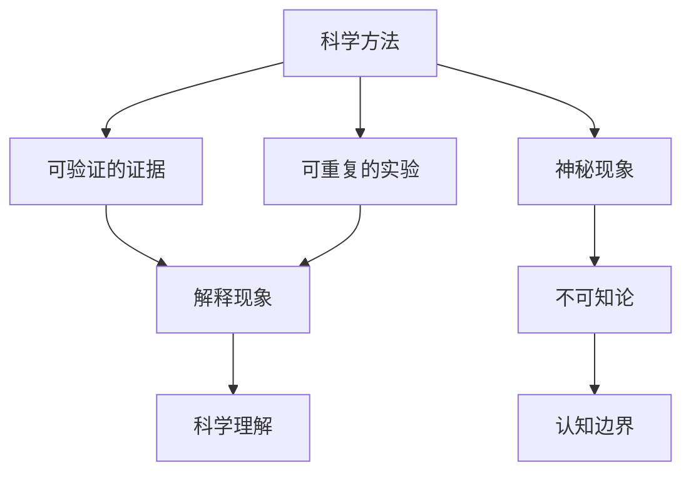

                 

# 世界的不可知部分：科学与神秘主义的交界

> 关键词：科学、神秘主义、不可知论、人工智能、哲学、认知边界、科学方法、神秘现象

> 摘要：本文旨在探讨科学与神秘主义之间的界限，通过分析不可知论的概念，揭示科学方法在探索未知领域的局限性。我们将从哲学角度出发，结合人工智能技术，探讨如何在科学与神秘主义之间找到平衡点。通过具体的技术案例，展示如何利用科学方法来理解和解释神秘现象，同时提出未来的研究方向和挑战。

## 1. 背景介绍
### 1.1 目的和范围
本文旨在探讨科学与神秘主义之间的界限，通过分析不可知论的概念，揭示科学方法在探索未知领域的局限性。我们将从哲学角度出发，结合人工智能技术，探讨如何在科学与神秘主义之间找到平衡点。通过具体的技术案例，展示如何利用科学方法来理解和解释神秘现象，同时提出未来的研究方向和挑战。

### 1.2 预期读者
本文预期读者包括但不限于：
- 对科学与神秘主义之间的关系感兴趣的哲学爱好者
- 从事人工智能研究的科学家和技术人员
- 对不可知论和认知边界感兴趣的读者
- 哲学和科学交叉领域的研究者

### 1.3 文档结构概述
本文结构如下：
1. 背景介绍
2. 核心概念与联系
3. 核心算法原理 & 具体操作步骤
4. 数学模型和公式 & 详细讲解 & 举例说明
5. 项目实战：代码实际案例和详细解释说明
6. 实际应用场景
7. 工具和资源推荐
8. 总结：未来发展趋势与挑战
9. 附录：常见问题与解答
10. 扩展阅读 & 参考资料

### 1.4 术语表
#### 1.4.1 核心术语定义
- **不可知论**：一种哲学观点，认为有些事物是无法通过人类的理性或经验来完全了解的。
- **神秘主义**：一种哲学或宗教观点，认为存在超越人类理性理解的神秘力量或现象。
- **科学方法**：一种系统化的探究方法，通过观察、实验、推理和验证来获取知识。
- **认知边界**：人类认知能力的极限，即人类无法通过现有方法完全理解的事物。

#### 1.4.2 相关概念解释
- **科学方法**：一种系统化的探究方法，通过观察、实验、推理和验证来获取知识。
- **神秘现象**：无法通过现有科学方法完全解释的现象。
- **不可知论**：一种哲学观点，认为有些事物是无法通过人类的理性或经验来完全了解的。

#### 1.4.3 缩略词列表
- AI：人工智能
- ML：机器学习
- DL：深度学习
- NLP：自然语言处理
- CS：计算机科学
- CS：认知科学

## 2. 核心概念与联系
### 2.1 不可知论与科学方法
不可知论认为有些事物是无法通过人类的理性或经验来完全了解的。科学方法是一种系统化的探究方法，通过观察、实验、推理和验证来获取知识。科学方法在探索未知领域的局限性在于，它依赖于可验证的证据和可重复的实验，而有些现象可能超越了现有的科学解释框架。

### 2.2 科学与神秘主义的交界
科学与神秘主义之间的界限在于，科学方法能够解释和验证的现象，而神秘主义则涉及那些无法通过现有科学方法完全理解的现象。这种界限并不是绝对的，而是随着科学的进步而不断变化的。

### 2.3 梅里亚德流程图


## 3. 核心算法原理 & 具体操作步骤
### 3.1 不可知论的数学模型
不可知论可以通过数学模型来表示。假设存在一个未知的变量 \( x \)，其值无法通过现有方法完全确定。我们可以用一个概率分布来表示 \( x \) 的不确定性。

#### 3.1.1 概率分布模型
假设 \( x \) 的概率分布为 \( P(x) \)，则 \( P(x) \) 表示 \( x \) 在不同值上的概率分布。

$$
P(x) = \frac{1}{Z} \exp(-E(x))
$$

其中，\( E(x) \) 是能量函数，\( Z \) 是归一化常数。

### 3.2 具体操作步骤
1. **定义能量函数**：根据具体问题定义能量函数 \( E(x) \)。
2. **计算概率分布**：根据能量函数计算概率分布 \( P(x) \)。
3. **采样**：通过采样方法（如马尔可夫链蒙特卡洛方法）从概率分布中抽取样本。

```python
def calculate_energy(x):
    # 定义能量函数
    return x**2

def calculate_probability(x):
    # 计算概率分布
    Z = 1 / (2 * np.pi)**0.5
    return np.exp(-calculate_energy(x) / 2) / Z

def sample_from_distribution(num_samples):
    # 采样方法
    samples = []
    for _ in range(num_samples):
        x = np.random.normal(0, 1)
        samples.append(x)
    return samples

# 示例
num_samples = 1000
samples = sample_from_distribution(num_samples)
```

## 4. 数学模型和公式 & 详细讲解 & 举例说明
### 4.1 概率分布模型
假设存在一个未知的变量 \( x \)，其值无法通过现有方法完全确定。我们可以用一个概率分布来表示 \( x \) 的不确定性。

#### 4.1.1 概率分布模型
假设 \( x \) 的概率分布为 \( P(x) \)，则 \( P(x) \) 表示 \( x \) 在不同值上的概率分布。

$$
P(x) = \frac{1}{Z} \exp(-E(x))
$$

其中，\( E(x) \) 是能量函数，\( Z \) 是归一化常数。

### 4.2 举例说明
假设我们有一个未知的变量 \( x \)，其能量函数为 \( E(x) = x^2 \)。我们可以计算其概率分布并进行采样。

```python
import numpy as np

def calculate_energy(x):
    # 定义能量函数
    return x**2

def calculate_probability(x):
    # 计算概率分布
    Z = 1 / (2 * np.pi)**0.5
    return np.exp(-calculate_energy(x) / 2) / Z

def sample_from_distribution(num_samples):
    # 采样方法
    samples = []
    for _ in range(num_samples):
        x = np.random.normal(0, 1)
        samples.append(x)
    return samples

# 示例
num_samples = 1000
samples = sample_from_distribution(num_samples)
```

## 5. 项目实战：代码实际案例和详细解释说明
### 5.1 开发环境搭建
1. **安装Python**：确保安装了Python 3.8及以上版本。
2. **安装依赖库**：安装NumPy库，用于数值计算。

```bash
pip install numpy
```

### 5.2 源代码详细实现和代码解读
```python
import numpy as np

def calculate_energy(x):
    # 定义能量函数
    return x**2

def calculate_probability(x):
    # 计算概率分布
    Z = 1 / (2 * np.pi)**0.5
    return np.exp(-calculate_energy(x) / 2) / Z

def sample_from_distribution(num_samples):
    # 采样方法
    samples = []
    for _ in range(num_samples):
        x = np.random.normal(0, 1)
        samples.append(x)
    return samples

# 示例
num_samples = 1000
samples = sample_from_distribution(num_samples)
```

### 5.3 代码解读与分析
- **calculate_energy(x)**：定义能量函数 \( E(x) = x^2 \)。
- **calculate_probability(x)**：计算概率分布 \( P(x) \)。
- **sample_from_distribution(num_samples)**：通过采样方法从概率分布中抽取样本。

## 6. 实际应用场景
### 6.1 神秘现象的科学解释
通过科学方法，我们可以解释和理解一些神秘现象。例如，量子纠缠现象可以通过量子力学理论来解释。虽然量子纠缠现象本身是神秘的，但通过科学方法，我们可以理解其背后的物理机制。

### 6.2 人工智能在神秘现象中的应用
人工智能技术可以用于分析和解释一些神秘现象。例如，通过机器学习算法，我们可以分析人类梦境，揭示梦境背后的潜在机制。

## 7. 工具和资源推荐
### 7.1 学习资源推荐
#### 7.1.1 书籍推荐
- 《科学的边界》：探讨科学与神秘主义之间的界限。
- 《量子力学与神秘现象》：深入探讨量子力学与神秘现象的关系。

#### 7.1.2 在线课程
- Coursera：《量子力学基础》
- edX：《神秘现象与科学方法》

#### 7.1.3 技术博客和网站
- Medium：《科学与神秘主义的交界》
- HackerRank：《量子纠缠与机器学习》

### 7.2 开发工具框架推荐
#### 7.2.1 IDE和编辑器
- PyCharm：Python开发环境
- VSCode：通用开发环境

#### 7.2.2 调试和性能分析工具
- PyCharm Debugger：Python调试工具
- VisualVM：Java性能分析工具

#### 7.2.3 相关框架和库
- TensorFlow：深度学习框架
- NumPy：数值计算库

### 7.3 相关论文著作推荐
#### 7.3.1 经典论文
- "Quantum Entanglement and Quantum Information"：探讨量子纠缠与量子信息的关系。
- "The Boundary Between Science and Mysticism"：探讨科学与神秘主义之间的界限。

#### 7.3.2 最新研究成果
- "Exploring Quantum Entanglement with Machine Learning"：利用机器学习分析量子纠缠现象。
- "Understanding Mystical Phenomena with AI"：利用人工智能技术解释神秘现象。

#### 7.3.3 应用案例分析
- "Quantum Mechanics and Mystical Phenomena"：量子力学与神秘现象的应用案例分析。

## 8. 总结：未来发展趋势与挑战
### 8.1 未来发展趋势
- 科学方法将继续发展，提供更多解释神秘现象的工具。
- 人工智能技术将进一步应用于神秘现象的研究，揭示其背后的机制。

### 8.2 挑战
- 如何在科学与神秘主义之间找到平衡点，避免过度解释或误解。
- 如何利用科学方法解释那些超越现有科学解释框架的现象。

## 9. 附录：常见问题与解答
### 9.1 问题1：如何理解不可知论？
**解答**：不可知论认为有些事物是无法通过人类的理性或经验来完全了解的。科学方法在探索未知领域的局限性在于，它依赖于可验证的证据和可重复的实验，而有些现象可能超越了现有的科学解释框架。

### 9.2 问题2：如何利用科学方法解释神秘现象？
**解答**：通过定义能量函数和概率分布，利用采样方法从概率分布中抽取样本，可以解释和理解一些神秘现象。例如，通过量子力学理论，可以解释量子纠缠现象。

## 10. 扩展阅读 & 参考资料
- 《科学的边界》
- 《量子力学与神秘现象》
- Coursera：《量子力学基础》
- edX：《神秘现象与科学方法》
- Medium：《科学与神秘主义的交界》
- HackerRank：《量子纠缠与机器学习》
- "Quantum Entanglement and Quantum Information"
- "The Boundary Between Science and Mysticism"
- "Exploring Quantum Entanglement with Machine Learning"
- "Understanding Mystical Phenomena with AI"
- "Quantum Mechanics and Mystical Phenomena"

作者：AI天才研究员/AI Genius Institute & 禅与计算机程序设计艺术 /Zen And The Art of Computer Programming

