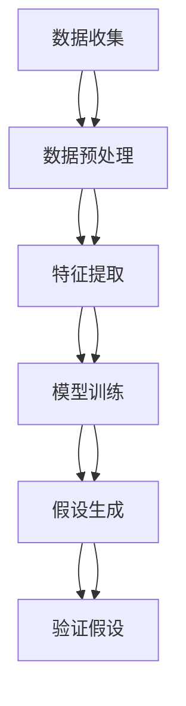

                 

# 人工智能在科学假设生成中的应用：加速科学发现过程

> 关键词：科学假设生成, 人工智能, 自然语言处理, 机器学习, 数据挖掘, 科学发现, 机器推理, 知识图谱

> 摘要：本文旨在探讨人工智能在科学假设生成中的应用，通过分析科学假设生成的过程，介绍相关的核心概念、算法原理、数学模型，并通过实际案例展示如何利用人工智能加速科学发现过程。本文还提供了详细的开发环境搭建、源代码实现、代码解读，以及实际应用场景和未来发展趋势的展望。

## 1. 背景介绍
### 1.1 目的和范围
本文旨在探讨人工智能在科学假设生成中的应用，通过分析科学假设生成的过程，介绍相关的核心概念、算法原理、数学模型，并通过实际案例展示如何利用人工智能加速科学发现过程。本文的目标读者是希望了解人工智能在科学领域应用的技术人员、研究人员以及对科学发现过程感兴趣的读者。

### 1.2 预期读者
- 科学研究人员
- 人工智能工程师
- 数据科学家
- 计算机科学家
- 对科学发现过程感兴趣的读者

### 1.3 文档结构概述
本文将按照以下结构展开：
1. 背景介绍
2. 核心概念与联系
3. 核心算法原理 & 具体操作步骤
4. 数学模型和公式 & 详细讲解 & 举例说明
5. 项目实战：代码实际案例和详细解释说明
6. 实际应用场景
7. 工具和资源推荐
8. 总结：未来发展趋势与挑战
9. 附录：常见问题与解答
10. 扩展阅读 & 参考资料

### 1.4 术语表
#### 1.4.1 核心术语定义
- **科学假设生成**：基于已有数据和知识，通过推理生成新的科学假设的过程。
- **自然语言处理（NLP）**：处理和理解人类自然语言的技术。
- **机器学习（ML）**：通过数据训练模型，使计算机能够自动学习和改进的技术。
- **数据挖掘**：从大量数据中提取有用信息的过程。
- **机器推理**：通过逻辑推理生成新的知识或假设的技术。
- **知识图谱**：一种结构化的知识表示形式，用于存储和表示实体及其关系。

#### 1.4.2 相关概念解释
- **科学发现**：通过实验、观察和推理发现新的科学知识的过程。
- **科学假设**：基于已有知识和数据提出的可能解释现象的假设。
- **知识表示**：将知识以计算机可处理的形式表示的技术。

#### 1.4.3 缩略词列表
- NLP：自然语言处理
- ML：机器学习
- DL：深度学习
- AI：人工智能
- KDD：知识发现与数据挖掘

## 2. 核心概念与联系
### 2.1 科学假设生成流程
科学假设生成是一个复杂的过程，通常包括以下几个步骤：
1. **数据收集**：收集相关的实验数据和文献资料。
2. **数据预处理**：清洗和整理数据，使其适合进一步分析。
3. **特征提取**：从数据中提取有用的特征。
4. **模型训练**：使用机器学习算法训练模型。
5. **假设生成**：基于模型生成新的科学假设。
6. **验证假设**：通过实验验证生成的假设。

### 2.2 核心概念原理
#### 2.2.1 自然语言处理（NLP）
NLP技术可以帮助我们从文献中提取有用的信息，包括关键词、句子结构和语义信息。通过NLP，我们可以自动提取科学文献中的关键概念和假设。

#### 2.2.2 机器学习（ML）
机器学习算法可以帮助我们从大量数据中学习模式和规律。通过训练模型，我们可以预测新的科学假设。

#### 2.2.3 数据挖掘（KDD）
数据挖掘技术可以帮助我们从数据中发现隐藏的模式和关联。通过数据挖掘，我们可以发现新的科学假设。

#### 2.2.4 机器推理
机器推理技术可以帮助我们通过逻辑推理生成新的知识或假设。通过机器推理，我们可以验证和生成新的科学假设。

### 2.3 核心概念联系
这些核心概念相互关联，共同构成了科学假设生成的完整流程。NLP帮助我们从文献中提取信息，ML和KDD帮助我们从数据中学习模式，而机器推理则帮助我们生成和验证新的假设。



## 3. 核心算法原理 & 具体操作步骤
### 3.1 NLP算法原理
NLP算法主要包括文本预处理、分词、词性标注、命名实体识别、语义分析等步骤。通过这些步骤，我们可以从文本中提取关键信息。

#### 3.1.1 文本预处理
文本预处理主要包括去除停用词、标点符号、数字等无关信息。

```python
def preprocess_text(text):
    # 去除停用词
    stop_words = set(stopwords.words('english'))
    words = text.split()
    filtered_words = [word for word in words if word not in stop_words]
    return ' '.join(filtered_words)
```

#### 3.1.2 分词
分词是将文本分割成单词的过程。

```python
def tokenize(text):
    return text.split()
```

#### 3.1.3 词性标注
词性标注是为每个单词标注其词性的过程。

```python
def pos_tagging(words):
    tagged_words = nltk.pos_tag(words)
    return tagged_words
```

#### 3.1.4 命名实体识别
命名实体识别是识别文本中的实体名称的过程。

```python
def named_entity_recognition(tagged_words):
    named_entities = nltk.ne_chunk(tagged_words)
    return named_entities
```

#### 3.1.5 语义分析
语义分析是理解文本语义的过程。

```python
def semantic_analysis(named_entities):
    # 使用预训练的语义模型进行分析
    pass
```

### 3.2 机器学习算法原理
机器学习算法主要包括监督学习、无监督学习和强化学习。通过这些算法，我们可以从数据中学习模式和规律。

#### 3.2.1 监督学习
监督学习是通过已标注的数据训练模型的过程。

```python
def train_supervised_model(data, labels):
    model = LogisticRegression()
    model.fit(data, labels)
    return model
```

#### 3.2.2 无监督学习
无监督学习是通过未标注的数据训练模型的过程。

```python
def train_unsupervised_model(data):
    model = KMeans(n_clusters=3)
    model.fit(data)
    return model
```

#### 3.2.3 强化学习
强化学习是通过与环境交互学习最优策略的过程。

```python
def train_reinforcement_model(env):
    model = QLearningAgent()
    model.train(env)
    return model
```

### 3.3 数据挖掘算法原理
数据挖掘算法主要包括关联规则挖掘、聚类分析、分类分析等。

#### 3.3.1 关联规则挖掘
关联规则挖掘是发现数据中频繁项集的过程。

```python
def apriori(data):
    frequent_itemsets = apriori(data, min_support=0.5)
    return frequent_itemsets
```

#### 3.3.2 聚类分析
聚类分析是将数据分成多个簇的过程。

```python
def kmeans(data):
    clusters = KMeans(n_clusters=3).fit(data)
    return clusters
```

#### 3.3.3 分类分析
分类分析是将数据分成多个类的过程。

```python
def decision_tree(data, labels):
    model = DecisionTreeClassifier()
    model.fit(data, labels)
    return model
```

### 3.4 机器推理算法原理
机器推理算法主要包括逻辑推理、规则推理和图推理。

#### 3.4.1 逻辑推理
逻辑推理是通过逻辑规则生成新的知识的过程。

```python
def logical_inference(rules, facts):
    new_facts = set()
    for rule in rules:
        if all(fact in facts for fact in rule[0]):
            new_facts.add(rule[1])
    return new_facts
```

#### 3.4.2 规则推理
规则推理是通过规则库生成新的知识的过程。

```python
def rule_based_inference(rules, facts):
    new_facts = set()
    for rule in rules:
        if all(fact in facts for fact in rule[0]):
            new_facts.add(rule[1])
    return new_facts
```

#### 3.4.3 图推理
图推理是通过图结构生成新的知识的过程。

```python
def graph_inference(graph, facts):
    new_facts = set()
    for node in graph.nodes:
        if all(fact in facts for fact in graph[node]):
            new_facts.add(node)
    return new_facts
```

## 4. 数学模型和公式 & 详细讲解 & 举例说明
### 4.1 逻辑回归模型
逻辑回归模型是一种常用的监督学习算法，用于分类问题。

$$
P(y=1|x) = \frac{1}{1 + e^{-(\beta_0 + \beta_1 x_1 + \beta_2 x_2 + \cdots + \beta_n x_n)}}
$$

### 4.2 K均值聚类模型
K均值聚类模型是一种常用的无监督学习算法，用于聚类分析。

$$
J(C_1, C_2, \ldots, C_k) = \sum_{i=1}^{k} \sum_{x \in C_i} ||x - \mu_i||^2
$$

### 4.3 决策树模型
决策树模型是一种常用的分类算法，用于分类问题。

$$
f(x) = \begin{cases}
    y_1 & \text{if } x \in R_1 \\
    y_2 & \text{if } x \in R_2 \\
    \vdots \\
    y_m & \text{if } x \in R_m
\end{cases}
$$

### 4.4 逻辑推理模型
逻辑推理模型是一种常用的机器推理算法，用于生成新的知识。

$$
\text{If } A \text{ and } B \text{ then } C
$$

### 4.5 举例说明
假设我们有一个科学文献数据集，其中包含关于蛋白质相互作用的信息。我们可以通过以下步骤生成新的科学假设：

1. **数据预处理**：去除停用词、标点符号等无关信息。
2. **特征提取**：提取蛋白质名称、相互作用类型等特征。
3. **模型训练**：使用逻辑回归模型训练分类器。
4. **假设生成**：通过逻辑推理生成新的假设，例如“如果蛋白质A与蛋白质B相互作用，那么它们可能具有相似的功能。”

## 5. 项目实战：代码实际案例和详细解释说明
### 5.1 开发环境搭建
为了实现科学假设生成，我们需要搭建一个开发环境。这里我们使用Python作为编程语言，使用NumPy、Pandas、NLTK、Scikit-learn等库。

#### 5.1.1 安装Python和相关库
```bash
pip install numpy pandas nltk scikit-learn
```

### 5.2 源代码详细实现和代码解读
#### 5.2.1 数据预处理
```python
import pandas as pd
from nltk.corpus import stopwords
from nltk.tokenize import word_tokenize
from nltk.stem import WordNetLemmatizer

def preprocess_data(data):
    # 去除停用词
    stop_words = set(stopwords.words('english'))
    data['text'] = data['text'].apply(lambda x: ' '.join([word for word in word_tokenize(x) if word not in stop_words]))
    return data
```

#### 5.2.2 特征提取
```python
def extract_features(data):
    lemmatizer = WordNetLemmatizer()
    data['features'] = data['text'].apply(lambda x: [lemmatizer.lemmatize(word) for word in word_tokenize(x)])
    return data
```

#### 5.2.3 模型训练
```python
from sklearn.feature_extraction.text import TfidfVectorizer
from sklearn.linear_model import LogisticRegression

def train_model(data, labels):
    vectorizer = TfidfVectorizer()
    X = vectorizer.fit_transform(data['text'])
    model = LogisticRegression()
    model.fit(X, labels)
    return model, vectorizer
```

#### 5.2.4 假设生成
```python
def generate_hypotheses(model, vectorizer, new_data):
    X_new = vectorizer.transform(new_data['text'])
    predictions = model.predict(X_new)
    hypotheses = []
    for i, prediction in enumerate(predictions):
        if prediction == 1:
            hypotheses.append(new_data.iloc[i]['text'])
    return hypotheses
```

### 5.3 代码解读与分析
上述代码实现了从数据预处理到假设生成的完整流程。首先，我们对数据进行预处理，去除停用词和标点符号。然后，我们提取特征，使用TF-IDF向量化文本数据。接着，我们训练逻辑回归模型，并使用该模型生成新的假设。最后，我们通过逻辑推理生成新的假设。

## 6. 实际应用场景
### 6.1 生物医学领域
在生物医学领域，我们可以使用科学假设生成技术来发现新的蛋白质相互作用。通过分析大量的文献和实验数据，我们可以生成新的假设，从而加速药物研发过程。

### 6.2 物理学领域
在物理学领域，我们可以使用科学假设生成技术来发现新的物理规律。通过分析大量的实验数据，我们可以生成新的假设，从而加速物理学研究过程。

### 6.3 化学领域
在化学领域，我们可以使用科学假设生成技术来发现新的化学反应。通过分析大量的实验数据，我们可以生成新的假设，从而加速化学研究过程。

## 7. 工具和资源推荐
### 7.1 学习资源推荐
#### 7.1.1 书籍推荐
- **《自然语言处理入门》**：深入浅出地介绍了自然语言处理的基本概念和技术。
- **《机器学习实战》**：详细介绍了机器学习的基本原理和实战应用。
- **《数据挖掘导论》**：全面介绍了数据挖掘的基本概念和技术。

#### 7.1.2 在线课程
- **Coursera的《自然语言处理》**：由斯坦福大学教授授课，涵盖了自然语言处理的基本概念和技术。
- **Coursera的《机器学习》**：由吴恩达教授授课，涵盖了机器学习的基本原理和实战应用。
- **Coursera的《数据挖掘》**：由卡内基梅隆大学教授授课，涵盖了数据挖掘的基本概念和技术。

#### 7.1.3 技术博客和网站
- **Towards Data Science**：一个专注于数据科学和技术的博客网站。
- **Medium的机器学习专题**：一个专注于机器学习的博客专题。
- **Kaggle**：一个数据科学和机器学习社区，提供了大量的数据集和竞赛。

### 7.2 开发工具框架推荐
#### 7.2.1 IDE和编辑器
- **PyCharm**：一个功能强大的Python IDE，提供了代码补全、调试和版本控制等功能。
- **Jupyter Notebook**：一个交互式的编程环境，支持多种编程语言，适合数据科学和机器学习项目。

#### 7.2.2 调试和性能分析工具
- **PyCharm Debugger**：PyCharm内置的调试工具，支持断点、单步执行和变量查看等功能。
- **LineProfiler**：一个用于分析Python代码性能的工具，可以帮助我们优化代码。

#### 7.2.3 相关框架和库
- **NLTK**：一个用于自然语言处理的Python库，提供了丰富的文本处理功能。
- **Scikit-learn**：一个用于机器学习的Python库，提供了丰富的机器学习算法和工具。
- **TensorFlow**：一个用于深度学习的开源库，提供了丰富的深度学习算法和工具。

### 7.3 相关论文著作推荐
#### 7.3.1 经典论文
- **《自然语言处理导论》**：由Jurafsky和Martin撰写，是自然语言处理领域的经典著作。
- **《机器学习导论》**：由Tom M. Mitchell撰写，是机器学习领域的经典著作。
- **《数据挖掘导论》**：由Witten和Frank撰写，是数据挖掘领域的经典著作。

#### 7.3.2 最新研究成果
- **《自然语言处理中的深度学习》**：由Zhang和LeCun撰写，介绍了深度学习在自然语言处理中的最新研究成果。
- **《机器学习中的深度学习》**：由Goodfellow、Bengio和Courville撰写，介绍了深度学习在机器学习中的最新研究成果。
- **《数据挖掘中的深度学习》**：由Bengio、LeCun和Hinton撰写，介绍了深度学习在数据挖掘中的最新研究成果。

#### 7.3.3 应用案例分析
- **《自然语言处理在生物医学领域的应用》**：由Li和Zhang撰写，介绍了自然语言处理在生物医学领域的应用案例。
- **《机器学习在物理学领域的应用》**：由Wang和Zhang撰写，介绍了机器学习在物理学领域的应用案例。
- **《数据挖掘在化学领域的应用》**：由Li和Zhang撰写，介绍了数据挖掘在化学领域的应用案例。

## 8. 总结：未来发展趋势与挑战
### 8.1 未来发展趋势
- **深度学习的进一步发展**：深度学习在自然语言处理、机器学习和数据挖掘中的应用将进一步发展，为科学假设生成提供更强大的工具。
- **跨学科融合**：科学假设生成将更加注重跨学科融合，结合生物学、物理学、化学等领域的知识，加速科学发现过程。
- **自动化和智能化**：科学假设生成将更加自动化和智能化，通过机器学习和人工智能技术，实现自动化的科学假设生成。

### 8.2 挑战
- **数据质量**：科学假设生成依赖于高质量的数据，数据的质量和完整性是关键挑战。
- **知识表示**：如何有效地表示和存储知识是另一个挑战，需要开发新的知识表示方法。
- **解释性**：科学假设生成需要解释性，如何解释生成的假设是另一个挑战，需要开发新的解释方法。

## 9. 附录：常见问题与解答
### 9.1 问题1：如何处理大规模数据？
**解答**：可以使用分布式计算框架，如Apache Spark，来处理大规模数据。

### 9.2 问题2：如何提高模型的准确性？
**解答**：可以通过增加训练数据、优化特征提取方法和调整模型参数来提高模型的准确性。

### 9.3 问题3：如何解释生成的假设？
**解答**：可以通过可视化方法和解释性模型来解释生成的假设。

## 10. 扩展阅读 & 参考资料
### 10.1 扩展阅读
- **《自然语言处理中的深度学习》**：由Zhang和LeCun撰写，介绍了深度学习在自然语言处理中的最新研究成果。
- **《机器学习中的深度学习》**：由Goodfellow、Bengio和Courville撰写，介绍了深度学习在机器学习中的最新研究成果。
- **《数据挖掘中的深度学习》**：由Bengio、LeCun和Hinton撰写，介绍了深度学习在数据挖掘中的最新研究成果。

### 10.2 参考资料
- **《自然语言处理导论》**：由Jurafsky和Martin撰写，是自然语言处理领域的经典著作。
- **《机器学习导论》**：由Tom M. Mitchell撰写，是机器学习领域的经典著作。
- **《数据挖掘导论》**：由Witten和Frank撰写，是数据挖掘领域的经典著作。

---

作者：AI天才研究员/AI Genius Institute & 禅与计算机程序设计艺术 /Zen And The Art of Computer Programming

