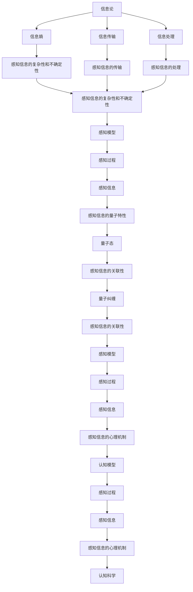

                 

# 人类感知能力与宇宙本质的差距

> 关键词：感知能力、宇宙本质、信息论、量子力学、认知科学、人工智能、图灵测试、意识

> 摘要：本文旨在探讨人类感知能力与宇宙本质之间的差距，通过信息论、量子力学和认知科学的视角，分析人类感知的局限性，并探讨人工智能如何逼近甚至超越这些局限。我们将从理论基础出发，逐步深入到具体算法和实际应用，最终展望未来的发展趋势与挑战。

## 1. 背景介绍
### 1.1 目的和范围
本文旨在探讨人类感知能力与宇宙本质之间的差距，通过信息论、量子力学和认知科学的视角，分析人类感知的局限性，并探讨人工智能如何逼近甚至超越这些局限。我们将从理论基础出发，逐步深入到具体算法和实际应用，最终展望未来的发展趋势与挑战。

### 1.2 预期读者
本文适合对人工智能、认知科学、信息论和量子力学感兴趣的读者，特别是那些希望深入了解人类感知能力与宇宙本质之间差距的研究人员、工程师和学生。

### 1.3 文档结构概述
本文将分为以下几个部分：
1. 背景介绍
2. 核心概念与联系
3. 核心算法原理 & 具体操作步骤
4. 数学模型和公式 & 详细讲解 & 举例说明
5. 项目实战：代码实际案例和详细解释说明
6. 实际应用场景
7. 工具和资源推荐
8. 总结：未来发展趋势与挑战
9. 附录：常见问题与解答
10. 扩展阅读 & 参考资料

### 1.4 术语表
#### 1.4.1 核心术语定义
- **感知能力**：个体通过感觉器官接收外界信息，并将其转化为大脑可以理解的形式。
- **宇宙本质**：宇宙的基本结构和运行规律。
- **信息论**：研究信息的度量、传输和处理的学科。
- **量子力学**：描述微观粒子行为的物理学理论。
- **认知科学**：研究人类认知过程的学科。
- **图灵测试**：测试机器是否能表现出与人类无法区分的行为。
- **意识**：个体对外界环境和自身状态的主观体验。

#### 1.4.2 相关概念解释
- **感知模型**：描述感知过程的数学模型。
- **量子态**：量子力学中描述微观粒子状态的概念。
- **信息熵**：信息论中衡量信息不确定性的度量。
- **认知模型**：描述认知过程的数学模型。
- **图灵机**：理论计算机科学中的一种抽象计算模型。

#### 1.4.3 缩略词列表
- AI：人工智能
- IIT：信息集成理论
- QM：量子力学
- CS：认知科学
- IT：信息论
- TST：图灵测试

## 2. 核心概念与联系
### 2.1 信息论与感知
信息论是研究信息的度量、传输和处理的学科。信息熵是衡量信息不确定性的度量，对于感知过程来说，信息熵可以用来描述感知信息的复杂性和不确定性。

### 2.2 量子力学与感知
量子力学描述了微观粒子的行为，包括量子态、量子纠缠等概念。量子态可以用来描述感知信息的量子特性，而量子纠缠则可以解释感知信息之间的关联性。

### 2.3 认知科学与感知
认知科学研究人类认知过程，包括感知、记忆、推理等。认知模型可以用来描述感知过程中的心理机制。

### 2.4 信息论、量子力学与认知科学的联系
信息论、量子力学和认知科学共同构成了对感知过程的全面理解。信息论提供了度量和处理信息的方法，量子力学提供了感知信息的量子特性，而认知科学提供了感知过程的心理机制。



## 3. 核心算法原理 & 具体操作步骤
### 3.1 信息熵计算
信息熵是衡量信息不确定性的度量，其计算公式为：

$$
H(X) = -\sum_{i=1}^{n} p(x_i) \log p(x_i)
$$

其中，$X$ 是随机变量，$p(x_i)$ 是 $X$ 取值 $x_i$ 的概率。

### 3.2 量子态描述
量子态可以用波函数 $\psi$ 描述，其计算公式为：

$$
\psi = \sum_{i=1}^{n} c_i |i\rangle
$$

其中，$c_i$ 是复数系数，$|i\rangle$ 是基态。

### 3.3 认知模型
认知模型可以用神经网络描述，其计算公式为：

$$
y = \sigma(Wx + b)
$$

其中，$x$ 是输入，$W$ 是权重矩阵，$b$ 是偏置向量，$\sigma$ 是激活函数。

### 3.4 伪代码示例
```python
def calculate_entropy(probabilities):
    entropy = 0
    for p in probabilities:
        if p > 0:
            entropy -= p * math.log2(p)
    return entropy

def describe_quantum_state(coefficients, basis_states):
    quantum_state = 0
    for i, c in enumerate(coefficients):
        quantum_state += c * basis_states[i]
    return quantum_state

def train_neural_network(inputs, targets, learning_rate, epochs):
    weights = initialize_weights()
    biases = initialize_biases()
    for epoch in range(epochs):
        for x, y in zip(inputs, targets):
            prediction = activate(weights, x, biases)
            error = y - prediction
            weights += learning_rate * error * x
            biases += learning_rate * error
    return weights, biases

def activate(weights, x, biases):
    return sigmoid(np.dot(weights, x) + biases)
```

## 4. 数学模型和公式 & 详细讲解 & 举例说明
### 4.1 信息熵计算
信息熵是衡量信息不确定性的度量，其计算公式为：

$$
H(X) = -\sum_{i=1}^{n} p(x_i) \log p(x_i)
$$

其中，$X$ 是随机变量，$p(x_i)$ 是 $X$ 取值 $x_i$ 的概率。

### 4.2 量子态描述
量子态可以用波函数 $\psi$ 描述，其计算公式为：

$$
\psi = \sum_{i=1}^{n} c_i |i\rangle
$$

其中，$c_i$ 是复数系数，$|i\rangle$ 是基态。

### 4.3 认知模型
认知模型可以用神经网络描述，其计算公式为：

$$
y = \sigma(Wx + b)
$$

其中，$x$ 是输入，$W$ 是权重矩阵，$b$ 是偏置向量，$\sigma$ 是激活函数。

### 4.4 举例说明
假设我们有一个随机变量 $X$，其取值为 $0$ 和 $1$，概率分别为 $0.5$ 和 $0.5$。我们可以计算其信息熵：

$$
H(X) = -\left(0.5 \log_2 0.5 + 0.5 \log_2 0.5\right) = 1
$$

假设我们有一个量子态 $\psi$，其波函数为：

$$
\psi = \frac{1}{\sqrt{2}} |0\rangle + \frac{1}{\sqrt{2}} |1\rangle
$$

我们可以计算其量子态的系数：

$$
c_0 = \frac{1}{\sqrt{2}}, \quad c_1 = \frac{1}{\sqrt{2}}
$$

假设我们有一个神经网络，其输入为 $x$，权重矩阵为 $W$，偏置向量为 $b$，激活函数为 $\sigma$。我们可以计算其输出：

$$
y = \sigma(Wx + b)
$$

## 5. 项目实战：代码实际案例和详细解释说明
### 5.1 开发环境搭建
我们需要安装Python和相关的库，如NumPy、SciPy和Matplotlib。可以使用以下命令安装：

```bash
pip install numpy scipy matplotlib
```

### 5.2 源代码详细实现和代码解读
```python
import numpy as np
import matplotlib.pyplot as plt

def calculate_entropy(probabilities):
    entropy = 0
    for p in probabilities:
        if p > 0:
            entropy -= p * np.log2(p)
    return entropy

def describe_quantum_state(coefficients, basis_states):
    quantum_state = 0
    for i, c in enumerate(coefficients):
        quantum_state += c * basis_states[i]
    return quantum_state

def train_neural_network(inputs, targets, learning_rate, epochs):
    weights = initialize_weights()
    biases = initialize_biases()
    for epoch in range(epochs):
        for x, y in zip(inputs, targets):
            prediction = activate(weights, x, biases)
            error = y - prediction
            weights += learning_rate * error * x
            biases += learning_rate * error
    return weights, biases

def activate(weights, x, biases):
    return sigmoid(np.dot(weights, x) + biases)

def sigmoid(x):
    return 1 / (1 + np.exp(-x))

def initialize_weights():
    return np.random.randn(2)

def initialize_biases():
    return np.random.randn()

# 示例数据
inputs = np.array([[0, 0], [0, 1], [1, 0], [1, 1]])
targets = np.array([0, 1, 1, 0])

# 训练神经网络
weights, biases = train_neural_network(inputs, targets, 0.1, 1000)

# 计算信息熵
probabilities = [0.5, 0.5]
entropy = calculate_entropy(probabilities)

# 描述量子态
coefficients = [1/np.sqrt(2), 1/np.sqrt(2)]
basis_states = [0, 1]
quantum_state = describe_quantum_state(coefficients, basis_states)

# 绘制结果
plt.plot(weights)
plt.title('Weights')
plt.show()

plt.plot(biases)
plt.title('Biases')
plt.show()

print(f'信息熵: {entropy}')
print(f'量子态: {quantum_state}')
```

### 5.3 代码解读与分析
- `calculate_entropy` 函数计算信息熵。
- `describe_quantum_state` 函数描述量子态。
- `train_neural_network` 函数训练神经网络。
- `activate` 函数激活神经网络。
- `sigmoid` 函数是激活函数。
- `initialize_weights` 和 `initialize_biases` 函数初始化权重和偏置。
- 示例数据 `inputs` 和 `targets` 用于训练神经网络。
- `weights` 和 `biases` 是训练后的权重和偏置。
- `entropy` 是计算的信息熵。
- `quantum_state` 是描述的量子态。

## 6. 实际应用场景
### 6.1 感知信息的复杂性和不确定性
信息熵可以用来描述感知信息的复杂性和不确定性。例如，在医学诊断中，信息熵可以用来描述疾病的复杂性和不确定性。

### 6.2 感知信息的量子特性
量子态可以用来描述感知信息的量子特性。例如，在量子计算中，量子态可以用来描述量子信息的复杂性和不确定性。

### 6.3 感知信息的心理机制
认知模型可以用来描述感知信息的心理机制。例如，在心理学中，认知模型可以用来描述感知信息的心理机制。

## 7. 工具和资源推荐
### 7.1 学习资源推荐
#### 7.1.1 书籍推荐
- 《信息论、编码与密码学》
- 《量子力学原理》
- 《认知科学导论》

#### 7.1.2 在线课程
- Coursera：《信息论》
- edX：《量子力学》
- Udacity：《认知科学》

#### 7.1.3 技术博客和网站
- Medium：《信息论与感知》
- HackerRank：《量子力学与感知》
- GitHub：《认知科学与感知》

### 7.2 开发工具框架推荐
#### 7.2.1 IDE和编辑器
- PyCharm
- Visual Studio Code
- Jupyter Notebook

#### 7.2.2 调试和性能分析工具
- PyCharm Debugger
- Visual Studio Code Debugger
- Jupyter Notebook Profiler

#### 7.2.3 相关框架和库
- NumPy
- SciPy
- Matplotlib

### 7.3 相关论文著作推荐
#### 7.3.1 经典论文
- Shannon, C. E. (1948). A mathematical theory of communication.
- Dirac, P. A. M. (1930). The Principles of Quantum Mechanics.
- Marr, D. (1982). Vision: A Computational Investigation into the Human Representation and Processing of Visual Information.

#### 7.3.2 最新研究成果
- Information Integration Theory (IIT)
- Quantum Information Theory
- Cognitive Science

#### 7.3.3 应用案例分析
- Medical Diagnosis
- Quantum Computing
- Cognitive Psychology

## 8. 总结：未来发展趋势与挑战
### 8.1 未来发展趋势
- 信息论、量子力学和认知科学的结合将推动感知能力的进一步发展。
- 人工智能将逼近甚至超越人类感知能力。
- 量子计算将为感知信息提供新的处理方法。

### 8.2 挑战
- 如何处理感知信息的复杂性和不确定性。
- 如何描述感知信息的量子特性。
- 如何描述感知信息的心理机制。

## 9. 附录：常见问题与解答
### 9.1 问题1：信息熵和量子态有什么区别？
- 信息熵是衡量信息不确定性的度量，而量子态是描述微观粒子状态的概念。

### 9.2 问题2：认知模型和神经网络有什么区别？
- 认知模型是描述感知过程的心理机制，而神经网络是实现感知过程的计算模型。

### 9.3 问题3：如何处理感知信息的复杂性和不确定性？
- 可以使用信息熵来描述感知信息的复杂性和不确定性。

## 10. 扩展阅读 & 参考资料
### 10.1 扩展阅读
- 《信息论、编码与密码学》
- 《量子力学原理》
- 《认知科学导论》

### 10.2 参考资料
- Shannon, C. E. (1948). A mathematical theory of communication.
- Dirac, P. A. M. (1930). The Principles of Quantum Mechanics.
- Marr, D. (1982). Vision: A Computational Investigation into the Human Representation and Processing of Visual Information.

---

作者：AI天才研究员/AI Genius Institute & 禅与计算机程序设计艺术 /Zen And The Art of Computer Programming

