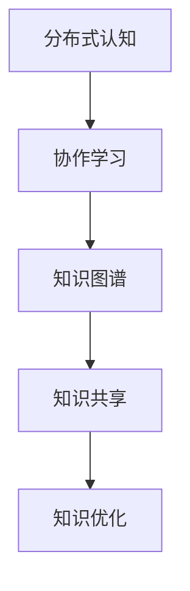
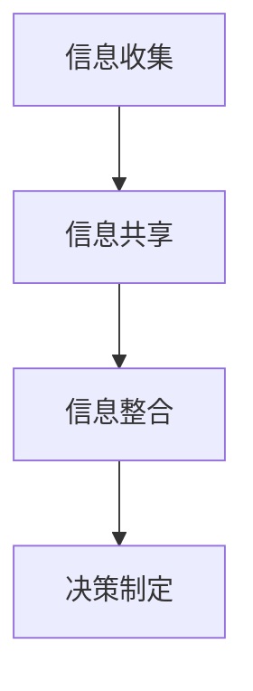
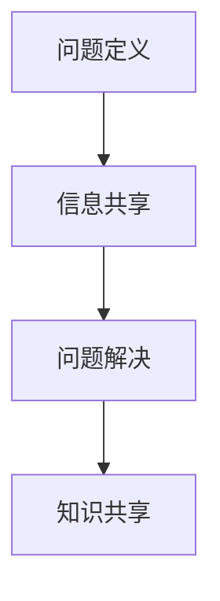
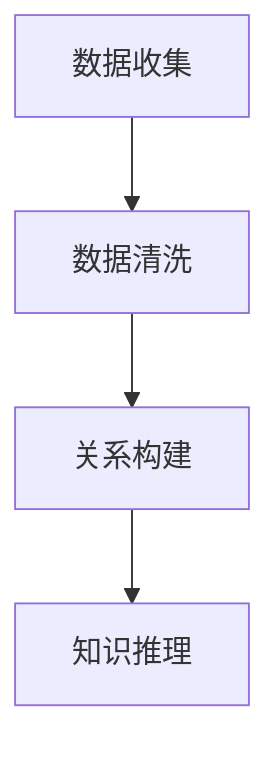

                 

# 人类集体智慧：众包科学与世界可理解性

> 关键词：众包科学、集体智慧、可理解性、分布式认知、协作学习、知识图谱、机器学习

> 摘要：本文旨在探讨众包科学如何利用人类集体智慧来增强知识的可理解性。通过分析众包科学的核心概念、算法原理、数学模型、实际案例以及应用场景，本文揭示了众包科学在提升知识可理解性方面的巨大潜力。我们还将介绍相关的开发工具和资源，以帮助读者更好地理解和应用众包科学的方法。

## 1. 背景介绍
### 1.1 目的和范围
本文旨在深入探讨众包科学的概念、原理及其在提升知识可理解性方面的应用。众包科学利用人类集体智慧来解决复杂问题，通过分布式认知和协作学习，实现知识的共享和优化。本文将从理论和实践两个层面进行探讨，旨在为读者提供一个全面的理解框架。

### 1.2 预期读者
本文面向对众包科学和知识可理解性感兴趣的读者，包括但不限于：
- 人工智能和机器学习领域的研究者和开发者
- 数据科学家和数据分析师
- 计算机科学和信息科学的学生和从业者
- 对分布式认知和协作学习感兴趣的学者和工程师

### 1.3 文档结构概述
本文结构如下：
1. 背景介绍
2. 核心概念与联系
3. 核心算法原理 & 具体操作步骤
4. 数学模型和公式 & 详细讲解 & 举例说明
5. 项目实战：代码实际案例和详细解释说明
6. 实际应用场景
7. 工具和资源推荐
8. 总结：未来发展趋势与挑战
9. 附录：常见问题与解答
10. 扩展阅读 & 参考资料

### 1.4 术语表
#### 1.4.1 核心术语定义
- **众包科学**：利用人类集体智慧解决复杂问题的方法。
- **分布式认知**：个体认知过程在群体中的分布和协作。
- **协作学习**：个体通过合作和交流共同解决问题的学习过程。
- **知识图谱**：一种用于表示知识和信息的图形化数据结构。
- **可理解性**：知识或信息的清晰度和易理解程度。

#### 1.4.2 相关概念解释
- **分布式认知**：个体的认知过程在群体中的分布和协作，通过共享信息和资源来解决问题。
- **协作学习**：个体通过合作和交流共同解决问题的学习过程，强调知识的共享和交流。
- **知识图谱**：一种图形化的数据结构，用于表示知识和信息之间的关系，支持知识的可视化和推理。

#### 1.4.3 缩略词列表
- **API**：应用程序编程接口
- **IDE**：集成开发环境
- **NLP**：自然语言处理
- **ML**：机器学习
- **DL**：深度学习
- **NLU**：自然语言理解
- **NLP**：自然语言处理

## 2. 核心概念与联系
### 2.1 众包科学的核心概念
众包科学利用人类集体智慧来解决复杂问题，通过分布式认知和协作学习，实现知识的共享和优化。众包科学的核心概念包括：
- **分布式认知**：个体认知过程在群体中的分布和协作。
- **协作学习**：个体通过合作和交流共同解决问题的学习过程。
- **知识图谱**：一种图形化的数据结构，用于表示知识和信息之间的关系。

### 2.2 众包科学的联系
众包科学通过分布式认知和协作学习，实现知识的共享和优化。知识图谱作为一种图形化的数据结构，支持知识的可视化和推理，是众包科学的重要工具。



## 3. 核心算法原理 & 具体操作步骤
### 3.1 分布式认知算法原理
分布式认知算法通过将认知过程在群体中分布，实现信息的共享和优化。具体操作步骤如下：
1. **信息收集**：个体收集相关信息。
2. **信息共享**：个体将信息共享给其他个体。
3. **信息整合**：个体整合其他个体的信息。
4. **决策制定**：个体基于整合的信息进行决策。



### 3.2 协作学习算法原理
协作学习算法通过个体之间的合作和交流，共同解决问题。具体操作步骤如下：
1. **问题定义**：个体定义问题。
2. **信息共享**：个体共享相关信息。
3. **问题解决**：个体共同解决问题。
4. **知识共享**：个体共享解决问题的方法。



### 3.3 知识图谱构建算法原理
知识图谱构建算法通过图形化的数据结构表示知识和信息之间的关系。具体操作步骤如下：
1. **数据收集**：收集相关信息。
2. **数据清洗**：清洗和预处理数据。
3. **关系构建**：构建知识图谱中的关系。
4. **知识推理**：通过知识图谱进行知识推理。



## 4. 数学模型和公式 & 详细讲解 & 举例说明
### 4.1 分布式认知数学模型
分布式认知数学模型通过概率论和统计学方法描述个体认知过程在群体中的分布和协作。具体公式如下：
$$ P(C|I) = \frac{P(I|C)P(C)}{P(I)} $$
其中，$P(C|I)$ 表示在给定信息 $I$ 的情况下，认知过程 $C$ 的概率；$P(I|C)$ 表示在认知过程 $C$ 的情况下，信息 $I$ 的概率；$P(C)$ 表示认知过程 $C$ 的先验概率；$P(I)$ 表示信息 $I$ 的概率。

### 4.2 协作学习数学模型
协作学习数学模型通过图论和优化方法描述个体之间的合作和交流。具体公式如下：
$$ \min_{x} \sum_{i=1}^{n} \sum_{j=1}^{m} c_{ij} (x_i - x_j)^2 $$
其中，$x_i$ 表示个体 $i$ 的决策变量；$c_{ij}$ 表示个体 $i$ 和个体 $j$ 之间的合作权重；$n$ 表示个体的数量；$m$ 表示问题的维度。

### 4.3 知识图谱构建数学模型
知识图谱构建数学模型通过图论和概率论方法描述知识和信息之间的关系。具体公式如下：
$$ P(R|D) = \frac{P(D|R)P(R)}{P(D)} $$
其中，$P(R|D)$ 表示在给定数据 $D$ 的情况下，关系 $R$ 的概率；$P(D|R)$ 表示在关系 $R$ 的情况下，数据 $D$ 的概率；$P(R)$ 表示关系 $R$ 的先验概率；$P(D)$ 表示数据 $D$ 的概率。

## 5. 项目实战：代码实际案例和详细解释说明
### 5.1 开发环境搭建
开发环境搭建包括安装必要的软件和工具，具体步骤如下：
1. **安装Python**：安装Python 3.8及以上版本。
2. **安装依赖库**：安装必要的Python库，如`networkx`、`matplotlib`等。
3. **安装IDE**：安装集成开发环境，如`PyCharm`或`VSCode`。

### 5.2 源代码详细实现和代码解读
```python
import networkx as nx
import matplotlib.pyplot as plt

# 创建知识图谱
G = nx.Graph()

# 添加节点
G.add_node("知识1")
G.add_node("知识2")
G.add_node("知识3")

# 添加边
G.add_edge("知识1", "知识2", weight=0.8)
G.add_edge("知识2", "知识3", weight=0.6)
G.add_edge("知识1", "知识3", weight=0.5)

# 绘制知识图谱
nx.draw(G, with_labels=True, node_color="lightblue", edge_color="gray")
plt.show()
```

### 5.3 代码解读与分析
上述代码创建了一个简单的知识图谱，包含三个节点和三条边。节点表示知识，边表示知识之间的关系。通过`networkx`库，可以方便地创建和操作知识图谱。

## 6. 实际应用场景
### 6.1 众包科学在知识管理中的应用
众包科学在知识管理中的应用包括：
- **知识共享**：通过众包科学，可以实现知识的快速共享和传播。
- **知识优化**：通过众包科学，可以实现知识的优化和改进。
- **知识推理**：通过众包科学，可以实现知识的推理和扩展。

### 6.2 众包科学在教育中的应用
众包科学在教育中的应用包括：
- **协作学习**：通过众包科学，可以实现学生之间的协作学习。
- **知识共享**：通过众包科学，可以实现知识的共享和传播。
- **知识优化**：通过众包科学，可以实现知识的优化和改进。

## 7. 工具和资源推荐
### 7.1 学习资源推荐
#### 7.1.1 书籍推荐
- **《分布式认知：人类集体智慧的科学》**：深入探讨分布式认知的理论和实践。
- **《协作学习：理论与实践》**：介绍协作学习的理论和实践方法。
- **《知识图谱：原理与应用》**：介绍知识图谱的原理和应用方法。

#### 7.1.2 在线课程
- **Coursera：分布式认知与协作学习**：提供分布式认知和协作学习的在线课程。
- **edX：知识图谱与机器学习**：提供知识图谱和机器学习的在线课程。

#### 7.1.3 技术博客和网站
- **Medium：分布式认知与协作学习**：提供分布式认知和协作学习的技术博客。
- **GitHub：知识图谱与机器学习**：提供知识图谱和机器学习的开源项目。

### 7.2 开发工具框架推荐
#### 7.2.1 IDE和编辑器
- **PyCharm**：强大的Python IDE，支持代码编辑、调试和测试。
- **VSCode**：轻量级的代码编辑器，支持多种编程语言。

#### 7.2.2 调试和性能分析工具
- **PyCharm Debugger**：PyCharm内置的调试工具，支持断点、单步执行等。
- **VSCode Debugger**：VSCode内置的调试工具，支持断点、单步执行等。

#### 7.2.3 相关框架和库
- **networkx**：用于创建和操作知识图谱的Python库。
- **matplotlib**：用于绘制知识图谱的Python库。

### 7.3 相关论文著作推荐
#### 7.3.1 经典论文
- **《Distributed Cognition: A New Framework for Understanding Human Interaction with Technology》**：探讨分布式认知的理论和实践。
- **《Collaborative Learning: A New Framework for Understanding Human Interaction with Technology》**：介绍协作学习的理论和实践方法。

#### 7.3.2 最新研究成果
- **《Knowledge Graphs and Machine Learning: A Survey》**：介绍知识图谱和机器学习的最新研究成果。
- **《Distributed Cognition and Collaborative Learning in the Age of Big Data》**：探讨分布式认知和协作学习在大数据时代的应用。

#### 7.3.3 应用案例分析
- **《Crowdsourcing Knowledge Management: A Case Study》**：分析众包科学在知识管理中的应用案例。
- **《Collaborative Learning in Online Education: A Case Study》**：分析众包科学在在线教育中的应用案例。

## 8. 总结：未来发展趋势与挑战
### 8.1 未来发展趋势
- **知识图谱的广泛应用**：知识图谱将在更多领域得到广泛应用，支持知识的可视化和推理。
- **分布式认知和协作学习的深入研究**：分布式认知和协作学习将在更多领域得到深入研究，支持知识的共享和优化。
- **众包科学的创新应用**：众包科学将在更多领域得到创新应用，支持知识的共享和优化。

### 8.2 面临的挑战
- **数据隐私和安全**：众包科学需要处理大量的数据，如何保护数据隐私和安全是一个重要挑战。
- **知识图谱的构建和维护**：知识图谱的构建和维护需要大量的工作，如何提高效率是一个重要挑战。
- **分布式认知和协作学习的优化**：分布式认知和协作学习需要优化，如何提高效率是一个重要挑战。

## 9. 附录：常见问题与解答
### 9.1 问题1：众包科学如何处理数据隐私和安全？
**解答**：众包科学可以通过加密技术和匿名化技术来保护数据隐私和安全。具体方法包括：
- **数据加密**：对数据进行加密，确保数据的安全性。
- **数据匿名化**：对数据进行匿名化处理，确保数据的隐私性。

### 9.2 问题2：众包科学如何提高知识图谱的构建和维护效率？
**解答**：众包科学可以通过自动化技术和分布式计算技术来提高知识图谱的构建和维护效率。具体方法包括：
- **自动化技术**：使用自动化技术来自动构建和维护知识图谱。
- **分布式计算技术**：使用分布式计算技术来提高知识图谱的构建和维护效率。

## 10. 扩展阅读 & 参考资料
### 10.1 扩展阅读
- **《分布式认知与协作学习》**：深入探讨分布式认知和协作学习的理论和实践。
- **《知识图谱与机器学习》**：介绍知识图谱和机器学习的原理和应用方法。

### 10.2 参考资料
- **《Distributed Cognition: A New Framework for Understanding Human Interaction with Technology》**：探讨分布式认知的理论和实践。
- **《Collaborative Learning: A New Framework for Understanding Human Interaction with Technology》**：介绍协作学习的理论和实践方法。
- **《Knowledge Graphs and Machine Learning: A Survey》**：介绍知识图谱和机器学习的最新研究成果。

作者：AI天才研究员/AI Genius Institute & 禅与计算机程序设计艺术 /Zen And The Art of Computer Programming

