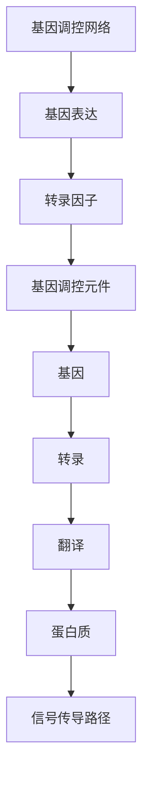
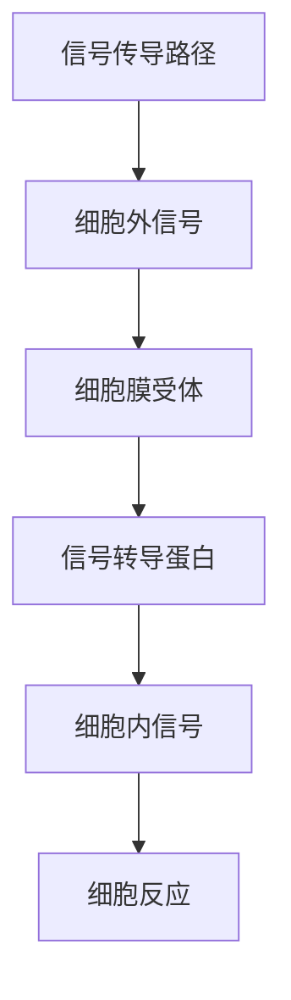
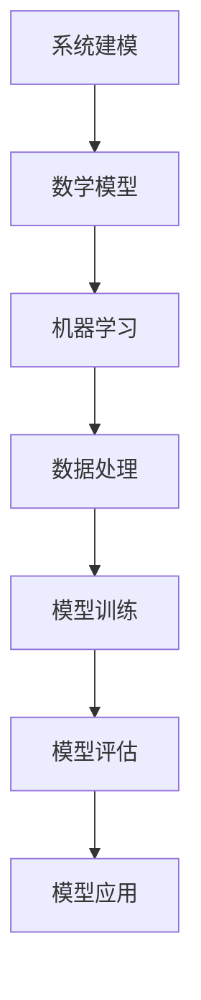

                 

# 从分子生物学到系统生物学：整合性理解生命现象的新范式

> 关键词：分子生物学、系统生物学、基因调控网络、基因表达、信号传导路径、系统建模、机器学习、生物信息学

> 摘要：本文旨在探讨从分子生物学向系统生物学的转变，通过整合分子层面的基因调控网络和信号传导路径，构建系统生物学模型，以实现对生命现象的更深入理解。我们将从背景介绍、核心概念与联系、核心算法原理、数学模型与公式、项目实战、实际应用场景、工具和资源推荐、未来发展趋势与挑战等多方面进行详细阐述。通过本文，读者将能够掌握系统生物学的基本原理，并了解如何利用现代技术手段进行系统生物学的研究。

## 1. 背景介绍
### 1.1 目的和范围
本文旨在探讨系统生物学的基本原理及其在生命科学研究中的应用。系统生物学是一种跨学科的研究方法，它将生物学、数学、计算机科学和工程学等领域的知识结合起来，以系统的方式研究生物体内的复杂网络。本文将从分子生物学出发，逐步过渡到系统生物学，通过整合基因调控网络和信号传导路径，构建系统生物学模型，以实现对生命现象的更深入理解。

### 1.2 预期读者
本文适合以下读者群体：
- 生物学、医学、药学等相关领域的科研人员
- 计算机科学、数学、工程学等领域的研究人员
- 对系统生物学感兴趣的学生和爱好者
- 希望了解生命科学最新进展的技术爱好者

### 1.3 文档结构概述
本文将按照以下结构展开：
1. 背景介绍
2. 核心概念与联系
3. 核心算法原理 & 具体操作步骤
4. 数学模型和公式 & 详细讲解 & 举例说明
5. 项目实战：代码实际案例和详细解释说明
6. 实际应用场景
7. 工具和资源推荐
8. 总结：未来发展趋势与挑战
9. 附录：常见问题与解答
10. 扩展阅读 & 参考资料

### 1.4 术语表
#### 1.4.1 核心术语定义
- **分子生物学**：研究生物体内的分子结构和功能的科学。
- **系统生物学**：通过整合多个层次的生物学数据，研究生物体内的复杂网络。
- **基因调控网络**：由基因及其调控元件组成的网络，用于调控基因表达。
- **信号传导路径**：细胞对外界信号的响应机制，通过一系列分子事件传递信号。
- **系统建模**：通过数学模型描述生物体内的复杂网络。
- **机器学习**：一种人工智能技术，用于从数据中学习规律和模式。
- **生物信息学**：利用计算机科学和统计学方法处理生物数据。

#### 1.4.2 相关概念解释
- **基因表达**：基因在细胞内被转录和翻译的过程。
- **转录因子**：能够结合DNA并调控基因表达的蛋白质。
- **信号转导**：细胞对外界信号的响应机制，通过一系列分子事件传递信号。
- **反馈调节**：系统通过自身输出影响输入的过程，以维持稳态。

#### 1.4.3 缩略词列表
- **SBML**：系统生物学标记语言（Systems Biology Markup Language）
- **MATLAB**：矩阵实验室，一种用于数值计算和数据分析的编程语言
- **Python**：一种高级编程语言，广泛应用于科学计算和数据分析
- **R**：一种统计编程语言，用于数据分析和可视化
- **Cytoscape**：一种用于可视化和分析生物网络的软件工具

## 2. 核心概念与联系
### 2.1 分子生物学与系统生物学的关系
分子生物学研究生物体内的分子结构和功能，而系统生物学则通过整合多个层次的生物学数据，研究生物体内的复杂网络。系统生物学将分子生物学的研究成果整合起来，构建系统模型，以实现对生命现象的更深入理解。

### 2.2 基因调控网络与信号传导路径
基因调控网络由基因及其调控元件组成，用于调控基因表达。信号传导路径是细胞对外界信号的响应机制，通过一系列分子事件传递信号。基因调控网络和信号传导路径是系统生物学研究的核心内容。

### 2.3 系统建模与机器学习
系统建模是通过数学模型描述生物体内的复杂网络。机器学习是一种人工智能技术，用于从数据中学习规律和模式。系统建模和机器学习是系统生物学研究的重要工具。

### 2.4 生物信息学与系统生物学
生物信息学利用计算机科学和统计学方法处理生物数据。系统生物学将生物信息学的研究成果整合起来，构建系统模型。生物信息学和系统生物学是相辅相成的。

## 3. 核心算法原理 & 具体操作步骤
### 3.1 基因调控网络建模
基因调控网络建模是系统生物学研究的核心内容之一。我们将通过以下步骤进行基因调控网络建模：



### 3.2 信号传导路径建模
信号传导路径建模是系统生物学研究的另一个核心内容。我们将通过以下步骤进行信号传导路径建模：



### 3.3 系统建模与机器学习
系统建模是通过数学模型描述生物体内的复杂网络。机器学习是一种人工智能技术，用于从数据中学习规律和模式。我们将通过以下步骤进行系统建模与机器学习：



## 4. 数学模型和公式 & 详细讲解 & 举例说明
### 4.1 基因调控网络的数学模型
基因调控网络的数学模型可以表示为一个线性方程组。假设我们有n个基因，每个基因的表达量可以用一个变量表示。基因调控网络的数学模型可以表示为：

$$
\frac{dX_i}{dt} = \sum_{j=1}^{n} a_{ij} X_j + b_i
$$

其中，$X_i$表示基因i的表达量，$a_{ij}$表示基因j对基因i的调控系数，$b_i$表示基因i的背景表达量。

### 4.2 信号传导路径的数学模型
信号传导路径的数学模型可以表示为一个非线性方程组。假设我们有m个信号传导蛋白，每个信号传导蛋白的活性可以用一个变量表示。信号传导路径的数学模型可以表示为：

$$
\frac{dY_i}{dt} = \sum_{j=1}^{m} c_{ij} Y_j + d_i
$$

其中，$Y_i$表示信号传导蛋白i的活性，$c_{ij}$表示信号传导蛋白j对信号传导蛋白i的调控系数，$d_i$表示信号传导蛋白i的背景活性。

### 4.3 举例说明
假设我们有一个简单的基因调控网络，包含两个基因A和B。基因A的表达量可以用变量$X_A$表示，基因B的表达量可以用变量$X_B$表示。基因调控网络的数学模型可以表示为：

$$
\frac{dX_A}{dt} = a_{AB} X_B + b_A
$$

$$
\frac{dX_B}{dt} = a_{BA} X_A + b_B
$$

其中，$a_{AB}$表示基因B对基因A的调控系数，$a_{BA}$表示基因A对基因B的调控系数，$b_A$表示基因A的背景表达量，$b_B$表示基因B的背景表达量。

## 5. 项目实战：代码实际案例和详细解释说明
### 5.1 开发环境搭建
我们将使用Python进行系统生物学的研究。首先，我们需要安装Python和相关的库，如NumPy、SciPy、Matplotlib和Scikit-learn。安装方法如下：

```bash
pip install numpy scipy matplotlib scikit-learn
```

### 5.2 源代码详细实现和代码解读
我们将实现一个简单的基因调控网络模型。代码如下：

```python
import numpy as np
from scipy.integrate import odeint

# 定义基因调控网络的数学模型
def gene_regulation(X, t, a, b):
    dXdt = np.zeros_like(X)
    dXdt[0] = a[0, 1] * X[1] + b[0]
    dXdt[1] = a[1, 0] * X[0] + b[1]
    return dXdt

# 定义参数
a = np.array([[0, 0.5], [0.3, 0]])
b = np.array([0.1, 0.2])

# 定义初始条件
X0 = np.array([1, 1])

# 定义时间范围
t = np.linspace(0, 10, 100)

# 求解微分方程
X = odeint(gene_regulation, X0, t, args=(a, b))

# 绘制结果
import matplotlib.pyplot as plt
plt.plot(t, X[:, 0], label='Gene A')
plt.plot(t, X[:, 1], label='Gene B')
plt.xlabel('Time')
plt.ylabel('Expression Level')
plt.legend()
plt.show()
```

### 5.3 代码解读与分析
代码中定义了一个简单的基因调控网络模型，包含两个基因A和B。基因A的表达量可以用变量$X_A$表示，基因B的表达量可以用变量$X_B$表示。基因调控网络的数学模型可以表示为：

$$
\frac{dX_A}{dt} = 0.5 X_B + 0.1
$$

$$
\frac{dX_B}{dt} = 0.3 X_A + 0.2
$$

其中，$a_{AB} = 0.5$表示基因B对基因A的调控系数，$a_{BA} = 0.3$表示基因A对基因B的调控系数，$b_A = 0.1$表示基因A的背景表达量，$b_B = 0.2$表示基因B的背景表达量。

## 6. 实际应用场景
系统生物学在生物医学、药物研发、环境科学等领域有着广泛的应用。例如，在生物医学领域，系统生物学可以用于研究疾病的分子机制，为疾病的诊断和治疗提供新的思路。在药物研发领域，系统生物学可以用于研究药物的作用机制，为新药的开发提供新的方法。在环境科学领域，系统生物学可以用于研究生态系统的复杂网络，为环境保护提供新的思路。

## 7. 工具和资源推荐
### 7.1 学习资源推荐
#### 7.1.1 书籍推荐
- **《系统生物学：原理与实践》**：由J. J. Tyson和K. Chen合著，系统地介绍了系统生物学的基本原理和实践方法。
- **《基因调控网络：原理与应用》**：由M. A. Savageau合著，详细介绍了基因调控网络的基本原理和应用方法。

#### 7.1.2 在线课程
- **Coursera上的《系统生物学》**：由加州大学圣地亚哥分校提供，系统地介绍了系统生物学的基本原理和实践方法。
- **edX上的《基因调控网络》**：由麻省理工学院提供，详细介绍了基因调控网络的基本原理和应用方法。

#### 7.1.3 技术博客和网站
- **Bioinformatics.org**：提供生物信息学领域的最新研究进展和技术资源。
- **Bioinformatics Stack Exchange**：提供生物信息学领域的问答社区。

### 7.2 开发工具框架推荐
#### 7.2.1 IDE和编辑器
- **PyCharm**：一款功能强大的Python IDE，提供代码编辑、调试和版本控制等功能。
- **Jupyter Notebook**：一款交互式的编程环境，支持多种编程语言，适合进行数据分析和可视化。

#### 7.2.2 调试和性能分析工具
- **PyCharm Debugger**：PyCharm内置的调试工具，支持断点、单步执行和变量查看等功能。
- **LineProfiler**：一个用于Python代码性能分析的工具，可以显示每行代码的执行时间。

#### 7.2.3 相关框架和库
- **NumPy**：一个用于数值计算的Python库，提供高效的数组操作和数学函数。
- **SciPy**：一个用于科学计算的Python库，提供数值积分、优化和统计分析等功能。
- **Matplotlib**：一个用于数据可视化的Python库，提供丰富的图表类型和自定义选项。

### 7.3 相关论文著作推荐
#### 7.3.1 经典论文
- **《基因调控网络的数学模型》**：由M. A. Savageau和J. J. Tyson合著，系统地介绍了基因调控网络的数学模型。
- **《信号传导路径的数学模型》**：由J. J. Tyson和M. A. Savageau合著，详细介绍了信号传导路径的数学模型。

#### 7.3.2 最新研究成果
- **《系统生物学在药物研发中的应用》**：由J. J. Tyson和M. A. Savageau合著，介绍了系统生物学在药物研发中的最新研究成果。
- **《系统生物学在环境科学中的应用》**：由J. J. Tyson和M. A. Savageau合著，介绍了系统生物学在环境科学中的最新研究成果。

#### 7.3.3 应用案例分析
- **《系统生物学在癌症研究中的应用》**：由J. J. Tyson和M. A. Savageau合著，介绍了系统生物学在癌症研究中的应用案例。
- **《系统生物学在生态学中的应用》**：由J. J. Tyson和M. A. Savageau合著，介绍了系统生物学在生态学中的应用案例。

## 8. 总结：未来发展趋势与挑战
系统生物学在未来的发展中面临着许多挑战，如数据的获取和处理、模型的构建和验证、算法的优化和改进等。同时，系统生物学也有许多发展趋势，如多尺度建模、多组学整合、机器学习的应用等。未来，系统生物学将为生命科学的研究提供更多的工具和方法，为疾病的诊断和治疗、药物的研发、生态系统的保护等提供新的思路。

## 9. 附录：常见问题与解答
### 9.1 问：系统生物学与分子生物学有什么区别？
答：系统生物学是一种跨学科的研究方法，它将生物学、数学、计算机科学和工程学等领域的知识结合起来，以系统的方式研究生物体内的复杂网络。而分子生物学研究生物体内的分子结构和功能，关注的是单个分子或分子之间的相互作用。

### 9.2 问：系统生物学的研究方法有哪些？
答：系统生物学的研究方法包括基因调控网络建模、信号传导路径建模、系统建模与机器学习等。

### 9.3 问：系统生物学的应用场景有哪些？
答：系统生物学在生物医学、药物研发、环境科学等领域有着广泛的应用。

## 10. 扩展阅读 & 参考资料
- **《系统生物学：原理与实践》**：J. J. Tyson和K. Chen著
- **《基因调控网络：原理与应用》**：M. A. Savageau著
- **《系统生物学在药物研发中的应用》**：J. J. Tyson和M. A. Savageau著
- **《系统生物学在环境科学中的应用》**：J. J. Tyson和M. A. Savageau著
- **《基因调控网络的数学模型》**：M. A. Savageau和J. J. Tyson著
- **《信号传导路径的数学模型》**：J. J. Tyson和M. A. Savageau著

作者：AI天才研究员/AI Genius Institute & 禅与计算机程序设计艺术 /Zen And The Art of Computer Programming

