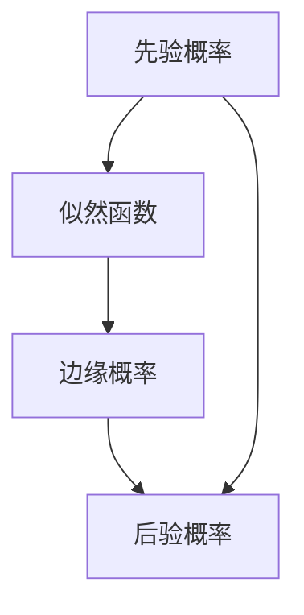

                 

# 从古典概率到贝叶斯推断：理解不确定世界的新思路

> 关键词：贝叶斯定理, 概率论, 统计学, 机器学习, 人工智能, 不确定性, 信息论, 先验概率, 后验概率

> 摘要：本文旨在深入探讨贝叶斯推断的基本原理及其在现代数据分析中的应用。通过逐步分析和推理，我们将从古典概率论出发，逐步引入贝叶斯定理，并通过具体的数学模型和实际代码案例，帮助读者理解如何在不确定的世界中进行有效的推理和决策。本文适合对概率论、统计学、机器学习和人工智能感兴趣的读者，特别是那些希望深入了解贝叶斯方法及其实际应用的技术人员和研究人员。

## 1. 背景介绍
### 1.1 目的和范围
本文旨在为读者提供一个全面的视角，从古典概率论出发，逐步引入贝叶斯推断的概念和方法。我们将探讨贝叶斯定理的基本原理，以及它在现代数据分析中的应用。通过具体的数学模型和实际代码案例，帮助读者理解如何在不确定的世界中进行有效的推理和决策。

### 1.2 预期读者
本文适合对概率论、统计学、机器学习和人工智能感兴趣的读者，特别是那些希望深入了解贝叶斯方法及其实际应用的技术人员和研究人员。读者应具备一定的数学基础，包括概率论和统计学的基本概念。

### 1.3 文档结构概述
本文将分为以下几个部分：
1. **背景介绍**：介绍本文的目的、范围、预期读者和文档结构。
2. **核心概念与联系**：介绍贝叶斯推断的核心概念，并通过Mermaid流程图展示其原理。
3. **核心算法原理 & 具体操作步骤**：详细阐述贝叶斯推断的核心算法原理，并通过伪代码进行具体操作步骤的说明。
4. **数学模型和公式 & 详细讲解 & 举例说明**：通过数学模型和公式详细讲解贝叶斯推断的原理，并通过具体例子进行说明。
5. **项目实战：代码实际案例和详细解释说明**：通过实际代码案例展示贝叶斯推断的应用。
6. **实际应用场景**：探讨贝叶斯推断在实际应用中的具体场景。
7. **工具和资源推荐**：推荐学习资源、开发工具框架和相关论文著作。
8. **总结：未来发展趋势与挑战**：总结贝叶斯推断的发展趋势和面临的挑战。
9. **附录：常见问题与解答**：解答读者在学习过程中可能遇到的常见问题。
10. **扩展阅读 & 参考资料**：提供进一步学习的扩展阅读和参考资料。

### 1.4 术语表
#### 1.4.1 核心术语定义
- **古典概率**：基于频率理论的概率计算方法。
- **贝叶斯定理**：一种用于计算条件概率的方法。
- **先验概率**：在获得新信息之前，对某个事件的概率估计。
- **后验概率**：在获得新信息之后，对某个事件的概率估计。
- **似然函数**：描述给定参数值下观测数据出现的概率。
- **边缘概率**：在贝叶斯定理中，通过积分或求和得到的某个变量的总概率。

#### 1.4.2 相关概念解释
- **条件概率**：在已知某个事件发生的条件下，另一个事件发生的概率。
- **联合概率**：两个或多个事件同时发生的概率。
- **独立事件**：两个事件的发生互不影响。

#### 1.4.3 缩略词列表
- **PDF**：概率密度函数（Probability Density Function）
- **PMF**：概率质量函数（Probability Mass Function）
- **MAP**：最大后验概率（Maximum A Posteriori）

## 2. 核心概念与联系
### 2.1 古典概率
古典概率是基于频率理论的概率计算方法。假设一个事件的所有可能结果是有限且等可能的，那么该事件的概率可以通过以下公式计算：
$$
P(A) = \frac{\text{事件A出现的次数}}{\text{总试验次数}}
$$
例如，抛一枚公平的硬币，正面朝上的概率为：
$$
P(\text{正面}) = \frac{1}{2}
$$

### 2.2 贝叶斯定理
贝叶斯定理是一种用于计算条件概率的方法。它描述了在已知某些条件下，另一个事件的概率如何变化。贝叶斯定理的公式为：
$$
P(A|B) = \frac{P(B|A) \cdot P(A)}{P(B)}
$$
其中：
- $P(A|B)$ 是在事件B发生的条件下，事件A发生的概率（后验概率）。
- $P(B|A)$ 是在事件A发生的条件下，事件B发生的概率（似然函数）。
- $P(A)$ 是事件A发生的先验概率。
- $P(B)$ 是事件B发生的边缘概率。

### 2.3 贝叶斯推断的Mermaid流程图


## 3. 核心算法原理 & 具体操作步骤
### 3.1 贝叶斯定理的伪代码
```python
def bayes_theorem(prior_probability, likelihood, evidence_probability):
    posterior_probability = (likelihood * prior_probability) / evidence_probability
    return posterior_probability
```

### 3.2 具体操作步骤
1. **定义先验概率**：根据已有知识或经验，确定事件A的先验概率$P(A)$。
2. **计算似然函数**：确定在事件A发生的条件下，事件B发生的概率$P(B|A)$。
3. **计算边缘概率**：通过积分或求和计算事件B发生的边缘概率$P(B)$。
4. **计算后验概率**：使用贝叶斯定理计算在事件B发生的条件下，事件A发生的后验概率$P(A|B)$。

## 4. 数学模型和公式 & 详细讲解 & 举例说明
### 4.1 数学模型
贝叶斯定理的核心在于通过先验概率和似然函数，结合边缘概率计算后验概率。具体公式为：
$$
P(A|B) = \frac{P(B|A) \cdot P(A)}{P(B)}
$$
其中：
- $P(A)$ 是事件A的先验概率。
- $P(B|A)$ 是在事件A发生的条件下，事件B发生的概率。
- $P(B)$ 是事件B的边缘概率，可以通过以下公式计算：
$$
P(B) = \sum_{i} P(B|A_i) \cdot P(A_i)
$$
其中$A_i$是所有可能的事件A。

### 4.2 详细讲解
1. **先验概率**：先验概率是基于已有知识或经验对事件A的概率估计。例如，假设我们对某个疾病的发病率有先验估计。
2. **似然函数**：似然函数描述了在事件A发生的条件下，事件B发生的概率。例如，假设我们已经知道某种症状在患病人群中的出现概率。
3. **边缘概率**：边缘概率是事件B发生的总概率，可以通过所有可能的事件A的概率加权求和得到。

### 4.3 举例说明
假设我们有一个医学诊断问题，需要判断一个人是否患有某种疾病。我们有以下信息：
- 先验概率：人群中患有该疾病的概率为0.01。
- 似然函数：在患有该疾病的条件下，出现某种症状的概率为0.9。
- 似然函数：在不患有该疾病的条件下，出现该症状的概率为0.1。

我们可以通过以下步骤计算后验概率：
1. **计算边缘概率**：
$$
P(B) = P(B|A) \cdot P(A) + P(B|\neg A) \cdot P(\neg A)
$$
$$
P(B) = 0.9 \cdot 0.01 + 0.1 \cdot 0.99 = 0.108
$$
2. **计算后验概率**：
$$
P(A|B) = \frac{P(B|A) \cdot P(A)}{P(B)} = \frac{0.9 \cdot 0.01}{0.108} \approx 0.0833
$$

## 5. 项目实战：代码实际案例和详细解释说明
### 5.1 开发环境搭建
为了演示贝叶斯推断的实际应用，我们将使用Python编程语言和NumPy库进行计算。首先，确保安装了Python和NumPy库：
```bash
pip install numpy
```

### 5.2 源代码详细实现和代码解读
```python
import numpy as np

# 定义先验概率
prior_probability = 0.01

# 定义似然函数
likelihood_disease = 0.9
likelihood_no_disease = 0.1

# 计算边缘概率
evidence_probability = likelihood_disease * prior_probability + likelihood_no_disease * (1 - prior_probability)

# 计算后验概率
posterior_probability = (likelihood_disease * prior_probability) / evidence_probability

print(f"后验概率: {posterior_probability}")
```

### 5.3 代码解读与分析
1. **定义先验概率**：`prior_probability`表示人群中患有该疾病的概率。
2. **定义似然函数**：`likelihood_disease`和`likelihood_no_disease`分别表示在患有该疾病和不患有该疾病的情况下，出现某种症状的概率。
3. **计算边缘概率**：`evidence_probability`表示出现该症状的总概率。
4. **计算后验概率**：`posterior_probability`表示在出现该症状的情况下，患有该疾病的概率。

## 6. 实际应用场景
贝叶斯推断在许多实际应用中都有广泛的应用，包括：
- **医学诊断**：通过症状和病史，判断患者是否患有某种疾病。
- **垃圾邮件过滤**：通过邮件内容和历史数据，判断邮件是否为垃圾邮件。
- **推荐系统**：通过用户的历史行为和偏好，推荐相关产品或内容。

## 7. 工具和资源推荐
### 7.1 学习资源推荐
#### 7.1.1 书籍推荐
- **《贝叶斯统计》**：深入讲解贝叶斯统计的基本原理和应用。
- **《贝叶斯方法》**：详细介绍了贝叶斯方法在统计学中的应用。

#### 7.1.2 在线课程
- **Coursera上的“贝叶斯统计”课程**：由约翰霍普金斯大学教授授课，适合初学者。
- **edX上的“贝叶斯方法”课程**：由哈佛大学教授授课，适合有一定统计学基础的读者。

#### 7.1.3 技术博客和网站
- **Towards Data Science**：提供大量关于贝叶斯推断的文章和案例分析。
- **Medium上的贝叶斯推断专题**：包含许多实用的教程和案例研究。

### 7.2 开发工具框架推荐
#### 7.2.1 IDE和编辑器
- **PyCharm**：功能强大的Python IDE，适合进行贝叶斯推断的开发。
- **Jupyter Notebook**：适合进行交互式数据分析和代码演示。

#### 7.2.2 调试和性能分析工具
- **PySnooper**：用于调试Python代码的工具。
- **Line_profiler**：用于分析Python代码性能的工具。

#### 7.2.3 相关框架和库
- **PyMC3**：用于贝叶斯统计建模的Python库。
- **Stan**：用于贝叶斯统计建模的统计建模语言和平台。

### 7.3 相关论文著作推荐
#### 7.3.1 经典论文
- **“贝叶斯统计的现代应用”**：介绍了贝叶斯统计在现代数据分析中的应用。
- **“贝叶斯方法在机器学习中的应用”**：探讨了贝叶斯方法在机器学习中的应用。

#### 7.3.2 最新研究成果
- **“贝叶斯推断在深度学习中的应用”**：最新研究成果，探讨了贝叶斯推断在深度学习中的应用。
- **“贝叶斯方法在自然语言处理中的应用”**：最新研究成果，探讨了贝叶斯方法在自然语言处理中的应用。

#### 7.3.3 应用案例分析
- **“贝叶斯推断在医疗诊断中的应用案例”**：详细分析了贝叶斯推断在医疗诊断中的应用。
- **“贝叶斯推断在推荐系统中的应用案例”**：详细分析了贝叶斯推断在推荐系统中的应用。

## 8. 总结：未来发展趋势与挑战
贝叶斯推断在未来的发展中将面临以下挑战和趋势：
- **计算效率**：随着数据量的增加，计算效率将成为一个重要的挑战。
- **模型复杂性**：模型的复杂性将不断增加，如何处理高维数据和复杂模型将成为研究的重点。
- **实际应用**：贝叶斯推断将在更多领域得到应用，如医疗、金融、自然语言处理等。

## 9. 附录：常见问题与解答
### 9.1 问题1：如何理解先验概率和后验概率？
**解答**：先验概率是基于已有知识或经验对事件的概率估计，后验概率是在获得新信息后，对事件的概率重新估计。

### 9.2 问题2：如何计算边缘概率？
**解答**：边缘概率可以通过所有可能的事件的概率加权求和得到，公式为：
$$
P(B) = \sum_{i} P(B|A_i) \cdot P(A_i)
$$

## 10. 扩展阅读 & 参考资料
- **《贝叶斯统计》**：深入讲解贝叶斯统计的基本原理和应用。
- **《贝叶斯方法》**：详细介绍了贝叶斯方法在统计学中的应用。
- **Coursera上的“贝叶斯统计”课程**：由约翰霍普金斯大学教授授课，适合初学者。
- **edX上的“贝叶斯方法”课程**：由哈佛大学教授授课，适合有一定统计学基础的读者。
- **Towards Data Science**：提供大量关于贝叶斯推断的文章和案例分析。
- **Medium上的贝叶斯推断专题**：包含许多实用的教程和案例研究。
- **PyCharm**：功能强大的Python IDE，适合进行贝叶斯推断的开发。
- **Jupyter Notebook**：适合进行交互式数据分析和代码演示。
- **PySnooper**：用于调试Python代码的工具。
- **Line_profiler**：用于分析Python代码性能的工具。
- **PyMC3**：用于贝叶斯统计建模的Python库。
- **Stan**：用于贝叶斯统计建模的统计建模语言和平台。
- **“贝叶斯统计的现代应用”**：介绍了贝叶斯统计在现代数据分析中的应用。
- **“贝叶斯方法在机器学习中的应用”**：探讨了贝叶斯方法在机器学习中的应用。
- **“贝叶斯推断在深度学习中的应用”**：最新研究成果，探讨了贝叶斯推断在深度学习中的应用。
- **“贝叶斯方法在自然语言处理中的应用”**：最新研究成果，探讨了贝叶斯方法在自然语言处理中的应用。
- **“贝叶斯推断在医疗诊断中的应用案例”**：详细分析了贝叶斯推断在医疗诊断中的应用。
- **“贝叶斯推断在推荐系统中的应用案例”**：详细分析了贝叶斯推断在推荐系统中的应用。

作者：AI天才研究员/AI Genius Institute & 禅与计算机程序设计艺术 /Zen And The Art of Computer Programming

