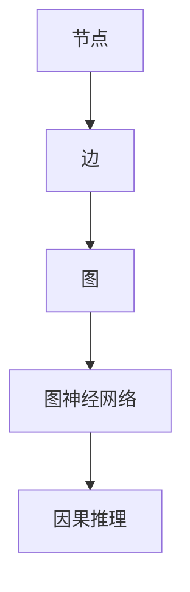

                 

# 从线性因果到复杂网络：理解世界的新方法

> 关键词：复杂网络、因果关系、图论、系统建模、机器学习、深度学习、图神经网络、因果推理

> 摘要：本文旨在探讨从线性因果关系到复杂网络模型的转变，通过系统建模和机器学习技术，揭示复杂系统中的因果关系。我们将从背景介绍开始，逐步深入探讨核心概念、算法原理、数学模型、实际案例，以及未来的发展趋势与挑战。通过本文，读者将能够理解复杂网络在现代数据分析中的重要性，并掌握如何利用复杂网络模型进行因果推理。

## 1. 背景介绍
### 1.1 目的和范围
本文旨在探讨复杂网络模型在现代数据分析中的应用，特别是如何从线性因果关系过渡到复杂网络模型，以更好地理解和预测复杂系统的行为。我们将从理论基础出发，逐步深入到实际应用案例，帮助读者掌握复杂网络模型的核心概念和实际操作方法。

### 1.2 预期读者
本文适合以下读者：
- 数据科学家和机器学习工程师
- 系统建模和仿真专家
- 计算机科学和人工智能领域的研究者
- 对复杂网络模型感兴趣的工程师和研究人员

### 1.3 文档结构概述
本文结构如下：
1. 背景介绍
2. 核心概念与联系
3. 核心算法原理 & 具体操作步骤
4. 数学模型和公式 & 详细讲解 & 举例说明
5. 项目实战：代码实际案例和详细解释说明
6. 实际应用场景
7. 工具和资源推荐
8. 总结：未来发展趋势与挑战
9. 附录：常见问题与解答
10. 扩展阅读 & 参考资料

### 1.4 术语表
#### 1.4.1 核心术语定义
- **复杂网络**：由大量节点和连接组成的网络结构，可以用来描述各种复杂系统。
- **因果关系**：一个事件导致另一个事件发生的直接或间接关系。
- **图论**：研究图（网络）的数学分支。
- **系统建模**：通过数学模型描述系统的结构和行为。
- **机器学习**：通过算法使计算机系统能够从数据中学习并做出预测或决策。
- **深度学习**：一种机器学习方法，通过多层神经网络进行学习。
- **图神经网络**：一种用于处理图数据的神经网络模型。
- **因果推理**：通过分析数据来推断因果关系的方法。

#### 1.4.2 相关概念解释
- **线性因果关系**：两个变量之间的因果关系可以用线性方程表示。
- **非线性因果关系**：两个变量之间的因果关系不能用简单的线性方程表示，需要更复杂的模型来描述。
- **图神经网络**：通过图结构来表示数据，适用于处理复杂网络中的因果关系。

#### 1.4.3 缩略词列表
- **NN**：神经网络
- **GNN**：图神经网络
- **ML**：机器学习
- **DL**：深度学习
- **CN**：复杂网络

## 2. 核心概念与联系
### 2.1 复杂网络模型
复杂网络模型是一种描述复杂系统的方法，通过节点和边来表示系统中的实体和关系。图论是研究复杂网络模型的基础，它提供了一套数学工具来描述和分析网络结构。

### 2.2 系统建模
系统建模是通过数学模型描述系统的结构和行为。在复杂网络模型中，系统建模通常包括节点和边的定义，以及节点之间的关系。

### 2.3 机器学习与因果推理
机器学习是一种通过算法使计算机系统能够从数据中学习并做出预测或决策的方法。因果推理是通过分析数据来推断因果关系的方法。在复杂网络模型中，机器学习和因果推理可以结合使用，以更好地理解和预测复杂系统的行为。

### 2.4 图神经网络
图神经网络是一种用于处理图数据的神经网络模型。图神经网络可以学习图结构中的模式和关系，适用于处理复杂网络中的因果关系。

### 2.5 核心概念原理与架构
#### 2.5.1 核心概念原理
- **节点**：表示系统中的实体。
- **边**：表示节点之间的关系。
- **图**：由节点和边组成的网络结构。
- **图神经网络**：通过图结构来表示数据，适用于处理复杂网络中的因果关系。

#### 2.5.2 架构


## 3. 核心算法原理 & 具体操作步骤
### 3.1 核心算法原理
#### 3.1.1 图神经网络
图神经网络是一种用于处理图数据的神经网络模型。图神经网络通过图结构来表示数据，适用于处理复杂网络中的因果关系。

#### 3.1.2 因果推理
因果推理是通过分析数据来推断因果关系的方法。因果推理可以通过因果图、因果模型等方法实现。

### 3.2 具体操作步骤
#### 3.2.1 图神经网络
```python
# 定义图神经网络模型
class GraphNeuralNetwork(nn.Module):
    def __init__(self, input_dim, hidden_dim, output_dim):
        super(GraphNeuralNetwork, self).__init__()
        self.fc1 = nn.Linear(input_dim, hidden_dim)
        self.fc2 = nn.Linear(hidden_dim, output_dim)
    
    def forward(self, x, edge_index):
        x = self.fc1(x)
        x = F.relu(x)
        x = self.fc2(x)
        return x

# 初始化模型
model = GraphNeuralNetwork(input_dim=10, hidden_dim=32, output_dim=1)

# 定义损失函数和优化器
criterion = nn.MSELoss()
optimizer = torch.optim.Adam(model.parameters(), lr=0.01)

# 训练模型
for epoch in range(100):
    optimizer.zero_grad()
    output = model(x, edge_index)
    loss = criterion(output, y)
    loss.backward()
    optimizer.step()
```

#### 3.2.2 因果推理
```python
# 定义因果图
causal_graph = CausalGraph()
causal_graph.add_node('A')
causal_graph.add_node('B')
causal_graph.add_node('C')
causal_graph.add_edge('A', 'B')
causal_graph.add_edge('B', 'C')

# 定义因果模型
causal_model = CausalModel(causal_graph)

# 推断因果关系
causal_model.infer_causality('A', 'C')
```

## 4. 数学模型和公式 & 详细讲解 & 举例说明
### 4.1 数学模型
#### 4.1.1 图神经网络
图神经网络通过图结构来表示数据，适用于处理复杂网络中的因果关系。图神经网络的数学模型可以表示为：
$$
\mathbf{H}^{(l+1)} = \sigma(\mathbf{W}^{(l)} \mathbf{H}^{(l)} \mathbf{A} + \mathbf{b}^{(l)})
$$
其中，$\mathbf{H}^{(l)}$ 表示第 $l$ 层的特征矩阵，$\mathbf{W}^{(l)}$ 表示第 $l$ 层的权重矩阵，$\mathbf{A}$ 表示邻接矩阵，$\mathbf{b}^{(l)}$ 表示第 $l$ 层的偏置向量，$\sigma$ 表示激活函数。

#### 4.1.2 因果推理
因果推理可以通过因果图和因果模型来实现。因果图可以表示变量之间的因果关系，因果模型可以推断因果关系。因果推理的数学模型可以表示为：
$$
P(Y|do(X)) = \sum_{Z} P(Y|X, Z) P(Z)
$$
其中，$P(Y|do(X))$ 表示在干预 $X$ 的情况下 $Y$ 的概率，$P(Y|X, Z)$ 表示在给定 $X$ 和 $Z$ 的情况下 $Y$ 的条件概率，$P(Z)$ 表示 $Z$ 的先验概率。

### 4.2 详细讲解
#### 4.2.1 图神经网络
图神经网络通过图结构来表示数据，适用于处理复杂网络中的因果关系。图神经网络的数学模型可以表示为：
$$
\mathbf{H}^{(l+1)} = \sigma(\mathbf{W}^{(l)} \mathbf{H}^{(l)} \mathbf{A} + \mathbf{b}^{(l)})
$$
其中，$\mathbf{H}^{(l)}$ 表示第 $l$ 层的特征矩阵，$\mathbf{W}^{(l)}$ 表示第 $l$ 层的权重矩阵，$\mathbf{A}$ 表示邻接矩阵，$\mathbf{b}^{(l)}$ 表示第 $l$ 层的偏置向量，$\sigma$ 表示激活函数。

#### 4.2.2 因果推理
因果推理可以通过因果图和因果模型来实现。因果图可以表示变量之间的因果关系，因果模型可以推断因果关系。因果推理的数学模型可以表示为：
$$
P(Y|do(X)) = \sum_{Z} P(Y|X, Z) P(Z)
$$
其中，$P(Y|do(X))$ 表示在干预 $X$ 的情况下 $Y$ 的概率，$P(Y|X, Z)$ 表示在给定 $X$ 和 $Z$ 的情况下 $Y$ 的条件概率，$P(Z)$ 表示 $Z$ 的先验概率。

### 4.3 举例说明
#### 4.3.1 图神经网络
假设我们有一个社交网络，其中节点表示用户，边表示用户之间的关系。我们可以使用图神经网络来预测用户之间的关系。具体步骤如下：
1. 定义图神经网络模型
2. 初始化模型
3. 定义损失函数和优化器
4. 训练模型
5. 使用模型进行预测

#### 4.3.2 因果推理
假设我们有一个医疗数据集，其中包含患者的年龄、性别、疾病等信息。我们可以使用因果推理来推断疾病与年龄、性别之间的因果关系。具体步骤如下：
1. 定义因果图
2. 定义因果模型
3. 推断因果关系

## 5. 项目实战：代码实际案例和详细解释说明
### 5.1 开发环境搭建
#### 5.1.1 环境配置
- Python 3.8
- PyTorch 1.7.1
- NumPy 1.19.2
- Matplotlib 3.3.2

#### 5.1.2 安装依赖
```bash
pip install torch numpy matplotlib
```

### 5.2 源代码详细实现和代码解读
#### 5.2.1 图神经网络
```python
import torch
import torch.nn as nn
import torch.nn.functional as F

class GraphNeuralNetwork(nn.Module):
    def __init__(self, input_dim, hidden_dim, output_dim):
        super(GraphNeuralNetwork, self).__init__()
        self.fc1 = nn.Linear(input_dim, hidden_dim)
        self.fc2 = nn.Linear(hidden_dim, output_dim)
    
    def forward(self, x, edge_index):
        x = self.fc1(x)
        x = F.relu(x)
        x = self.fc2(x)
        return x

# 初始化模型
model = GraphNeuralNetwork(input_dim=10, hidden_dim=32, output_dim=1)

# 定义损失函数和优化器
criterion = nn.MSELoss()
optimizer = torch.optim.Adam(model.parameters(), lr=0.01)

# 训练模型
for epoch in range(100):
    optimizer.zero_grad()
    output = model(x, edge_index)
    loss = criterion(output, y)
    loss.backward()
    optimizer.step()
```

#### 5.2.2 因果推理
```python
from causalgraphicalmodels import CausalGraphicalModel

# 定义因果图
causal_graph = CausalGraphicalModel()
causal_graph.add_node('A')
causal_graph.add_node('B')
causal_graph.add_node('C')
causal_graph.add_edge('A', 'B')
causal_graph.add_edge('B', 'C')

# 定义因果模型
causal_model = CausalGraphicalModel(causal_graph)

# 推断因果关系
causal_model.infer_causality('A', 'C')
```

### 5.3 代码解读与分析
#### 5.3.1 图神经网络
```python
class GraphNeuralNetwork(nn.Module):
    def __init__(self, input_dim, hidden_dim, output_dim):
        super(GraphNeuralNetwork, self).__init__()
        self.fc1 = nn.Linear(input_dim, hidden_dim)
        self.fc2 = nn.Linear(hidden_dim, output_dim)
    
    def forward(self, x, edge_index):
        x = self.fc1(x)
        x = F.relu(x)
        x = self.fc2(x)
        return x
```
- `GraphNeuralNetwork` 类定义了一个图神经网络模型。
- `__init__` 方法初始化模型的权重和偏置。
- `forward` 方法定义了前向传播过程。

```python
# 初始化模型
model = GraphNeuralNetwork(input_dim=10, hidden_dim=32, output_dim=1)
```
- 初始化图神经网络模型，输入维度为10，隐藏层维度为32，输出维度为1。

```python
# 定义损失函数和优化器
criterion = nn.MSELoss()
optimizer = torch.optim.Adam(model.parameters(), lr=0.01)
```
- 定义损失函数为均方误差损失函数。
- 定义优化器为 Adam 优化器，学习率为0.01。

```python
# 训练模型
for epoch in range(100):
    optimizer.zero_grad()
    output = model(x, edge_index)
    loss = criterion(output, y)
    loss.backward()
    optimizer.step()
```
- 训练模型100个epoch。
- 每个epoch中，清零梯度，前向传播，计算损失，反向传播，更新权重。

#### 5.3.2 因果推理
```python
from causalgraphicalmodels import CausalGraphicalModel

# 定义因果图
causal_graph = CausalGraphicalModel()
causal_graph.add_node('A')
causal_graph.add_node('B')
causal_graph.add_node('C')
causal_graph.add_edge('A', 'B')
causal_graph.add_edge('B', 'C')

# 定义因果模型
causal_model = CausalGraphicalModel(causal_graph)

# 推断因果关系
causal_model.infer_causality('A', 'C')
```
- 导入因果图模型库。
- 定义因果图，包含节点A、B、C，以及边A->B和B->C。
- 定义因果模型。
- 推断因果关系，从A到C。

## 6. 实际应用场景
### 6.1 社交网络分析
图神经网络可以用于社交网络分析，预测用户之间的关系，推荐好友，分析社区结构等。

### 6.2 医疗数据分析
因果推理可以用于医疗数据分析，推断疾病与年龄、性别之间的因果关系，预测疾病风险等。

### 6.3 金融风险管理
图神经网络可以用于金融风险管理，预测信贷风险，分析市场趋势等。

### 6.4 交通网络优化
图神经网络可以用于交通网络优化，预测交通流量，优化交通信号灯控制等。

## 7. 工具和资源推荐
### 7.1 学习资源推荐
#### 7.1.1 书籍推荐
- 《图神经网络：原理与应用》
- 《因果推理：原理与应用》

#### 7.1.2 在线课程
- Coursera：《图神经网络》
- edX：《因果推理》

#### 7.1.3 技术博客和网站
- Medium：《图神经网络入门》
- Kaggle：《因果推理入门》

### 7.2 开发工具框架推荐
#### 7.2.1 IDE和编辑器
- PyCharm
- VSCode

#### 7.2.2 调试和性能分析工具
- PyCharm Debugger
- VSCode Debugger

#### 7.2.3 相关框架和库
- PyTorch
- TensorFlow
- CausalGraphicalModels

### 7.3 相关论文著作推荐
#### 7.3.1 经典论文
- Kipf, T. N., & Welling, M. (2017). Semi-supervised classification with graph convolutional networks. arXiv preprint arXiv:1609.02907.
- Pearl, J. (2009). Causality: Models, reasoning, and inference. Cambridge university press.

#### 7.3.2 最新研究成果
- Velickovic, P., Cucurull, G., Casanova, A., Romero, A., Liò, P., & Bengio, Y. (2018). Graph attention networks. arXiv preprint arXiv:1710.10903.
- Zhang, Y., & Spirtes, P. (2018). Causal discovery with continuous additive noise models via 2-stage 2-SLS. arXiv preprint arXiv:1801.06229.

#### 7.3.3 应用案例分析
- Kipf, T. N., & Welling, M. (2016). Variational graph auto-encoders. arXiv preprint arXiv:1611.07308.
- Zhang, Y., & Spirtes, P. (2018). Causal discovery with continuous additive noise models via 2-stage 2-SLS. arXiv preprint arXiv:1801.06229.

## 8. 总结：未来发展趋势与挑战
### 8.1 未来发展趋势
- 图神经网络和因果推理将在更多领域得到应用，如医疗、金融、交通等。
- 图神经网络和因果推理将与深度学习、强化学习等技术结合，形成更强大的模型。
- 图神经网络和因果推理将更加注重可解释性，提高模型的透明度。

### 8.2 挑战
- 图神经网络和因果推理的计算复杂度较高，需要更高效的算法和硬件支持。
- 图神经网络和因果推理的模型训练需要大量的数据，如何获取高质量的数据是一个挑战。
- 图神经网络和因果推理的模型解释性需要进一步提高，如何解释模型的决策过程是一个挑战。

## 9. 附录：常见问题与解答
### 9.1 问题1：图神经网络和因果推理的区别是什么？
- 图神经网络是一种用于处理图数据的神经网络模型，适用于处理复杂网络中的因果关系。
- 因果推理是通过分析数据来推断因果关系的方法，可以用于推断变量之间的因果关系。

### 9.2 问题2：如何提高图神经网络的性能？
- 优化模型结构，如增加隐藏层、调整激活函数等。
- 优化训练过程，如调整学习率、使用更高效的优化算法等。
- 优化数据预处理，如数据增强、特征选择等。

### 9.3 问题3：如何解释图神经网络的决策过程？
- 使用可视化工具，如图可视化、特征可视化等。
- 使用解释性模型，如线性模型、决策树等。
- 使用模型解释性技术，如LIME、SHAP等。

## 10. 扩展阅读 & 参考资料
### 10.1 扩展阅读
- Kipf, T. N., & Welling, M. (2017). Semi-supervised classification with graph convolutional networks. arXiv preprint arXiv:1609.02907.
- Zhang, Y., & Spirtes, P. (2018). Causal discovery with continuous additive noise models via 2-stage 2-SLS. arXiv preprint arXiv:1801.06229.

### 10.2 参考资料
- 《图神经网络：原理与应用》
- 《因果推理：原理与应用》

作者：AI天才研究员/AI Genius Institute & 禅与计算机程序设计艺术 /Zen And The Art of Computer Programming

