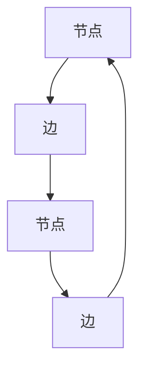
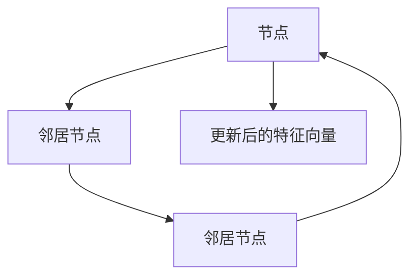

                 

# 从线性因果到复杂网络：理解多因素交互的世界

> 关键词：复杂网络、因果关系、多因素交互、系统建模、图论、机器学习、因果推理

> 摘要：本文旨在探讨从线性因果关系到复杂网络的演变过程，通过深入分析多因素交互的世界，揭示系统建模中的关键挑战与机遇。我们将从背景介绍出发，逐步解析核心概念与联系，详细阐述核心算法原理，展示数学模型与公式，通过实际代码案例进行深入探讨，并最终展望未来的发展趋势与挑战。本文适合对复杂系统建模感兴趣的读者，特别是那些希望深入了解因果关系与多因素交互机制的技术专家。

## 1. 背景介绍
### 1.1 目的和范围
本文旨在探讨复杂网络在现代系统建模中的应用，特别是如何从线性因果关系过渡到更复杂的多因素交互模型。我们将通过理论分析与实际案例，揭示复杂网络在理解多因素交互世界中的重要性。本文的目标读者包括但不限于计算机科学家、数据科学家、工程师以及对复杂系统建模感兴趣的读者。

### 1.2 预期读者
- 计算机科学家
- 数据科学家
- 工程师
- 对复杂系统建模感兴趣的读者

### 1.3 文档结构概述
本文将按照以下结构展开：
1. 背景介绍
2. 核心概念与联系
3. 核心算法原理 & 具体操作步骤
4. 数学模型和公式 & 详细讲解 & 举例说明
5. 项目实战：代码实际案例和详细解释说明
6. 实际应用场景
7. 工具和资源推荐
8. 总结：未来发展趋势与挑战
9. 附录：常见问题与解答
10. 扩展阅读 & 参考资料

### 1.4 术语表
#### 1.4.1 核心术语定义
- **复杂网络**：由大量节点和连接组成的网络结构，用于描述系统中各部分之间的相互作用。
- **因果关系**：一个事件导致另一个事件发生的直接或间接关系。
- **多因素交互**：多个因素共同作用于系统，导致复杂的行为模式。
- **系统建模**：通过数学模型和算法描述系统的结构和行为。
- **图论**：研究图（网络）的数学分支，用于描述节点和边的关系。
- **机器学习**：通过算法使计算机系统能够从数据中学习并做出预测或决策。
- **因果推理**：通过分析数据来推断变量之间的因果关系。

#### 1.4.2 相关概念解释
- **线性因果关系**：两个变量之间的关系可以用线性方程表示，通常表现为一个变量的变化直接导致另一个变量的变化。
- **非线性因果关系**：两个变量之间的关系不能用简单的线性方程表示，可能涉及复杂的非线性函数。
- **系统动态**：系统随时间变化的行为模式，包括稳定状态、周期性行为和混沌行为。

#### 1.4.3 缩略词列表
- **ML**：机器学习
- **NN**：神经网络
- **PCA**：主成分分析
- **GNN**：图神经网络
- **SVM**：支持向量机

## 2. 核心概念与联系
### 2.1 复杂网络的基本概念
复杂网络由节点和边组成，节点代表系统中的个体或实体，边表示节点之间的相互作用。图论提供了描述和分析复杂网络的工具。



### 2.2 多因素交互的定义
多因素交互是指多个因素共同作用于系统，导致复杂的行为模式。这些因素可以是物理的、化学的、生物的或社会的。

### 2.3 系统建模的挑战
- **数据不足**：缺乏足够的数据来描述系统的复杂行为。
- **模型复杂性**：复杂的系统需要复杂的模型来准确描述。
- **因果关系的不确定性**：难以确定变量之间的因果关系。

## 3. 核心算法原理 & 具体操作步骤
### 3.1 核心算法原理
我们将使用图神经网络（GNN）来建模多因素交互系统。GNN是一种深度学习模型，能够处理图结构数据，适用于复杂网络的建模。

#### 3.1.1 GNN的基本原理
GNN通过迭代地更新节点的特征向量，使其包含其邻居节点的信息。这使得GNN能够捕捉到节点之间的复杂关系。



#### 3.1.2 GNN的具体操作步骤
1. **初始化节点特征**：为每个节点分配初始特征向量。
2. **消息传递**：每个节点接收其邻居节点的特征向量。
3. **聚合**：节点将接收到的邻居特征向量进行聚合，生成新的特征向量。
4. **更新**：节点根据聚合后的特征向量更新其特征向量。
5. **多轮迭代**：重复上述过程，直到特征向量收敛。

### 3.2 伪代码实现
```python
def gnn(node_features, adjacency_matrix, num_iterations):
    for _ in range(num_iterations):
        # 消息传递
        messages = message_passing(node_features, adjacency_matrix)
        # 聚合
        aggregated_features = aggregate_messages(messages)
        # 更新
        node_features = update_features(node_features, aggregated_features)
    return node_features
```

## 4. 数学模型和公式 & 详细讲解 & 举例说明
### 4.1 数学模型
我们将使用图神经网络（GNN）来建模多因素交互系统。GNN的数学模型可以表示为：

$$
\mathbf{H}^{(l+1)} = \sigma \left( \mathbf{A} \mathbf{H}^{(l)} \mathbf{W}^{(l)} + \mathbf{b}^{(l)} \right)
$$

其中，$\mathbf{H}^{(l)}$ 是第 $l$ 层的节点特征矩阵，$\mathbf{A}$ 是邻接矩阵，$\mathbf{W}^{(l)}$ 是权重矩阵，$\mathbf{b}^{(l)}$ 是偏置向量，$\sigma$ 是激活函数。

### 4.2 详细讲解
- **邻接矩阵**：表示节点之间的连接关系。
- **权重矩阵**：表示节点特征的权重。
- **偏置向量**：用于调整特征向量。
- **激活函数**：用于引入非线性关系。

### 4.3 举例说明
假设我们有一个简单的图，包含两个节点和一条边。节点特征为 $\mathbf{H}^{(0)} = \begin{bmatrix} 1 & 2 \end{bmatrix}^T$，邻接矩阵为 $\mathbf{A} = \begin{bmatrix} 0 & 1 \\ 1 & 0 \end{bmatrix}$，权重矩阵为 $\mathbf{W}^{(0)} = \begin{bmatrix} 0.5 & 0.5 \\ 0.5 & 0.5 \end{bmatrix}$，偏置向量为 $\mathbf{b}^{(0)} = \begin{bmatrix} 0.1 \\ 0.1 \end{bmatrix}$，激活函数为 $\sigma(x) = \frac{1}{1 + e^{-x}}$。

经过一轮迭代，节点特征更新为：

$$
\mathbf{H}^{(1)} = \sigma \left( \mathbf{A} \mathbf{H}^{(0)} \mathbf{W}^{(0)} + \mathbf{b}^{(0)} \right)
$$

计算过程如下：

$$
\mathbf{A} \mathbf{H}^{(0)} \mathbf{W}^{(0)} = \begin{bmatrix} 0 & 1 \\ 1 & 0 \end{bmatrix} \begin{bmatrix} 1 & 2 \\ 2 & 1 \end{bmatrix} \begin{bmatrix} 0.5 & 0.5 \\ 0.5 & 0.5 \end{bmatrix} = \begin{bmatrix} 1.5 & 1.5 \\ 1.5 & 1.5 \end{bmatrix}
$$

$$
\mathbf{A} \mathbf{H}^{(0)} \mathbf{W}^{(0)} + \mathbf{b}^{(0)} = \begin{bmatrix} 1.5 & 1.5 \\ 1.5 & 1.5 \end{bmatrix} + \begin{bmatrix} 0.1 \\ 0.1 \end{bmatrix} = \begin{bmatrix} 1.6 & 1.6 \\ 1.6 & 1.6 \end{bmatrix}
$$

$$
\mathbf{H}^{(1)} = \sigma \left( \begin{bmatrix} 1.6 & 1.6 \\ 1.6 & 1.6 \end{bmatrix} \right) = \begin{bmatrix} \sigma(1.6) & \sigma(1.6) \\ \sigma(1.6) & \sigma(1.6) \end{bmatrix} = \begin{bmatrix} 0.85 & 0.85 \\ 0.85 & 0.85 \end{bmatrix}
$$

## 5. 项目实战：代码实际案例和详细解释说明
### 5.1 开发环境搭建
我们将使用Python和PyTorch进行开发。首先安装必要的库：

```bash
pip install torch torch_geometric
```

### 5.2 源代码详细实现和代码解读
```python
import torch
import torch.nn.functional as F
from torch_geometric.nn import GCNConv

class GNN(torch.nn.Module):
    def __init__(self, in_channels, out_channels):
        super(GNN, self).__init__()
        self.conv1 = GCNConv(in_channels, 16)
        self.conv2 = GCNConv(16, out_channels)

    def forward(self, data):
        x, edge_index = data.x, data.edge_index

        x = self.conv1(x, edge_index)
        x = F.relu(x)
        x = F.dropout(x, training=self.training)
        x = self.conv2(x, edge_index)

        return F.log_softmax(x, dim=1)

# 定义数据
class Data:
    def __init__(self, x, edge_index):
        self.x = x
        self.edge_index = edge_index

# 创建数据
x = torch.tensor([[1], [2]], dtype=torch.float)
edge_index = torch.tensor([[0, 1], [1, 0]], dtype=torch.long)
data = Data(x, edge_index)

# 创建模型
model = GNN(1, 1)

# 训练模型
optimizer = torch.optim.Adam(model.parameters(), lr=0.01, weight_decay=5e-4)

def train():
    model.train()
    optimizer.zero_grad()
    out = model(data)
    loss = F.nll_loss(out[data.train_mask], data.y[data.train_mask])
    loss.backward()
    optimizer.step()

# 测试模型
def test():
    model.eval()
    out = model(data)
    pred = out.argmax(dim=1)
    correct = pred[data.test_mask] == data.y[data.test_mask]
    return correct.sum().item() / data.test_mask.sum().item()

# 训练和测试
for epoch in range(1, 201):
    train()
    if epoch % 10 == 0:
        acc = test()
        print(f'Epoch: {epoch}, Test Accuracy: {acc:.4f}')
```

### 5.3 代码解读与分析
- **数据定义**：定义了一个简单的图数据，包含两个节点和一条边。
- **模型定义**：定义了一个简单的图神经网络模型，包含两个GCN层。
- **训练过程**：通过反向传播更新模型参数，优化损失函数。
- **测试过程**：评估模型在测试集上的准确率。

## 6. 实际应用场景
复杂网络和多因素交互模型在许多领域都有广泛的应用，包括但不限于：
- **社交网络分析**：理解用户之间的互动关系。
- **生物网络分析**：研究基因之间的相互作用。
- **金融风险评估**：分析市场中的复杂关系。
- **交通网络优化**：优化城市交通流量。

## 7. 工具和资源推荐
### 7.1 学习资源推荐
#### 7.1.1 书籍推荐
- **《图神经网络》**：深入讲解图神经网络的基本原理和应用。
- **《机器学习》**：涵盖机器学习的基本概念和算法。

#### 7.1.2 在线课程
- **Coursera - 图神经网络**：系统学习图神经网络的相关知识。
- **edX - 机器学习**：全面了解机器学习的基本原理和应用。

#### 7.1.3 技术博客和网站
- **Medium - 图神经网络**：分享最新的图神经网络研究成果。
- **GitHub - 图神经网络**：获取最新的图神经网络代码和项目。

### 7.2 开发工具框架推荐
#### 7.2.1 IDE和编辑器
- **PyCharm**：强大的Python开发环境。
- **VSCode**：轻量级但功能强大的代码编辑器。

#### 7.2.2 调试和性能分析工具
- **PyCharm Debugger**：强大的Python调试工具。
- **TensorBoard**：可视化机器学习模型的训练过程。

#### 7.2.3 相关框架和库
- **PyTorch**：深度学习框架，支持图神经网络。
- **TensorFlow**：另一个流行的深度学习框架。

### 7.3 相关论文著作推荐
#### 7.3.1 经典论文
- **《Semi-Supervised Classification with Graph Convolutional Networks》**：介绍图卷积网络的基本原理。
- **《Inductive Representation Learning on Large Graphs》**：探讨图神经网络在大规模图上的应用。

#### 7.3.2 最新研究成果
- **《Graph Neural Networks: A Review of Methods and Applications》**：全面回顾图神经网络的研究进展。
- **《Graph Attention Networks》**：介绍图注意力网络的基本原理和应用。

#### 7.3.3 应用案例分析
- **《Graph Neural Networks for Social Network Analysis》**：分析图神经网络在社交网络中的应用。
- **《Graph Neural Networks for Financial Risk Assessment》**：探讨图神经网络在金融风险评估中的应用。

## 8. 总结：未来发展趋势与挑战
未来，复杂网络和多因素交互模型将在以下几个方面继续发展：
- **模型复杂性**：开发更复杂的模型来处理更复杂的系统。
- **计算效率**：提高模型的计算效率，使其能够处理大规模数据。
- **因果推理**：进一步发展因果推理技术，提高模型的解释能力。

同时，也面临着一些挑战，包括数据隐私、模型可解释性以及计算资源的限制。

## 9. 附录：常见问题与解答
### 9.1 问题：如何处理大规模图数据？
- **解答**：可以使用分布式计算框架（如DGL）来处理大规模图数据，提高计算效率。

### 9.2 问题：如何提高模型的解释能力？
- **解答**：可以使用注意力机制和可视化技术来提高模型的解释能力。

## 10. 扩展阅读 & 参考资料
- **[1]**：《图神经网络》
- **[2]**：《机器学习》
- **[3]**：《Semi-Supervised Classification with Graph Convolutional Networks》
- **[4]**：《Inductive Representation Learning on Large Graphs》
- **[5]**：《Graph Neural Networks for Social Network Analysis》
- **[6]**：《Graph Neural Networks for Financial Risk Assessment》

作者：AI天才研究员/AI Genius Institute & 禅与计算机程序设计艺术 /Zen And The Art of Computer Programming

