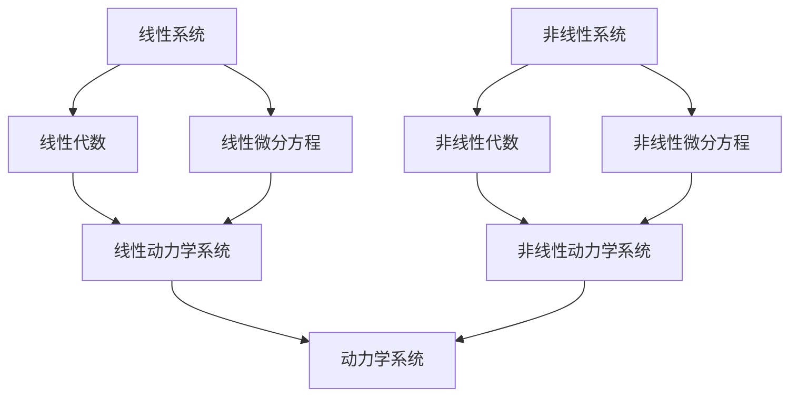

                 

# 从线性思维到非线性动力学：理解复杂系统的新范式

> 关键词：非线性动力学, 复杂系统, 线性思维, 动力学系统, 系统建模, 混沌理论, 分形几何, 系统稳定性, 非线性方程

> 摘要：本文旨在探讨从线性思维到非线性动力学的转变，通过深入分析复杂系统的新范式，帮助读者理解非线性动力学在现代科技中的重要性。我们将从核心概念、数学模型、实际案例、应用场景等多个角度进行探讨，并提供详细的代码实现和工具推荐，以期为读者提供全面的技术指导和深入的理论理解。

## 1. 背景介绍
### 1.1 目的和范围
本文旨在探讨非线性动力学在现代科技中的应用，特别是如何从线性思维转向非线性动力学，以更好地理解和建模复杂系统。我们将从理论基础、数学模型、实际案例等多个方面进行详细阐述，帮助读者掌握非线性动力学的核心概念和应用方法。

### 1.2 预期读者
本文适合以下读者：
- 对复杂系统建模感兴趣的科研人员和工程师
- 从事数据分析、机器学习、人工智能领域的专业人士
- 对混沌理论、分形几何感兴趣的学者
- 对系统稳定性、非线性方程感兴趣的工程师和科学家

### 1.3 文档结构概述
本文结构如下：
1. 背景介绍
2. 核心概念与联系
3. 核心算法原理 & 具体操作步骤
4. 数学模型和公式 & 详细讲解 & 举例说明
5. 项目实战：代码实际案例和详细解释说明
6. 实际应用场景
7. 工具和资源推荐
8. 总结：未来发展趋势与挑战
9. 附录：常见问题与解答
10. 扩展阅读 & 参考资料

### 1.4 术语表
#### 1.4.1 核心术语定义
- **非线性动力学**：研究非线性系统随时间变化的行为和规律。
- **混沌理论**：研究非线性动力学系统中的混沌现象。
- **分形几何**：研究具有自相似性的几何对象。
- **系统稳定性**：系统在受到扰动后能否恢复到初始状态。
- **非线性方程**：描述非线性系统的数学方程。

#### 1.4.2 相关概念解释
- **线性系统**：系统输出与输入成线性关系，满足叠加原理。
- **非线性系统**：系统输出与输入不成线性关系，不满足叠加原理。
- **动力学系统**：描述系统随时间变化的数学模型。

#### 1.4.3 缩略词列表
- **ODE**：常微分方程
- **PDE**：偏微分方程
- **FFT**：快速傅里叶变换
- **FFT**：快速傅里叶变换

## 2. 核心概念与联系
### 2.1 核心概念
#### 2.1.1 线性系统
线性系统是指系统输出与输入成线性关系，满足叠加原理。其数学模型通常为线性方程组或线性微分方程。

#### 2.1.2 非线性系统
非线性系统是指系统输出与输入不成线性关系，不满足叠加原理。其数学模型通常为非线性方程组或非线性微分方程。

#### 2.1.3 动力学系统
动力学系统是指描述系统随时间变化的数学模型，包括线性动力学系统和非线性动力学系统。

### 2.2 联系
线性系统和非线性系统的主要区别在于系统的数学模型。线性系统可以使用线性代数和线性微分方程进行描述，而非线性系统则需要使用非线性代数和非线性微分方程进行描述。动力学系统是研究系统随时间变化的数学模型，包括线性动力学系统和非线性动力学系统。

### 2.3 Mermaid 流程图


## 3. 核心算法原理 & 具体操作步骤
### 3.1 核心算法原理
#### 3.1.1 欧拉法
欧拉法是一种数值解法，用于求解常微分方程。其基本思想是将微分方程在某一点的导数近似为该点的增量。

#### 3.1.2 龙格-库塔法
龙格-库塔法是一种高精度的数值解法，用于求解常微分方程。其基本思想是通过多次迭代，逐步逼近微分方程的解。

### 3.2 具体操作步骤
#### 3.2.1 欧拉法
```python
def euler_method(f, x0, y0, h, n):
    x = x0
    y = y0
    for i in range(n):
        y = y + h * f(x, y)
        x = x + h
    return y
```

#### 3.2.2 龙格-库塔法
```python
def runge_kutta_method(f, x0, y0, h, n):
    x = x0
    y = y0
    for i in range(n):
        k1 = h * f(x, y)
        k2 = h * f(x + h/2, y + k1/2)
        k3 = h * f(x + h/2, y + k2/2)
        k4 = h * f(x + h, y + k3)
        y = y + (k1 + 2*k2 + 2*k3 + k4) / 6
        x = x + h
    return y
```

## 4. 数学模型和公式 & 详细讲解 & 举例说明
### 4.1 数学模型
#### 4.1.1 线性微分方程
线性微分方程的一般形式为：
$$
\frac{dy}{dt} = ay + b
$$
其中，$a$ 和 $b$ 为常数。

#### 4.1.2 非线性微分方程
非线性微分方程的一般形式为：
$$
\frac{dy}{dt} = ay^2 + by + c
$$
其中，$a$、$b$ 和 $c$ 为常数。

### 4.2 详细讲解
#### 4.2.1 线性微分方程
线性微分方程的解可以通过积分得到：
$$
y(t) = Ce^{at} + \frac{b}{a}
$$
其中，$C$ 为积分常数。

#### 4.2.2 非线性微分方程
非线性微分方程的解通常需要数值方法求解。例如，使用欧拉法或龙格-库塔法。

### 4.3 举例说明
#### 4.3.1 线性微分方程
考虑线性微分方程：
$$
\frac{dy}{dt} = 2y - 1
$$
初始条件为 $y(0) = 1$。使用欧拉法求解：
```python
def linear_ode(t, y):
    return 2 * y - 1

y0 = 1
h = 0.1
n = 10
y = euler_method(linear_ode, 0, y0, h, n)
print(y)
```

#### 4.3.2 非线性微分方程
考虑非线性微分方程：
$$
\frac{dy}{dt} = y^2 - 2y + 1
$$
初始条件为 $y(0) = 1$。使用龙格-库塔法求解：
```python
def nonlinear_ode(t, y):
    return y**2 - 2 * y + 1

y0 = 1
h = 0.1
n = 10
y = runge_kutta_method(nonlinear_ode, 0, y0, h, n)
print(y)
```

## 5. 项目实战：代码实际案例和详细解释说明
### 5.1 开发环境搭建
#### 5.1.1 环境要求
- Python 3.8+
- NumPy
- Matplotlib

#### 5.1.2 安装依赖
```bash
pip install numpy matplotlib
```

### 5.2 源代码详细实现和代码解读
```python
import numpy as np
import matplotlib.pyplot as plt

def linear_ode(t, y):
    return 2 * y - 1

def nonlinear_ode(t, y):
    return y**2 - 2 * y + 1

def euler_method(f, x0, y0, h, n):
    x = x0
    y = y0
    for i in range(n):
        y = y + h * f(x, y)
        x = x + h
    return y

def runge_kutta_method(f, x0, y0, h, n):
    x = x0
    y = y0
    for i in range(n):
        k1 = h * f(x, y)
        k2 = h * f(x + h/2, y + k1/2)
        k3 = h * f(x + h/2, y + k2/2)
        k4 = h * f(x + h, y + k3)
        y = y + (k1 + 2*k2 + 2*k3 + k4) / 6
        x = x + h
    return y

# 线性微分方程
y0 = 1
h = 0.1
n = 10
y_linear = euler_method(linear_ode, 0, y0, h, n)
print("线性微分方程解：", y_linear)

# 非线性微分方程
y0 = 1
h = 0.1
n = 10
y_nonlinear = runge_kutta_method(nonlinear_ode, 0, y0, h, n)
print("非线性微分方程解：", y_nonlinear)

# 绘制结果
t = np.linspace(0, h * n, n + 1)
plt.plot(t, y_linear, label='线性微分方程')
plt.plot(t, y_nonlinear, label='非线性微分方程')
plt.xlabel('时间')
plt.ylabel('y')
plt.legend()
plt.show()
```

### 5.3 代码解读与分析
上述代码实现了线性微分方程和非线性微分方程的数值解法，并绘制了结果。通过对比线性微分方程和非线性微分方程的解，可以直观地看到非线性微分方程的复杂性。

## 6. 实际应用场景
### 6.1 复杂系统建模
非线性动力学在复杂系统建模中具有重要作用。例如，生态系统的动态变化、经济系统的波动、社会系统的演化等。

### 6.2 金融市场的预测
金融市场中的价格波动通常是非线性的，通过非线性动力学模型可以更好地预测市场走势。

### 6.3 天气预报
天气系统的复杂性使得传统的线性模型难以准确预测。非线性动力学模型可以更好地捕捉天气系统的非线性特征。

## 7. 工具和资源推荐
### 7.1 学习资源推荐
#### 7.1.1 书籍推荐
- **《非线性动力学与混沌》**：深入探讨非线性动力学和混沌理论。
- **《分形几何》**：介绍分形几何的基本概念和应用。

#### 7.1.2 在线课程
- **Coursera - 非线性动力学与混沌**：系统学习非线性动力学和混沌理论。
- **edX - 分形几何**：深入学习分形几何的基本概念和应用。

#### 7.1.3 技术博客和网站
- **MathWorks - 非线性动力学**：提供丰富的非线性动力学资源和案例。
- **Wolfram - 分形几何**：提供分形几何的理论和应用实例。

### 7.2 开发工具框架推荐
#### 7.2.1 IDE和编辑器
- **PyCharm**：功能强大的Python IDE，支持代码调试和性能分析。
- **Jupyter Notebook**：支持代码、文本和图表的交互式环境。

#### 7.2.2 调试和性能分析工具
- **PyCharm Debugger**：强大的Python调试工具。
- **LineProfiler**：用于分析Python代码的性能。

#### 7.2.3 相关框架和库
- **NumPy**：用于科学计算的基础库。
- **SciPy**：用于科学计算的高级库。
- **Matplotlib**：用于绘制图表的库。

### 7.3 相关论文著作推荐
#### 7.3.1 经典论文
- **"Nonlinear Dynamics and Chaos"**：深入探讨非线性动力学和混沌理论的经典论文。
- **"Fractals and Scaling in Finance"**：介绍分形几何在金融领域的应用。

#### 7.3.2 最新研究成果
- **"Recent Advances in Nonlinear Dynamics and Chaos"**：最新非线性动力学和混沌理论的研究成果。
- **"Applications of Fractal Geometry in Complex Systems"**：分形几何在复杂系统中的最新应用。

#### 7.3.3 应用案例分析
- **"Case Studies in Nonlinear Dynamics and Chaos"**：非线性动力学和混沌理论的实际应用案例分析。
- **"Fractal Geometry in Complex Systems"**：分形几何在复杂系统中的应用案例分析。

## 8. 总结：未来发展趋势与挑战
### 8.1 未来发展趋势
- **复杂系统建模**：非线性动力学在复杂系统建模中的应用将更加广泛。
- **数据驱动方法**：结合大数据和机器学习，非线性动力学模型将更加精确。
- **跨学科应用**：非线性动力学将在更多领域得到应用，如生物学、经济学、社会学等。

### 8.2 挑战
- **计算复杂性**：非线性动力学模型的计算复杂性较高，需要高效的算法和计算资源。
- **模型验证**：非线性动力学模型的验证和评估需要更多的实验数据和理论支持。
- **理论发展**：非线性动力学理论的发展需要更多的创新和突破。

## 9. 附录：常见问题与解答
### 9.1 问题1：如何选择合适的数值解法？
- **解答**：根据问题的复杂性和精度要求选择合适的数值解法。欧拉法适用于简单问题，龙格-库塔法适用于复杂问题。

### 9.2 问题2：如何处理非线性方程的解？
- **解答**：对于非线性方程，通常需要数值方法求解。可以使用龙格-库塔法或其他高级数值方法。

### 9.3 问题3：如何验证非线性动力学模型？
- **解答**：通过实验数据和理论分析验证非线性动力学模型。可以使用统计方法和模型比较方法进行验证。

## 10. 扩展阅读 & 参考资料
### 10.1 扩展阅读
- **《非线性动力学与混沌》**：深入探讨非线性动力学和混沌理论。
- **《分形几何》**：介绍分形几何的基本概念和应用。

### 10.2 参考资料
- **"Nonlinear Dynamics and Chaos"**：深入探讨非线性动力学和混沌理论的经典论文。
- **"Fractals and Scaling in Finance"**：介绍分形几何在金融领域的应用。

---

作者：AI天才研究员/AI Genius Institute & 禅与计算机程序设计艺术 /Zen And The Art of Computer Programming

