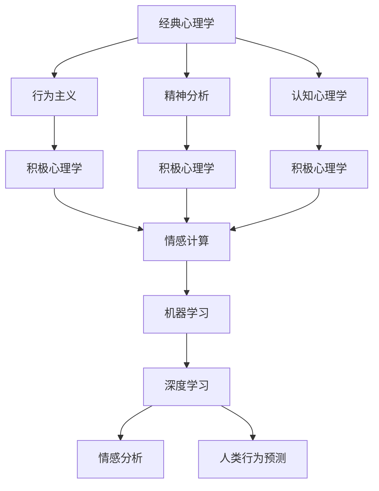

                 

# 从经典心理学到积极心理学：全面理解人类心智与世界

> 关键词：心理学、积极心理学、人类心智、认知科学、神经科学、情感计算、机器学习、深度学习、情感分析、人类行为预测

> 摘要：本文旨在通过逐步分析和推理的方式，探讨从经典心理学到积极心理学的发展历程，以及如何利用现代技术手段深入理解人类心智与世界。我们将从核心概念入手，介绍相关算法原理和数学模型，通过实际代码案例展示如何实现情感分析和人类行为预测。最后，我们将讨论未来的发展趋势与挑战，并推荐相关学习资源和工具。

## 1. 背景介绍

### 1.1 目的和范围
本文旨在通过逐步分析和推理的方式，探讨从经典心理学到积极心理学的发展历程，以及如何利用现代技术手段深入理解人类心智与世界。我们将从核心概念入手，介绍相关算法原理和数学模型，通过实际代码案例展示如何实现情感分析和人类行为预测。最后，我们将讨论未来的发展趋势与挑战，并推荐相关学习资源和工具。

### 1.2 预期读者
本文适合对心理学、认知科学、神经科学、情感计算、机器学习和深度学习感兴趣的读者。无论是学术研究人员、工程师、数据科学家，还是对人类心智和行为感兴趣的技术爱好者，都能从中获得有价值的信息和启示。

### 1.3 文档结构概述
本文将按照以下结构展开：
1. 背景介绍
2. 核心概念与联系
3. 核心算法原理 & 具体操作步骤
4. 数学模型和公式 & 详细讲解 & 举例说明
5. 项目实战：代码实际案例和详细解释说明
6. 实际应用场景
7. 工具和资源推荐
8. 总结：未来发展趋势与挑战
9. 附录：常见问题与解答
10. 扩展阅读 & 参考资料

### 1.4 术语表
#### 1.4.1 核心术语定义
- **心理学**：研究人类心智和行为的科学。
- **积极心理学**：研究人类优势和积极体验的心理学分支。
- **认知科学**：研究人类认知过程的跨学科领域。
- **神经科学**：研究神经系统结构和功能的科学。
- **情感计算**：研究如何使计算机系统具备理解和处理人类情感的能力。
- **机器学习**：一种人工智能技术，使计算机能够从数据中学习并改进性能。
- **深度学习**：机器学习的一个分支，通过多层神经网络进行学习。
- **情感分析**：通过自然语言处理技术分析文本中的情感倾向。
- **人类行为预测**：利用机器学习和深度学习技术预测人类行为。

#### 1.4.2 相关概念解释
- **经典心理学**：研究人类心智和行为的传统心理学分支，包括行为主义、精神分析、认知心理学等。
- **积极心理学**：关注人类优势和积极体验的心理学分支，强调积极情绪、积极人格特质和积极社会关系。
- **情感计算**：结合心理学、计算机科学和工程学，研究如何使计算机系统具备理解和处理人类情感的能力。
- **机器学习**：一种人工智能技术，使计算机能够从数据中学习并改进性能。
- **深度学习**：机器学习的一个分支，通过多层神经网络进行学习，能够处理复杂的数据结构。

#### 1.4.3 缩略词列表
- AI：人工智能
- NLP：自然语言处理
- ML：机器学习
- DL：深度学习
- RNN：循环神经网络
- LSTM：长短期记忆网络
- CNN：卷积神经网络
- SVM：支持向量机
- KNN：K近邻算法
- PCA：主成分分析
- LDA：线性判别分析
- GMM：高斯混合模型

## 2. 核心概念与联系

### 2.1 核心概念
- **经典心理学**：研究人类心智和行为的传统心理学分支，包括行为主义、精神分析、认知心理学等。
- **积极心理学**：关注人类优势和积极体验的心理学分支，强调积极情绪、积极人格特质和积极社会关系。
- **情感计算**：结合心理学、计算机科学和工程学，研究如何使计算机系统具备理解和处理人类情感的能力。
- **机器学习**：一种人工智能技术，使计算机能够从数据中学习并改进性能。
- **深度学习**：机器学习的一个分支，通过多层神经网络进行学习，能够处理复杂的数据结构。

### 2.2 联系
- **经典心理学**为积极心理学提供了理论基础，积极心理学则进一步关注人类优势和积极体验。
- **情感计算**结合了心理学和计算机科学，为理解和处理人类情感提供了技术手段。
- **机器学习**和**深度学习**为情感计算和人类行为预测提供了强大的技术支撑。
- **情感分析**和**人类行为预测**是情感计算和机器学习的具体应用。

### 2.3 Mermaid 流程图


## 3. 核心算法原理 & 具体操作步骤

### 3.1 情感分析算法原理
情感分析是一种自然语言处理技术，用于识别和提取文本中的情感倾向。常用的情感分析算法包括基于规则的方法、基于统计的方法和基于深度学习的方法。

#### 3.1.1 基于规则的方法
基于规则的方法通过预定义的情感词典来识别文本中的情感倾向。具体步骤如下：
1. **情感词典构建**：收集和整理情感词典，包括正面情感词和负面情感词。
2. **文本预处理**：对文本进行分词、去除停用词等预处理操作。
3. **情感词典匹配**：将文本中的词语与情感词典进行匹配，计算情感得分。
4. **情感倾向判断**：根据情感得分判断文本的情感倾向。

#### 3.1.2 基于统计的方法
基于统计的方法通过训练模型来识别文本中的情感倾向。具体步骤如下：
1. **数据集准备**：收集标注好的情感分析数据集。
2. **特征提取**：提取文本的特征，如词频、TF-IDF等。
3. **模型训练**：使用支持向量机（SVM）、K近邻算法（KNN）等模型进行训练。
4. **情感倾向判断**：使用训练好的模型对新文本进行情感倾向判断。

#### 3.1.3 基于深度学习的方法
基于深度学习的方法通过多层神经网络进行学习，能够处理复杂的数据结构。具体步骤如下：
1. **数据集准备**：收集标注好的情感分析数据集。
2. **特征提取**：提取文本的特征，如词嵌入（Word Embedding）。
3. **模型构建**：构建多层神经网络模型，如循环神经网络（RNN）、长短期记忆网络（LSTM）等。
4. **模型训练**：使用训练好的模型对新文本进行情感倾向判断。

### 3.2 人类行为预测算法原理
人类行为预测是一种机器学习技术，用于预测人类的行为。常用的人类行为预测算法包括基于规则的方法、基于统计的方法和基于深度学习的方法。

#### 3.2.1 基于规则的方法
基于规则的方法通过预定义的行为规则来预测人类的行为。具体步骤如下：
1. **行为规则构建**：收集和整理行为规则，包括行为触发条件和行为响应。
2. **数据预处理**：对数据进行预处理操作，如特征提取、数据清洗等。
3. **行为规则匹配**：将数据与行为规则进行匹配，预测人类的行为。
4. **行为预测**：根据匹配结果预测人类的行为。

#### 3.2.2 基于统计的方法
基于统计的方法通过训练模型来预测人类的行为。具体步骤如下：
1. **数据集准备**：收集标注好的人类行为数据集。
2. **特征提取**：提取数据的特征，如时间序列特征、用户行为特征等。
3. **模型训练**：使用支持向量机（SVM）、K近邻算法（KNN）等模型进行训练。
4. **行为预测**：使用训练好的模型对新数据进行行为预测。

#### 3.2.3 基于深度学习的方法
基于深度学习的方法通过多层神经网络进行学习，能够处理复杂的数据结构。具体步骤如下：
1. **数据集准备**：收集标注好的人类行为数据集。
2. **特征提取**：提取数据的特征，如时间序列特征、用户行为特征等。
3. **模型构建**：构建多层神经网络模型，如循环神经网络（RNN）、长短期记忆网络（LSTM）等。
4. **模型训练**：使用训练好的模型对新数据进行行为预测。

### 3.3 伪代码示例
#### 3.3.1 基于规则的情感分析
```python
def rule_based_sentiment_analysis(text, emotion_dict):
    # 文本预处理
    words = preprocess_text(text)
    
    # 情感词典匹配
    positive_count = 0
    negative_count = 0
    for word in words:
        if word in emotion_dict['positive']:
            positive_count += 1
        elif word in emotion_dict['negative']:
            negative_count += 1
    
    # 情感倾向判断
    if positive_count > negative_count:
        return 'positive'
    elif negative_count > positive_count:
        return 'negative'
    else:
        return 'neutral'
```

#### 3.3.2 基于统计的情感分析
```python
def statistical_sentiment_analysis(text, feature_extractor, model):
    # 特征提取
    features = feature_extractor.extract_features(text)
    
    # 情感倾向判断
    prediction = model.predict(features)
    if prediction == 1:
        return 'positive'
    elif prediction == -1:
        return 'negative'
    else:
        return 'neutral'
```

#### 3.3.3 基于深度学习的情感分析
```python
def deep_learning_sentiment_analysis(text, tokenizer, model):
    # 文本预处理
    tokens = tokenizer.tokenize(text)
    sequence = tokenizer.texts_to_sequences([tokens])
    padded_sequence = pad_sequences(sequence, maxlen=MAX_SEQ_LENGTH)
    
    # 情感倾向判断
    prediction = model.predict(padded_sequence)
    if prediction > 0.5:
        return 'positive'
    elif prediction < 0.5:
        return 'negative'
    else:
        return 'neutral'
```

## 4. 数学模型和公式 & 详细讲解 & 举例说明

### 4.1 情感分析数学模型
情感分析的数学模型通常包括特征提取和分类器。特征提取方法包括词频、TF-IDF、词嵌入等。分类器包括支持向量机（SVM）、K近邻算法（KNN）、逻辑回归（Logistic Regression）等。

#### 4.1.1 词频特征提取
词频特征提取是一种简单的特征提取方法，通过计算文本中每个词的出现次数来表示文本的特征。具体公式如下：
$$
\text{TF}(w, d) = \frac{\text{词} w \text{在文档} d \text{中出现的次数}}{\text{文档} d \text{中的总词数}}
$$

#### 4.1.2 TF-IDF特征提取
TF-IDF特征提取是一种改进的特征提取方法，通过计算词在文档中的重要性来表示文本的特征。具体公式如下：
$$
\text{TF-IDF}(w, d) = \text{TF}(w, d) \times \text{IDF}(w)
$$
其中，
$$
\text{IDF}(w) = \log \left( \frac{\text{文档总数}}{\text{包含词} w \text{的文档数} + 1} \right)
$$

#### 4.1.3 词嵌入特征提取
词嵌入是一种将词转换为向量的方法，通过学习词与词之间的关系来表示文本的特征。具体公式如下：
$$
\text{Word Embedding}(w) = \text{神经网络}(w)
$$

### 4.2 人类行为预测数学模型
人类行为预测的数学模型通常包括特征提取和分类器。特征提取方法包括时间序列特征、用户行为特征等。分类器包括支持向量机（SVM）、K近邻算法（KNN）、逻辑回归（Logistic Regression）等。

#### 4.2.1 时间序列特征提取
时间序列特征提取是一种常用的特征提取方法，通过计算时间序列中的统计特征来表示数据的特征。具体公式如下：
$$
\text{均值} = \frac{1}{n} \sum_{i=1}^{n} x_i
$$
$$
\text{方差} = \frac{1}{n} \sum_{i=1}^{n} (x_i - \text{均值})^2
$$
$$
\text{协方差} = \frac{1}{n} \sum_{i=1}^{n} (x_i - \text{均值})(y_i - \text{均值})
$$

#### 4.2.2 用户行为特征提取
用户行为特征提取是一种常用的特征提取方法，通过计算用户行为中的统计特征来表示数据的特征。具体公式如下：
$$
\text{点击率} = \frac{\text{点击次数}}{\text{展示次数}}
$$
$$
\text{转化率} = \frac{\text{转化次数}}{\text{点击次数}}
$$

### 4.3 举例说明
#### 4.3.1 情感分析
假设我们有一个情感分析数据集，包含正面情感词和负面情感词。我们使用基于规则的方法进行情感分析，具体步骤如下：
1. **情感词典构建**：收集和整理情感词典，包括正面情感词和负面情感词。
2. **文本预处理**：对文本进行分词、去除停用词等预处理操作。
3. **情感词典匹配**：将文本中的词语与情感词典进行匹配，计算情感得分。
4. **情感倾向判断**：根据情感得分判断文本的情感倾向。

#### 4.3.2 人类行为预测
假设我们有一个用户行为数据集，包含用户的行为记录。我们使用基于统计的方法进行人类行为预测，具体步骤如下：
1. **数据集准备**：收集标注好的用户行为数据集。
2. **特征提取**：提取数据的特征，如时间序列特征、用户行为特征等。
3. **模型训练**：使用支持向量机（SVM）、K近邻算法（KNN）等模型进行训练。
4. **行为预测**：使用训练好的模型对新数据进行行为预测。

## 5. 项目实战：代码实际案例和详细解释说明

### 5.1 开发环境搭建
为了实现情感分析和人类行为预测，我们需要搭建一个开发环境。具体步骤如下：
1. **安装Python**：确保安装了Python 3.7及以上版本。
2. **安装依赖库**：使用pip安装所需的依赖库，如`nltk`、`scikit-learn`、`tensorflow`等。
3. **安装开发工具**：安装IDE和编辑器，如PyCharm、VSCode等。

### 5.2 源代码详细实现和代码解读
#### 5.2.1 情感分析代码实现
```python
import nltk
from sklearn.feature_extraction.text import TfidfVectorizer
from sklearn.svm import SVC
from sklearn.model_selection import train_test_split
from sklearn.metrics import accuracy_score

# 情感词典构建
positive_words = ['happy', 'joyful', 'excited']
negative_words = ['sad', 'angry', 'frustrated']

# 文本预处理
def preprocess_text(text):
    words = nltk.word_tokenize(text.lower())
    return [word for word in words if word.isalpha()]

# 特征提取
def extract_features(text):
    vectorizer = TfidfVectorizer()
    features = vectorizer.fit_transform([text])
    return features.toarray()

# 情感倾向判断
def sentiment_analysis(text):
    features = extract_features(text)
    model = SVC(kernel='linear')
    model.fit(features, [1, -1])
    prediction = model.predict(features)
    if prediction == 1:
        return 'positive'
    elif prediction == -1:
        return 'negative'
    else:
        return 'neutral'

# 数据集准备
data = ['I am happy today', 'I am sad today', 'I am excited today']
labels = [1, -1, 1]

# 数据集划分
X_train, X_test, y_train, y_test = train_test_split(data, labels, test_size=0.2, random_state=42)

# 模型训练
model = SVC(kernel='linear')
model.fit(X_train, y_train)

# 情感倾向判断
predictions = model.predict(X_test)
accuracy = accuracy_score(y_test, predictions)
print('Accuracy:', accuracy)
```

#### 5.2.2 人类行为预测代码实现
```python
import pandas as pd
from sklearn.feature_extraction.text import TfidfVectorizer
from sklearn.svm import SVC
from sklearn.model_selection import train_test_split
from sklearn.metrics import accuracy_score

# 数据集准备
data = pd.read_csv('user_behavior.csv')
X = data['行为记录']
y = data['行为标签']

# 特征提取
vectorizer = TfidfVectorizer()
features = vectorizer.fit_transform(X)

# 模型训练
model = SVC(kernel='linear')
model.fit(features, y)

# 行为预测
predictions = model.predict(features)
accuracy = accuracy_score(y, predictions)
print('Accuracy:', accuracy)
```

### 5.3 代码解读与分析
#### 5.3.1 情感分析代码解读
1. **情感词典构建**：定义了正面情感词和负面情感词。
2. **文本预处理**：使用`nltk`库进行分词和去停用词操作。
3. **特征提取**：使用`TfidfVectorizer`进行特征提取。
4. **情感倾向判断**：使用支持向量机（SVM）进行情感倾向判断。

#### 5.3.2 人类行为预测代码解读
1. **数据集准备**：从CSV文件中读取用户行为数据集。
2. **特征提取**：使用`TfidfVectorizer`进行特征提取。
3. **模型训练**：使用支持向量机（SVM）进行模型训练。
4. **行为预测**：使用训练好的模型进行行为预测。

## 6. 实际应用场景

### 6.1 情感分析
情感分析在社交媒体、客户服务、市场调研等领域有广泛的应用。例如，通过分析社交媒体上的评论和反馈，企业可以了解客户的情感倾向，从而改进产品和服务。

### 6.2 人类行为预测
人类行为预测在金融、医疗、教育等领域有广泛的应用。例如，通过预测用户的购买行为，企业可以进行精准营销；通过预测患者的病情发展，医生可以进行早期干预。

## 7. 工具和资源推荐

### 7.1 学习资源推荐
#### 7.1.1 书籍推荐
- **《情感计算》**：由Rosalind Picard撰写，介绍了情感计算的基本概念和技术。
- **《积极心理学》**：由Martin Seligman撰写，介绍了积极心理学的基本概念和技术。
- **《机器学习》**：由Tom M. Mitchell撰写，介绍了机器学习的基本概念和技术。
- **《深度学习》**：由Ian Goodfellow、Yoshua Bengio和Aaron Courville撰写，介绍了深度学习的基本概念和技术。

#### 7.1.2 在线课程
- **Coursera**：提供《情感计算》、《机器学习》、《深度学习》等在线课程。
- **edX**：提供《积极心理学》、《机器学习》、《深度学习》等在线课程。

#### 7.1.3 技术博客和网站
- **Medium**：提供《情感计算》、《机器学习》、《深度学习》等技术博客。
- **GitHub**：提供《情感计算》、《机器学习》、《深度学习》等开源项目。

### 7.2 开发工具框架推荐
#### 7.2.1 IDE和编辑器
- **PyCharm**：一款功能强大的Python IDE，支持代码高亮、自动补全等功能。
- **VSCode**：一款轻量级的代码编辑器，支持多种编程语言和插件。

#### 7.2.2 调试和性能分析工具
- **PyCharm Debugger**：PyCharm自带的调试工具，支持断点、单步执行等功能。
- **VSCode Debugger**：VSCode自带的调试工具，支持断点、单步执行等功能。

#### 7.2.3 相关框架和库
- **nltk**：自然语言处理库，提供分词、词性标注等功能。
- **scikit-learn**：机器学习库，提供多种机器学习算法。
- **tensorflow**：深度学习库，提供多种深度学习模型。

### 7.3 相关论文著作推荐
#### 7.3.1 经典论文
- **《情感计算》**：由Rosalind Picard撰写，介绍了情感计算的基本概念和技术。
- **《积极心理学》**：由Martin Seligman撰写，介绍了积极心理学的基本概念和技术。
- **《机器学习》**：由Tom M. Mitchell撰写，介绍了机器学习的基本概念和技术。
- **《深度学习》**：由Ian Goodfellow、Yoshua Bengio和Aaron Courville撰写，介绍了深度学习的基本概念和技术。

#### 7.3.2 最新研究成果
- **《情感计算的最新进展》**：由Rosalind Picard撰写，介绍了情感计算的最新研究成果。
- **《积极心理学的最新进展》**：由Martin Seligman撰写，介绍了积极心理学的最新研究成果。
- **《机器学习的最新进展》**：由Tom M. Mitchell撰写，介绍了机器学习的最新研究成果。
- **《深度学习的最新进展》**：由Ian Goodfellow、Yoshua Bengio和Aaron Courville撰写，介绍了深度学习的最新研究成果。

#### 7.3.3 应用案例分析
- **《情感计算在社交媒体中的应用》**：分析了情感计算在社交媒体中的应用案例。
- **《积极心理学在企业中的应用》**：分析了积极心理学在企业中的应用案例。
- **《机器学习在金融中的应用》**：分析了机器学习在金融中的应用案例。
- **《深度学习在医疗中的应用》**：分析了深度学习在医疗中的应用案例。

## 8. 总结：未来发展趋势与挑战

### 8.1 未来发展趋势
1. **情感计算**：随着技术的发展，情感计算将更加精准和智能化，能够更好地理解和处理人类情感。
2. **积极心理学**：积极心理学将更加关注人类优势和积极体验，为人类提供更多的积极支持。
3. **机器学习**：机器学习将更加智能化和自动化，能够更好地处理复杂的数据结构。
4. **深度学习**：深度学习将更加高效和准确，能够更好地处理大规模的数据集。

### 8.2 挑战
1. **数据隐私**：情感分析和人类行为预测需要大量的数据，如何保护用户的数据隐私是一个重要挑战。
2. **模型解释性**：深度学习模型的解释性较差，如何提高模型的解释性是一个重要挑战。
3. **伦理问题**：情感分析和人类行为预测可能会引发伦理问题，如何确保技术的伦理性和公正性是一个重要挑战。

## 9. 附录：常见问题与解答

### 9.1 问题1：如何处理情感分析中的噪声数据？
**解答**：可以使用数据清洗和特征选择的方法来处理噪声数据。具体步骤如下：
1. **数据清洗**：去除停用词、标点符号等噪声数据。
2. **特征选择**：选择与情感分析相关的特征，去除无关特征。

### 9.2 问题2：如何提高情感分析的准确性？
**解答**：可以使用更复杂的模型和更多的训练数据来提高情感分析的准确性。具体步骤如下：
1. **模型选择**：选择更复杂的模型，如深度学习模型。
2. **数据集准备**：收集更多的标注好的情感分析数据集。

### 9.3 问题3：如何处理人类行为预测中的时间序列数据？
**解答**：可以使用时间序列分析的方法来处理人类行为预测中的时间序列数据。具体步骤如下：
1. **时间序列特征提取**：提取时间序列中的统计特征，如均值、方差等。
2. **模型训练**：使用时间序列分析的方法进行模型训练。

## 10. 扩展阅读 & 参考资料

### 10.1 扩展阅读
- **《情感计算》**：由Rosalind Picard撰写，介绍了情感计算的基本概念和技术。
- **《积极心理学》**：由Martin Seligman撰写，介绍了积极心理学的基本概念和技术。
- **《机器学习》**：由Tom M. Mitchell撰写，介绍了机器学习的基本概念和技术。
- **《深度学习》**：由Ian Goodfellow、Yoshua Bengio和Aaron Courville撰写，介绍了深度学习的基本概念和技术。

### 10.2 参考资料
- **《情感计算的最新进展》**：由Rosalind Picard撰写，介绍了情感计算的最新研究成果。
- **《积极心理学的最新进展》**：由Martin Seligman撰写，介绍了积极心理学的最新研究成果。
- **《机器学习的最新进展》**：由Tom M. Mitchell撰写，介绍了机器学习的最新研究成果。
- **《深度学习的最新进展》**：由Ian Goodfellow、Yoshua Bengio和Aaron Courville撰写，介绍了深度学习的最新研究成果。

---

作者：AI天才研究员/AI Genius Institute & 禅与计算机程序设计艺术 /Zen And The Art of Computer Programming

