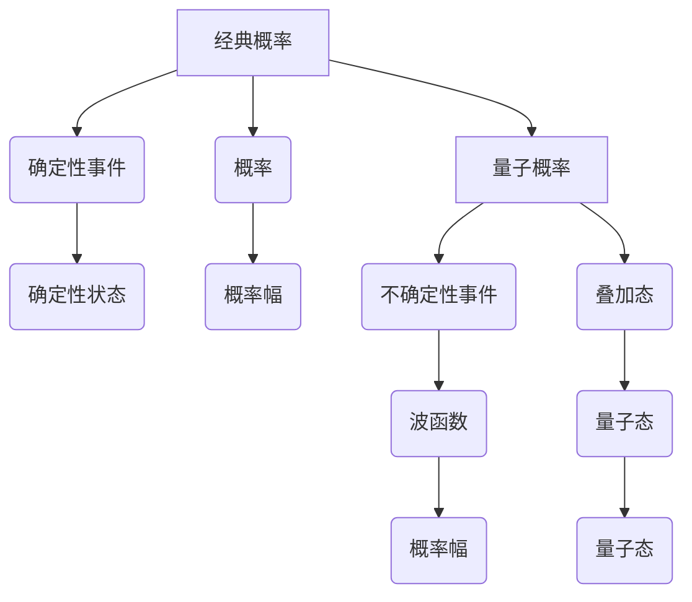

                 

# 从经典概率到量子概率：宇宙的根本不确定性

> 关键词：经典概率，量子概率，不确定性原理，薛定谔方程，量子计算，概率幅，波函数

> 摘要：本文将从经典概率论出发，逐步深入探讨量子概率论的基本原理和应用。我们将通过详细的理论分析、数学模型、伪代码和实际代码案例，揭示量子概率如何描述微观世界的不确定性，并探讨其在现代科技中的应用。本文旨在为读者提供一个全面而深入的理解，帮助他们在量子计算和量子信息处理领域取得突破。

## 1. 背景介绍
### 1.1 目的和范围
本文旨在探讨经典概率论与量子概率论之间的差异和联系，以及量子概率论在现代科技中的应用。我们将从基本概念出发，逐步深入到量子概率论的核心原理，并通过实际代码案例展示其应用。

### 1.2 预期读者
本文适合以下读者：
- 对经典概率论和量子概率论感兴趣的科研人员和工程师。
- 从事量子计算和量子信息处理领域的专业人士。
- 对量子力学和概率论有浓厚兴趣的学生和爱好者。
- 希望了解量子概率论在实际应用中的工程师和开发者。

### 1.3 文档结构概述
本文结构如下：
1. 背景介绍
2. 核心概念与联系
3. 核心算法原理 & 具体操作步骤
4. 数学模型和公式 & 详细讲解 & 举例说明
5. 项目实战：代码实际案例和详细解释说明
6. 实际应用场景
7. 工具和资源推荐
8. 总结：未来发展趋势与挑战
9. 附录：常见问题与解答
10. 扩展阅读 & 参考资料

### 1.4 术语表
#### 1.4.1 核心术语定义
- **经典概率**：描述宏观世界中事件发生的可能性。
- **量子概率**：描述微观世界中事件发生的可能性。
- **不确定性原理**：由海森堡提出，描述了位置和动量不能同时精确测量。
- **波函数**：量子力学中描述量子系统状态的数学函数。
- **概率幅**：波函数的复数部分，用于计算概率。
- **薛定谔方程**：描述量子系统随时间演化的基本方程。

#### 1.4.2 相关概念解释
- **量子态**：量子系统在某一时刻的状态。
- **量子叠加**：量子系统可以同时处于多个状态的叠加态。
- **量子纠缠**：两个或多个量子系统之间的状态相互关联，即使相隔很远也能瞬间影响彼此。

#### 1.4.3 缩略词列表
- QM：量子力学
- QP：量子概率
- CM：经典力学
- CP：经典概率

## 2. 核心概念与联系
### 2.1 经典概率
经典概率论描述了宏观世界中事件发生的可能性。例如，抛硬币时，正面和反面出现的概率各为1/2。经典概率论基于确定性的物理定律，如牛顿运动定律。

### 2.2 量子概率
量子概率论描述了微观世界中事件发生的可能性。量子系统可以处于多个状态的叠加态，且测量结果具有不确定性。量子概率论基于量子力学的基本原理，如薛定谔方程和波函数。

### 2.3 核心概念联系
经典概率和量子概率的主要区别在于：
- **确定性 vs 不确定性**：经典概率描述确定性的事件，而量子概率描述不确定性的事件。
- **叠加态 vs 确定态**：经典概率中的事件要么发生要么不发生，而量子概率中的事件可以处于多个状态的叠加态。
- **波函数 vs 确定性状态**：经典概率中的事件状态是确定的，而量子概率中的事件状态由波函数描述。

### 2.4 Mermaid 流程图


## 3. 核心算法原理 & 具体操作步骤
### 3.1 薛定谔方程
薛定谔方程是描述量子系统随时间演化的基本方程。其形式如下：
$$
i\hbar \frac{\partial \psi}{\partial t} = \hat{H} \psi
$$
其中，$\psi$ 是波函数，$\hat{H}$ 是哈密顿算子，$\hbar$ 是约化普朗克常数。

### 3.2 量子态的表示
量子态可以用波函数 $\psi(x,t)$ 表示。波函数的模平方 $|\psi(x,t)|^2$ 表示在位置 $x$ 处找到粒子的概率密度。

### 3.3 量子叠加
量子系统可以处于多个状态的叠加态。例如，一个量子比特可以处于 $\alpha|0\rangle + \beta|1\rangle$ 的叠加态，其中 $\alpha$ 和 $\beta$ 是概率幅。

### 3.4 量子测量
量子测量会导致波函数坍缩。测量结果的概率由波函数的模平方决定。例如，测量一个量子比特时，结果为 $|0\rangle$ 的概率为 $|\alpha|^2$，结果为 $|1\rangle$ 的概率为 $|\beta|^2$。

### 3.5 伪代码
```python
def measure_quantum_state(state):
    """
    测量量子态并返回结果
    :param state: 波函数
    :return: 测量结果
    """
    probabilities = [abs(amplitude)**2 for amplitude in state]
    result = np.random.choice([0, 1], p=probabilities)
    return result
```

## 4. 数学模型和公式 & 详细讲解 & 举例说明
### 4.1 波函数
波函数 $\psi(x,t)$ 描述量子系统的状态。其形式如下：
$$
\psi(x,t) = A e^{i(kx - \omega t)}
$$
其中，$A$ 是归一化常数，$k$ 是波数，$\omega$ 是角频率。

### 4.2 概率幅
概率幅是波函数的复数部分。例如，对于波函数 $\psi(x,t) = A e^{i(kx - \omega t)}$，概率幅为 $A e^{i(kx - \omega t)}$。

### 4.3 薛定谔方程
薛定谔方程描述了波函数随时间演化的过程。其形式如下：
$$
i\hbar \frac{\partial \psi}{\partial t} = \hat{H} \psi
$$
其中，$\hat{H}$ 是哈密顿算子，描述系统的能量。

### 4.4 举例说明
假设一个量子比特处于叠加态 $\alpha|0\rangle + \beta|1\rangle$。测量该量子比特时，结果为 $|0\rangle$ 的概率为 $|\alpha|^2$，结果为 $|1\rangle$ 的概率为 $|\beta|^2$。

## 5. 项目实战：代码实际案例和详细解释说明
### 5.1 开发环境搭建
- **Python**：安装 `numpy` 和 `scipy` 库。
- **Jupyter Notebook**：用于编写和运行代码。

### 5.2 源代码详细实现和代码解读
```python
import numpy as np
from scipy.integrate import solve_ivp

def schrodinger_eq(t, psi, H):
    """
    薛定谔方程
    :param t: 时间
    :param psi: 波函数
    :param H: 哈密顿算子
    :return: 波函数的导数
    """
    return 1j * H @ psi

def measure_quantum_state(state):
    """
    测量量子态并返回结果
    :param state: 波函数
    :return: 测量结果
    """
    probabilities = [abs(amplitude)**2 for amplitude in state]
    result = np.random.choice([0, 1], p=probabilities)
    return result

def main():
    # 初始化波函数
    psi = np.array([1/np.sqrt(2), 1/np.sqrt(2)])
    # 定义哈密顿算子
    H = np.array([[0, 1], [1, 0]])
    # 解薛定谔方程
    sol = solve_ivp(schrodinger_eq, [0, 10], psi, args=(H,))
    # 测量量子态
    result = measure_quantum_state(sol.y[:, -1])
    print(f"测量结果: {result}")

if __name__ == "__main__":
    main()
```

### 5.3 代码解读与分析
- **初始化波函数**：量子比特处于叠加态 $\frac{1}{\sqrt{2}}|0\rangle + \frac{1}{\sqrt{2}}|1\rangle$。
- **定义哈密顿算子**：哈密顿算子描述系统的能量。
- **解薛定谔方程**：使用 `solve_ivp` 函数求解薛定谔方程。
- **测量量子态**：根据波函数的模平方计算测量结果的概率，并返回测量结果。

## 6. 实际应用场景
量子概率论在多个领域有广泛的应用，包括：
- **量子计算**：利用量子比特的叠加态和纠缠态进行并行计算。
- **量子通信**：利用量子纠缠实现安全的量子密钥分发。
- **量子模拟**：模拟复杂的量子系统，如分子结构和材料性质。

## 7. 工具和资源推荐
### 7.1 学习资源推荐
#### 7.1.1 书籍推荐
- **《量子力学原理》**：R. P. Feynman, R. B. Leighton, M. Sands
- **《量子力学与路径积分》**：R. P. Feynman, A. R. Hibbs

#### 7.1.2 在线课程
- **Coursera**：量子计算与量子信息论
- **edX**：量子力学基础

#### 7.1.3 技术博客和网站
- **Quantum Computing Report**：量子计算领域的最新动态
- **Quantum Computing Stack Exchange**：量子计算领域的问答社区

### 7.2 开发工具框架推荐
#### 7.2.1 IDE和编辑器
- **Jupyter Notebook**：用于编写和运行量子计算代码。
- **Visual Studio Code**：支持多种编程语言的集成开发环境。

#### 7.2.2 调试和性能分析工具
- **Qiskit**：IBM开发的量子计算框架，提供调试和性能分析工具。
- **Qulacs**：一个高性能的量子计算模拟器。

#### 7.2.3 相关框架和库
- **Qiskit**：IBM开发的量子计算框架。
- **Qulacs**：高性能的量子计算模拟器。
- **PyQuil**：Rigetti开发的量子计算框架。

### 7.3 相关论文著作推荐
#### 7.3.1 经典论文
- **《量子力学的数学基础》**：John von Neumann
- **《量子计算与量子信息》**：Michael A. Nielsen, Isaac L. Chuang

#### 7.3.2 最新研究成果
- **《量子计算的最新进展》**：Nature Quantum Information
- **《量子信息处理的最新进展》**：Physical Review Letters

#### 7.3.3 应用案例分析
- **《量子计算在化学领域的应用》**：Chemical Reviews
- **《量子计算在金融领域的应用》**：Quantitative Finance

## 8. 总结：未来发展趋势与挑战
量子概率论在现代科技中的应用前景广阔，但同时也面临许多挑战。未来的发展趋势包括：
- **量子计算的商业化**：量子计算机的商业化应用将推动量子计算技术的发展。
- **量子通信的安全性**：量子密钥分发技术将为信息安全提供新的解决方案。
- **量子模拟的精度**：量子模拟技术将帮助我们更好地理解复杂的量子系统。

## 9. 附录：常见问题与解答
### 9.1 问题：量子概率和经典概率有什么区别？
**回答**：经典概率描述确定性的事件，而量子概率描述不确定性的事件。经典概率中的事件要么发生要么不发生，而量子概率中的事件可以处于多个状态的叠加态。

### 9.2 问题：量子测量会导致波函数坍缩吗？
**回答**：是的，量子测量会导致波函数坍缩。测量结果的概率由波函数的模平方决定。

## 10. 扩展阅读 & 参考资料
- **《量子力学原理》**：R. P. Feynman, R. B. Leighton, M. Sands
- **《量子力学与路径积分》**：R. P. Feynman, A. R. Hibbs
- **《量子计算与量子信息》**：Michael A. Nielsen, Isaac L. Chuang
- **Nature Quantum Information**：量子计算领域的最新进展
- **Physical Review Letters**：量子信息处理的最新进展

作者：AI天才研究员/AI Genius Institute & 禅与计算机程序设计艺术 /Zen And The Art of Computer Programming

