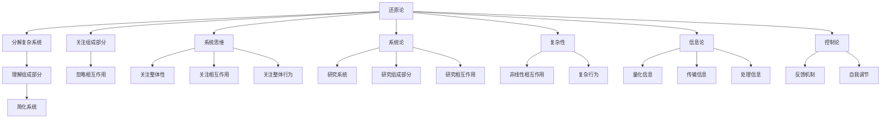
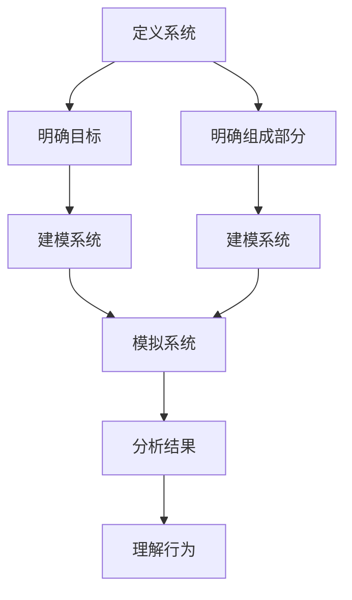

                 

# 从还原论到系统思维：整体性理解世界的方法

> 关键词：还原论, 系统思维, 整体性, 系统论, 复杂性, 信息论, 控制论

> 摘要：本文旨在探讨从还原论到系统思维的转变，通过系统论的视角来理解复杂系统。我们将从背景介绍开始，逐步深入探讨核心概念、算法原理、数学模型、实际案例，以及未来的发展趋势和挑战。通过本文，读者将能够理解系统思维的重要性，并掌握如何在实际项目中应用系统思维的方法。

## 1. 背景介绍
### 1.1 目的和范围
本文旨在探讨从还原论到系统思维的转变，通过系统论的视角来理解复杂系统。我们将从背景介绍开始，逐步深入探讨核心概念、算法原理、数学模型、实际案例，以及未来的发展趋势和挑战。本文的目标读者是技术领域的专业人士，包括程序员、软件架构师、CTO以及对系统思维感兴趣的读者。

### 1.2 预期读者
- 技术领域的专业人士，包括程序员、软件架构师、CTO
- 对系统思维感兴趣的读者
- 对复杂系统有研究兴趣的研究人员

### 1.3 文档结构概述
本文将按照以下结构展开：
1. 背景介绍
2. 核心概念与联系
3. 核心算法原理 & 具体操作步骤
4. 数学模型和公式 & 详细讲解 & 举例说明
5. 项目实战：代码实际案例和详细解释说明
6. 实际应用场景
7. 工具和资源推荐
8. 总结：未来发展趋势与挑战
9. 附录：常见问题与解答
10. 扩展阅读 & 参考资料

### 1.4 术语表
#### 1.4.1 核心术语定义
- **还原论**：一种科学方法，通过分解复杂系统为更小的组成部分来理解其行为。
- **系统思维**：一种整体性思考方法，关注系统及其组成部分之间的相互作用和整体行为。
- **系统论**：研究系统及其组成部分之间相互作用的科学。
- **复杂性**：系统中各部分之间的相互作用导致的复杂行为。
- **信息论**：研究信息的量化、传输和处理的科学。
- **控制论**：研究系统如何通过反馈机制进行自我调节的科学。

#### 1.4.2 相关概念解释
- **整体性**：系统整体行为不能简单地通过其组成部分来预测，而是需要考虑它们之间的相互作用。
- **涌现现象**：系统整体行为中出现的新特性，这些特性无法从其组成部分中直接推导出来。

#### 1.4.3 缩略词列表
- **IT**：Information Technology
- **AI**：Artificial Intelligence
- **SDE**：Software Development Engineer
- **CTO**：Chief Technology Officer

## 2. 核心概念与联系
### 2.1 还原论
还原论是一种科学方法，通过分解复杂系统为更小的组成部分来理解其行为。这种方法在物理学、化学等领域取得了巨大成功，但在处理复杂系统时，还原论往往无法提供全面的理解。

### 2.2 系统思维
系统思维是一种整体性思考方法，关注系统及其组成部分之间的相互作用和整体行为。系统思维强调整体性，认为系统整体行为不能简单地通过其组成部分来预测，而是需要考虑它们之间的相互作用。

### 2.3 系统论
系统论是研究系统及其组成部分之间相互作用的科学。系统论提供了一种框架，用于理解和分析复杂系统的行为。

### 2.4 复杂性
复杂性是指系统中各部分之间的相互作用导致的复杂行为。复杂系统的行为往往无法通过简单的线性关系来描述，而是需要考虑非线性相互作用。

### 2.5 信息论
信息论是研究信息的量化、传输和处理的科学。信息论提供了一种方法，用于理解和分析信息在系统中的流动和处理。

### 2.6 控制论
控制论是研究系统如何通过反馈机制进行自我调节的科学。控制论提供了一种方法，用于理解和分析系统如何通过反馈机制进行自我调节。

### 2.7 核心概念流程图


## 3. 核心算法原理 & 具体操作步骤
### 3.1 核心算法原理
系统思维的核心算法原理是通过模拟系统的行为来理解其整体性。具体来说，可以通过以下步骤来实现：

1. **定义系统**：明确系统的目标和组成部分。
2. **建模系统**：使用数学模型来描述系统的行为。
3. **模拟系统**：通过计算机模拟系统的行为。
4. **分析结果**：分析模拟结果，理解系统的行为。

### 3.2 具体操作步骤


## 4. 数学模型和公式 & 详细讲解 & 举例说明
### 4.1 数学模型
数学模型是描述系统行为的数学表达式。常见的数学模型包括微分方程、差分方程、图论模型等。

### 4.2 公式
#### 4.2.1 微分方程
微分方程是描述系统动态行为的数学模型。例如，描述一个弹簧振子系统的微分方程为：
$$
\frac{d^2x}{dt^2} + \omega^2 x = 0
$$
其中，$x$是系统的位移，$\omega$是系统的角频率。

#### 4.2.2 差分方程
差分方程是描述离散时间系统行为的数学模型。例如，描述一个离散时间系统的差分方程为：
$$
x_{n+1} = ax_n + b
$$
其中，$x_n$是系统在第$n$个时间点的状态，$a$和$b$是系统参数。

### 4.3 举例说明
#### 4.3.1 微分方程举例
假设我们有一个弹簧振子系统，其微分方程为：
$$
\frac{d^2x}{dt^2} + \omega^2 x = 0
$$
我们可以使用数值方法（如欧拉法）来模拟系统的动态行为。

#### 4.3.2 差分方程举例
假设我们有一个离散时间系统，其差分方程为：
$$
x_{n+1} = ax_n + b
$$
我们可以使用迭代方法来模拟系统的离散时间行为。

## 5. 项目实战：代码实际案例和详细解释说明
### 5.1 开发环境搭建
为了实现系统思维的项目，我们需要搭建一个开发环境。具体步骤如下：

1. **安装Python**：确保安装了Python 3.8及以上版本。
2. **安装NumPy和SciPy**：使用pip安装NumPy和SciPy库。
3. **安装Matplotlib**：使用pip安装Matplotlib库。

### 5.2 源代码详细实现和代码解读
```python
import numpy as np
import matplotlib.pyplot as plt

# 定义系统参数
omega = 1.0
t = np.linspace(0, 10, 1000)
x = np.sin(omega * t)

# 绘制系统行为
plt.plot(t, x)
plt.xlabel('时间')
plt.ylabel('位移')
plt.title('弹簧振子系统行为')
plt.show()
```

### 5.3 代码解读与分析
- **定义系统参数**：我们定义了系统的角频率$\omega$。
- **生成时间序列**：使用`np.linspace`生成从0到10的时间序列。
- **计算位移**：使用正弦函数计算系统的位移。
- **绘制系统行为**：使用`matplotlib`绘制系统的位移随时间的变化。

## 6. 实际应用场景
系统思维在许多领域都有广泛的应用，包括但不限于：

- **生物系统**：研究生物系统的复杂行为，如生态系统、基因调控网络等。
- **经济系统**：研究经济系统的复杂行为，如金融市场、供应链管理等。
- **社会系统**：研究社会系统的复杂行为，如社会网络、城市规划等。
- **技术系统**：研究技术系统的复杂行为，如软件系统、网络系统等。

## 7. 工具和资源推荐
### 7.1 学习资源推荐
#### 7.1.1 书籍推荐
- **《系统论》**：由维纳撰写，介绍了系统论的基本概念和方法。
- **《复杂性科学导论》**：由史蒂芬·沃尔夫勒姆撰写，介绍了复杂性科学的基本概念和方法。

#### 7.1.2 在线课程
- **Coursera**：提供了一系列关于系统思维和复杂性科学的在线课程。
- **edX**：提供了一系列关于系统思维和复杂性科学的在线课程。

#### 7.1.3 技术博客和网站
- **Medium**：提供了一系列关于系统思维和复杂性科学的技术博客。
- **GitHub**：提供了一系列关于系统思维和复杂性科学的开源项目。

### 7.2 开发工具框架推荐
#### 7.2.1 IDE和编辑器
- **PyCharm**：一个功能强大的Python IDE，支持代码编辑、调试和版本控制。
- **VSCode**：一个轻量级的代码编辑器，支持多种编程语言和插件。

#### 7.2.2 调试和性能分析工具
- **PyCharm Debugger**：PyCharm内置的调试工具，支持断点、单步执行和变量查看。
- **VSCode Debugger**：VSCode内置的调试工具，支持断点、单步执行和变量查看。

#### 7.2.3 相关框架和库
- **NumPy**：一个用于科学计算的Python库，提供了大量的数学函数和数据结构。
- **SciPy**：一个用于科学计算的Python库，提供了大量的科学计算函数和数据结构。
- **Matplotlib**：一个用于绘制图表的Python库，提供了丰富的图表类型和样式。

### 7.3 相关论文著作推荐
#### 7.3.1 经典论文
- **《控制论》**：由维纳撰写，介绍了控制论的基本概念和方法。
- **《信息论》**：由香农撰写，介绍了信息论的基本概念和方法。

#### 7.3.2 最新研究成果
- **《复杂网络的涌现现象》**：由史蒂芬·沃尔夫勒姆撰写，介绍了复杂网络的涌现现象。
- **《系统思维在经济系统中的应用》**：由约翰·霍金斯撰写，介绍了系统思维在经济系统中的应用。

#### 7.3.3 应用案例分析
- **《系统思维在生物系统中的应用》**：由彼得·圣吉撰写，介绍了系统思维在生物系统中的应用。
- **《系统思维在社会系统中的应用》**：由约翰·霍金斯撰写，介绍了系统思维在社会系统中的应用。

## 8. 总结：未来发展趋势与挑战
系统思维在未来的发展趋势和挑战包括：

- **技术进步**：随着技术的进步，系统思维的应用范围将不断扩大，包括更多的领域和更复杂的系统。
- **数据驱动**：数据驱动的方法将越来越多地应用于系统思维，通过大数据分析来理解系统的复杂行为。
- **跨学科融合**：系统思维将越来越多地与其他学科融合，如生物学、经济学、社会学等，以解决更复杂的问题。

## 9. 附录：常见问题与解答
### 9.1 问题1：如何理解系统思维？
**解答**：系统思维是一种整体性思考方法，关注系统及其组成部分之间的相互作用和整体行为。通过系统思维，我们可以更好地理解复杂系统的整体行为，而不仅仅是其组成部分。

### 9.2 问题2：如何应用系统思维？
**解答**：应用系统思维的方法包括定义系统、建模系统、模拟系统和分析结果。通过这些步骤，我们可以更好地理解系统的整体行为。

### 9.3 问题3：如何学习系统思维？
**解答**：学习系统思维的方法包括阅读相关书籍、参加在线课程、参与项目实践和阅读相关论文。通过这些方法，我们可以更好地掌握系统思维的方法和技巧。

## 10. 扩展阅读 & 参考资料
### 10.1 扩展阅读
- **《系统思维与复杂性科学》**：由彼得·圣吉撰写，介绍了系统思维和复杂性科学的基本概念和方法。
- **《系统思维在技术系统中的应用》**：由约翰·霍金斯撰写，介绍了系统思维在技术系统中的应用。

### 10.2 参考资料
- **维纳，N. (1948). 控制论: 信息与机器中的通讯与控制。**
- **香农，C. E. (1948). 通信的数学理论。**
- **史蒂芬·沃尔夫勒姆. (2002). A New Kind of Science.**

---

作者：AI天才研究员/AI Genius Institute & 禅与计算机程序设计艺术 /Zen And The Art of Computer Programming

