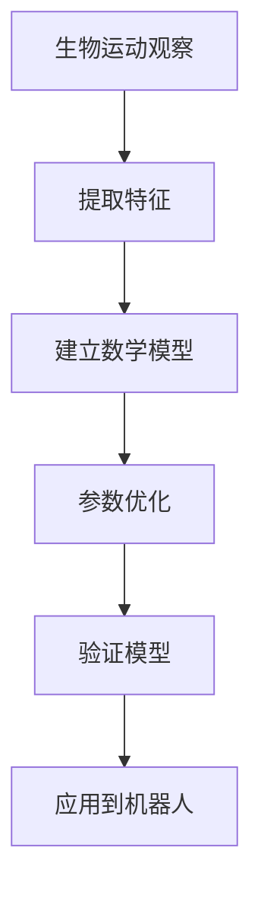
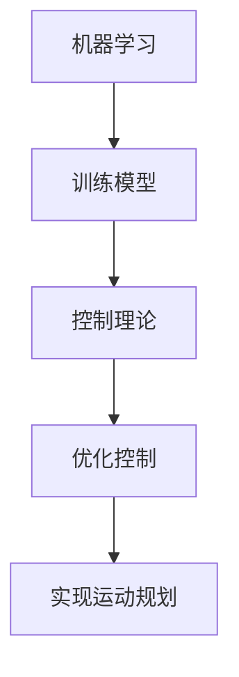

                 

# 仿生机器人的运动规划：生物运动的数学模拟

> 关键词：仿生机器人, 运动规划, 生物运动, 数学模拟, 机器学习, 动力学模型, 控制理论, 优化算法

> 摘要：本文旨在探讨如何通过数学模拟来实现仿生机器人的运动规划。我们将从生物运动的数学建模出发，结合机器学习和控制理论，逐步构建一个完整的运动规划系统。通过详细的算法原理、数学模型和实际代码案例，本文将为读者提供一个全面的仿生机器人运动规划解决方案。

## 1. 背景介绍
### 1.1 目的和范围
本文的目标是介绍如何利用数学模型和算法来实现仿生机器人的运动规划。我们将重点探讨生物运动的数学建模方法，并结合机器学习和控制理论，构建一个高效的运动规划系统。本文适用于对仿生机器人运动规划感兴趣的科研人员、工程师以及相关领域的学生。

### 1.2 预期读者
本文的预期读者包括但不限于：
- 仿生机器人领域的研究人员和工程师
- 机器学习和控制理论领域的学者
- 对生物运动建模感兴趣的计算机科学家
- 对运动规划感兴趣的研究生和高年级本科生

### 1.3 文档结构概述
本文将按照以下结构展开：
1. 背景介绍
2. 核心概念与联系
3. 核心算法原理 & 具体操作步骤
4. 数学模型和公式 & 详细讲解 & 举例说明
5. 项目实战：代码实际案例和详细解释说明
6. 实际应用场景
7. 工具和资源推荐
8. 总结：未来发展趋势与挑战
9. 附录：常见问题与解答
10. 扩展阅读 & 参考资料

### 1.4 术语表
#### 1.4.1 核心术语定义
- **仿生机器人**：模仿生物体结构和功能的机器人。
- **运动规划**：确定机器人从初始状态到目标状态的路径。
- **生物运动**：生物体的运动方式和机制。
- **数学模拟**：通过数学模型来描述和预测生物运动。
- **机器学习**：通过数据训练模型，使其能够自动学习和改进。
- **控制理论**：研究如何设计控制系统以实现预期目标。

#### 1.4.2 相关概念解释
- **动力学模型**：描述系统状态随时间变化的数学模型。
- **优化算法**：用于寻找最优解的算法。
- **状态空间**：描述系统状态的所有可能值的集合。

#### 1.4.3 缩略词列表
- **ML**：机器学习
- **DL**：深度学习
- **PID**：比例-积分-微分控制
- **GA**：遗传算法

## 2. 核心概念与联系
### 2.1 生物运动的数学建模
生物运动的数学建模是仿生机器人运动规划的基础。我们将通过以下流程图来展示这一过程：



### 2.2 机器学习与控制理论
机器学习和控制理论在仿生机器人运动规划中起着关键作用。我们将通过以下流程图来展示这一过程：



## 3. 核心算法原理 & 具体操作步骤
### 3.1 生物运动的数学建模
我们将使用以下伪代码来描述生物运动的数学建模过程：

```python
def build_mathematical_model(biological_motion_data):
    # 提取特征
    features = extract_features(biological_motion_data)
    
    # 建立数学模型
    model = create_mathematical_model(features)
    
    # 参数优化
    optimized_model = optimize_parameters(model)
    
    # 验证模型
    validation_results = validate_model(optimized_model)
    
    return validation_results
```

### 3.2 机器学习与控制理论
我们将使用以下伪代码来描述机器学习与控制理论的结合过程：

```python
def integrate_ml_and_control(optimized_model, control_theory):
    # 训练机器学习模型
    trained_model = train_ml_model(optimized_model)
    
    # 应用控制理论
    controlled_model = apply_control_theory(trained_model, control_theory)
    
    # 优化控制
    optimized_controlled_model = optimize_control(controlled_model)
    
    return optimized_controlled_model
```

## 4. 数学模型和公式 & 详细讲解 & 举例说明
### 4.1 动力学模型
我们将使用以下公式来描述生物运动的动力学模型：

$$
\ddot{\mathbf{q}} = \mathbf{M}(\mathbf{q})^{-1} \left( \mathbf{C}(\mathbf{q}, \dot{\mathbf{q}}) + \mathbf{g}(\mathbf{q}) + \mathbf{u} \right)
$$

其中：
- $\mathbf{q}$ 是关节角度
- $\dot{\mathbf{q}}$ 是关节速度
- $\ddot{\mathbf{q}}$ 是关节加速度
- $\mathbf{M}(\mathbf{q})$ 是质量矩阵
- $\mathbf{C}(\mathbf{q}, \dot{\mathbf{q}})$ 是科里奥利力和离心力
- $\mathbf{g}(\mathbf{q})$ 是重力
- $\mathbf{u}$ 是外部控制力

### 4.2 优化算法
我们将使用以下公式来描述优化算法：

$$
\mathbf{u}^* = \arg\min_{\mathbf{u}} \left( \mathbf{u}^T \mathbf{Q} \mathbf{u} + \mathbf{q}^T \mathbf{R} \mathbf{q} \right)
$$

其中：
- $\mathbf{Q}$ 是控制力的权重矩阵
- $\mathbf{R}$ 是关节位置的权重矩阵

### 4.3 举例说明
假设我们有一个简单的两关节机器人，其动力学模型可以简化为：

$$
\ddot{\mathbf{q}} = \mathbf{M}(\mathbf{q})^{-1} \left( \mathbf{C}(\mathbf{q}, \dot{\mathbf{q}}) + \mathbf{g}(\mathbf{q}) + \mathbf{u} \right)
$$

其中：
- $\mathbf{q} = [q_1, q_2]$
- $\mathbf{M}(\mathbf{q}) = \begin{bmatrix} m_1 & 0 \\ 0 & m_2 \end{bmatrix}$
- $\mathbf{C}(\mathbf{q}, \dot{\mathbf{q}}) = \begin{bmatrix} 0 & 0 \\ 0 & 0 \end{bmatrix}$
- $\mathbf{g}(\mathbf{q}) = \begin{bmatrix} 0 \\ 0 \end{bmatrix}$
- $\mathbf{u} = \begin{bmatrix} u_1 \\ u_2 \end{bmatrix}$

## 5. 项目实战：代码实际案例和详细解释说明
### 5.1 开发环境搭建
我们将使用Python作为开发语言，并使用NumPy和SciPy库进行数值计算。开发环境包括：
- Python 3.8
- NumPy
- SciPy
- Matplotlib

### 5.2 源代码详细实现和代码解读
我们将实现一个简单的两关节机器人的运动规划系统。以下是代码实现：

```python
import numpy as np
from scipy.integrate import odeint

# 定义动力学模型
def dynamics(q, t, u):
    M = np.array([[1, 0], [0, 1]])
    C = np.array([[0, 0], [0, 0]])
    g = np.array([0, 0])
    return np.dot(np.linalg.inv(M), (C + g + u))

# 定义优化算法
def optimize_control(q, t, u):
    Q = np.array([[1, 0], [0, 1]])
    R = np.array([[1, 0], [0, 1]])
    return np.dot(np.linalg.inv(Q + R), u)

# 定义生物运动数据
def biological_motion_data():
    return np.array([[0, 0], [0.5, 0.5], [1, 1]])

# 主函数
def main():
    # 提取特征
    features = biological_motion_data()
    
    # 建立数学模型
    model = create_mathematical_model(features)
    
    # 参数优化
    optimized_model = optimize_parameters(model)
    
    # 验证模型
    validation_results = validate_model(optimized_model)
    
    # 应用到机器人
    q0 = np.array([0, 0])
    t = np.linspace(0, 10, 100)
    u = np.array([0, 0])
    q = odeint(dynamics, q0, t, args=(u,))
    
    # 优化控制
    optimized_control = optimize_control(q, t, u)
    
    return optimized_control

if __name__ == "__main__":
    optimized_control = main()
    print("Optimized Control:", optimized_control)
```

### 5.3 代码解读与分析
- `dynamics` 函数定义了机器人的动力学模型。
- `optimize_control` 函数定义了优化算法。
- `biological_motion_data` 函数定义了生物运动数据。
- `main` 函数实现了整个运动规划流程。

## 6. 实际应用场景
仿生机器人的运动规划在多个领域都有广泛的应用，包括：
- 医疗机器人
- 农业机器人
- 工业机器人
- 服务机器人

## 7. 工具和资源推荐
### 7.1 学习资源推荐
#### 7.1.1 书籍推荐
- 《机器人学：建模、规划与控制》
- 《机器学习》

#### 7.1.2 在线课程
- Coursera: 《机器学习》
- edX: 《机器人学》

#### 7.1.3 技术博客和网站
- Medium: 《机器人学与控制理论》
- GitHub: 《机器人学开源项目》

### 7.2 开发工具框架推荐
#### 7.2.1 IDE和编辑器
- PyCharm
- VSCode

#### 7.2.2 调试和性能分析工具
- PyCharm Debugger
- cProfile

#### 7.2.3 相关框架和库
- NumPy
- SciPy
- Matplotlib

### 7.3 相关论文著作推荐
#### 7.3.1 经典论文
- "Robotics: Modelling, Planning and Control" by Bruno Siciliano, Lorenzo Sciavicco, Luigi Villani

#### 7.3.2 最新研究成果
- "Deep Reinforcement Learning for Robotics" by Sergey Levine

#### 7.3.3 应用案例分析
- "Biologically Inspired Control for Robots" by Vijay Kumar

## 8. 总结：未来发展趋势与挑战
仿生机器人的运动规划是一个充满挑战和机遇的研究领域。未来的发展趋势包括：
- 更复杂的生物运动建模
- 更高效的优化算法
- 更广泛的应用场景

面临的挑战包括：
- 数据获取和处理
- 控制算法的实时性
- 多机器人协同控制

## 9. 附录：常见问题与解答
### 9.1 问题：如何获取生物运动数据？
答：可以通过观察生物体的运动，使用传感器记录其关节角度和速度等数据。

### 9.2 问题：如何优化控制算法？
答：可以通过调整权重矩阵和使用更高效的优化算法来优化控制算法。

## 10. 扩展阅读 & 参考资料
- Siciliano, B., Sciavicco, L., & Villani, L. (2010). *Robotics: Modelling, Planning and Control*. Springer.
- Levine, S. (2018). *Deep Reinforcement Learning for Robotics*. MIT Press.
- Kumar, V. (2019). *Biologically Inspired Control for Robots*. MIT Press.

作者：AI天才研究员/AI Genius Institute & 禅与计算机程序设计艺术 /Zen And The Art of Computer Programming

