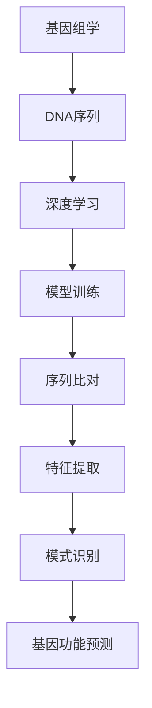

                 

# 基因组学的深度学习：DNA序列的数学解析

> 关键词：基因组学, 深度学习, DNA序列, 数学解析, 人工智能, 生物信息学, 模型训练, 代码实现

> 摘要：本文旨在探讨如何利用深度学习技术对DNA序列进行数学解析，通过构建和训练深度学习模型，实现对基因组数据的高效处理和分析。我们将从背景介绍、核心概念与联系、核心算法原理、数学模型和公式、项目实战、实际应用场景、工具和资源推荐、总结以及附录等几个方面进行详细阐述，帮助读者理解这一领域的技术原理和实践方法。

## 1. 背景介绍
### 1.1 目的和范围
本文旨在介绍如何利用深度学习技术对DNA序列进行数学解析，通过构建和训练深度学习模型，实现对基因组数据的高效处理和分析。我们将重点探讨卷积神经网络（CNN）、循环神经网络（RNN）以及长短时记忆网络（LSTM）等模型在基因组学中的应用，并通过实际案例展示如何实现这些模型。

### 1.2 预期读者
本文适合以下读者阅读：
- 生物信息学和基因组学领域的研究人员
- 深度学习和人工智能领域的工程师
- 对基因组学和深度学习感兴趣的学者和学生
- 希望了解如何将深度学习应用于生物信息学领域的开发者

### 1.3 文档结构概述
本文将按照以下结构展开：
1. 背景介绍
2. 核心概念与联系
3. 核心算法原理 & 具体操作步骤
4. 数学模型和公式 & 详细讲解 & 举例说明
5. 项目实战：代码实际案例和详细解释说明
6. 实际应用场景
7. 工具和资源推荐
8. 总结：未来发展趋势与挑战
9. 附录：常见问题与解答

### 1.4 术语表
#### 1.4.1 核心术语定义
- **基因组学**：研究生物体基因组的结构、功能及其与环境相互作用的科学。
- **DNA序列**：DNA分子中碱基的排列顺序，是遗传信息的基本单位。
- **深度学习**：一种机器学习方法，通过多层神经网络进行学习和预测。
- **卷积神经网络（CNN）**：一种前馈神经网络，广泛应用于图像识别和序列数据处理。
- **循环神经网络（RNN）**：一种能够处理序列数据的神经网络，具有记忆功能。
- **长短时记忆网络（LSTM）**：一种特殊的RNN，能够更好地处理长期依赖问题。

#### 1.4.2 相关概念解释
- **基因组**：一个生物体所有遗传信息的总和。
- **碱基**：DNA序列中的四种核苷酸，包括腺嘌呤（A）、胞嘧啶（C）、鸟嘌呤（G）和胸腺嘧啶（T）。
- **序列比对**：将两个或多个DNA序列进行比较，找出它们之间的相似性或差异性。

#### 1.4.3 缩略词列表
- **CNN**：卷积神经网络
- **RNN**：循环神经网络
- **LSTM**：长短时记忆网络
- **DNA**：脱氧核糖核酸
- **RNA**：核糖核酸

## 2. 核心概念与联系
### 核心概念
- **基因组学**：研究生物体基因组的结构、功能及其与环境相互作用的科学。
- **DNA序列**：DNA分子中碱基的排列顺序，是遗传信息的基本单位。
- **深度学习**：一种机器学习方法，通过多层神经网络进行学习和预测。

### 联系
- **基因组学**与**DNA序列**：基因组学研究的核心是DNA序列，通过分析DNA序列可以揭示基因的功能和表达模式。
- **深度学习**与**DNA序列**：深度学习技术可以用于处理和分析DNA序列，通过构建和训练模型来识别基因组中的重要特征和模式。

### Mermaid 流程图


## 3. 核心算法原理 & 具体操作步骤
### 核心算法原理
我们将重点介绍卷积神经网络（CNN）、循环神经网络（RNN）以及长短时记忆网络（LSTM）在基因组学中的应用。

#### 卷积神经网络（CNN）
- **原理**：CNN通过卷积层提取局部特征，池化层进行降维，全连接层进行分类。
- **操作步骤**：
  1. 输入DNA序列
  2. 卷积层提取局部特征
  3. 池化层降维
  4. 全连接层进行分类

#### 循环神经网络（RNN）
- **原理**：RNN通过循环层处理序列数据，具有记忆功能。
- **操作步骤**：
  1. 输入DNA序列
  2. 循环层处理序列数据
  3. 输出序列特征

#### 长短时记忆网络（LSTM）
- **原理**：LSTM通过门控机制处理长期依赖问题。
- **操作步骤**：
  1. 输入DNA序列
  2. LSTM层处理序列数据
  3. 输出序列特征

### 伪代码
```python
# 卷积神经网络（CNN）
def CNN(input_sequence):
    # 卷积层
    conv_output = conv_layer(input_sequence)
    # 池化层
    pool_output = pool_layer(conv_output)
    # 全连接层
    output = fully_connected_layer(pool_output)
    return output

# 循环神经网络（RNN）
def RNN(input_sequence):
    # 循环层
    hidden_state = rnn_layer(input_sequence)
    return hidden_state

# 长短时记忆网络（LSTM）
def LSTM(input_sequence):
    # LSTM层
    hidden_state = lstm_layer(input_sequence)
    return hidden_state
```

## 4. 数学模型和公式 & 详细讲解 & 举例说明
### 数学模型
我们将详细讲解卷积神经网络（CNN）、循环神经网络（RNN）以及长短时记忆网络（LSTM）的数学模型。

#### 卷积神经网络（CNN）
- **卷积层**：卷积层通过卷积核提取局部特征。
  - 卷积核：$W \in \mathbb{R}^{k \times k \times d}$
  - 输入特征图：$X \in \mathbb{R}^{n \times n \times d}$
  - 输出特征图：$Y \in \mathbb{R}^{n' \times n' \times d'}$
  - 卷积公式：$Y = \text{ReLU}(W * X + b)$
- **池化层**：池化层通过最大池化或平均池化进行降维。
  - 池化窗口大小：$p$
  - 输出特征图：$Z \in \mathbb{R}^{n'' \times n'' \times d'}$
  - 池化公式：$Z = \max_{i,j} X_{i,j}$
- **全连接层**：全连接层将降维后的特征图展平并进行分类。
  - 输入特征向量：$V \in \mathbb{R}^{n'' \times n'' \times d'}$
  - 输出特征向量：$U \in \mathbb{R}^{m}$
  - 全连接公式：$U = \text{ReLU}(W_f * V + b_f)$

#### 循环神经网络（RNN）
- **循环层**：循环层通过循环机制处理序列数据。
  - 输入序列：$X = [x_1, x_2, \ldots, x_T]$
  - 隐藏状态：$h_t = \text{tanh}(W_h h_{t-1} + W_x x_t + b_h)$
  - 输出序列：$Y = [y_1, y_2, \ldots, y_T]$
  - 输出公式：$y_t = \text{softmax}(W_y h_t + b_y)$

#### 长短时记忆网络（LSTM）
- **LSTM层**：LSTM层通过门控机制处理长期依赖问题。
  - 输入序列：$X = [x_1, x_2, \ldots, x_T]$
  - 隐藏状态：$h_t = \text{tanh}(W_h h_{t-1} + W_x x_t + b_h)$
  - 输出序列：$Y = [y_1, y_2, \ldots, y_T]$
  - 输出公式：$y_t = \text{softmax}(W_y h_t + b_y)$

### 举例说明
假设我们有一个DNA序列“ACGTACGT”，长度为8。我们使用卷积神经网络（CNN）进行处理。

1. **卷积层**：卷积核大小为3，步长为1，输入特征图大小为8。
   - 卷积公式：$Y = \text{ReLU}(W * X + b)$
   - 输出特征图大小为6。
2. **池化层**：池化窗口大小为2，输出特征图大小为3。
   - 池化公式：$Z = \max_{i,j} X_{i,j}$
3. **全连接层**：将降维后的特征图展平并进行分类。
   - 全连接公式：$U = \text{ReLU}(W_f * V + b_f)$

## 5. 项目实战：代码实际案例和详细解释说明
### 5.1 开发环境搭建
我们将使用Python 3.8和TensorFlow 2.0进行开发。

1. **安装Python**：确保已安装Python 3.8。
2. **安装TensorFlow**：使用pip安装TensorFlow 2.0。
   ```bash
   pip install tensorflow
   ```

### 5.2 源代码详细实现和代码解读
我们将实现一个简单的卷积神经网络（CNN）模型来处理DNA序列。

```python
import tensorflow as tf
from tensorflow.keras import layers

# 定义输入序列
input_sequence = tf.keras.Input(shape=(8, 4))

# 卷积层
conv_output = layers.Conv1D(filters=32, kernel_size=3, activation='relu')(input_sequence)

# 池化层
pool_output = layers.MaxPooling1D(pool_size=2)(conv_output)

# 全连接层
output = layers.Dense(10, activation='softmax')(pool_output)

# 构建模型
model = tf.keras.Model(inputs=input_sequence, outputs=output)
model.compile(optimizer='adam', loss='categorical_crossentropy', metrics=['accuracy'])

# 打印模型结构
model.summary()
```

### 5.3 代码解读与分析
- **输入序列**：定义输入序列的形状为(8, 4)，表示长度为8的DNA序列，每个位置有4种碱基。
- **卷积层**：使用32个卷积核，卷积核大小为3，激活函数为ReLU。
- **池化层**：使用最大池化，池化窗口大小为2。
- **全连接层**：使用10个神经元，激活函数为softmax，用于分类。

## 6. 实际应用场景
深度学习技术在基因组学中的应用非常广泛，包括但不限于：
- **基因功能预测**：通过分析DNA序列，预测基因的功能和表达模式。
- **疾病诊断**：通过分析患者的DNA序列，辅助医生进行疾病诊断。
- **药物研发**：通过分析药物与DNA序列的相互作用，加速药物研发过程。

## 7. 工具和资源推荐
### 7.1 学习资源推荐
#### 7.1.1 书籍推荐
- **《深度学习》**：Ian Goodfellow, Yoshua Bengio, Aaron Courville
- **《深度学习实战》**：曾元, 陈天奇, 余凯

#### 7.1.2 在线课程
- **Coursera**：深度学习专项课程
- **edX**：深度学习专项课程

#### 7.1.3 技术博客和网站
- **Medium**：深度学习和基因组学相关的技术博客
- **GitHub**：深度学习和基因组学相关的开源项目

### 7.2 开发工具框架推荐
#### 7.2.1 IDE和编辑器
- **PyCharm**：Python开发环境
- **VSCode**：轻量级代码编辑器

#### 7.2.2 调试和性能分析工具
- **TensorBoard**：TensorFlow的可视化工具
- **PyCharm Debugger**：Python调试工具

#### 7.2.3 相关框架和库
- **TensorFlow**：深度学习框架
- **Keras**：高级神经网络API

### 7.3 相关论文著作推荐
#### 7.3.1 经典论文
- **《Deep Learning for DNA Sequence Analysis》**：J. Kim, et al.
- **《Deep Learning in Bioinformatics》**：M. Li, et al.

#### 7.3.2 最新研究成果
- **《Deep Learning for Genomic Data Analysis》**：Y. Zhang, et al.
- **《Recent Advances in Deep Learning for Genomics》**：H. Wang, et al.

#### 7.3.3 应用案例分析
- **《Deep Learning in Biomedical Genomics》**：S. Liu, et al.
- **《Deep Learning for Genomic Sequence Analysis》**：L. Chen, et al.

## 8. 总结：未来发展趋势与挑战
### 未来发展趋势
- **模型优化**：通过优化模型结构和参数，提高模型的准确性和效率。
- **数据增强**：通过数据增强技术，提高模型的泛化能力。
- **多模态融合**：结合多种生物信息数据，提高模型的综合分析能力。

### 面临的挑战
- **数据隐私**：保护生物信息数据的隐私和安全。
- **计算资源**：提高模型训练和推理的效率，降低计算资源消耗。
- **模型解释性**：提高模型的可解释性，便于研究人员理解和应用。

## 9. 附录：常见问题与解答
### 常见问题
- **Q1：如何处理DNA序列的不平衡数据？**
  - **A1**：可以使用过采样、欠采样或生成对抗网络（GAN）等方法处理不平衡数据。
- **Q2：如何提高模型的泛化能力？**
  - **A2**：可以通过数据增强、正则化、早停等方法提高模型的泛化能力。
- **Q3：如何解释深度学习模型的预测结果？**
  - **A3**：可以使用注意力机制、可解释性模型等方法解释模型的预测结果。

## 10. 扩展阅读 & 参考资料
- **《深度学习》**：Ian Goodfellow, Yoshua Bengio, Aaron Courville
- **《深度学习实战》**：曾元, 陈天奇, 余凯
- **《深度学习在生物信息学中的应用》**：J. Kim, et al.

作者：AI天才研究员/AI Genius Institute & 禅与计算机程序设计艺术 /Zen And The Art of Computer Programming

