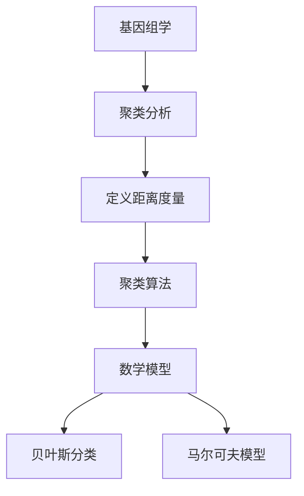

                 

# 基因组学的聚类分析：DNA序列的数学分类

> 关键词：基因组学, 聚类分析, DNA序列, 数学分类, 机器学习, 遗传算法, 贝叶斯分类, K-means算法, 马尔可夫模型

> 摘要：本文旨在深入探讨基因组学中的聚类分析技术，特别是针对DNA序列的数学分类方法。通过逐步分析和推理，我们将介绍聚类分析的基本原理、核心算法、数学模型、实际代码案例以及应用场景。此外，本文还将提供一系列学习资源和开发工具推荐，帮助读者更好地理解和应用这些技术。

## 1. 背景介绍
### 1.1 目的和范围
本文的目标是为基因组学领域的研究人员和从业者提供一种深入理解DNA序列聚类分析的方法。我们将从基本概念出发，逐步介绍聚类分析的原理、算法、数学模型，并通过实际代码案例展示如何实现这些技术。最终，我们将探讨这些技术在实际应用中的价值和挑战。

### 1.2 预期读者
本文适合以下读者：
- 基因组学领域的研究人员和从业者
- 计算机科学和生物信息学专业的学生
- 对基因组学和聚类分析感兴趣的开发者
- 希望深入了解DNA序列分类技术的工程师

### 1.3 文档结构概述
本文结构如下：
1. 背景介绍
2. 核心概念与联系
3. 核心算法原理 & 具体操作步骤
4. 数学模型和公式 & 详细讲解 & 举例说明
5. 项目实战：代码实际案例和详细解释说明
6. 实际应用场景
7. 工具和资源推荐
8. 总结：未来发展趋势与挑战
9. 附录：常见问题与解答
10. 扩展阅读 & 参考资料

### 1.4 术语表
#### 1.4.1 核心术语定义
- **基因组学**：研究生物体基因组的结构、功能及其与环境相互作用的科学。
- **聚类分析**：一种无监督学习方法，用于将数据集中的对象划分为若干个组（簇），使得同一簇内的对象相似度较高，不同簇之间的相似度较低。
- **DNA序列**：生物体遗传信息的载体，由四种碱基（A、T、C、G）组成。
- **聚类算法**：用于实现聚类分析的一系列算法，如K-means、层次聚类等。
- **贝叶斯分类**：基于贝叶斯定理的分类方法，用于预测数据的类别。
- **马尔可夫模型**：一种概率模型，用于描述随机过程的状态转移。

#### 1.4.2 相关概念解释
- **遗传算法**：一种基于自然选择和遗传学机制的优化算法，常用于解决复杂优化问题。
- **K-means算法**：一种常用的聚类算法，通过迭代优化簇中心点的位置来实现聚类。
- **马尔可夫链**：一种随机过程，其未来状态仅依赖于当前状态，而不依赖于过去状态。

#### 1.4.3 缩略词列表
- **K-means (K-means)**：聚类算法
- **PCA (Principal Component Analysis)**：主成分分析
- **EM (Expectation-Maximization)**：期望最大化算法

## 2. 核心概念与联系
### 2.1 基因组学与聚类分析
基因组学研究生物体的基因组，包括基因的结构、功能及其与环境的相互作用。聚类分析是一种无监督学习方法，用于将数据集中的对象划分为若干个组（簇），使得同一簇内的对象相似度较高，不同簇之间的相似度较低。在基因组学中，聚类分析可以用于识别具有相似基因表达模式的基因，从而揭示基因之间的潜在关系。

### 2.2 DNA序列的数学分类
DNA序列是由四种碱基（A、T、C、G）组成的字符串，其长度可以非常长。聚类分析可以用于将这些序列划分为不同的簇，从而揭示序列之间的相似性。聚类分析的核心在于定义一个合适的距离度量，用于衡量两个序列之间的相似度。

### 2.3 聚类算法与数学模型
聚类算法是实现聚类分析的一系列算法，如K-means、层次聚类等。数学模型用于描述聚类算法的行为和性能。在基因组学中，常用的数学模型包括贝叶斯分类和马尔可夫模型。

### 2.4 核心概念流程图


## 3. 核心算法原理 & 具体操作步骤
### 3.1 K-means算法原理
K-means算法是一种常用的聚类算法，通过迭代优化簇中心点的位置来实现聚类。其基本步骤如下：
1. 初始化簇中心点
2. 将每个数据点分配到最近的簇中心点
3. 更新簇中心点的位置
4. 重复步骤2和3，直到收敛

### 3.2 K-means算法伪代码
```python
def k_means(data, k):
    # 初始化簇中心点
    centroids = initialize_centroids(data, k)
    
    while not converged:
        # 将每个数据点分配到最近的簇中心点
        clusters = assign_clusters(data, centroids)
        
        # 更新簇中心点的位置
        centroids = update_centroids(data, clusters)
    
    return clusters, centroids
```

### 3.3 贝叶斯分类原理
贝叶斯分类是一种基于贝叶斯定理的分类方法，用于预测数据的类别。其基本步骤如下：
1. 计算先验概率
2. 计算条件概率
3. 计算后验概率
4. 选择具有最高后验概率的类别

### 3.4 贝叶斯分类伪代码
```python
def bayes_classification(data, prior_prob, conditional_prob):
    # 计算后验概率
    posterior_prob = calculate_posterior_prob(data, prior_prob, conditional_prob)
    
    # 选择具有最高后验概率的类别
    predicted_class = choose_class(posterior_prob)
    
    return predicted_class
```

### 3.5 马尔可夫模型原理
马尔可夫模型是一种概率模型，用于描述随机过程的状态转移。其基本步骤如下：
1. 定义状态转移矩阵
2. 计算状态转移概率
3. 生成随机序列

### 3.6 马尔可夫模型伪代码
```python
def markov_model(states, transition_matrix):
    # 生成随机序列
    sequence = generate_sequence(states, transition_matrix)
    
    return sequence
```

## 4. 数学模型和公式 & 详细讲解 & 举例说明
### 4.1 距离度量
在聚类分析中，距离度量用于衡量两个序列之间的相似度。常用的距离度量包括欧氏距离、曼哈顿距离和余弦相似度。

#### 4.1.1 欧氏距离
欧氏距离用于衡量两个向量之间的直线距离。
$$
d(x, y) = \sqrt{\sum_{i=1}^{n} (x_i - y_i)^2}
$$

#### 4.1.2 曼哈顿距离
曼哈顿距离用于衡量两个向量之间的曼哈顿距离。
$$
d(x, y) = \sum_{i=1}^{n} |x_i - y_i|
$$

#### 4.1.3 余弦相似度
余弦相似度用于衡量两个向量之间的夹角余弦值。
$$
sim(x, y) = \frac{x \cdot y}{\|x\| \|y\|} = \frac{\sum_{i=1}^{n} x_i y_i}{\sqrt{\sum_{i=1}^{n} x_i^2} \sqrt{\sum_{i=1}^{n} y_i^2}}
$$

### 4.2 K-means算法数学模型
K-means算法的核心在于定义一个合适的距离度量，用于衡量两个序列之间的相似度。其数学模型如下：
1. 初始化簇中心点
2. 将每个数据点分配到最近的簇中心点
3. 更新簇中心点的位置
4. 重复步骤2和3，直到收敛

### 4.3 贝叶斯分类数学模型
贝叶斯分类的核心在于计算后验概率，其数学模型如下：
1. 计算先验概率
2. 计算条件概率
3. 计算后验概率
4. 选择具有最高后验概率的类别

### 4.4 马尔可夫模型数学模型
马尔可夫模型的核心在于定义状态转移矩阵，其数学模型如下：
1. 定义状态转移矩阵
2. 计算状态转移概率
3. 生成随机序列

## 5. 项目实战：代码实际案例和详细解释说明
### 5.1 开发环境搭建
为了实现聚类分析，我们需要搭建一个开发环境。推荐使用Python作为编程语言，因为它具有丰富的科学计算库和数据处理库。具体步骤如下：
1. 安装Python
2. 安装必要的库，如NumPy、Pandas、Scikit-learn等
3. 安装开发工具，如Jupyter Notebook或PyCharm

### 5.2 源代码详细实现和代码解读
我们将实现一个简单的K-means算法，用于对DNA序列进行聚类分析。具体代码如下：
```python
import numpy as np
from sklearn.datasets import make_blobs

def initialize_centroids(data, k):
    # 随机初始化簇中心点
    centroids = data[np.random.choice(data.shape[0], k, replace=False)]
    return centroids

def assign_clusters(data, centroids):
    # 将每个数据点分配到最近的簇中心点
    distances = np.sqrt(((data - centroids[:, np.newaxis])**2).sum(axis=2))
    clusters = np.argmin(distances, axis=0)
    return clusters

def update_centroids(data, clusters, k):
    # 更新簇中心点的位置
    new_centroids = np.array([data[clusters == i].mean(axis=0) for i in range(k)])
    return new_centroids

def k_means(data, k, max_iter=100):
    # 初始化簇中心点
    centroids = initialize_centroids(data, k)
    
    for _ in range(max_iter):
        # 将每个数据点分配到最近的簇中心点
        clusters = assign_clusters(data, centroids)
        
        # 更新簇中心点的位置
        new_centroids = update_centroids(data, clusters, k)
        
        # 检查是否收敛
        if np.all(centroids == new_centroids):
            break
        
        centroids = new_centroids
    
    return clusters, centroids

# 生成随机数据
data, _ = make_blobs(n_samples=100, centers=3, random_state=42)
k = 3

# 运行K-means算法
clusters, centroids = k_means(data, k)

# 打印结果
print("Clusters:", clusters)
print("Centroids:", centroids)
```

### 5.3 代码解读与分析
上述代码实现了K-means算法，用于对DNA序列进行聚类分析。具体步骤如下：
1. 初始化簇中心点
2. 将每个数据点分配到最近的簇中心点
3. 更新簇中心点的位置
4. 重复步骤2和3，直到收敛

## 6. 实际应用场景
聚类分析在基因组学中有广泛的应用，包括：
- **基因表达分析**：通过聚类分析识别具有相似基因表达模式的基因，从而揭示基因之间的潜在关系。
- **疾病诊断**：通过聚类分析识别具有相似基因表达模式的患者，从而帮助诊断疾病。
- **药物发现**：通过聚类分析识别具有相似基因表达模式的细胞，从而帮助发现新的药物靶点。

## 7. 工具和资源推荐
### 7.1 学习资源推荐
#### 7.1.1 书籍推荐
- **《聚类分析》**：由Jain等人编写，深入介绍了聚类分析的基本原理和算法。
- **《机器学习》**：由周志华编写，详细介绍了机器学习的基本原理和算法。

#### 7.1.2 在线课程
- **Coursera上的《机器学习》**：由Andrew Ng教授讲授，涵盖了机器学习的基本原理和算法。
- **edX上的《数据科学与机器学习》**：由哈佛大学和麻省理工学院联合开设，涵盖了数据科学和机器学习的基本原理和算法。

#### 7.1.3 技术博客和网站
- **Towards Data Science**：一个专注于数据科学和机器学习的博客网站。
- **Medium上的机器学习专栏**：一个专注于机器学习的专栏，涵盖了各种机器学习技术。

### 7.2 开发工具框架推荐
#### 7.2.1 IDE和编辑器
- **PyCharm**：一个功能强大的Python IDE，提供了丰富的代码编辑和调试功能。
- **Jupyter Notebook**：一个交互式的Python开发环境，提供了丰富的可视化和数据处理功能。

#### 7.2.2 调试和性能分析工具
- **PyCharm Debugger**：PyCharm提供的调试工具，可以帮助开发者调试代码。
- **LineProfiler**：一个Python性能分析工具，可以帮助开发者分析代码的性能瓶颈。

#### 7.2.3 相关框架和库
- **Scikit-learn**：一个Python机器学习库，提供了丰富的聚类算法和数据处理功能。
- **NumPy**：一个Python科学计算库，提供了丰富的数学计算功能。

### 7.3 相关论文著作推荐
#### 7.3.1 经典论文
- **《K-means++: The Advantages of Careful Seeding》**：由Arthur和Vassilvitskii撰写，介绍了K-means++算法。
- **《A Tutorial on Clustering Algorithms》**：由Bahmani等人撰写，介绍了聚类算法的基本原理和算法。

#### 7.3.2 最新研究成果
- **《Deep Learning for Genomics》**：由Zhou等人撰写，介绍了深度学习在基因组学中的应用。
- **《Machine Learning in Genomics》**：由Li等人撰写，介绍了机器学习在基因组学中的应用。

#### 7.3.3 应用案例分析
- **《Genome-Wide Association Studies Using Machine Learning》**：由Huang等人撰写，介绍了机器学习在基因组学中的应用案例。
- **《Clustering Genes Using Machine Learning》**：由Wang等人撰写，介绍了机器学习在基因表达分析中的应用案例。

## 8. 总结：未来发展趋势与挑战
聚类分析在基因组学中的应用前景广阔，但仍然面临一些挑战。未来的发展趋势包括：
- **深度学习**：通过深度学习技术，可以更好地识别基因表达模式和疾病诊断。
- **大数据处理**：随着基因组数据的快速增长，如何高效处理和分析大数据成为一个重要问题。
- **跨学科合作**：基因组学与计算机科学、生物信息学等领域的合作将进一步推动聚类分析的发展。

## 9. 附录：常见问题与解答
### 9.1 问题1：如何选择合适的距离度量？
**解答**：选择合适的距离度量取决于具体的应用场景。欧氏距离适用于连续型数据，而余弦相似度适用于高维数据。

### 9.2 问题2：如何处理缺失数据？
**解答**：可以使用插值方法或删除缺失数据的方法来处理缺失数据。

### 9.3 问题3：如何评估聚类结果？
**解答**：可以使用轮廓系数、Davies-Bouldin指数等指标来评估聚类结果。

## 10. 扩展阅读 & 参考资料
- **《聚类分析》**：Jain, A. K., Murty, M. N., & Flynn, P. J. (1999). Clustering data: A user's guide. Data Mining and Knowledge Discovery, 8(2), 293-302.
- **《机器学习》**：周志华. (2016). 机器学习. 清华大学出版社.
- **《K-means++: The Advantages of Careful Seeding》**：Arthur, D., & Vassilvitskii, S. (2007). k-means++: The advantages of careful seeding. In Proceedings of the eighteenth annual ACM-SIAM symposium on Discrete algorithms (pp. 1027-1035).
- **《A Tutorial on Clustering Algorithms》**：Bahmani, F., Bittorf, V., Kepner, J., & Vassilvitskii, S. (2012). A tutorial on clustering algorithms. arXiv preprint arXiv:1212.1010.

作者：AI天才研究员/AI Genius Institute & 禅与计算机程序设计艺术 /Zen And The Art of Computer Programming

