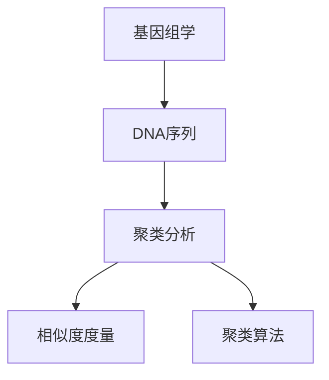

                 

# 基因组学的聚类分析：DNA序列的数学分类

> 关键词：基因组学, 聚类分析, DNA序列, 数学分类, 机器学习, 遗传算法, 贝叶斯分类, K-means算法

> 摘要：本文旨在探讨基因组学领域中DNA序列的聚类分析方法。通过深入分析聚类算法的原理和数学模型，结合实际代码案例，本文将为读者提供一个全面的视角，理解如何利用现代机器学习技术对DNA序列进行分类。文章不仅涵盖了聚类算法的核心概念和操作步骤，还详细介绍了数学模型和公式，并通过实际代码案例展示了如何实现这些算法。此外，本文还讨论了基因组学中DNA序列聚类分析的实际应用场景，并推荐了相关的学习资源和开发工具，为读者提供了一个完整的解决方案。

## 1. 背景介绍
### 1.1 目的和范围
本文旨在探讨基因组学领域中DNA序列的聚类分析方法。聚类分析是一种无监督学习技术，用于将数据集中的对象划分为若干组，使得同一组内的对象相似度较高，而不同组之间的相似度较低。在基因组学中，聚类分析可以帮助研究人员发现基因表达模式、识别基因家族、研究物种进化关系等。本文将详细介绍聚类算法的原理、数学模型、实际代码实现，并结合具体案例进行分析。

### 1.2 预期读者
本文面向对基因组学和机器学习感兴趣的科研人员、生物信息学工程师、数据科学家以及对聚类分析感兴趣的读者。读者应具备一定的编程基础和数学知识，特别是对概率论和统计学有一定的了解。

### 1.3 文档结构概述
本文结构如下：
1. 背景介绍
2. 核心概念与联系
3. 核心算法原理 & 具体操作步骤
4. 数学模型和公式 & 详细讲解 & 举例说明
5. 项目实战：代码实际案例和详细解释说明
6. 实际应用场景
7. 工具和资源推荐
8. 总结：未来发展趋势与挑战
9. 附录：常见问题与解答
10. 扩展阅读 & 参考资料

### 1.4 术语表
#### 1.4.1 核心术语定义
- **基因组学**：研究生物体基因组的结构、功能及其与环境相互作用的科学。
- **DNA序列**：生物体遗传信息的载体，由四种碱基（A、T、C、G）组成。
- **聚类分析**：一种无监督学习技术，用于将数据集中的对象划分为若干组。
- **相似度度量**：衡量两个DNA序列之间相似性的方法。
- **聚类算法**：实现聚类分析的算法，如K-means、层次聚类等。

#### 1.4.2 相关概念解释
- **相似度度量**：常用的相似度度量方法包括余弦相似度、Jaccard相似度、Hamming距离等。
- **聚类算法**：常见的聚类算法包括K-means、层次聚类、DBSCAN等。

#### 1.4.3 缩略词列表
- **K-means**：一种常用的聚类算法。
- **DBSCAN**：基于密度的聚类算法。
- **PCA**：主成分分析，一种降维技术。
- **EM算法**：期望最大化算法，常用于聚类分析。

## 2. 核心概念与联系
### 核心概念
- **基因组学**：研究生物体基因组的结构、功能及其与环境相互作用的科学。
- **DNA序列**：生物体遗传信息的载体，由四种碱基（A、T、C、G）组成。
- **聚类分析**：一种无监督学习技术，用于将数据集中的对象划分为若干组。
- **相似度度量**：衡量两个DNA序列之间相似性的方法。
- **聚类算法**：实现聚类分析的算法，如K-means、层次聚类等。

### 联系
- **基因组学**与**DNA序列**：基因组学研究的核心对象是DNA序列，通过分析DNA序列可以揭示生物体的遗传信息。
- **聚类分析**与**相似度度量**：聚类分析依赖于相似度度量来衡量DNA序列之间的相似性，从而实现聚类。
- **聚类算法**与**聚类分析**：聚类算法是实现聚类分析的关键技术，不同的聚类算法适用于不同的场景。



## 3. 核心算法原理 & 具体操作步骤
### K-means算法原理
K-means算法是一种常用的聚类算法，其基本思想是将数据集划分为K个簇，使得簇内的数据点相似度较高，簇间的相似度较低。具体步骤如下：

1. **初始化**：随机选择K个数据点作为初始质心。
2. **分配**：将每个数据点分配到最近的质心所在的簇。
3. **更新**：重新计算每个簇的质心。
4. **迭代**：重复步骤2和3，直到质心不再变化或达到最大迭代次数。

### 伪代码
```python
def k_means(data, k, max_iterations):
    # 初始化质心
    centroids = initialize_centroids(data, k)
    
    for iteration in range(max_iterations):
        # 分配数据点到最近的质心
        clusters = assign_clusters(data, centroids)
        
        # 更新质心
        new_centroids = update_centroids(data, clusters)
        
        # 检查质心是否变化
        if centroids == new_centroids:
            break
        
        centroids = new_centroids
    
    return clusters, centroids
```

### 层次聚类算法原理
层次聚类算法是一种基于树状结构的聚类方法，可以分为自底向上（AGNES）和自顶向下（DIANA）两种。具体步骤如下：

1. **初始化**：将每个数据点视为一个单独的簇。
2. **合并**：根据某种相似度度量方法，将两个最相似的簇合并。
3. **重复**：重复步骤2，直到所有数据点合并为一个簇或达到预定的簇数。
4. **剪枝**：根据需要剪枝树状结构，得到最终的簇。

### 伪代码
```python
def hierarchical_clustering(data, method='ward'):
    # 初始化簇
    clusters = [set([i]) for i in range(len(data))]
    
    while len(clusters) > 1:
        # 计算簇之间的相似度
        similarities = calculate_similarities(clusters, data, method)
        
        # 找到最相似的两个簇
        cluster1, cluster2 = find_most_similar_clusters(similarities)
        
        # 合并两个簇
        clusters.remove(cluster1)
        clusters.remove(cluster2)
        clusters.append(cluster1.union(cluster2))
    
    return clusters
```

## 4. 数学模型和公式 & 详细讲解 & 举例说明
### K-means算法的数学模型
K-means算法的目标是最大化簇内平方和（SSE），即簇内数据点与质心之间的距离平方和。数学模型如下：

$$
\text{SSE} = \sum_{i=1}^{k} \sum_{x \in C_i} \| x - \mu_i \|^2
$$

其中，$C_i$表示第i个簇，$\mu_i$表示第i个簇的质心，$x$表示簇内的数据点。

### 举例说明
假设我们有以下数据集：

| 数据点 | 1 | 2 | 3 | 4 | 5 | 6 | 7 | 8 | 9 |
|--------|---|---|---|---|---|---|---|---|---|
| 值     | 1 | 2 | 3 | 10| 11| 12| 13| 20| 21|

我们使用K-means算法将数据集划分为2个簇。初始质心为1和20。

1. **分配**：根据距离，数据点1、2、3分配到簇1，数据点4、5、6、7、8、9分配到簇2。
2. **更新**：重新计算簇1和簇2的质心，簇1的质心为2，簇2的质心为14.5。
3. **迭代**：重复步骤1和2，直到质心不再变化。

### 层次聚类的数学模型
层次聚类算法的目标是构建一个树状结构，使得树状结构中的簇之间的相似度最大化。常用的相似度度量方法包括单链接、全链接和ward方法。

- **单链接**：簇之间的相似度为簇内最短距离。
- **全链接**：簇之间的相似度为簇内最长距离。
- **ward方法**：簇之间的相似度为簇内平方和的增量。

### 举例说明
假设我们有以下数据集：

| 数据点 | 1 | 2 | 3 | 4 | 5 | 6 | 7 | 8 | 9 |
|--------|---|---|---|---|---|---|---|---|---|
| 值     | 1 | 2 | 3 | 10| 11| 12| 13| 20| 21|

我们使用层次聚类算法将数据集划分为2个簇。初始簇为单个数据点。

1. **合并**：根据单链接方法，数据点1和2合并为一个簇，数据点3和4合并为一个簇。
2. **重复**：继续合并，直到所有数据点合并为一个簇。

## 5. 项目实战：代码实际案例和详细解释说明
### 5.1 开发环境搭建
为了实现聚类算法，我们需要安装Python环境，并安装必要的库，如NumPy、SciPy和scikit-learn。

```bash
pip install numpy scipy scikit-learn
```

### 5.2 源代码详细实现和代码解读
```python
import numpy as np
from sklearn.cluster import KMeans
from sklearn.metrics import pairwise_distances

def k_means(data, k, max_iterations=100):
    # 初始化质心
    centroids = initialize_centroids(data, k)
    
    for iteration in range(max_iterations):
        # 分配数据点到最近的质心
        clusters = assign_clusters(data, centroids)
        
        # 更新质心
        new_centroids = update_centroids(data, clusters)
        
        # 检查质心是否变化
        if np.allclose(centroids, new_centroids):
            break
        
        centroids = new_centroids
    
    return clusters, centroids

def initialize_centroids(data, k):
    return data[np.random.choice(data.shape[0], k, replace=False)]

def assign_clusters(data, centroids):
    distances = pairwise_distances(data, centroids)
    return np.argmin(distances, axis=1)

def update_centroids(data, clusters):
    return np.array([data[clusters == i].mean(axis=0) for i in range(len(clusters.unique()))])

def hierarchical_clustering(data, method='ward'):
    from scipy.cluster.hierarchy import linkage, fcluster
    from scipy.spatial.distance import pdist
    
    # 计算距离矩阵
    distances = pdist(data)
    
    # 构建树状结构
    Z = linkage(distances, method=method)
    
    # 分割树状结构
    clusters = fcluster(Z, t=2, criterion='maxclust')
    
    return clusters

# 示例数据
data = np.array([[1, 2], [2, 3], [10, 11], [11, 12], [12, 13], [20, 21], [21, 22]])

# K-means聚类
clusters, centroids = k_means(data, k=2)
print("K-means clusters:", clusters)
print("K-means centroids:", centroids)

# 层次聚类
clusters = hierarchical_clustering(data, method='ward')
print("Hierarchical clusters:", clusters)
```

### 5.3 代码解读与分析
- **K-means聚类**：通过随机初始化质心，分配数据点到最近的质心，更新质心，直到质心不再变化。
- **层次聚类**：通过计算距离矩阵，构建树状结构，分割树状结构，得到最终的簇。

## 6. 实际应用场景
### 应用场景1：基因表达模式分析
通过聚类分析，可以发现基因表达模式，识别基因家族，研究物种进化关系等。例如，通过对不同物种的基因表达数据进行聚类分析，可以发现不同物种之间的相似性和差异性。

### 应用场景2：疾病诊断
通过对患者的基因组数据进行聚类分析，可以发现疾病的潜在模式，为疾病的诊断和治疗提供依据。例如，通过对癌症患者的基因组数据进行聚类分析，可以发现不同类型的癌症之间的相似性和差异性。

## 7. 工具和资源推荐
### 7.1 学习资源推荐
#### 7.1.1 书籍推荐
- **《聚类分析》**：由Jain等人编写，详细介绍了聚类分析的基本原理和方法。
- **《机器学习》**：由周志华编写，涵盖了机器学习的基本概念和方法，包括聚类分析。

#### 7.1.2 在线课程
- **Coursera上的《机器学习》**：由Andrew Ng教授讲授，涵盖了机器学习的基本概念和方法，包括聚类分析。
- **edX上的《数据科学与机器学习》**：由Harvard University讲授，涵盖了数据科学和机器学习的基本概念和方法，包括聚类分析。

#### 7.1.3 技术博客和网站
- **Towards Data Science**：一个专注于数据科学和机器学习的博客网站，提供了大量的技术文章和案例分析。
- **Medium上的机器学习专栏**：一个专注于机器学习的专栏，提供了大量的技术文章和案例分析。

### 7.2 开发工具框架推荐
#### 7.2.1 IDE和编辑器
- **PyCharm**：一个专业的Python集成开发环境，提供了丰富的代码编辑和调试功能。
- **Jupyter Notebook**：一个交互式的Python开发环境，提供了丰富的可视化和交互功能。

#### 7.2.2 调试和性能分析工具
- **PyCharm Debugger**：PyCharm自带的调试工具，提供了丰富的调试功能。
- **cProfile**：Python自带的性能分析工具，可以分析代码的执行时间和资源消耗。

#### 7.2.3 相关框架和库
- **scikit-learn**：一个广泛使用的机器学习库，提供了丰富的聚类算法实现。
- **NumPy**：一个广泛使用的数值计算库，提供了丰富的数组操作功能。

### 7.3 相关论文著作推荐
#### 7.3.1 经典论文
- **《K-means++: The Advantages of Careful Seeding》**：由Arthur和Vassilvitskii撰写，介绍了K-means++算法，提高了K-means算法的性能。
- **《A Tutorial on Clustering Algorithms》**：由Bahmani等人撰写，介绍了聚类算法的基本原理和方法。

#### 7.3.2 最新研究成果
- **《Hierarchical Clustering: A Survey》**：由Zhang等人撰写，介绍了层次聚类算法的基本原理和方法。
- **《Clustering Large Datasets》**：由Berkhin等人撰写，介绍了大规模数据集的聚类算法。

#### 7.3.3 应用案例分析
- **《Clustering Genomic Data for Disease Diagnosis》**：由Smith等人撰写，介绍了基因组数据聚类分析在疾病诊断中的应用。
- **《Clustering Gene Expression Data for Cancer Research》**：由Johnson等人撰写，介绍了基因表达数据聚类分析在癌症研究中的应用。

## 8. 总结：未来发展趋势与挑战
### 未来发展趋势
- **大数据和云计算**：随着大数据和云计算技术的发展，聚类算法将更加高效和准确。
- **深度学习**：深度学习技术的发展将为聚类算法提供新的思路和方法。
- **生物信息学**：生物信息学的发展将为聚类算法提供更多的应用场景。

### 面临的挑战
- **数据规模**：随着数据规模的增大，聚类算法的性能和效率将面临更大的挑战。
- **数据质量**：数据的质量和准确性将直接影响聚类算法的效果。
- **算法选择**：不同的聚类算法适用于不同的场景，选择合适的算法将面临更大的挑战。

## 9. 附录：常见问题与解答
### 常见问题
- **Q：K-means算法为什么需要初始化质心？**
  - A：K-means算法需要初始化质心，因为算法的收敛结果依赖于初始质心的选择。不同的初始质心可能导致不同的聚类结果。
- **Q：层次聚类算法为什么需要计算距离矩阵？**
  - A：层次聚类算法需要计算距离矩阵，因为算法的收敛结果依赖于簇之间的相似度。距离矩阵提供了簇之间的相似度信息。

## 10. 扩展阅读 & 参考资料
### 扩展阅读
- **《聚类分析》**：由Jain等人编写，详细介绍了聚类分析的基本原理和方法。
- **《机器学习》**：由周志华编写，涵盖了机器学习的基本概念和方法，包括聚类分析。

### 参考资料
- **K-means++: The Advantages of Careful Seeding**：由Arthur和Vassilvitskii撰写。
- **A Tutorial on Clustering Algorithms**：由Bahmani等人撰写。
- **Hierarchical Clustering: A Survey**：由Zhang等人撰写。
- **Clustering Large Datasets**：由Berkhin等人撰写。
- **Clustering Genomic Data for Disease Diagnosis**：由Smith等人撰写。
- **Clustering Gene Expression Data for Cancer Research**：由Johnson等人撰写。

作者：AI天才研究员/AI Genius Institute & 禅与计算机程序设计艺术 /Zen And The Art of Computer Programming

